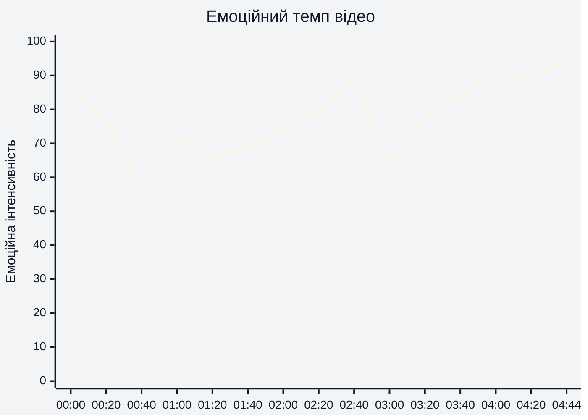
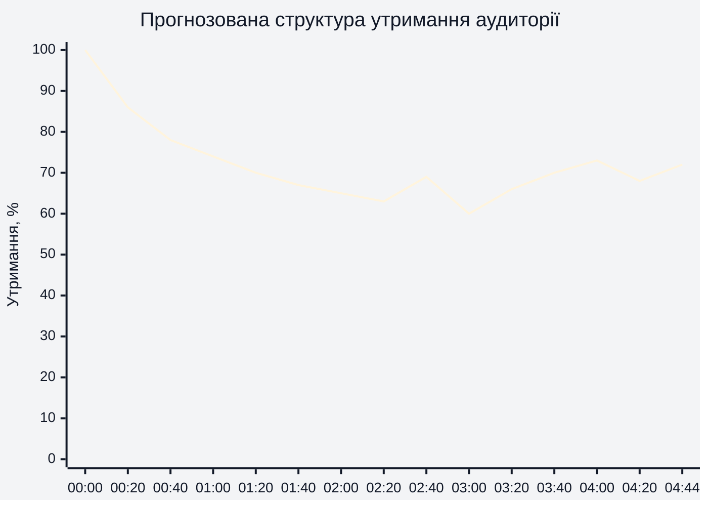
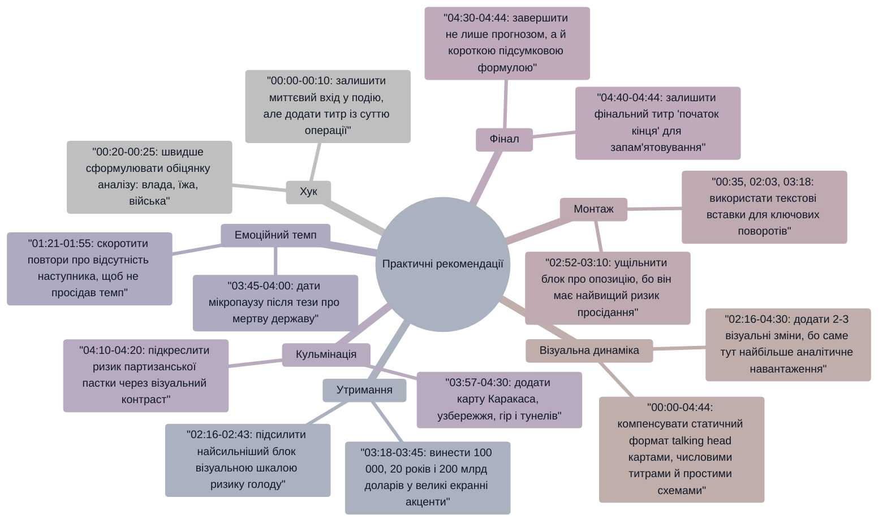

# Аналіз довгоформатного YouTube-відео

> Відео: `The Beginning of Venezuela's End: Part 2 || Peter Zeihan`  
> Тривалість: `04:44`  
> Дані YouTube Studio про фактичне утримання не надано, тому в розділі 4 використано прогнозовану структуру утримання на основі сюжету, темпу мовлення та зміни інформаційної напруги.

## 1. Сюжетна дуга (Narrative Arc)

```mermaid
%%{init: {'theme':'base', 'themeVariables': {
'primaryColor':'#f3f4f6',
'primaryTextColor':'#111827',
'primaryBorderColor':'#2563eb',
'lineColor':'#2563eb',
'secondaryColor':'#ffffff',
'tertiaryColor':'#f3f4f6',
'background':'#f3f4f6'
}}}%%
flowchart LR
    A["00:00-00:19<br/>Хук<br/>Одразу заявлено про спецоперацію США в Каракасі та захоплення Ніколаса Мадуро"] -->
    B["00:19-00:45<br/>Експозиція<br/>Ставиться головне питання: що буде далі з владою у Венесуелі"] -->
    C["00:45-01:21<br/>Перша ескалація<br/>Пояснюється деградація держави: голод, втеча частини населення, слабке управління"] -->
    D["01:21-01:55<br/>Переломний момент<br/>З'ясовується, що немає очевидного наступника й дієздатної команди після Мадуро"] -->
    E["01:55-02:43<br/>Наростання напруги<br/>США декларують контроль без наземної присутності; санкції та зупинка вантажів ведуть до ризику голоду"] -->
    F["02:43-03:57<br/>Кульмінація<br/>Описується майже неможливий сценарій стабілізації: 100 тисяч військових, 20 років і 200 млрд доларів"] -->
    G["03:57-04:30<br/>Розв'язка<br/>Географія Каракаса, тунелі й гори подаються як причина потенційної партизанської пастки"] -->
    H["04:30-04:44<br/>Фінальний висновок<br/>Відео завершується прогнозом спіралі хаосу, голоду, громадянської війни й масової міграції"]
```

## 2. Ключові сюжетні точки (Story Beats)

## 3. Емоційний темп

На `00:00-00:20` інтенсивність висока через миттєвий хук із захопленням Мадуро. На `00:40-01:40` темп стає аналітичнішим, але знову піднімається через згадки про голод, втечу населення й відсутність наступника. Найсильніший емоційний ріст відбувається на `02:40-04:44`, коли відео переходить від політичної невизначеності до прогнозу голоду, 20-річної окупаційної задачі, партизанської пастки й фінальної спіралі хаосу.

## 4. Утримання аудиторії

Прогнозована крива нижче не є фактичними даними YouTube Studio. Вона побудована як потенційна структура утримання: сильний старт на `00:00-00:20`, поступовий спад під час пояснювальних блоків на `00:40-01:55`, короткі підйоми на `02:40`, `03:18`, `03:57` і `04:30`, коли з'являються дедлайни, великі цифри та жорсткий фінальний прогноз.

## 5. Піки утримання (retention)

| Таймкод | Подія | Чому це може утримувати увагу | Сила піку 1-10 |
|---|---|---|---|
| `00:00-00:19` | Заява про спецоперацію США в Каракасі та захоплення Мадуро | Відео починається без розгону й одразу дає наслідкову подію високої ставки | 9 |
| `00:25-00:33` | Питання, що буде далі після захоплення | Чітко формує головну інтригу ролика й обіцяє відповідь | 8 |
| `00:54-01:15` | Згадка про голод, втрату ваги населення і масову втечу | Людська ціна кризи робить абстрактну геополітику емоційно конкретною | 8 |
| `02:16-02:43` | 80% імпорту їжі, падіння нафтовидобутку, зупинка вантажів і ризик голоду за тижні | Конфлікт переходить у зрозумілий дедлайн виживання країни | 9 |
| `03:18-03:45` | Сценарій 100 тисяч військових, 20 років і 200 млрд доларів | Великі числа швидко пояснюють масштаб неможливості стабілізації | 8 |
| `03:57-04:20` | Формула "мертвої держави" та географічна пастка Каракаса | Різка теза плюс конкретна географія створюють новий шар загрози | 9 |
| `04:30-04:44` | Фінальний прогноз хаосу, голоду, громадянської війни й міграції | Фінал стискає весь сюжет у сильну, похмуру тезу | 9 |

## 6. Провали утримання (retention)

| Таймкод | Проблема | Ймовірна причина спаду | Що покращити |
|---|---|---|---|
| `00:33-00:50` | Пояснення про відсутність спадковості влади подається досить сухо | Після сильного хука немає візуального підсилення або короткої карти структури влади | Додати на `00:35` текстову вставку: "Вакуум влади: хто керує після Мадуро?" |
| `01:21-01:55` | Блок про відсутність наступника повторює думку про некомпетентність оточення | Ризик інформаційної стагнації після кількох схожих формулювань | На `01:30` скоротити пояснення й замінити частину фрази схемою "Мадуро -> кабінет -> армія -> порожнеча" |
| `02:00-02:16` | Перехід до ролі США без наземної присутності може губити увагу | Важлива суперечність заявлена, але не підкреслена монтажно | На `02:03` додати контрастний підпис: "Контроль заявлено. Військ немає." |
| `02:52-03:10` | Опис слабкої опозиції менш візуальний і менш конкретний | Після дедлайну голоду емоційна ставка тимчасово падає | На `02:55` показати коротку тезу: "Опозиція є, але вона не готова керувати" |
| `03:45-03:57` | Перехід від вартості стабілізації до тези про "мертву державу" надто швидкий | Сильна теза може не встигнути закріпитися перед наступною географічною деталлю | На `03:50` зробити паузу або титр: "Висновок: стабілізація майже нереальна" |

## 7. Оцінка сегментів

| Сегмент | Таймкод | Функція | Емоційна інтенсивність | Ризик втрати уваги | Оцінка 1-10 | Що покращити |
|---|---|---|---|---|---|---|
| Хук спецоперації | `00:00-00:19` | Одразу ввести подію з високою ставкою | Дуже висока | Низький | 9 | На `00:05` додати великий титр із суттю події для тих, хто дивиться без звуку |
| Головне питання | `00:19-00:45` | Перевести новину в аналітичну рамку "що далі?" | Середньо-висока | Середній | 8 | На `00:25` зробити короткий візуальний список трьох питань: влада, їжа, війська |
| Історія деградації держави | `00:45-01:21` | Пояснити, чому країна вже була крихкою | Висока | Середній | 8 | На `00:55` підсилити блок графікою про голод і еміграцію без перевантаження деталями |
| Вакуум наступництва | `01:21-01:55` | Показати, що після Мадуро немає очевидного керівника | Середня | Високий | 7 | Скоротити повтори на `01:30-01:45` і дати схему ланцюга влади |
| Роль США без наземної присутності | `01:55-02:16` | Створити суперечність між політичним контролем і фактичною відсутністю військ | Середньо-висока | Середній | 8 | На `02:03` акцентувати парадокс титром або монтажною паузою |
| Логістика голоду | `02:16-02:43` | Показати, як санкції, імпорт їжі й страх судноплавства ведуть до швидкої кризи | Дуже висока | Низький | 9 | На `02:25` додати просту шкалу: імпорт їжі, нафта, вантажі, голод |
| Недієздатна опозиція | `02:43-03:12` | Закрити надію на швидке внутрішнє перезавантаження | Середня | Високий | 6 | На `02:55` зробити формулювання коротшим і прив'язати його до наслідку: "немає кому прийняти владу" |
| Сценарій окупаційної стабілізації | `03:12-03:45` | Показати ціну й тривалість єдиного силового варіанту | Висока | Середній | 8 | На `03:18` винести числа `100 000`, `20 років`, `$200 млрд` великими титрами |
| Теза про "мертву державу" | `03:45-04:00` | Дати найжорсткіший аналітичний висновок | Дуже висока | Низький | 9 | На `03:50` залишити мікропаузу, щоб теза встигла спрацювати |
| Географічна пастка Каракаса | `04:00-04:30` | Пояснити, чому військова присутність може стати партизанською проблемою | Висока | Середній | 8 | На `04:05` додати карту: Каракас, узбережжя, гори, тунелі |
| Фінальна спіраль хаосу | `04:30-04:44` | Завершити ролик сильним прогнозом і повторити головну тезу | Дуже висока | Низький | 9 | На `04:35` додати фінальний титр із короткою формулою наслідків: хаос -> голод -> війна -> міграція |

## 8. Практичні рекомендації

## 9. Підсумкова оцінка

| Показник | Оцінка 1-10 | Коментар |
|---|---:|---|
| Сюжетна дуга | 8 | На `00:00-04:44` є чіткий рух від шокової новини до системного прогнозу, але середина на `01:21-01:55` потребує стискання. |
| Ключові сюжетні точки (Story Beats) | 8 | Сильні точки на `00:10`, `02:40`, `03:18`, `03:57` і `04:30`; слабша точка на `02:52-03:10`, де опозиційний блок менш драматичний. |
| Емоційний темп | 8 | Темп добре зростає після `02:16`, але на `00:40-01:55` є ризик спадання через пояснювальну щільність без візуального підсилення. |
| Структура утримання (Retention Structure) | 7 | Потенційно сильні піки на `00:00-00:20`, `02:16-02:43`, `03:18-03:45` і `04:30-04:44`, але статичний візуал протягом `00:00-04:44` може знижувати утримання. |
| Загальна оцінка | 8 | Відео має сильну аналітичну арку й потужний фінал на `04:30-04:44`; найбільший простір для покращення - монтажна й візуальна динаміка в блоках `01:21-01:55` та `02:52-03:10`. |
