# Статистичний аналіз відеозвітів

## 1. Короткий executive summary

| Пункт | Висновок |
|---|---|
| Скільки відео проаналізовано | 1 |
| Скільки форматів відео | 1: `LONG_4_10_MIN` |
| Найсильніше відео за overall score | Video 1 — `3.78 / 5` |
| Найсильніше відео за ER Public % | Video 1 — `3.78%` |
| Найсильніше відео за views per day | Video 1 — `3,806.75` |
| Найсильніша повторювана механіка | `INSUFFICIENT_DATA`: лише 1 відео; для цього відео найсильніші механіки — `TIMELY_TOPIC`, `FAST_VALUE_DELIVERY`, `CONTROVERSY_OR_DEBATE` |
| Найчастіша слабкість | `INSUFFICIENT_DATA`: лише 1 відео; для цього відео — `NO_COMMENT_PROMPT`, `AUDIO_DISTRACTION`, `MISSING_SERIES_LOGIC` |
| Головна стратегічна можливість | Масштабувати breaking-news expert take, але додати comment prompt, assumptions/counterarguments block і series bridge |
| Рівень впевненості | LOW: вибірка 1 відео, кореляції та статистичні узагальнення неможливі |

## 2. Якість і повнота даних

| Поле | Кількість відео з даними | Кількість N/A | Коментар |
|---|---:|---:|---|
| views | 1 | 0 | Є public metric |
| likes | 1 | 0 | Є public metric |
| comments_count | 1 | 0 | Є public metric |
| views_per_day | 1 | 0 | Розраховано у звіті |
| er_public_percent | 1 | 0 | Розраховано у звіті |
| views_per_1k_subs | 1 | 0 | Є subscribers у metadata |
| hook_score | 1 | 0 | Є оцінка 1–5 |
| cta_score | 1 | 0 | Є оцінка 1–5 |
| ad_integration_score | 0 | 1 | `NOT_APPLICABLE`: in-video ad не виявлено |
| audio_score | 1 | 0 | Є оцінка, але `PARTIAL_DATA` |
| comment_resonance_score | 1 | 0 | Є оцінка 1–5 |
| overall_video_score | 1 | 0 | Є weighted score |

### Обмеження аналізу

- `LOW_CONFIDENCE`: є лише 1 звіт, тому дозволена тільки описова статистика.
- Кореляції пропущені: менше ніж 5 comparable videos.
- Усі графіки є single-video visualization, а не порівняльна статистика когорти.
- `ad_load_percent` і `ad_integration_score` не будуються як графіки, бо реклама тільки у description links, без in-video duration.
- `time_to_first_value_seconds` не має точного значення через `NO_TIMECODES`.

## 3. Підготовлена таблиця для графіків

| Video | Format | Views | Likes | Comments | Views/day | Like Rate % | Comment Rate % | ER Public % | Views/1k subs | Hook | CTA | Ad | Audio | Comment Resonance | Overall |
|---|---|---:|---:|---:|---:|---:|---:|---:|---:|---:|---:|---:|---:|---:|---:|
| Video 1 | LONG_4_10_MIN | 521,525 | 16,863 | 2,857 | 3,806.8 | 3.23 | 0.55 | 3.78 | 545.5 | 5 | 5 | 1 | 0 | 5 | 0 |

| Label | Full title | URL |
|---|---|---|
| Video 1 | The Beginning of Venezuela's End: Part 2 \|\| Peter Zeihan | https://www.youtube.com/watch?v=K2f-tBameI0 |

## 4. Рекомендовані графіки

| # | Назва графіка | Тип графіка | Поля | Для чого потрібен | Пріоритет |
|---:|---|---|---|---|---|
| 1 | Overall score by video | Mermaid bar chart | `overall_video_score` | Побачити загальний score відео | HIGH |
| 2 | Views per day by video | Mermaid bar chart | `views_per_day` | Оцінити normalized performance | HIGH |
| 3 | ER Public % by video | Mermaid bar chart | `er_public_percent` | Оцінити public engagement | HIGH |
| 4 | ER Public % vs Views/day | Таблиця / quadrant note | `er_public_percent`, `views_per_day` | Баланс охоплення і залучення | HIGH, але `INSUFFICIENT_DATA` для scatter |
| 5 | Hook score by video | Mermaid bar chart | `hook_score` | Оцінити hook | HIGH |
| 6 | CTA score by video | Mermaid bar chart | `cta_score` | Оцінити CTA | HIGH |
| 7 | Score breakdown heatmap | Matrix table | score fields | Побачити сильні/слабкі сторони | HIGH |
| 8 | Sentiment distribution | Mermaid pie / table | sentiment counts | Оцінити реакцію аудиторії | HIGH |
| 9 | CTA features heatmap | Matrix table | CTA boolean fields | Побачити CTA coverage | HIGH |
| 10 | Ad load % by video | Skipped | `ad_load_percent` | Оцінити рекламне навантаження | HIGH, але `NOT_APPLICABLE` |

## 5. Графіки продуктивності

### 5.1. Views by video

- Назва графіка: Views by video
- Яке питання він відповідає: яке відео має найбільший raw reach?
- Які поля використовуються: `video_label`, `views`
- Тип графіка: Mermaid bar chart
- Що видно з графіка: Video 1 має `521,525` views.
- Практичний висновок: raw reach високий у межах одного кейсу, але без когорти не можна визначити percentile або outlier незалежно.

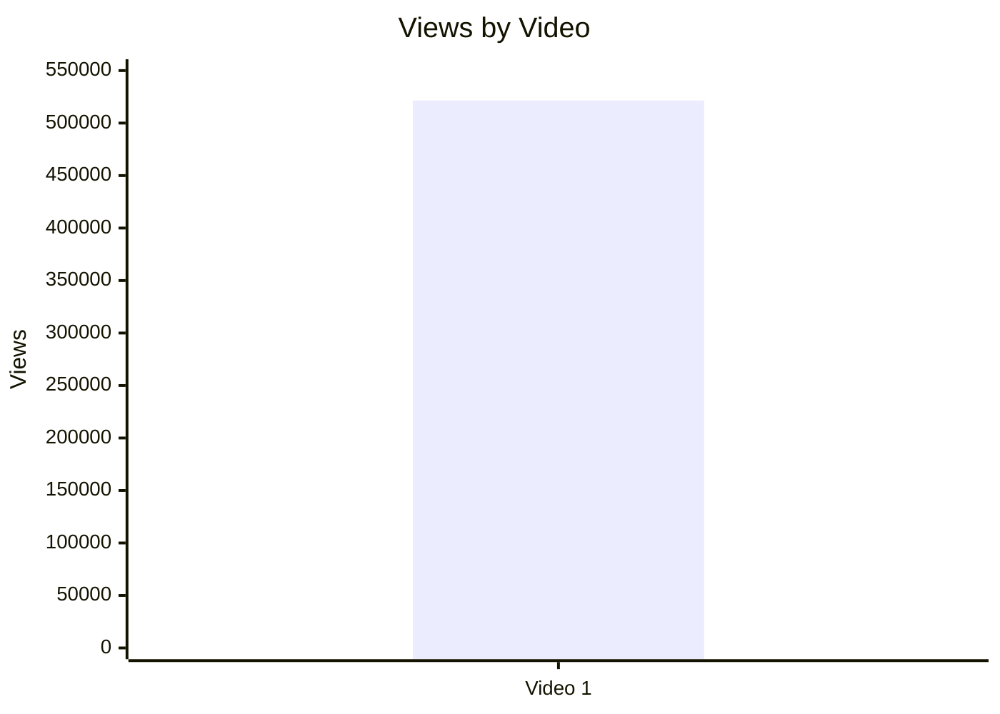

### 5.2. Views per day by video

- Назва графіка: Views per day by video
- Яке питання він відповідає: яка швидкість набору переглядів з урахуванням віку?
- Які поля використовуються: `video_label`, `views_per_day`
- Тип графіка: Mermaid bar chart
- Що видно з графіка: Video 1 набирає `3,806.75` views/day.
- Практичний висновок: це ключова normalized performance metric для наступних порівнянь із відео того ж формату.

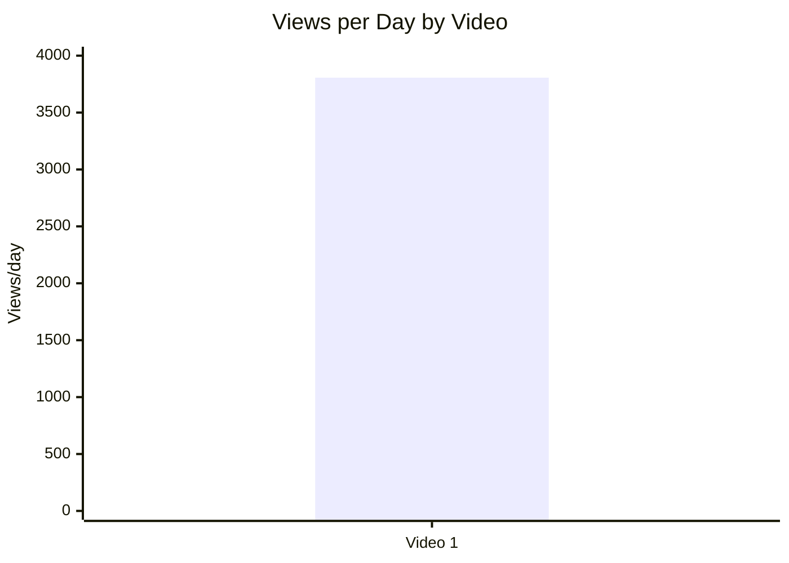

### 5.3. Views per 1k subscribers

- Назва графіка: Views per 1k subscribers
- Яке питання він відповідає: наскільки ефективно відео конвертує розмір каналу в перегляди?
- Які поля використовуються: `video_label`, `views_per_1k_subs`
- Тип графіка: Mermaid bar chart
- Що видно з графіка: Video 1 має `545.53` views per 1k subscribers.
- Практичний висновок: значення треба порівнювати з іншими `LONG_4_10_MIN` відео каналу.

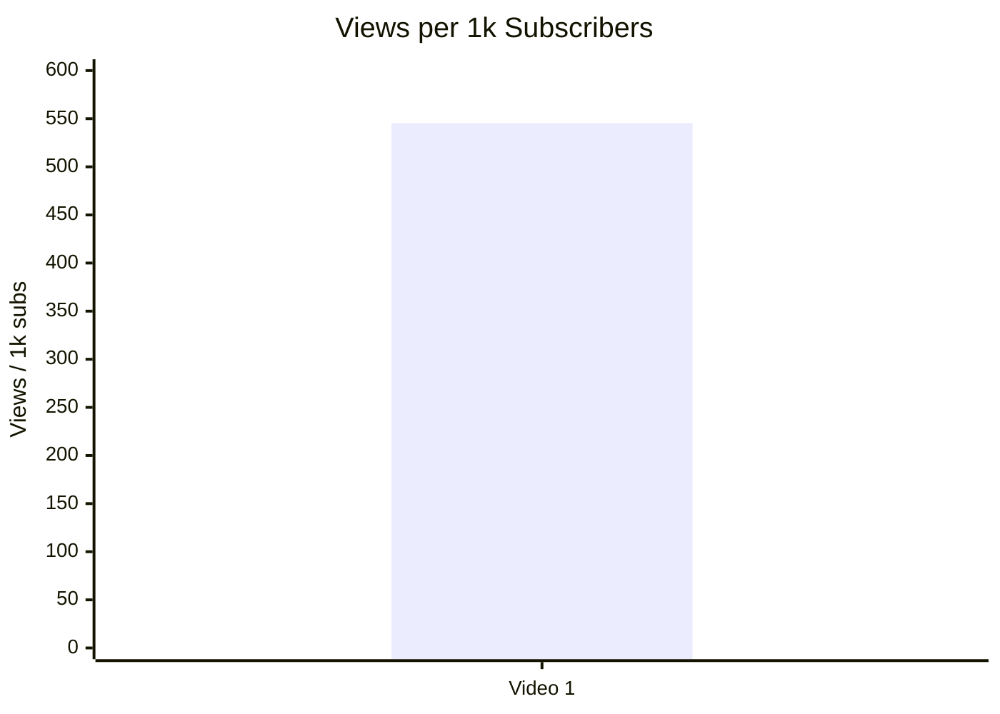

### 5.4. Performance quadrant

- Назва графіка: Performance quadrant
- Яке питання він відповідає: чи поєднує відео охоплення і залучення?
- Які поля використовуються: `views_per_day`, `er_public_percent`
- Тип графіка: scatter plot / quadrant
- Що видно з графіка: `INSUFFICIENT_DATA` для quadrant chart, бо є лише 1 точка і немає cohort median/threshold.
- Практичний висновок: зберегти Video 1 як baseline для майбутніх відео.

| Video | Views/day | ER Public % | Quadrant status |
|---|---:|---:|---|
| Video 1 | 3,806.75 | 3.78 | `INSUFFICIENT_DATA`: потрібні мінімум 3–5 відео для meaningful quadrant |

## 6. Графіки залучення

### 6.1. ER Public % by video

- Назва графіка: ER Public % by video
- Яке питання він відповідає: наскільки сильне публічне залучення?
- Які поля використовуються: `video_label`, `er_public_percent`
- Тип графіка: Mermaid bar chart
- Що видно з графіка: Video 1 має `3.78%` ER Public.
- Практичний висновок: це baseline для наступних відео; без benchmark не позначати як “добре” або “погано”.

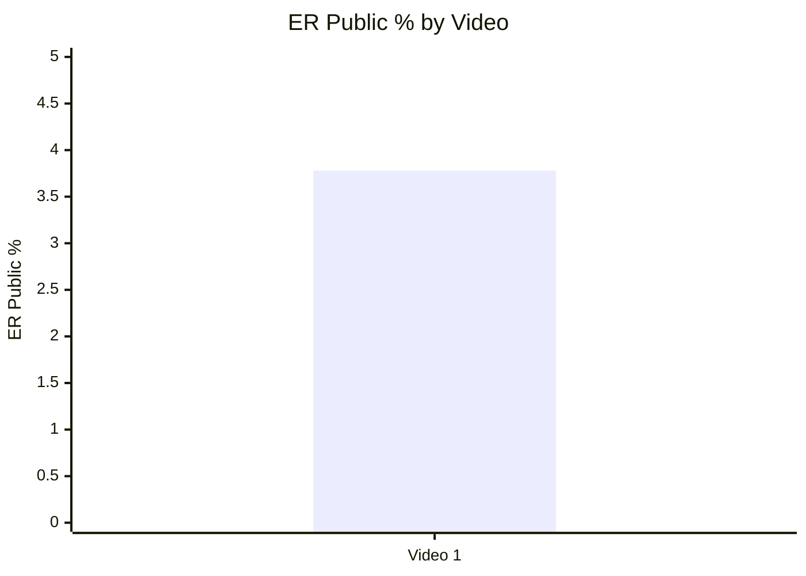

### 6.2. Like Rate % vs Comment Rate %

- Назва графіка: Like Rate % vs Comment Rate %
- Яке питання він відповідає: реакція більше схожа на approval чи debate?
- Які поля використовуються: `like_rate_percent`, `comment_rate_percent`
- Тип графіка: scatter plot
- Що видно з графіка: `INSUFFICIENT_DATA` для scatter; одна точка: Like Rate `3.23%`, Comment Rate `0.55%`.
- Практичний висновок: для цього відео коментарі помітні, але якісна реакція неоднорідна через високі negative/disagreement clusters.

| Video | Like Rate % | Comment Rate % | Interpretation |
|---|---:|---:|---|
| Video 1 | 3.23 | 0.55 | Сильна дискусійність, але sentiment змішаний/конфліктний |

### 6.3. Comments per 1k views

- Назва графіка: Comments per 1k views
- Яке питання він відповідає: які відео провокують реакцію?
- Які поля використовуються: `comments_per_1k_views`
- Тип графіка: Mermaid bar chart
- Що видно з графіка: Video 1 має `5.5` comments per 1k views.
- Практичний висновок: controversy/debate є важливою механікою цього кейсу.

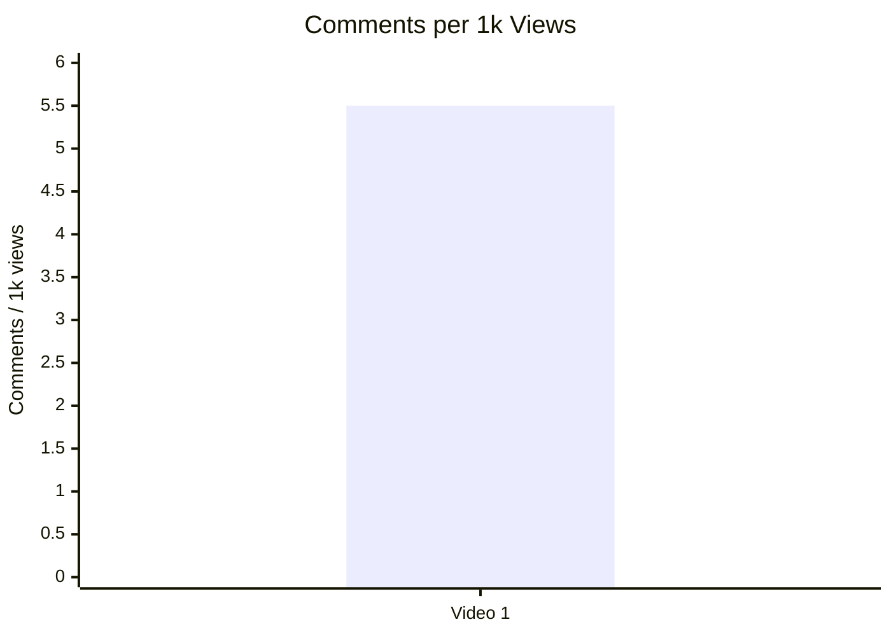

## 7. Графіки структури та hook

### 7.1. Hook score by video

- Назва графіка: Hook score by video
- Яке питання він відповідає: наскільки сильний hook?
- Які поля використовуються: `hook_score`
- Тип графіка: Mermaid bar chart
- Що видно з графіка: Video 1 має hook score `4 / 5`.
- Практичний висновок: shock-news opening варто тестувати далі в same-format videos.

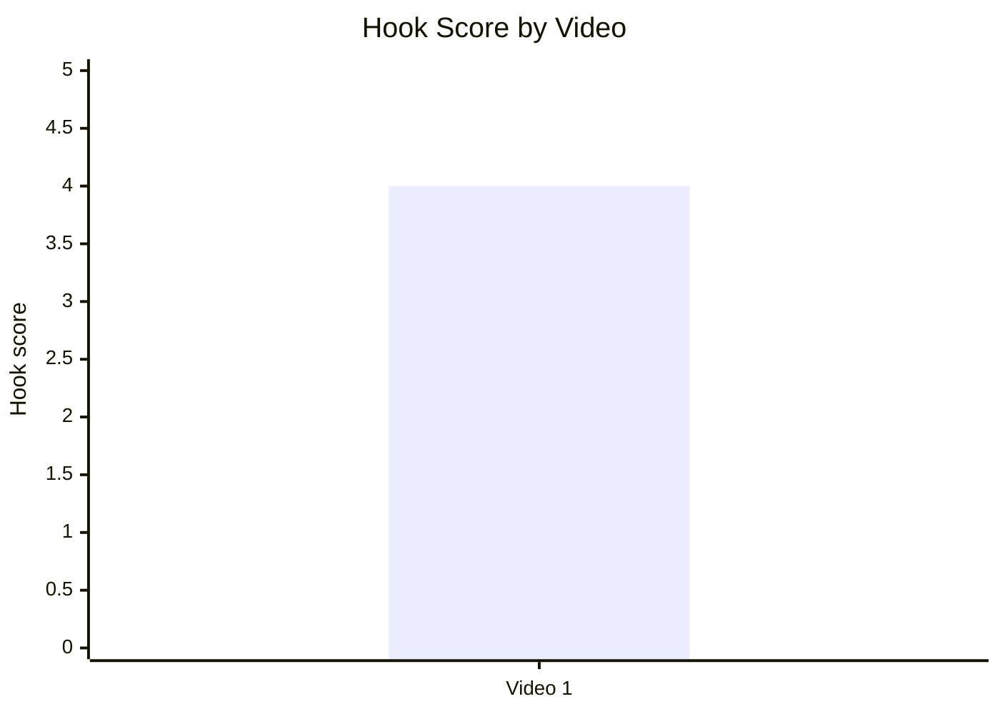

### 7.2. Hook type distribution

- Назва графіка: Hook type distribution
- Яке питання він відповідає: які hook types використовуються?
- Які поля використовуються: `hook_primary_type`
- Тип графіка: Mermaid pie chart
- Що видно з графіка: у вибірці є лише `SHOCK`.
- Практичний висновок: не можна сказати, що `SHOCK` працює краще за інші типи; можна лише зафіксувати його як механіку Video 1.

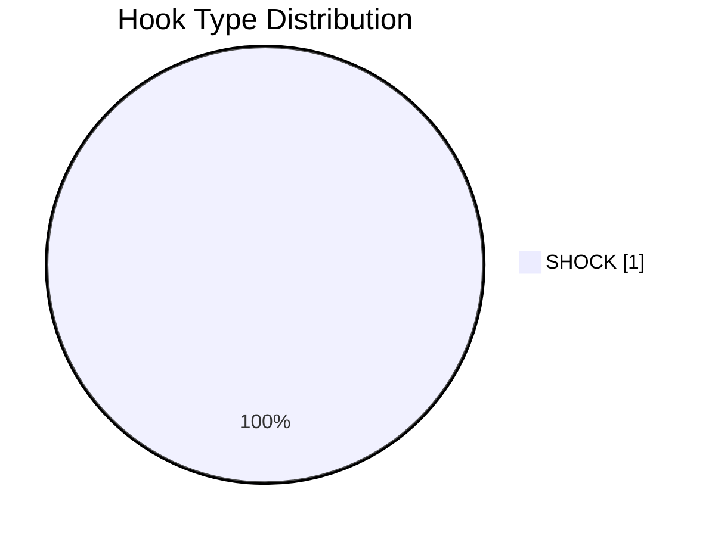

### 7.3. Time to first value vs Overall Score

- Назва графіка: Time to first value vs Overall Score
- Яке питання він відповідає: чи швидша перша цінність пов’язана з кращим результатом?
- Які поля використовуються: `time_to_first_value_seconds`, `overall_video_score`
- Тип графіка: scatter plot
- Що видно з графіка: `INSUFFICIENT_DATA`; точний `time_to_first_value_seconds` відсутній через `NO_TIMECODES`.
- Практичний висновок: у майбутніх звітах потрібно зберігати точний seconds value.

| Video | Time to first value | Time to first value seconds | Overall |
|---|---|---:|---:|
| Video 1 | ~00:00 / NO_TIMECODES | N/A | 3.78 |

## 8. Графіки CTA

### 8.1. CTA score by video

- Назва графіка: CTA score by video
- Яке питання він відповідає: наскільки сильна CTA-система?
- Які поля використовуються: `cta_score`
- Тип графіка: Mermaid bar chart
- Що видно з графіка: Video 1 має `3 / 5`.
- Практичний висновок: CTA є, але основна слабкість — немає comment prompt і next-video bridge.

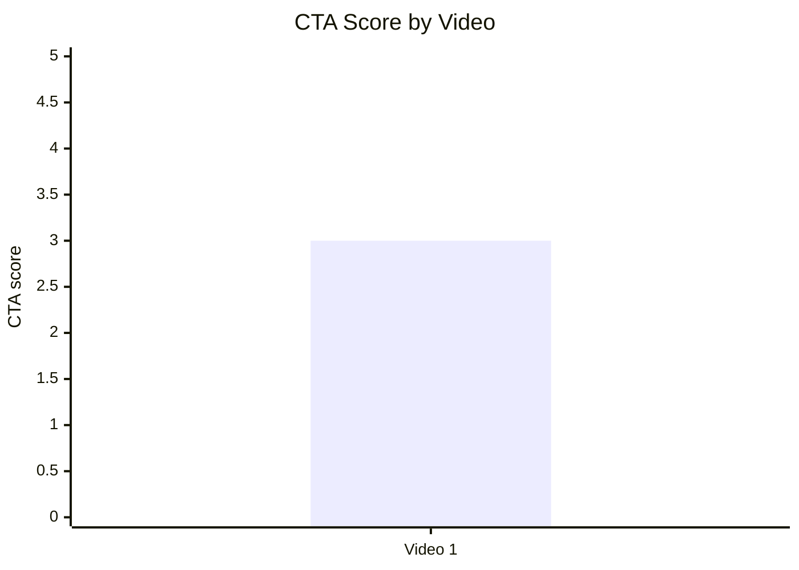

### 8.2. CTA count vs ER Public %

- Назва графіка: CTA count vs ER Public %
- Яке питання він відповідає: чи більше CTA пов’язано з кращим engagement?
- Які поля використовуються: `cta_count`, `er_public_percent`
- Тип графіка: scatter plot
- Що видно з графіка: `INSUFFICIENT_DATA`; одна точка: `cta_count = 7`, `ER Public = 3.78%`.
- Практичний висновок: CTA count не можна інтерпретувати як driver ER; важливіше якість CTA і наявність comment prompt.

| Video | CTA count | ER Public % | CTA overload risk |
|---|---:|---:|---|
| Video 1 | 7 | 3.78 | YES: багато description links, але немає verbal CTA |

### 8.3. CTA features heatmap

- Назва графіка: CTA features heatmap
- Яке питання він відповідає: які CTA-функції присутні?
- Які поля використовуються: `has_comment_prompt`, `has_subscribe_cta`, `has_like_cta`, `has_bell_cta`, `has_next_video_bridge`
- Тип графіка: matrix heatmap
- Що видно з графіка: є subscribe CTA у description, але немає comment prompt, like, bell, next-video bridge.
- Практичний висновок: головний тест — додати verbal comment prompt і bridge.

| Video | Comment prompt | Subscribe | Like | Bell | Next video bridge |
|---|---|---|---|---|---|
| Video 1 | ❌ | ✅ | ❌ | ❌ | ❌ |

## 9. Графіки реклами / інтеграцій

Advertising graphs skipped: no in-video advertising integrations detected.

У звіті зафіксовано description self-promo / description link ads: Patreon, Newsletter, YouTube subscribe, Podcast, Webinars / website. Але `ad_load_percent`, `first_ad_relative_position_percent` і `ad_integration_score` для in-video integration = `NOT_APPLICABLE`.

### 9.1. Ad load % by video

| Video | Ad detected | Ad type | Ad load % | Причина |
|---|---|---|---:|---|
| Video 1 | YES | DESCRIPTION_LINK_AD / SELF_PROMO | N/A | Немає in-video duration |

### 9.2. First ad position %

| Video | First ad time | First ad relative position % | Причина |
|---|---|---:|---|
| Video 1 | NOT_APPLICABLE | N/A | Реклама/промо тільки в описі |

### 9.3. Ad integration score vs ER Public %

| Video | Ad integration score | ER Public % | Статус |
|---|---:|---:|---|
| Video 1 | N/A | 3.78 | `NOT_APPLICABLE`: no in-video sponsor/ad read |

## 10. Графіки аудіо

### 10.1. Audio score by video

- Назва графіка: Audio score by video
- Яке питання він відповідає: чи є аудіо сильним або слабким елементом?
- Які поля використовуються: `audio_score`
- Тип графіка: Mermaid bar chart
- Що видно з графіка: Video 1 має `3 / 5`.
- Практичний висновок: аудіо не провалює відео, але є production issues: burp/belch cluster, wind/background complaints, fast tempo.

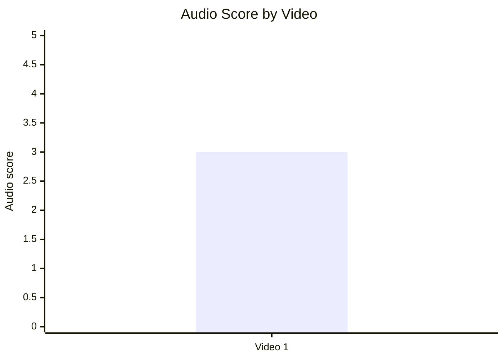

### 10.2. Audio score vs Overall Score

- Назва графіка: Audio score vs Overall Score
- Яке питання він відповідає: чи якість аудіо пов’язана із загальним score?
- Які поля використовуються: `audio_score`, `overall_video_score`
- Тип графіка: scatter plot
- Що видно з графіка: `INSUFFICIENT_DATA`; одна точка не дозволяє робити pattern/correlation.
- Практичний висновок: зафіксувати як майбутній test dimension.

| Video | Audio score | Overall score |
|---|---:|---:|
| Video 1 | 3 | 3.78 |

## 11. Графіки коментарів

### 11.1. Sentiment distribution

- Назва графіка: Sentiment distribution
- Яке питання він відповідає: який тип реакції домінує?
- Які поля використовуються: `positive_percent`, `negative_percent`, `mixed_percent`, `neutral_percent`, `question_percent`, `request_percent`
- Тип графіка: table + Mermaid pie chart
- Що видно з графіка: найбільша частка — neutral `54.5%`, потім negative `16.9%`, question `15.8%`.
- Практичний висновок: відео провокує дискусію та питання; треба додати counterarguments/FAQ/pinned comment.

| Sentiment | Count | Percent |
|---|---:|---:|
| POSITIVE | 153 | 5.7 |
| NEGATIVE | 458 | 16.9 |
| MIXED | 13 | 0.5 |
| NEUTRAL | 1,473 | 54.5 |
| QUESTION | 428 | 15.8 |
| REQUEST | 21 | 0.8 |
| JOKE_MEME | 157 | 5.8 |

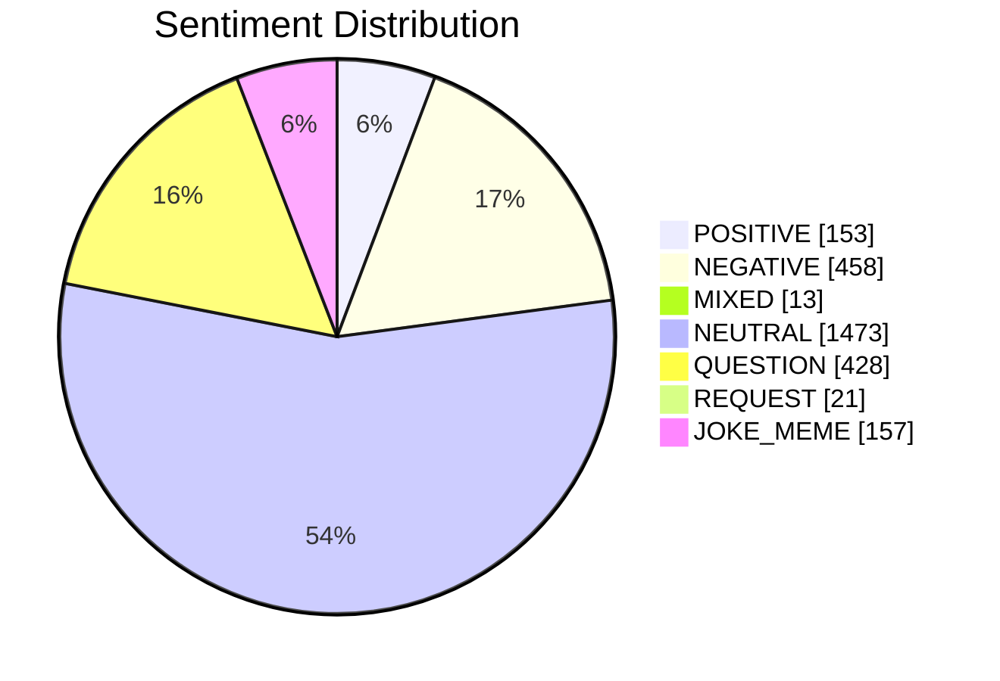

### 11.2. Comment resonance score by video

- Назва графіка: Comment resonance score by video
- Яке питання він відповідає: наскільки сильна коментарна реакція?
- Які поля використовуються: `comment_resonance_score`
- Тип графіка: Mermaid bar chart
- Що видно з графіка: Video 1 має `4 / 5`.
- Практичний висновок: controversy-driven comments є сильним механізмом, але треба зменшувати trust erosion.

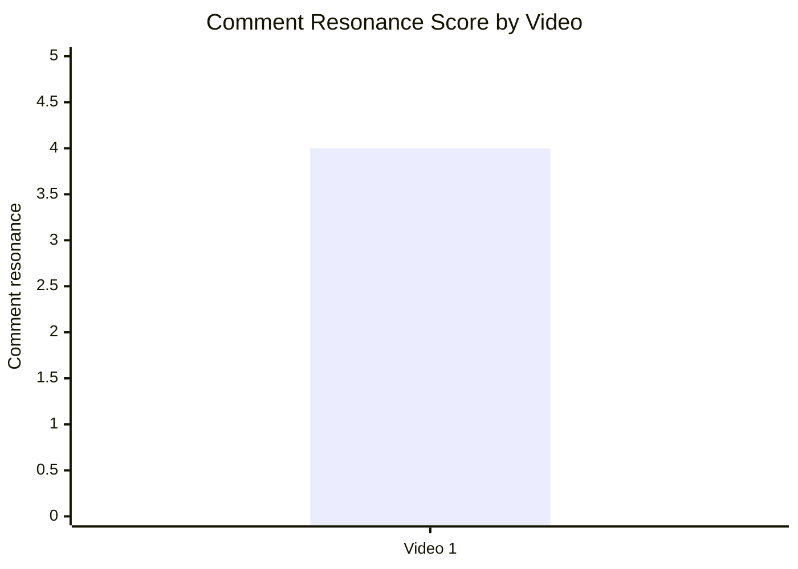

### 11.3. Top comment clusters

- Назва графіка: Top comment clusters
- Яке питання він відповідає: що найчастіше обговорюють/критикують?
- Які поля використовуються: comment cluster counts
- Тип графіка: Mermaid horizontal-style not supported reliably; використано bar chart
- Що видно з графіка: найбільші кластери — clarification questions, accuracy criticism, oil/resources angle.
- Практичний висновок: робити follow-up через FAQ/scenario table.

| Cluster | Count | % relevant |
|---|---:|---:|
| Questions / clarification requests | 345 | 12.8 |
| Accuracy / failed prediction criticism | 280 | 10.4 |
| Oil / resources / China-Russia-Iran angle | 275 | 10.2 |
| Optimistic counter-scenario / disagreement | 183 | 6.8 |
| Jokes / memes / creator appearance | 143 | 5.3 |
| Legality / kidnapped vs captured | 91 | 3.4 |
| Praise for explanation / concise summary | 86 | 3.2 |
| Maduro legitimacy / dictator framing | 74 | 2.7 |
| Sanctions / embargo omission | 50 | 1.8 |
| Audio / production issue | 30 | 1.1 |

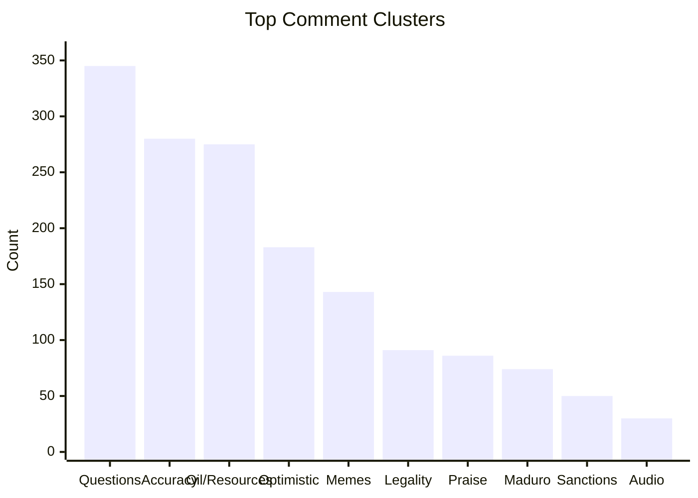

## 12. Графіки score-системи

### 12.1. Overall score by video

- Назва графіка: Overall score by video
- Яке питання він відповідає: який загальний бал відео?
- Які поля використовуються: `overall_video_score`
- Тип графіка: Mermaid bar chart
- Що видно з графіка: Video 1 має `3.78 / 5`.
- Практичний висновок: strong baseline, але не порівнювати без інших відео same format.

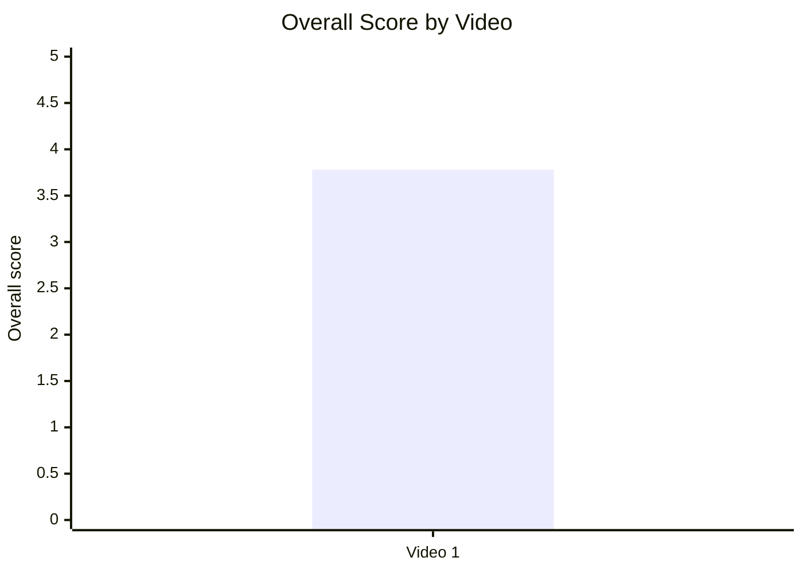

### 12.2. Score breakdown heatmap

- Назва графіка: Score breakdown heatmap
- Яке питання він відповідає: де сильні та слабкі сторони?
- Які поля використовуються: `hook_score`, `structure_score`, `value_density_score`, `audio_score`, `cta_score`, `ad_integration_score`, `comment_resonance_score`, `replicability_score`, `overall_video_score`
- Тип графіка: heatmap matrix table
- Що видно з графіка: найсильніші блоки — Hook, Structure, Value Density, Comments, Replicability; слабші — Audio і CTA.
- Практичний висновок: не змінювати core editorial format; покращувати CTA/audio/series packaging.

| Video | Hook | Structure | Value Density | Audio | CTA | Ad | Comments | Replicability | Overall |
|---|---:|---:|---:|---:|---:|---:|---:|---:|---:|
| Video 1 | 4 | 4 | 4 | 3 | 3 | N/A | 4 | 4 | 3.78 |

### 12.3. Strengths vs weaknesses count

- Назва графіка: Strengths vs weaknesses count
- Яке питання він відповідає: скільки success mechanics vs missed opportunities?
- Які поля використовуються: count of success mechanics, count of missed opportunities
- Тип графіка: Mermaid bar chart
- Що видно з графіка: 5 success mechanics і 5 missed opportunities у звіті.
- Практичний висновок: відео має сильний editorial engine, але помітні execution fixes.

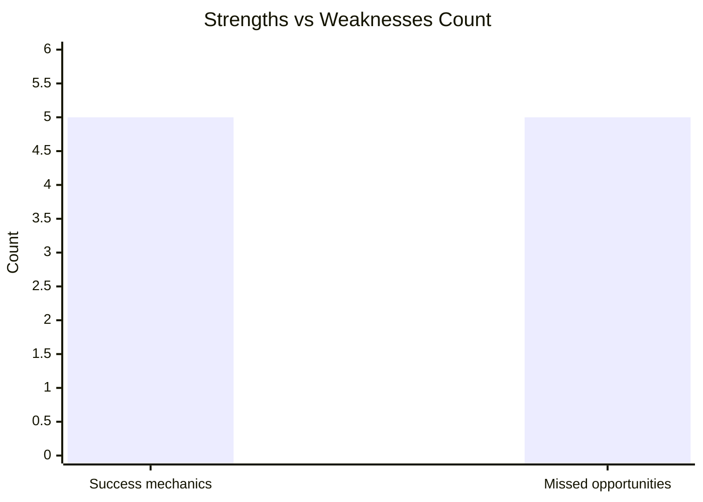

## 13. Кореляції та патерни

Correlation analysis skipped: fewer than 5 comparable videos.

| Pair | Correlation / Pattern | Strength | Interpretation | Confidence |
|---|---:|---|---|---|
| hook_score → overall_video_score | N/A | N/A | Недостатньо відео | LOW |
| value_density_score → er_public_percent | N/A | N/A | Недостатньо відео | LOW |
| cta_score → comment_rate_percent | N/A | N/A | Недостатньо відео | LOW |
| comment_resonance_score → er_public_percent | N/A | N/A | Недостатньо відео | LOW |
| views_per_day → er_public_percent | N/A | N/A | Недостатньо відео | LOW |
| ad_load_percent → er_public_percent | N/A | N/A | `ad_load_percent = NOT_APPLICABLE` | LOW |
| time_to_first_value_seconds → overall_video_score | N/A | N/A | `NO_TIMECODES`, seconds unavailable | LOW |

## 14. Висновки для контент-стратегії

| Спостереження | Дані / графік | Що це означає | Що робити |
|---|---|---|---|
| Shock-news hook є сильною механікою цього кейсу | Hook score `4`, hook type `SHOCK`, views/day `3,806.75` | Працює як швидкий вхід у тему, але не доведено статистично на вибірці 1 | Повторити на 3–5 відео same format і порівняти |
| Коментарі сильні, але конфліктні | Comment resonance `4`, negative `16.9%`, questions `15.8%` | Debate генерує engagement, але є trust risk | Додати assumptions/counterarguments і pinned FAQ |
| CTA слабко інтегровані в саме відео | CTA score `3`, comment prompt ❌, next bridge ❌ | Втрачається керування дискусією і session depth | Додати verbal comment prompt + end-screen bridge |
| Аудіо не критичне, але створило мемний distraction | Audio score `3`, audio issue cluster `30` | Малий кластер може відволікати від аналітики | QC pass: mute artifacts, trim silence, wind control |
| Description links перевантажені | CTA count `7`, overload risk YES | Багато дій без пріоритету | 1 primary CTA + 1 secondary у перших рядках |
| Рекламне навантаження не шкодить перегляду | In-video ad load `N/A`, description-only self-promo | Немає interruption risk | Залишити без in-video sponsor до першої цінності |

## 15. Що тестувати далі

| Тест | Гіпотеза | На яких даних базується | Як виміряти | Пріоритет |
|---|---|---|---|---|
| Shock-news opening у перші 10 секунд | Швидкий hook підвищить ранню увагу | Video 1: hook score `4`, time to first value ~00:00 | Views/day, early retention якщо доступна, ER Public % | HIGH |
| Assumptions/counterarguments block | Зменшить negative trust comments | Accuracy criticism `280`, sanctions `50`, legality `91` | Частка negative/disagreement comments | HIGH |
| Конкретний comment prompt | Переведе хаотичну дискусію у корисні відповіді | Comment prompt ❌, questions `345` | Comment rate %, частка structured replies | HIGH |
| Pinned FAQ / Part bridge | Зменшить повторні питання і збільшить session depth | Missing series logic, no next bridge | Clicks to next video, повтори questions | MEDIUM |
| Audio QC перед upload | Зменшить production distraction | Audio issue cluster `30`, audio score `3` | Audio complaints per 1k comments | MEDIUM |
| CTA pruning у description | Підвищить clarity conversion path | CTA count `7`, overload risk YES | Clicks по primary CTA, description link CTR якщо доступний | MEDIUM |
| Scenario table в описі або відео | Підвищить perceived rigor | Коментарі про scenarios/probabilities | Praise/criticism ratio, average comment quality | HIGH |

## 16. Дані для експорту в таблицю / CSV

| video_label | title | format_group | views | views_per_day | like_rate_percent | comment_rate_percent | er_public_percent | views_per_1k_subs | hook_type | hook_score | cta_count | cta_score | ad_load_percent | ad_integration_score | audio_score | comment_resonance_score | overall_video_score | top_success_mechanic | top_missed_opportunity |
|---|---|---|---:|---:|---:|---:|---:|---:|---|---:|---:|---:|---:|---:|---:|---:|---:|---|---|
| Video 1 | The Beginning of Venezuela's End: Part 2 \|\| Peter Zeihan | LONG_4_10_MIN | 521525 | 3806.75 | 3.23 | 0.55 | 3.78 | 545.53 | SHOCK | 4 | 7 | 3 | N/A | N/A | 3 | 4 | 3.78 | TIMELY_TOPIC | NO_COMMENT_PROMPT |

```csv
video_label,title,format_group,views,views_per_day,like_rate_percent,comment_rate_percent,er_public_percent,views_per_1k_subs,hook_type,hook_score,cta_count,cta_score,ad_load_percent,ad_integration_score,audio_score,comment_resonance_score,overall_video_score,top_success_mechanic,top_missed_opportunity
Video 1,"The Beginning of Venezuela's End: Part 2 || Peter Zeihan",LONG_4_10_MIN,521525,3806.75,3.23,0.55,3.78,545.53,SHOCK,4,7,3,N/A,N/A,3,4,3.78,TIMELY_TOPIC,NO_COMMENT_PROMPT
```