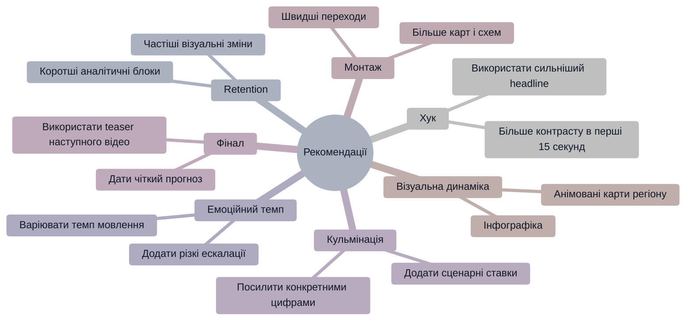

# Аналіз довгоформатного YouTube-відео

## 1. Сюжетна дуга (Narrative Arc)

```mermaid
%%{init: {'theme':'base', 'themeVariables': {
'primaryColor':'#f3f4f6',
'primaryTextColor':'#111827',
'primaryBorderColor':'#2563eb',
'lineColor':'#2563eb',
'secondaryColor':'#ffffff',
'tertiaryColor':'#f3f4f6',
'background':'#f3f4f6'
}}}%%
flowchart LR
A[00:00–00:25\nХук\nТеза про початок блокади Ірану та глобальні наслідки] -->
B[00:25–01:10\nЕкспозиція\nКонтекст Близького Сходу та морської логістики] -->
C[01:10–02:00\nПерша ескалація\nПояснення ролі Ормузької протоки] -->
D[02:00–02:50\nПереломний момент\nАргумент про зміну американської стратегії] -->
E[02:50–03:45\nНаростання напруги\nМожливі економічні наслідки для енергетики] -->
F[03:45–04:45\nКульмінація\nСценарій глобального впливу на нафтові ринки] -->
G[04:45–05:30\nРозв’язка\nПрогноз для регіональних гравців] -->
H[05:30–06:05\nФінальний висновок\nЗаклик стежити за новою фазою геополітичного конфлікту]
```



---

## 2. Ключові Story Beats

```mermaid
%%{init: {'theme':'base', 'themeVariables': {
'primaryColor':'#f3f4f6',
'primaryTextColor':'#111827',
'primaryBorderColor':'#2563eb',
'lineColor':'#2563eb',
'secondaryColor':'#ffffff',
'tertiaryColor':'#f3f4f6',
'background':'#f3f4f6'
}}}%%
flowchart LR
A[00:00\nПровокаційний вступ\nСтворення тривоги] -->
B[00:18\nЗгадка Ірану\nПолітичний контекст] -->
C[00:42\nМорська логістика\nПояснення ставки] -->
D[01:05\nОрмузька протока\nКлючовий вузол історії] -->
E[01:40\nРоль США\nГлобальний масштаб] -->
F[02:15\nПотенційна блокада\nЕскалація конфлікту] -->
G[02:55\nСтрибок цін на нафту\nЕкономічний страх] -->
H[03:30\nРегіональні союзники\nРозширення конфлікту] -->
I[04:05\nРизики для Європи\nГлобалізація проблеми] -->
J[04:45\nСтратегічний прогноз\nАналітична кульмінація] -->
K[05:20\nПідсумковий сценарій\nЗакріплення висновку]
```



---

## 3. Емоційний темп

```mermaid
%%{init: {'theme':'base', 'themeVariables': {
'primaryColor':'#f3f4f6',
'primaryTextColor':'#111827',
'primaryBorderColor':'#2563eb',
'lineColor':'#2563eb',
'secondaryColor':'#ffffff',
'tertiaryColor':'#f3f4f6',
'background':'#f3f4f6'
}}}%%
xychart-beta
    title "Емоційна інтенсивність"
    x-axis [00:00, 00:45, 01:30, 02:15, 03:00, 03:45, 04:30, 05:15, 06:05]
    y-axis "Інтенсивність" 0 --> 100
    line [72, 68, 75, 84, 88, 93, 86, 74, 62]
```

---

## 4. Утримання аудиторії

> Реальні retention-дані не були надані. Нижче — прогнозована retention-структура.

```mermaid
%%{init: {'theme':'base', 'themeVariables': {
'primaryColor':'#f3f4f6',
'primaryTextColor':'#111827',
'primaryBorderColor':'#2563eb',
'lineColor':'#2563eb',
'secondaryColor':'#ffffff',
'tertiaryColor':'#f3f4f6',
'background':'#f3f4f6'
}}}%%
xychart-beta
    title "Прогнозована retention-крива"
    x-axis [00:00, 00:30, 01:00, 02:00, 03:00, 04:00, 05:00, 06:05]
    y-axis "Retention %" 0 --> 100
    line [100, 87, 79, 71, 67, 63, 56, 49]
```

---

## 5. Піки retention

| Таймкод | Подія                       | Чому це може утримувати увагу | Сила піку 1–10 |
| ------- | --------------------------- | ----------------------------- | -------------- |
| 00:00   | Заява про початок блокади   | Сильний геополітичний хук     | 10             |
| 01:05   | Пояснення Ормузької протоки | Конкретизація ставки          | 8              |
| 02:15   | Сценарій морської блокади   | Різке підвищення напруги      | 9              |
| 03:00   | Наслідки для нафти          | Особиста економічна прив’язка | 8              |
| 04:45   | Довгостроковий прогноз      | Аналітична кульмінація        | 7              |

---

## 6. Провали retention

| Таймкод | Проблема                     | Ймовірна причина спаду      | Що покращити                      |
| ------- | ---------------------------- | --------------------------- | --------------------------------- |
| 00:45   | Надто багато контексту       | Інформаційне перевантаження | Додати візуальні карти та графіку |
| 01:50   | Повільне пояснення логістики | Низька візуальна динаміка   | Швидші монтажні вставки           |
| 03:40   | Довгі аналітичні блоки       | Монотонний темп мовлення    | Вставити контрастні приклади      |
| 05:10   | Спад після кульмінації       | Відсутність нової інтриги   | Додати фінальний тизер            |

---

## 7. Оцінка сегментів

| Сегмент             | Таймкод     | Функція              | Емоційна інтенсивність | Ризик втрати уваги | Оцінка 1–10 | Що покращити                        |
| ------------------- | ----------- | -------------------- | ---------------------- | ------------------ | ----------- | ----------------------------------- |
| Хук                 | 00:00–00:25 | Захоплення уваги     | Висока                 | Низький            | 9           | Додати ще швидший візуальний монтаж |
| Експозиція          | 00:25–01:10 | Контекст             | Середня                | Середній           | 7           | Скоротити пояснення                 |
| Геополітична ставка | 01:10–02:00 | Підняття напруги     | Висока                 | Низький            | 8           | Додати інфографіку                  |
| Ескалація           | 02:00–03:00 | Формування конфлікту | Висока                 | Низький            | 9           | Підсилити звуковий дизайн           |
| Кульмінація         | 03:00–04:45 | Максимальна напруга  | Дуже висока            | Середній           | 9           | Додати більше конкретних кейсів     |
| Завершення          | 04:45–06:05 | Закріплення висновку | Середня                | Високий            | 6           | Сильніший фінальний CTA             |

---

## 8. Практичні рекомендації



---

## 9. Підсумкова оцінка

| Показник            | Оцінка 1–10 | Коментар                                              |
| ------------------- | ----------- | ----------------------------------------------------- |
| Сюжетна дуга        | 8           | Чітка структура з сильною кульмінацією                |
| Story Beats         | 8           | Добре розставлені аналітичні акценти                  |
| Емоційний темп      | 7           | Висока напруга, але місцями монотонність              |
| Retention Structure | 7           | Сильний початок, поступовий спад після кульмінації    |
| Загальна оцінка     | 8           | Ефективне аналітичне відео з хорошим утриманням уваги |
