# Статистичний аналіз відеозвітів

## 1. Короткий executive summary

| Пункт | Висновок |
|---|---|
| Скільки відео проаналізовано | 1 |
| Скільки форматів відео | 1 (`LONG_4_10_MIN`) |
| Найсильніше відео за overall score | Video 1 — The Blockade of Iran Begins || Peter Zeihan / 3.77 |
| Найсильніше відео за ER Public % | Video 1 — 3.55% |
| Найсильніше відео за views per day | Video 1 — 6 596.44 |
| Найсильніша повторювана механіка | `INSUFFICIENT_DATA` для повторюваності; у єдиному звіті топ-механіки: `TIMELY_TOPIC`, `CLEAR_HOOK`, `FAST_VALUE_DELIVERY` |
| Найчастіша слабкість | `INSUFFICIENT_DATA` для частотності; у єдиному звіті: `NO_COMMENT_PROMPT`, `NO_NEXT_VIDEO_BRIDGE`, `COMMENTS_SHOW_TOPIC_GAP` |
| Головна стратегічна можливість | Тестувати формат “гаряча міжнародна подія → практичний економічний наслідок для аудиторії”, але висновок `LOW_CONFIDENCE`, бо є лише 1 відео |
| Рівень впевненості | LOW |

## 2. Якість і повнота даних

| Поле | Кількість відео з даними | Кількість N/A | Коментар |
|---|---:|---:|---|
| views | 1 | 0 | Є розбіжність між джерелами в базовому аналізі; використано значення з Comparable Summary JSON: 224279 |
| likes | 1 | 0 | Є розбіжність між джерелами; використано 7077 |
| comments_count | 1 | 0 | Є розбіжність між metadata / analytics / comments file; використано 890 |
| views_per_day | 1 | 0 | 6596.44 |
| er_public_percent | 1 | 0 | 3.55% |
| views_per_1k_subs | 1 | 0 | 234.60 |
| hook_score | 1 | 0 | 4.0 |
| cta_score | 1 | 0 | 2.5 |
| ad_integration_score | 0 | 1 | `NOT_APPLICABLE`, реклами не виявлено |
| audio_score | 1 | 0 | 3.5 |
| comment_resonance_score | 1 | 0 | 4.0 |
| overall_video_score | 1 | 0 | 3.77 |

### Обмеження аналізу

- Даних менше ніж 5 відео, тому кореляції не будуються.
- Даних менше ніж 3 відео, тому дозволена лише описова статистика.
- Усі висновки позначені як `LOW_CONFIDENCE`.
- Не можна визначати outlier, медіану когорти або повторювані патерни на базі одного відео.
- `CTR`, `impressions`, `retention`, `watch_time`, `traffic_sources` у звіті позначені як `OWNER_ONLY`, тому не використовуються.
- `time_to_first_value` має позначки `LOW_CONFIDENCE` і `NO_TIMECODES`, тому графік на цій основі не є статистично надійним.

## 3. Підготовлена таблиця для графіків

| Video | Format | Views | Views/day | Like Rate % | Comment Rate % | ER Public % | Views/1k subs | Hook | CTA | Ad | Audio | Comment Resonance | Overall |
|---|---|---:|---:|---:|---:|---:|---:|---:|---:|---:|---:|---:|---:|
| Video 1 | LONG_4_10_MIN | 224279 | 6596.44 | 3.16 | 0.40 | 3.55 | 234.60 | 4.0 | 2.5 | N/A | 3.5 | 4.0 | 3.77 |

| Label | Full title | URL |
|---|---|---|
| Video 1 | The Blockade of Iran Begins || Peter Zeihan | https://www.youtube.com/watch?v=YZ2K8T2M9U4 |

## 4. Рекомендовані графіки

| # | Назва графіка | Тип графіка | Поля | Для чого потрібен | Пріоритет |
|---:|---|---|---|---|---|
| 1 | Overall score by video | Bar chart / Mermaid xychart | `overall_video_score` | Побачити загальний score єдиного відео | HIGH |
| 2 | Views per day by video | Bar chart / Mermaid xychart | `views_per_day` | Показати швидкість набору переглядів | HIGH |
| 3 | ER Public % by video | Bar chart / Mermaid xychart | `er_public_percent` | Показати публічне залучення | HIGH |
| 4 | Performance quadrant | Scatter plot | `views_per_day`, `er_public_percent` | Для 1 відео це лише позиціонування, не порівняння | MEDIUM |
| 5 | Hook score by video | Bar chart | `hook_score` | Оцінити силу hook | HIGH |
| 6 | CTA score by video | Bar chart | `cta_score` | Оцінити слабкість CTA | HIGH |
| 7 | Score breakdown heatmap | Matrix table | score-поля | Побачити сильні/слабкі сторони | HIGH |
| 8 | Sentiment distribution | Stacked bar / table | sentiment percentages | Показати структуру коментарів | HIGH |
| 9 | CTA features heatmap | Matrix table | CTA boolean fields | Показати, яких CTA бракує | HIGH |
| 10 | Ad load % by video | Skipped | `ad_load_percent` | Реклами не виявлено | LOW |

## 5. Графіки продуктивності

## 5.1. Views by video

- Назва графіка: Views by video
- Яке питання він відповідає: яке відео має найбільший raw reach.
- Які поля використовуються: `video_label`, `views`.
- Тип графіка: Mermaid bar chart.
- Що видно з графіка: єдине відео має 224279 переглядів.
- Практичний висновок: raw views не можна порівняти з іншими відео, бо вибірка = 1.

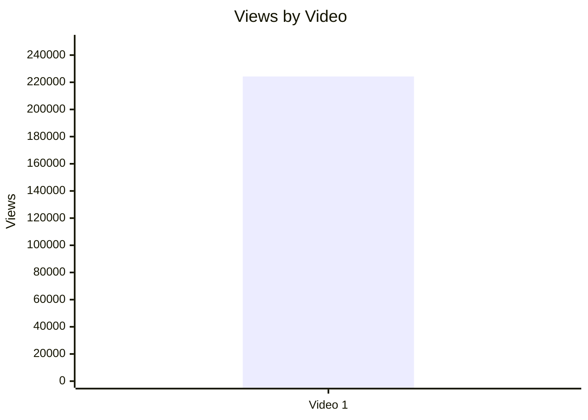

## 5.2. Views per day by video

- Назва графіка: Views per day by video
- Яке питання він відповідає: яка швидкість набору переглядів з урахуванням віку відео.
- Які поля використовуються: `video_label`, `views_per_day`.
- Тип графіка: Mermaid bar chart.
- Що видно з графіка: Video 1 має 6596.44 views/day.
- Практичний висновок: метрика придатна для майбутнього порівняння з іншими `LONG_4_10_MIN` відео.

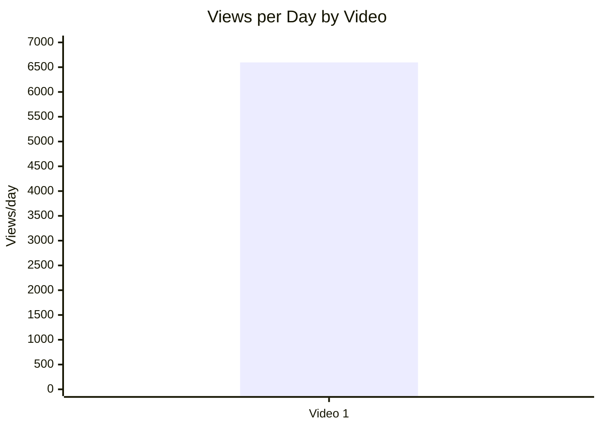

## 5.3. Views per 1k subscribers

- Назва графіка: Views per 1k subscribers
- Яке питання він відповідає: як відео конвертує базу підписників у перегляди.
- Які поля використовуються: `views_per_1k_subs`.
- Тип графіка: Mermaid bar chart.
- Що видно з графіка: 234.60 views per 1k subs.
- Практичний висновок: значення можна використовувати як baseline для наступних відео цього формату.

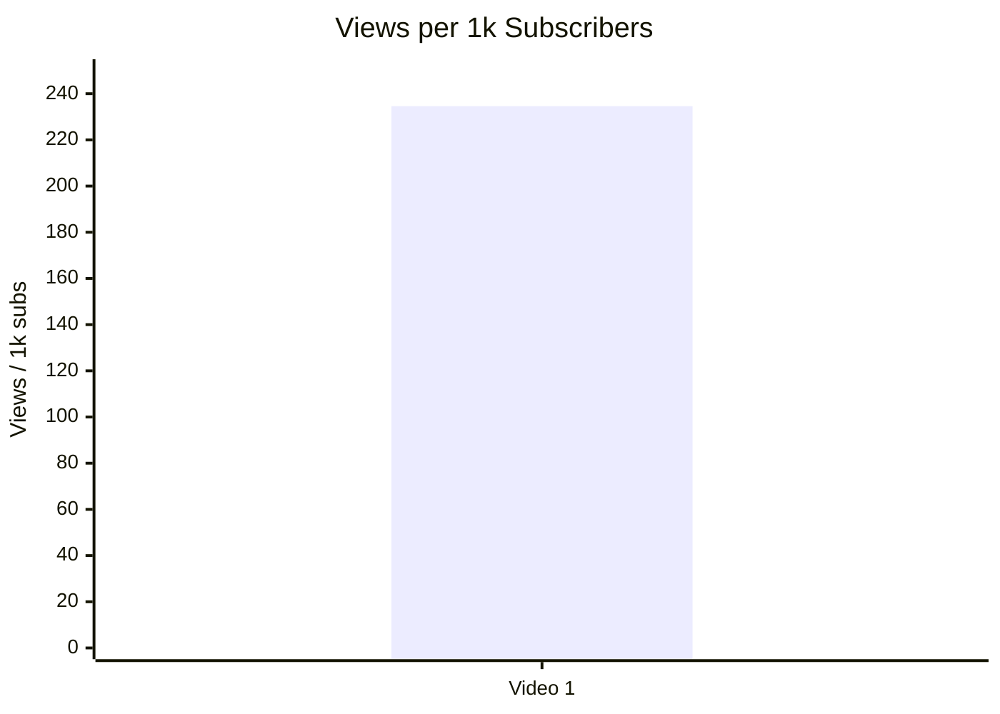

## 5.4. Performance quadrant

- Назва графіка: Performance quadrant
- Яке питання він відповідає: баланс охоплення й залучення.
- Які поля використовуються: `views_per_day`, `er_public_percent`.
- Тип графіка: scatter / quadrant.
- Що видно з графіка: є лише одна точка.
- Практичний висновок: `INSUFFICIENT_DATA` для квадрантного порівняння; потрібні мінімум 3–5 відео однієї когорти.

| Video | Views/day | ER Public % | Quadrant status |
|---|---:|---:|---|
| Video 1 | 6596.44 | 3.55 | `INSUFFICIENT_DATA` — немає cohort median / threshold |

## 6. Графіки залучення

## 6.1. ER Public % by video

- Назва графіка: ER Public % by video
- Яке питання він відповідає: який рівень публічного залучення.
- Які поля використовуються: `er_public_percent`.
- Тип графіка: Mermaid bar chart.
- Що видно з графіка: ER Public = 3.55%.
- Практичний висновок: це baseline для майбутніх long-form відео; без benchmark не називається “добрим” або “поганим”.

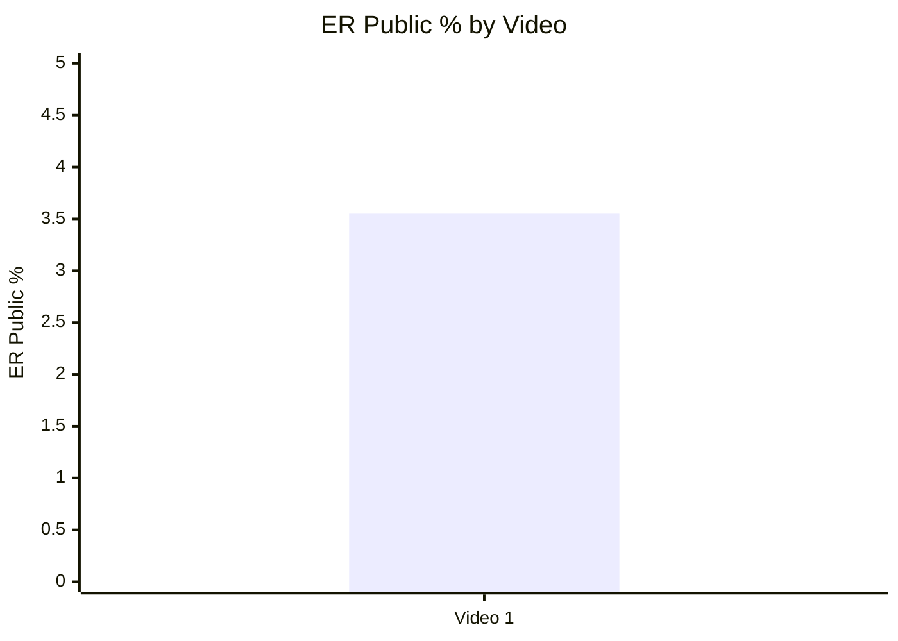

## 6.2. Like Rate % vs Comment Rate %

- Назва графіка: Like Rate % vs Comment Rate %
- Яке питання він відповідає: чи engagement більше йде через likes або comments.
- Які поля використовуються: `like_rate_percent`, `comment_rate_percent`.
- Тип графіка: scatter plot.
- Що видно з графіка: Like Rate = 3.16%, Comment Rate = 0.40%.
- Практичний висновок: для одного відео це описова точка; не можна робити висновок про патерн.

| Video | Like Rate % | Comment Rate % | Interpretation |
|---|---:|---:|---|
| Video 1 | 3.16 | 0.40 | `LOW_CONFIDENCE`: likes значно більші за comments; дискусія є, але без порівняльного benchmark |

## 6.3. Comments per 1k views

- Назва графіка: Comments per 1k views
- Яке питання він відповідає: наскільки відео провокує коментарі на 1000 переглядів.
- Які поля використовуються: `comments_per_1k_views`.
- Тип графіка: Mermaid bar chart.
- Що видно з графіка: 3.97 comments per 1k views.
- Практичний висновок: показник придатний для майбутнього порівняння між відео.

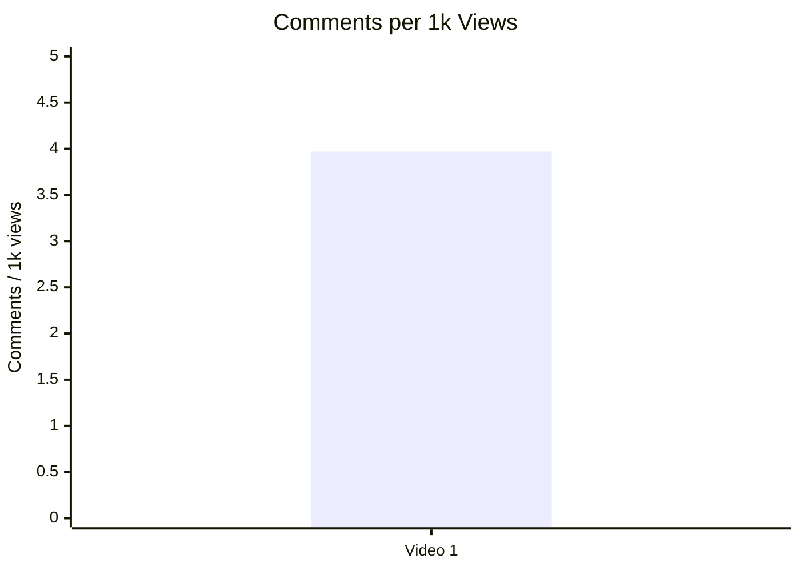

## 7. Графіки структури та hook

## 7.1. Hook score by video

- Назва графіка: Hook score by video
- Яке питання він відповідає: наскільки сильний hook.
- Які поля використовуються: `hook_score`.
- Тип графіка: Mermaid bar chart.
- Що видно з графіка: hook score = 4.0.
- Практичний висновок: hook є однією з сильніших зон у score breakdown.

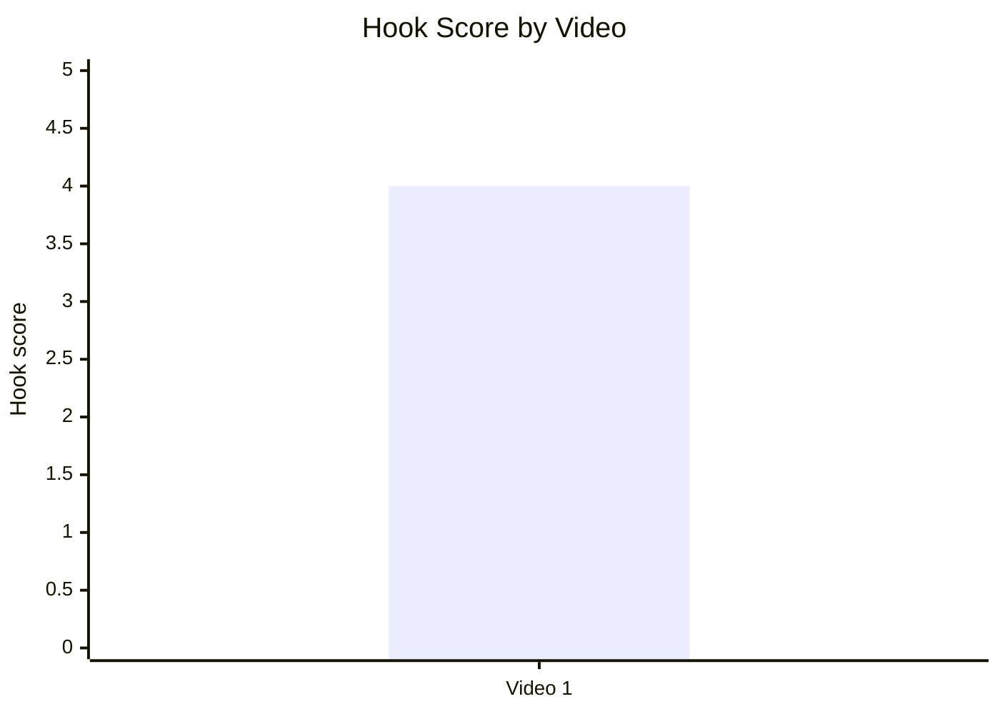

## 7.2. Hook type distribution

- Назва графіка: Hook type distribution
- Яке питання він відповідає: які типи hook використовуються.
- Які поля використовуються: `hook_primary_type`.
- Тип графіка: Mermaid pie chart.
- Що видно з графіка: у вибірці один primary hook type — `PROBLEM`.
- Практичний висновок: `INSUFFICIENT_DATA` для висновків, які hook types працюють краще.

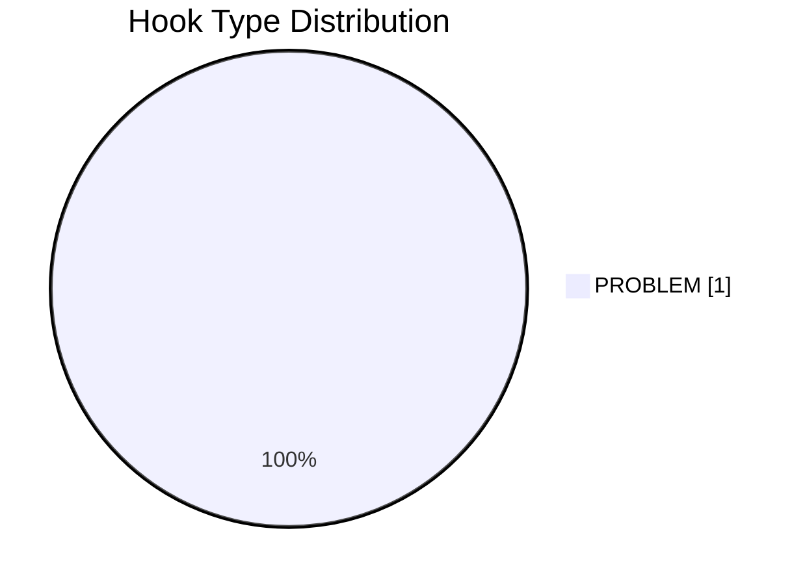

## 7.3. Time to first value vs Overall Score

- Назва графіка: Time to first value vs Overall Score
- Яке питання він відповідає: чи швидша перша цінність пов’язана з вищим результатом.
- Які поля використовуються: `time_to_first_value`, `overall_video_score`.
- Тип графіка: scatter plot.
- Що видно з графіка: `time_to_first_value` у звіті заданий як `~00:20-00:30 LOW_CONFIDENCE NO_TIMECODES`.
- Практичний висновок: графік не будується статистично; потрібні точні таймкоди або мінімум 5 відео.

| Video | Time to first value | Overall Score | Status |
|---|---|---:|---|
| Video 1 | ~00:20–00:30 / `LOW_CONFIDENCE` / `NO_TIMECODES` | 3.77 | `INSUFFICIENT_DATA` |

## 8. Графіки CTA

## 8.1. CTA score by video

- Назва графіка: CTA score by video
- Яке питання він відповідає: наскільки ефективний CTA-блок.
- Які поля використовуються: `cta_score`.
- Тип графіка: Mermaid bar chart.
- Що видно з графіка: CTA score = 2.5.
- Практичний висновок: CTA — слабша зона порівняно з hook, structure, value density і comment resonance.

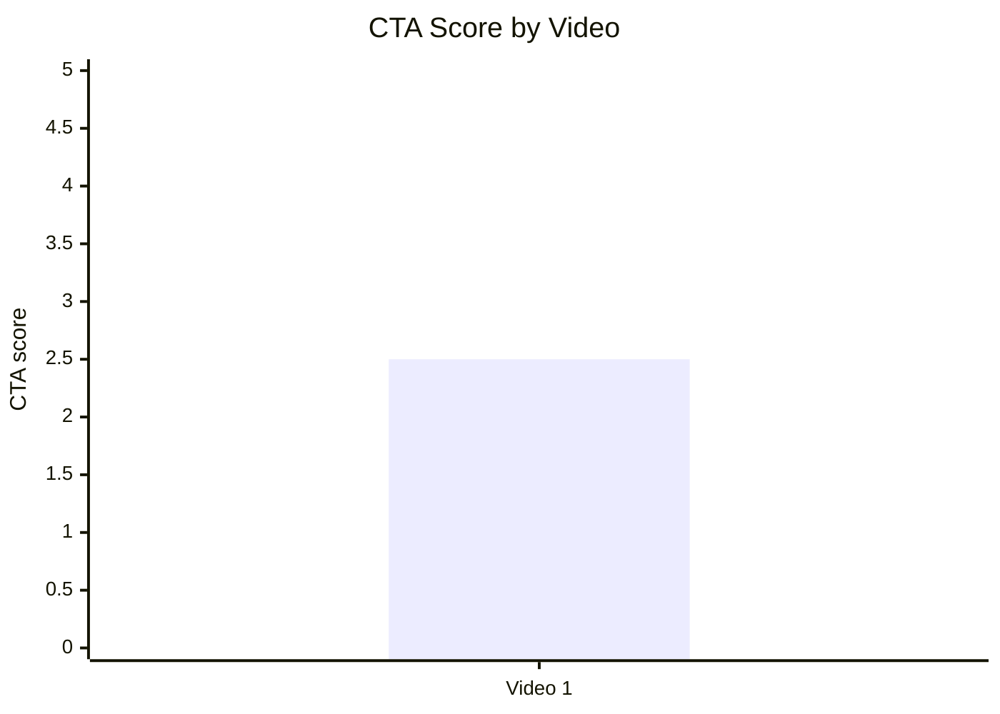

## 8.2. CTA count vs ER Public %

- Назва графіка: CTA count vs ER Public %
- Яке питання він відповідає: чи кількість CTA пов’язана із залученням.
- Які поля використовуються: `cta_count`, `er_public_percent`.
- Тип графіка: scatter plot.
- Що видно з графіка: CTA count = 5, ER Public = 3.55%.
- Практичний висновок: `INSUFFICIENT_DATA`; на одному відео не можна оцінити CTA overload або зв’язок із ER.

| Video | CTA count | ER Public % | Status |
|---|---:|---:|---|
| Video 1 | 5 | 3.55 | `INSUFFICIENT_DATA` для патерну |

## 8.3. CTA features heatmap

- Назва графіка: CTA features heatmap
- Яке питання він відповідає: які CTA-елементи присутні або відсутні.
- Які поля використовуються: `has_comment_prompt`, `has_subscribe_cta`, `has_like_cta`, `has_bell_cta`, `has_next_video_bridge`.
- Тип графіка: heatmap / matrix.
- Що видно з графіка: немає comment prompt, like CTA, bell CTA, next-video bridge; subscription CTA присутній у description link.
- Практичний висновок: найочевидніша зона тесту — додати конкретний comment prompt і next-video bridge.

| Video | Comment prompt | Subscribe | Like | Bell | Next video bridge |
|---|---|---|---|---|---|
| Video 1 | ❌ | ✅ | ❌ | ❌ | ❌ |

## 9. Графіки реклами / інтеграцій

Advertising graphs skipped: no advertising integrations detected.

| Video | Ad detected | Ad count | Ad load % | First ad position % | Ad integration score |
|---|---|---:|---:|---|---|
| Video 1 | NO | 0 | 0.0 | N/A | NOT_APPLICABLE |

## 10. Графіки аудіо

## 10.1. Audio score by video

- Назва графіка: Audio score by video
- Яке питання він відповідає: яка оцінка аудіо.
- Які поля використовуються: `audio_score`.
- Тип графіка: Mermaid bar chart.
- Що видно з графіка: audio score = 3.5.
- Практичний висновок: аудіо не є найслабшою зоною, але нижче за hook / structure / value density.

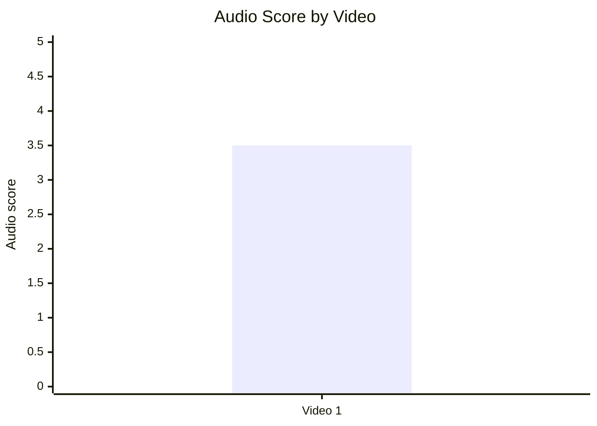

## 10.2. Audio score vs Overall Score

- Назва графіка: Audio score vs Overall Score
- Яке питання він відповідає: чи краща якість аудіо пов’язана з вищим загальним балом.
- Які поля використовуються: `audio_score`, `overall_video_score`.
- Тип графіка: scatter plot.
- Що видно з графіка: одна точка — Audio 3.5, Overall 3.77.
- Практичний висновок: `INSUFFICIENT_DATA` для зв’язку між audio score і overall score.

| Video | Audio Score | Overall Score | Status |
|---|---:|---:|---|
| Video 1 | 3.5 | 3.77 | `INSUFFICIENT_DATA` |

## 11. Графіки коментарів

## 11.1. Sentiment distribution

- Назва графіка: Sentiment distribution
- Яке питання він відповідає: яка структура реакції аудиторії.
- Які поля використовуються: `positive_percent`, `negative_percent`, `mixed_percent`, `neutral_percent`, `question_percent`, `request_percent`, `joke_meme_percent`.
- Тип графіка: stacked bar / table.
- Що видно з графіка: найбільша частка — neutral 51.91%, далі questions 25.90%.
- Практичний висновок: коментарі більше схожі на дискусійно-аналітичну реакцію, ніж на просту похвалу.

| Sentiment | Count | Percent of relevant comments |
|---|---:|---:|
| POSITIVE | 44 | 5.09% |
| NEGATIVE | 64 | 7.40% |
| MIXED | 3 | 0.35% |
| NEUTRAL | 449 | 51.91% |
| QUESTION | 224 | 25.90% |
| REQUEST | 25 | 2.89% |
| JOKE_MEME | 56 | 6.47% |
| SPAM / IRRELEVANT | 7 | N/A |

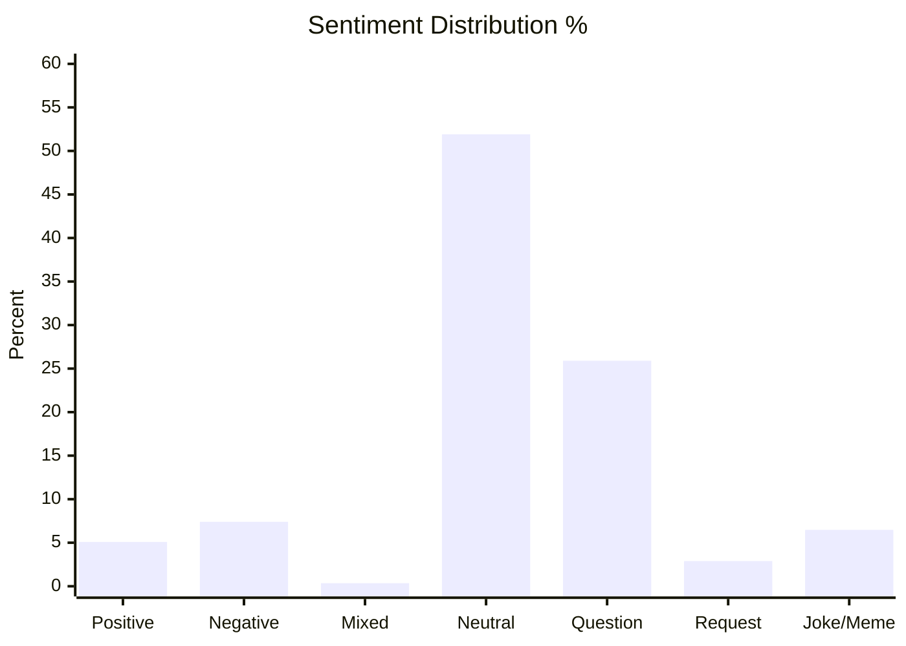

## 11.2. Comment resonance score by video

- Назва графіка: Comment resonance score by video
- Яке питання він відповідає: наскільки коментарі показують резонанс.
- Які поля використовуються: `comment_resonance_score`.
- Тип графіка: Mermaid bar chart.
- Що видно з графіка: comment resonance score = 4.0.
- Практичний висновок: тема провокує питання і дискусії навіть без явного comment prompt.

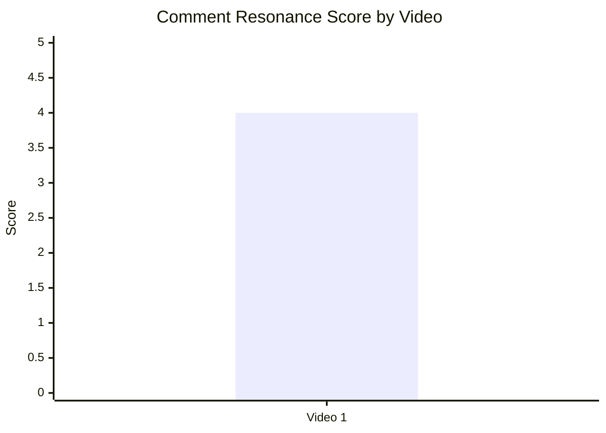

## 11.3. Top comment clusters

- Назва графіка: Top comment clusters
- Яке питання він відповідає: які теми найчастіше повторюються в коментарях.
- Які поля використовуються: cluster count / percent.
- Тип графіка: horizontal bar chart / table.
- Що видно з графіка: найбільший кластер — дискусія про ефективність блокади / Hormuz.
- Практичний висновок: найкращий follow-up angle — логістичні винятки, Китай, land routes, Chabahar, Caspian.

| Cluster | Topic label | Sentiment | Count | % of relevant comments | Strategic meaning |
|---|---|---|---:|---:|---|
| Дискусія про ефективність блокади / Hormuz | COMMUNITY_DISCUSSION | MIXED / QUESTION | 229 | 26.47% | Сильний comment trigger без явного CTA |
| China / land routes / Chabahar / Caspian logistics | COMMUNITY_DISCUSSION | QUESTION / NEUTRAL | 94 | 10.87% | Матеріал для follow-up відео |
| Trump / політична поляризація | DISAGREEMENT | MIXED / NEGATIVE | 75 | 8.67% | Підвищує дискусійність і токсичність |
| Ескалація / ризик війни / міжнародне право | COMMUNITY_DISCUSSION | QUESTION / NEGATIVE | 47 | 5.43% | Сильний ризиковий narrative angle |
| Критика точності / запізнення аналізу | CRITICISM_ACCURACY | NEGATIVE | 39 | 4.51% | Для hot topics важливі timestamp і швидкість |
| Підтримка або похвала контенту | PRAISE_CONTENT | POSITIVE | 19 | 2.20% | Позитив є, але менший за дискусійний шум |
| Аудіо / голос / стан ведучого | CRITICISM_AUDIO / PRAISE_PRODUCTION | MIXED | 3 | 0.35% | Не є значущим кластером |
| Запити на актуальніші оновлення | REQUEST_MORE_CONTENT | REQUEST | 2 | 0.23% | Мала кількість, але корисна ідея для серії |

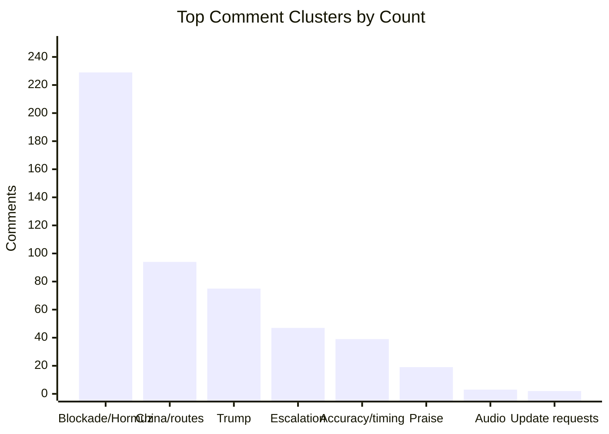

## 12. Графіки score-системи

## 12.1. Overall score by video

- Назва графіка: Overall score by video
- Яке питання він відповідає: загальна оцінка відео.
- Які поля використовуються: `overall_video_score`.
- Тип графіка: Mermaid bar chart.
- Що видно з графіка: overall score = 3.77.
- Практичний висновок: video має сильну аналітичну основу, але CTA знижує загальний score.

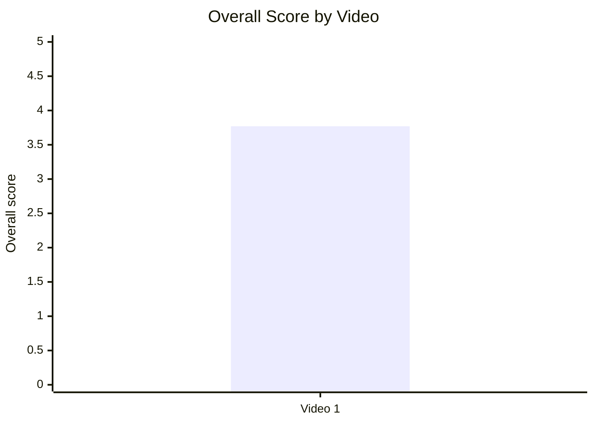

## 12.2. Score breakdown heatmap

- Назва графіка: Score breakdown heatmap
- Яке питання він відповідає: які компоненти сильніші / слабші.
- Які поля використовуються: `hook_score`, `structure_score`, `value_density_score`, `audio_score`, `cta_score`, `ad_integration_score`, `comment_resonance_score`, `replicability_score`, `overall_video_score`.
- Тип графіка: heatmap / matrix.
- Що видно з графіка: Hook, Structure, Value Density, Comments, Replicability = 4.0; CTA = 2.5.
- Практичний висновок: найкорисніший наступний тест — CTA layer, а не перебудова ядра контенту.

| Video | Hook | Structure | Value Density | Audio | CTA | Ad | Comments | Replicability | Overall |
|---|---:|---:|---:|---:|---:|---|---:|---:|---:|
| Video 1 | 4.0 | 4.0 | 4.0 | 3.5 | 2.5 | NOT_APPLICABLE | 4.0 | 4.0 | 3.77 |

## 12.3. Strengths vs weaknesses count

- Назва графіка: Strengths vs weaknesses count
- Яке питання він відповідає: скільки сильних механік і missed opportunities виявлено.
- Які поля використовуються: top success mechanics, top missed opportunities.
- Тип графіка: stacked bar / table.
- Що видно з графіка: 3 top mechanics і 3 top missed opportunities у Comparable Summary JSON.
- Практичний висновок: слабкі місця переважно пов’язані не з темою, а з упаковкою дії після перегляду.

| Video | Success mechanics count | Missed opportunities count | Top strengths | Top missed opportunities |
|---|---:|---:|---|---|
| Video 1 | 3 | 3 | `TIMELY_TOPIC`, `CLEAR_HOOK`, `FAST_VALUE_DELIVERY` | `NO_COMMENT_PROMPT`, `NO_NEXT_VIDEO_BRIDGE`, `COMMENTS_SHOW_TOPIC_GAP` |

## 13. Кореляції та патерни

Correlation analysis skipped: fewer than 5 comparable videos.

| Pair | Correlation / Pattern | Strength | Interpretation | Confidence |
|---|---:|---|---|---|
| hook_score → overall_video_score | INSUFFICIENT_DATA | N/A | Потрібно мінімум 5 порівнюваних відео | LOW |
| value_density_score → er_public_percent | INSUFFICIENT_DATA | N/A | Потрібно мінімум 5 порівнюваних відео | LOW |
| cta_score → comment_rate_percent | INSUFFICIENT_DATA | N/A | Потрібно мінімум 5 порівнюваних відео | LOW |
| comment_resonance_score → er_public_percent | INSUFFICIENT_DATA | N/A | Потрібно мінімум 5 порівнюваних відео | LOW |
| views_per_day → er_public_percent | INSUFFICIENT_DATA | N/A | Потрібно мінімум 5 порівнюваних відео | LOW |
| ad_load_percent → er_public_percent | NOT_APPLICABLE | N/A | Реклами не виявлено | LOW |
| time_to_first_value_seconds → overall_video_score | INSUFFICIENT_DATA | N/A | Немає точних таймкодів; лише LOW_CONFIDENCE діапазон | LOW |

## 14. Висновки для контент-стратегії

| Спостереження | Дані / графік | Що це означає | Що робити |
|---|---|---|---|
| Тема створює дискусію навіть без comment prompt | Comment clusters: 229 коментарів / 26.47% про blockade / Hormuz | Сам topic має природний debate trigger | Для адаптацій додавати конкретне питання в кінці: “Який сценарій найбільше вплине на ціни пального?” |
| Hook сильніший за CTA | Hook score 4.0 vs CTA score 2.5 | Привернення уваги працює краще, ніж конверсія в дію | Не ламати hook-формулу; тестувати CTA після першого value block |
| Найбільший follow-up gap — логістика Китаю / Chabahar / Caspian | 94 коментарі / 10.87% | Аудиторія сама просить / розвиває підтеми через питання | Зробити follow-up: “Як Китай може обходити блокаду Ірану?” |
| Немає next-video bridge | CTA heatmap: Next video bridge ❌ | Втрачається можливість перевести інтерес у наступний перегляд | Додати end-screen bridge або verbal teaser наступного відео |
| Рекламне навантаження не проблема в цьому кейсі | Ad detected: NO, ad load 0.0% | Немає негативного рекламного фактора | Якщо додавати рекламу в майбутньому, ставити після першого payoff |
| Точність і швидкість важливі для hot topic | Cluster “Критика точності / запізнення” 39 коментарів / 4.51% | Це не масова скарга, але стратегічно важливий ризик | Додавати дату/час запису на екрані або в перших 10 секундах |
| Аудіо не є головним джерелом негативу | Audio cluster 3 коментарі / 0.35%, audio score 3.5 | Поліпшення аудіо корисне, але не головний важіль | Пріоритет нижчий за CTA і follow-up structure |

## 15. Що тестувати далі

| Тест | Гіпотеза | На яких даних базується | Як виміряти | Пріоритет |
|---|---|---|---|---|
| Додати конкретний comment prompt | Це збільшить comments per 1k views і частку QUESTION / REQUEST | Comment resonance 4.0, але `has_comment_prompt=false` | Compare `comments_per_1k_views`, `comment_rate_percent`, частку relevant comments | HIGH |
| Додати next-video bridge | Це збільшить перехід у наступний ролик / серійність | `has_next_video_bridge=false`, багато follow-up тем у comments | YouTube Analytics: end screen CTR / next video views; public proxy — коментарі з запитами | HIGH |
| Серія про логістичні винятки | Підтема China / Chabahar / Caspian має попит | 94 коментарі / 10.87% у кластері logistics | Views/day, ER Public %, topic cluster share | HIGH |
| Виносити timestamp recording date | Зменшить критику запізнення в hot topics | 39 коментарів / 4.51% про точність / старіння | Частка criticism_accuracy у коментарях | MEDIUM |
| CTA після першого value block | CTA буде менш шаблонним і більш доречним | CTA score 2.5, time to first value ~00:20–00:30 LOW_CONFIDENCE | CTA response comments, description link clicks OWNER_ONLY | MEDIUM |
| Тестувати “impact on fuel prices” angle для АвтоЦензор | Геополітична тема стане ближчою до автоаудиторії | Top mechanics: `TIMELY_TOPIC`, `FAST_VALUE_DELIVERY`; у попередньому звіті є адаптаційна ідея | Views/day, ER, comments about fuel/logistics | HIGH |
| Не додавати ранню рекламу | Реклама до першої цінності може знизити retention / реакцію | Поточний ad load 0%; немає ad complaints | Якщо реклама з’явиться: ad load %, first ad position %, comment criticism_ads | MEDIUM |

## 16. Дані для експорту в таблицю / CSV

| video_label | title | format_group | views | views_per_day | like_rate_percent | comment_rate_percent | er_public_percent | views_per_1k_subs | hook_type | hook_score | cta_count | cta_score | ad_load_percent | ad_integration_score | audio_score | comment_resonance_score | overall_video_score | top_success_mechanic | top_missed_opportunity |
|---|---|---|---:|---:|---:|---:|---:|---:|---|---:|---:|---:|---:|---|---:|---:|---:|---|---|
| Video 1 | The Blockade of Iran Begins || Peter Zeihan | LONG_4_10_MIN | 224279 | 6596.44 | 3.16 | 0.40 | 3.55 | 234.60 | PROBLEM | 4.0 | 5 | 2.5 | 0.0 | NOT_APPLICABLE | 3.5 | 4.0 | 3.77 | TIMELY_TOPIC | NO_COMMENT_PROMPT |
