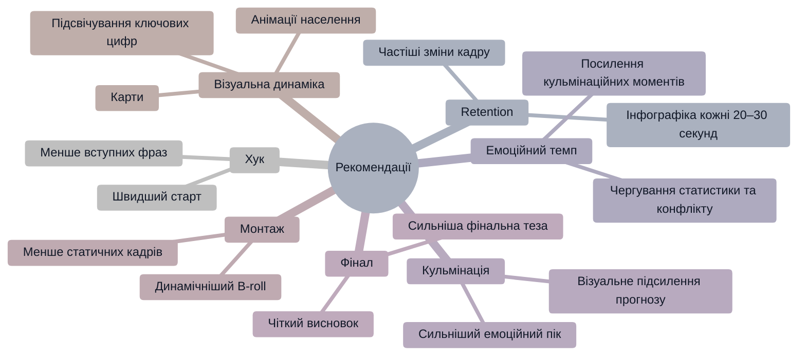

# Аналіз довгоформатного YouTube-відео

## 1. Сюжетна дуга (Narrative Arc)

```mermaid
%%{init: {'theme':'base', 'themeVariables': {
'primaryColor':'#f3f4f6',
'primaryTextColor':'#111827',
'primaryBorderColor':'#2563eb',
'lineColor':'#2563eb',
'secondaryColor':'#ffffff',
'tertiaryColor':'#f3f4f6',
'background':'#f3f4f6'
}}}%%
flowchart LR
A[0:00–0:28<br/>Хук<br/>Теза про демографічний колапс Росії та його наслідки] -->
B[0:28–1:05<br/>Експозиція<br/>Контекст війни, населення та економіки] -->
C[1:05–1:52<br/>Перша ескалація<br/>Пояснення падіння народжуваності та смертності] -->
D[1:52–2:41<br/>Переломний момент<br/>Аргумент про структурну незворотність кризи] -->
E[2:41–3:38<br/>Наростання напруги<br/>Вплив на армію, ринок праці та регіони] -->
F[3:38–4:42<br/>Кульмінація<br/>Прогноз довгострокового ослаблення держави] -->
G[4:42–5:46<br/>Розв’язка<br/>Порівняння з іншими країнами та геополітичні наслідки] -->
H[5:46–6:26<br/>Фінальний висновок<br/>Росія входить у фазу системного демографічного виснаження]
```



---

## 2. Ключові Story Beats

```mermaid
%%{init: {'theme':'base', 'themeVariables': {
'primaryColor':'#f3f4f6',
'primaryTextColor':'#111827',
'primaryBorderColor':'#2563eb',
'lineColor':'#2563eb',
'secondaryColor':'#ffffff',
'tertiaryColor':'#f3f4f6',
'background':'#f3f4f6'
}}}%%
flowchart LR
A[0:00<br/>Сильний вступ про кризу<br/>Функція: миттєвий хук] -->
B[0:22<br/>Опис масштабу проблеми<br/>Функція: створення ставки] -->
C[0:48<br/>Демографічна статистика<br/>Функція: авторитетність] -->
D[1:16<br/>Пояснення причин<br/>Функція: логічне занурення] -->
E[1:52<br/>Аргумент про незворотність<br/>Функція: драматизація] -->
F[2:25<br/>Вплив на економіку<br/>Функція: розширення конфлікту] -->
G[3:01<br/>Вплив на військову систему<br/>Функція: підняття напруги] -->
H[3:45<br/>Прогноз для регіонів РФ<br/>Функція: деталізація ризиків] -->
I[4:18<br/>Геополітичний ефект<br/>Функція: масштабування історії] -->
J[5:02<br/>Порівняння з іншими державами<br/>Функція: контраст] -->
K[5:40<br/>Підсумковий прогноз<br/>Функція: кульмінаційний висновок] -->
L[6:10<br/>Фінальна теза<br/>Функція: закриття на сильній думці]
```



---

## 3. Емоційний темп

```mermaid
%%{init: {'theme':'base', 'themeVariables': {
'primaryColor':'#f3f4f6',
'primaryTextColor':'#111827',
'primaryBorderColor':'#2563eb',
'lineColor':'#2563eb',
'secondaryColor':'#ffffff',
'tertiaryColor':'#f3f4f6',
'background':'#f3f4f6'
}}}%%
xychart-beta
    title "Емоційна інтенсивність відео"
    x-axis [0:00,0:45,1:30,2:15,3:00,3:45,4:30,5:15,6:20]
    y-axis "Інтенсивність" 0 --> 100
    line [82,74,78,88,92,95,86,79,72]
```

---

## 4. Утримання аудиторії

### Прогнозована retention-структура

```mermaid
%%{init: {'theme':'base', 'themeVariables': {
'primaryColor':'#f3f4f6',
'primaryTextColor':'#111827',
'primaryBorderColor':'#2563eb',
'lineColor':'#2563eb',
'secondaryColor':'#ffffff',
'tertiaryColor':'#f3f4f6',
'background':'#f3f4f6'
}}}%%
xychart-beta
    title "Прогнозована Retention-крива"
    x-axis [0:00,0:30,1:00,2:00,3:00,4:00,5:00,6:20]
    y-axis "Retention %" 0 --> 100
    line [100,86,79,74,71,66,59,51]
```

---

## 5. Піки retention

| Таймкод | Подія                         | Чому це може утримувати увагу         | Сила піку 1–10 |
| ------- | ----------------------------- | ------------------------------------- | -------------- |
| 0:00    | Теза про демографічний колапс | Сильний страх та геополітична інтрига | 10             |
| 1:52    | Аргумент про незворотність    | Високий рівень драматизації           | 9              |
| 3:01    | Вплив на армію                | Перехід від статистики до конфлікту   | 8              |
| 4:18    | Геополітичні наслідки         | Масштабування теми                    | 8              |
| 5:40    | Підсумковий прогноз           | Закриття головної тези                | 7              |

---

## 6. Провали retention

| Таймкод | Проблема                  | Ймовірна причина спаду         | Що покращити                |
| ------- | ------------------------- | ------------------------------ | --------------------------- |
| 0:48    | Блок статистики           | Надлишок цифр без візуалізації | Додати графіку та карти     |
| 2:25    | Довге пояснення економіки | Зниження емоційної динаміки    | Додати кейси або приклади   |
| 4:42    | Порівняльний сегмент      | Втрата основного конфлікту     | Скоротити порівняння        |
| 5:02    | Повільний темп фіналу     | Зниження новизни інформації    | Посилити фінальний висновок |

---

## 7. Оцінка сегментів

| Сегмент                | Таймкод   | Функція             | Емоційна інтенсивність | Ризик втрати уваги | Оцінка 1–10 | Що покращити             |
| ---------------------- | --------- | ------------------- | ---------------------- | ------------------ | ----------- | ------------------------ |
| Хук                    | 0:00–0:28 | Захоплення уваги    | Висока                 | Низький            | 9           | Додати швидший монтаж    |
| Експозиція             | 0:28–1:05 | Контекст            | Середня                | Середній           | 7           | Більше візуалів          |
| Аналіз причин          | 1:05–1:52 | Пояснення           | Середньо-висока        | Середній           | 8           | Скоротити статистику     |
| Переломний момент      | 1:52–2:41 | Драматизація        | Висока                 | Низький            | 9           | Посилити музичний акцент |
| Економічний блок       | 2:41–3:38 | Раціональний аналіз | Середня                | Високий            | 6           | Додати приклади          |
| Військовий блок        | 3:38–4:42 | Ескалація           | Дуже висока            | Низький            | 9           | Більше динамічних кадрів |
| Геополітичний висновок | 4:42–5:46 | Масштабування       | Середня                | Середній           | 7           | Зменшити повтори         |
| Фінал                  | 5:46–6:26 | Закриття історії    | Середньо-висока        | Середній           | 8           | Сильніший фінальний CTA  |

---

## 8. Практичні рекомендації



---

## 9. Підсумкова оцінка

| Показник            | Оцінка 1–10 | Коментар                                                     |
| ------------------- | ----------- | ------------------------------------------------------------ |
| Сюжетна дуга        | 8           | Добре структурований аналітичний наратив                     |
| Story Beats         | 8           | Є чіткі етапи ескалації теми                                 |
| Емоційний темп      | 7           | Переважає раціональна подача                                 |
| Retention Structure | 7           | Є кілька потенційних спадів через статистику                 |
| Загальна оцінка     | 8           | Сильне аналітичне відео з хорошою геополітичною драматургією |
