# Статистичний аналіз відеозвітів

## 1. Короткий executive summary

| Пункт | Висновок |
|---|---|
| Скільки відео проаналізовано | 1 |
| Скільки форматів відео | 1: `LONG_4_10_MIN` |
| Найсильніше відео за overall score | Video 1 — `3.8 / 5` |
| Найсильніше відео за ER Public % | Video 1 — `2.5911%` |
| Найсильніше відео за views per day | Video 1 — `1780.49` |
| Найсильніша повторювана механіка | `INSUFFICIENT_DATA` для повторюваності: є лише одне відео. У межах кейсу найсильніша механіка — current-event trigger + evergreen background + high-stakes geopolitical payoff. |
| Найчастіша слабкість | `INSUFFICIENT_DATA` для частоти між відео. У межах кейсу головна слабкість — contested claims без достатнього source/caveat framing. |
| Головна стратегічна можливість | Перетворити тему на comparative series: Russia vs Ukraine / West / Europe / China demographics, із сильнішим джерельним framing і comment prompt. |
| Рівень впевненості | LOW — лише 1 відео, `PARTIAL_DATA`, `NO_TIMECODES`, `OWNER_ONLY_ANALYTICS_MISSING`. |

## 2. Якість і повнота даних

| Поле | Кількість відео з даними | Кількість N/A | Коментар |
|---|---:|---:|---|
| views | 1 | 0 | Є: `608,927`; у звіті позначено metadata conflict із `610.4K`, тому базове значення взято з Comparable Summary JSON. |
| likes | 1 | 0 | Є: `14,615`; у звіті є конфлікт із округленим `14K`. |
| comments_count | 1 | 0 | Є: `1,163`; фактично надано `1,122` коментарі, тому `PARTIAL_DATA`. |
| views_per_day | 1 | 0 | Є: `1780.49`. |
| er_public_percent | 1 | 0 | Є: `2.5911%`. |
| views_per_1k_subs | 1 | 0 | Є: `636.95`. |
| hook_score | 1 | 0 | Є: `3`. |
| cta_score | 1 | 0 | Є: `2`. |
| ad_integration_score | 1 | 0 | Є: `5`; ad_detected = false, ad_load = `0.0%`. |
| audio_score | 1 | 0 | Є: `3`. |
| comment_resonance_score | 1 | 0 | Є: `4`. |
| overall_video_score | 1 | 0 | Є: `3.8`. |

### Обмеження аналізу

- `LOW_CONFIDENCE`: вибірка містить лише 1 відео; дозволена тільки описова статистика без кореляцій.
- `NOT_COMPARABLE`: немає інших відео в тій самій когорті `LONG_4_10_MIN`, тому не можна визначити лідера, аутсайдера або повторювані патерни між відео.
- `PARTIAL_DATA`: у джерельному V1-звіті зафіксовано конфлікт дати публікації, views, likes, comments і subscribers між файлами.
- `NO_TIMECODES`: транскрипт без точних таймкодів, тому графіки time-to-first-value мають обмежену точність.
- `OWNER_ONLY_ANALYTICS_MISSING`: CTR, impressions, retention, watch time, average view duration, traffic sources не надані й не використовуються.

## 3. Підготовлена таблиця для графіків

| Video | Format | Views | Likes | Comments | Views/day | Like Rate % | Comment Rate % | ER Public % | Views/1k subs | Hook | CTA | Ad | Audio | Comment Resonance | Overall |
|---|---|---:|---:|---:|---:|---:|---:|---:|---:|---:|---:|---:|---:|---:|---:|
| Video 1 | LONG_4_10_MIN | 608,927 | 14,615 | 1,163 | 1780.5 | 2.40 | 0.19 | 2.59 | 637.0 | 3 | 2 | 0.0 | 3 | 4 | 3.8 |

| Label | Full title | URL |
|---|---|---|
| Video 1 | The Demographic Crisis in Russia \|\| Peter Zeihan | https://www.youtube.com/watch?v=S6mXqOk63Ss |

## 4. Рекомендовані графіки

| # | Назва графіка | Тип графіка | Поля | Для чого потрібен | Пріоритет |
|---:|---|---|---|---|---|
| 1 | Views by video | Bar chart / Mermaid | `video_label`, `views` | Показати raw reach одного кейсу | HIGH |
| 2 | Views per day by video | Bar chart / Mermaid | `video_label`, `views_per_day` | Показати нормалізовану швидкість набору переглядів | HIGH |
| 3 | Views per 1k subscribers | Bar chart / Mermaid | `video_label`, `views_per_1k_subs` | Показати перегляди відносно розміру каналу | HIGH |
| 4 | ER Public % by video | Bar chart / Mermaid | `video_label`, `er_public_percent` | Показати публічне залучення | HIGH |
| 5 | Like Rate % vs Comment Rate % | Scatter data table | `like_rate_percent`, `comment_rate_percent` | Показати баланс лайків і коментарів | MEDIUM |
| 6 | Hook score by video | Bar chart / Mermaid | `hook_score` | Показати силу hook | HIGH |
| 7 | CTA score by video | Bar chart / Mermaid | `cta_score` | Показати слабкість CTA | HIGH |
| 8 | CTA features heatmap | Matrix | CTA feature booleans | Побачити, які CTA відсутні | HIGH |
| 9 | Score breakdown heatmap | Matrix | scores 1–5 | Побачити сильні/слабкі зони відео | HIGH |
| 10 | Sentiment distribution | Stacked data table / Mermaid pie | sentiment counts/percents | Показати структуру реакцій аудиторії | HIGH |
| 11 | Ad load % by video | Bar chart / table | `ad_load_percent` | Перевірити рекламне навантаження | MEDIUM |
| 12 | Audio score by video | Bar chart / table | `audio_score` | Показати аудіо-ризик | MEDIUM |

## 5. Графіки продуктивності

### 5.1. Views by video

- Назва графіка: Views by video
- Яке питання він відповідає: який raw reach має відео?
- Які поля використовуються: `video_label`, `views`
- Тип графіка: Mermaid bar chart
- Що видно з графіка: Video 1 має `608,927` переглядів.
- Практичний висновок: raw views корисні як факт охоплення, але без інших відео і без нормалізації не можна робити висновок про відносну силу.

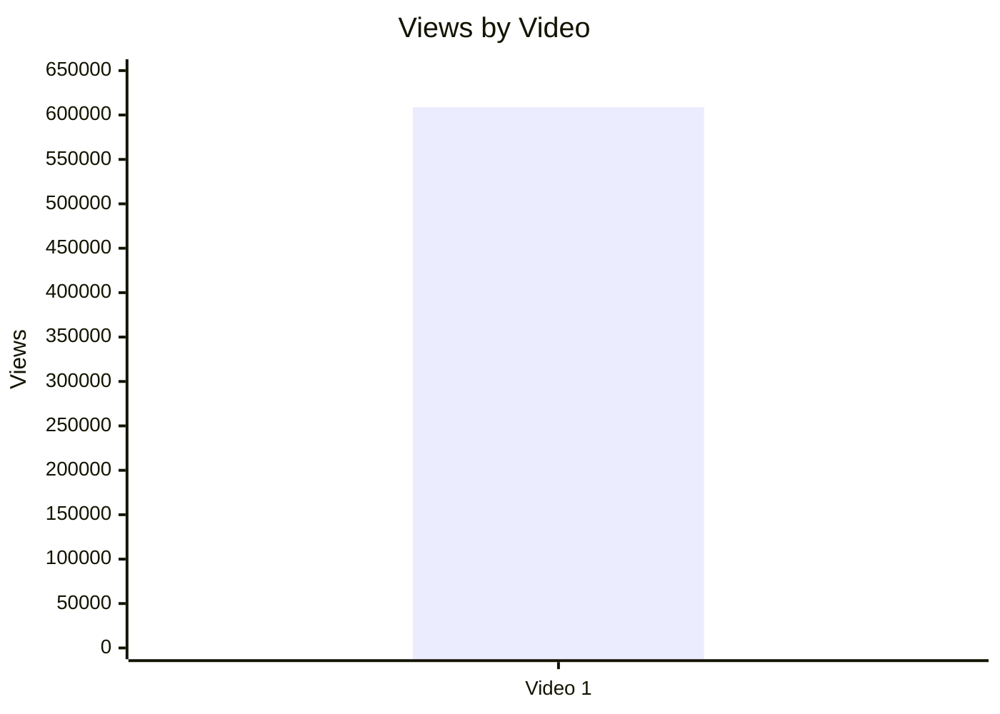

| Video | Views | Коментар |
|---|---:|---|
| Video 1 | 608927 | Raw reach високий у межах одного кейсу, але `NOT_COMPARABLE` без когорти. |

### 5.2. Views per day by video

- Назва графіка: Views per day by video
- Яке питання він відповідає: яка нормалізована швидкість набору переглядів?
- Які поля використовуються: `video_label`, `views_per_day`
- Тип графіка: Mermaid bar chart
- Що видно з графіка: Video 1 має `1780.49` views/day.
- Практичний висновок: це краща метрика для порівнянь, ніж raw views, але порівнювати нема з чим.

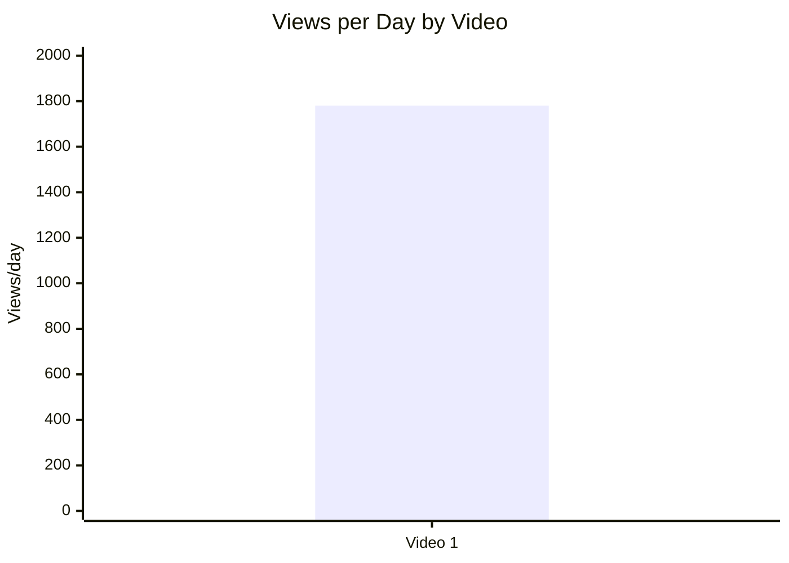

| Video | Views/day | Коментар |
|---|---:|---|
| Video 1 | 1780.49 | Описова метрика; `LOW_CONFIDENCE` для стратегічних висновків. |

### 5.3. Views per 1k subscribers

- Назва графіка: Views per 1k subscribers
- Яке питання він відповідає: як відео конвертує розмір каналу в перегляди?
- Які поля використовуються: `video_label`, `views_per_1k_subs`
- Тип графіка: Mermaid bar chart
- Що видно з графіка: Video 1 має `636.95` views / 1k subscribers.
- Практичний висновок: показник можна використовувати як baseline для майбутніх відео цього ж каналу.

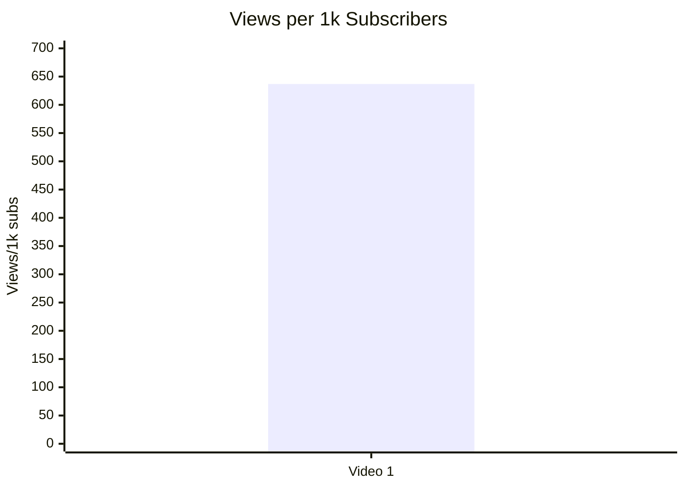

| Video | Views/1k subs | Коментар |
|---|---:|---|
| Video 1 | 636.95 | Можна зберегти як benchmark для наступних V1-звітів. |

### 5.4. Performance quadrant

- Назва графіка: Performance quadrant
- Яке питання він відповідає: де відео розташовується за балансом охоплення і залучення?
- Які поля використовуються: `views_per_day`, `er_public_percent`
- Тип графіка: scatter / quadrant
- Що видно з графіка: доступна лише одна точка: `views_per_day = 1780.49`, `ER Public = 2.5911%`.
- Практичний висновок: `INSUFFICIENT_DATA` для квадрантів, бо немає медіани/середнього по когорті.

| Video | Views/day | ER Public % | Quadrant |
|---|---:|---:|---|
| Video 1 | 1780.49 | 2.5911 | `INSUFFICIENT_DATA`: потрібні мінімум кілька comparable videos для порогів high/low. |

## 6. Графіки залучення

### 6.1. ER Public % by video

- Назва графіка: ER Public % by video
- Яке питання він відповідає: який рівень публічного залучення має відео?
- Які поля використовуються: `video_label`, `er_public_percent`
- Тип графіка: Mermaid bar chart
- Що видно з графіка: ER Public = `2.5911%`.
- Практичний висновок: значення корисне як baseline; без benchmark не називати “добрим” або “поганим”.

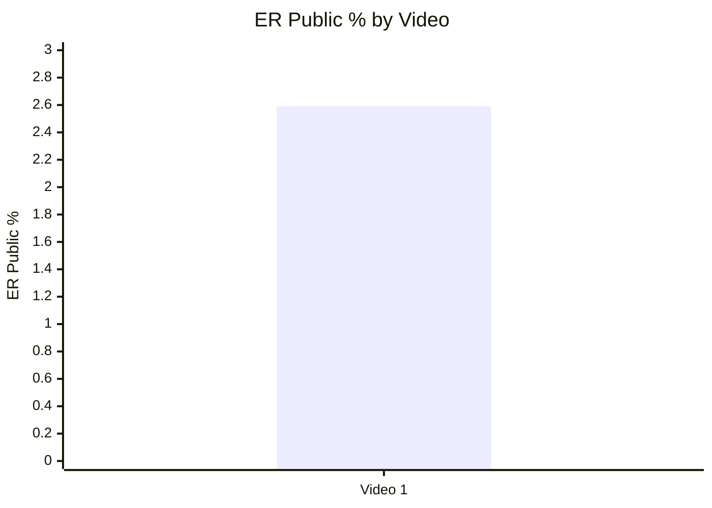

| Video | ER Public % | Коментар |
|---|---:|---|
| Video 1 | 2.5911 | Public engagement baseline для наступних порівнянь. |

### 6.2. Like Rate % vs Comment Rate %

- Назва графіка: Like Rate % vs Comment Rate %
- Яке питання він відповідає: залучення більше через лайки чи через дискусію?
- Які поля використовуються: `like_rate_percent`, `comment_rate_percent`
- Тип графіка: scatter data table
- Що видно з графіка: `Like Rate = 2.4001%`, `Comment Rate = 0.1910%`.
- Практичний висновок: у межах одного кейсу лайки значно переважають коментарі, але коментарів достатньо для якісного аналізу кластерів.

| Video | Like Rate % | Comment Rate % | Interpretation |
|---|---:|---:|---|
| Video 1 | 2.4001 | 0.1910 | Подобається більше, ніж провокує коментування; проте topic має сильний discussion layer. |

### 6.3. Comments per 1k views

- Назва графіка: Comments per 1k views
- Яке питання він відповідає: скільки коментарів відео отримує відносно переглядів?
- Які поля використовуються: `video_label`, `comments_per_1k_views`
- Тип графіка: Mermaid bar chart
- Що видно з графіка: `1.91` comments / 1k views.
- Практичний висновок: показник варто порівнювати з майбутніми роликами, особливо з роликами, де буде comment prompt.

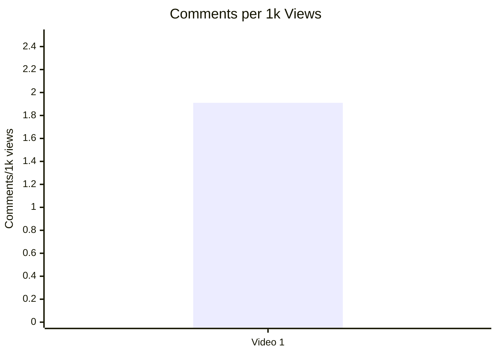

| Video | Comments per 1k views | Коментар |
|---|---:|---|
| Video 1 | 1.91 | Baseline для тесту comment prompt. |

## 7. Графіки структури та hook

### 7.1. Hook score by video

- Назва графіка: Hook score by video
- Яке питання він відповідає: наскільки сильний hook за V1-score?
- Які поля використовуються: `video_label`, `hook_score`
- Тип графіка: Mermaid bar chart
- Що видно з графіка: hook score = `3 / 5`.
- Практичний висновок: hook зрозумілий, але не максимальний; тестувати швидший trigger у перші 10 секунд.


| Video | Hook type | Hook score | Коментар |
|---|---|---:|---|
| Video 1 | PROBLEM | 3 | Hook стандартний; проблема сильна, але trigger запізнюється. |

### 7.2. Hook type distribution

- Назва графіка: Hook type distribution
- Яке питання він відповідає: які hook types присутні у вибірці?
- Які поля використовуються: `hook_primary_type`, count
- Тип графіка: Mermaid pie chart
- Що видно з графіка: 100% вибірки — `PROBLEM` hook.
- Практичний висновок: `INSUFFICIENT_DATA` для висновків про те, який hook працює краще; можна лише зафіксувати тип поточного кейсу.

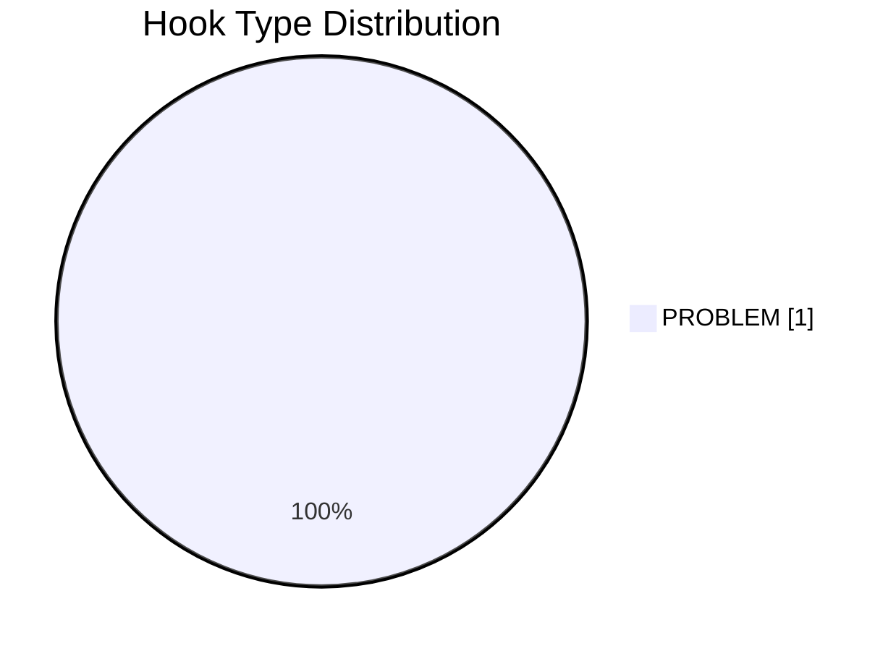

| Hook type | Count | Коментар |
|---|---:|---|
| PROBLEM | 1 | Єдиний кейс; не можна порівнювати з PROMISE / CONFLICT / CURIOSITY_GAP. |

### 7.3. Time to first value vs Overall Score

- Назва графіка: Time to first value vs Overall Score
- Яке питання він відповідає: чи швидший перший value пов’язаний із вищим score?
- Які поля використовуються: `time_to_first_value_seconds`, `overall_video_score`
- Тип графіка: scatter
- Що видно з графіка: `time_to_first_value = 00:20-00:30 LOW_CONFIDENCE NO_TIMECODES`, `overall = 3.8`.
- Практичний висновок: графік неможливо побудувати коректно через `NO_TIMECODES` і лише 1 відео.

| Video | Time to first value | Overall score | Graph status |
|---|---|---:|---|
| Video 1 | 00:20–00:30, `LOW_CONFIDENCE`, `NO_TIMECODES` | 3.8 | `INSUFFICIENT_DATA` |

## 8. Графіки CTA

### 8.1. CTA score by video

- Назва графіка: CTA score by video
- Яке питання він відповідає: наскільки сильна CTA-система?
- Які поля використовуються: `video_label`, `cta_score`
- Тип графіка: Mermaid bar chart
- Що видно з графіка: CTA score = `2 / 5`.
- Практичний висновок: CTA — одна з найслабших зон; у відео немає spoken CTA, comment prompt і next-video bridge.

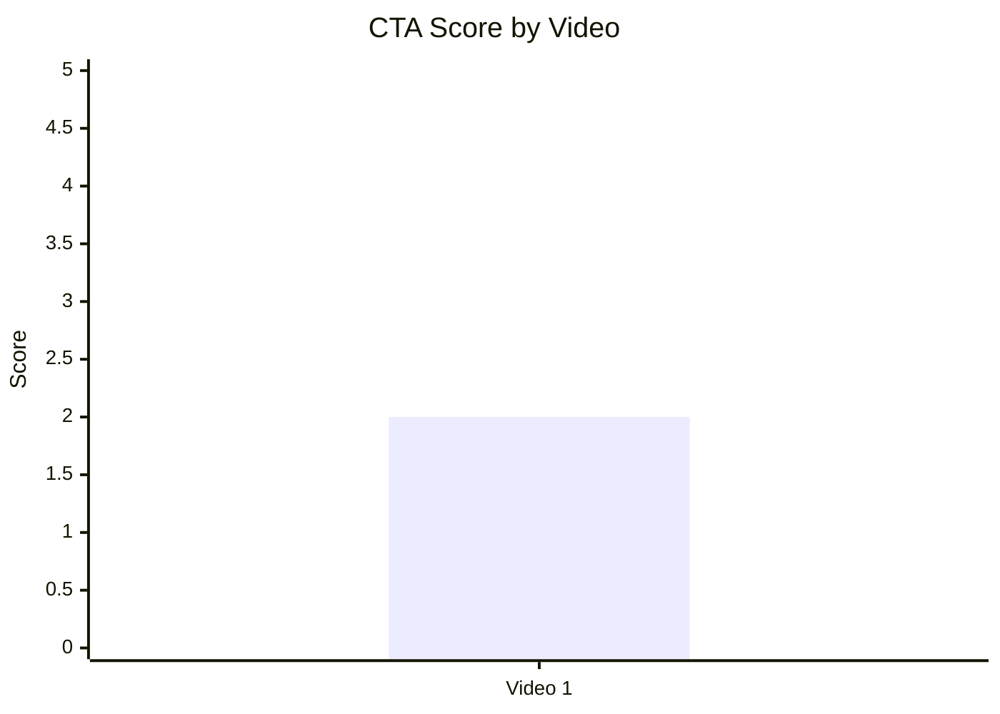

| Video | CTA count | CTA score | Коментар |
|---|---:|---:|---|
| Video 1 | 6 | 2 | CTA count іде переважно з description; spoken CTA не виявлено. |

### 8.2. CTA count vs ER Public %

- Назва графіка: CTA count vs ER Public %
- Яке питання він відповідає: чи більше CTA пов’язано з вищим engagement?
- Які поля використовуються: `cta_count`, `er_public_percent`
- Тип графіка: scatter data table
- Що видно з графіка: одна точка: `cta_count = 6`, `ER Public = 2.5911%`.
- Практичний висновок: `INSUFFICIENT_DATA` для зв’язку. Ризик не в кількості CTA, а в тому, що вони не вбудовані в spoken flow.

| Video | CTA count | ER Public % | Interpretation |
|---|---:|---:|---|
| Video 1 | 6 | 2.5911 | `LOW_CONFIDENCE`: CTA є в description, але якість CTA score низька. |

### 8.3. CTA features heatmap

- Назва графіка: CTA features heatmap
- Яке питання він відповідає: які CTA-елементи присутні або відсутні?
- Які поля використовуються: `has_comment_prompt`, `has_subscribe_cta`, `has_like_cta`, `has_bell_cta`, `has_next_video_bridge`
- Тип графіка: heatmap / matrix
- Що видно з графіка: comment prompt і next-video bridge відсутні; subscribe CTA не виявлено як spoken, але є YouTube Channel link у description.
- Практичний висновок: додати один чіткий verbal CTA після payoff і bridge на наступне відео.

| Video | Comment prompt | Subscribe | Like | Bell | Next video bridge |
|---|---|---|---|---|---|
| Video 1 | ❌ | ⚠️ Description link only | ❌ | ❌ | ❌ |

## 9. Графіки реклами / інтеграцій

Advertising graphs skipped: no advertising integrations detected.

### 9.1. Ad load % by video

- Назва графіка: Ad load % by video
- Яке питання він відповідає: яке рекламне навантаження має відео?
- Які поля використовуються: `video_label`, `ad_load_percent`
- Тип графіка: table / Mermaid bar chart
- Що видно з графіка: ad load = `0.0%`.
- Практичний висновок: відсутність spoken ad не перериває темп; self-promo є в description, але не як interruptive integration.

```mermaid
xychart-beta
    title "Ad Load % by Video"
    x-axis ["Video 1"]
    y-axis "Ad load %" 0 --> 1
    bar [0]
```

| Video | ad_detected | ad_count | ad_load_percent | first_ad_relative_position_percent |
|---|---|---:|---:|---|
| Video 1 | false | 0 | 0.0 | NOT_APPLICABLE |

### 9.2. First ad position %

`NOT_APPLICABLE`: у V1-звіті не виявлено рекламної інтеграції.

| Video | First ad time | First ad position % | Status |
|---|---|---|---|
| Video 1 | NOT_APPLICABLE | NOT_APPLICABLE | No advertising integration detected. |

### 9.3. Ad integration score vs ER Public %

- Назва графіка: Ad integration score vs ER Public %
- Яке питання він відповідає: чи якість реклами пов’язана з реакцією аудиторії?
- Які поля використовуються: `ad_integration_score`, `er_public_percent`
- Тип графіка: scatter data table
- Що видно з графіка: одна точка: `ad_integration_score = 5`, `ER Public = 2.5911%`.
- Практичний висновок: `INSUFFICIENT_DATA`; не можна робити висновок про зв’язок ad integration і engagement.

| Video | Ad integration score | ER Public % | Interpretation |
|---|---:|---:|---|
| Video 1 | 5 | 2.5911 | Score високий через відсутність interruptive ad; correlation skipped. |

## 10. Графіки аудіо

### 10.1. Audio score by video

- Назва графіка: Audio score by video
- Яке питання він відповідає: наскільки аудіо підтримує перегляд?
- Які поля використовуються: `audio_score`
- Тип графіка: Mermaid bar chart
- Що видно з графіка: audio score = `3 / 5`.
- Практичний висновок: аудіо не критична проблема, але loudness нижчий за бажаний spoken YouTube рівень у V1-звіті.

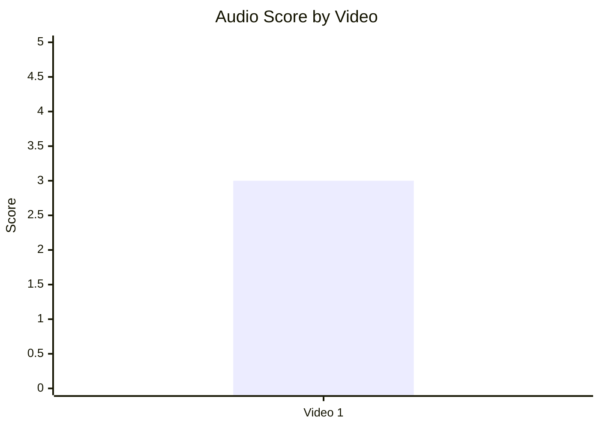

| Video | Audio score | Integrated loudness LUFS | LRA LU | True peak dBFS | Коментар |
|---|---:|---:|---:|---:|---|
| Video 1 | 3 | -24.4 | 5.8 | -3.3 | Технічно стабільно, але тихо для spoken YouTube. |

### 10.2. Audio score vs Overall Score

- Назва графіка: Audio score vs Overall Score
- Яке питання він відповідає: чи кращий audio score пов’язаний із вищим overall score?
- Які поля використовуються: `audio_score`, `overall_video_score`
- Тип графіка: scatter data table
- Що видно з графіка: одна точка: `audio = 3`, `overall = 3.8`.
- Практичний висновок: `INSUFFICIENT_DATA`; можна лише зафіксувати, що audio score не є найсильнішою стороною кейсу.

| Video | Audio score | Overall score | Interpretation |
|---|---:|---:|---|
| Video 1 | 3 | 3.8 | No correlation; one data point only. |

## 11. Графіки коментарів

### 11.1. Sentiment distribution

- Назва графіка: Sentiment distribution
- Яке питання він відповідає: яка структура реакцій аудиторії?
- Які поля використовуються: sentiment counts та percent of relevant comments
- Тип графіка: Mermaid pie chart + таблиця
- Що видно з графіка: більшість relevant comments — `NEUTRAL / COMMUNITY_DISCUSSION`, питання — друга найбільша група.
- Практичний висновок: відео працює як debate trigger; варто конвертувати questions/requests у follow-up content.

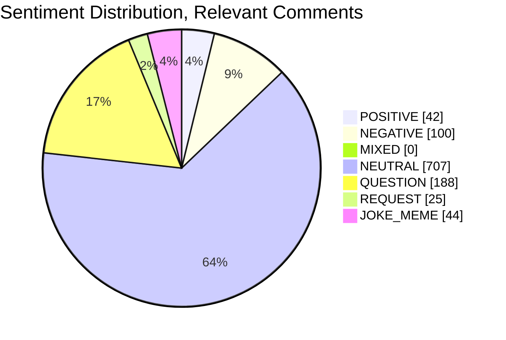

| Sentiment | Count | Percent of relevant comments |
|---|---:|---:|
| POSITIVE | 42 | 3.80% |
| NEGATIVE | 100 | 9.04% |
| MIXED | 0 | 0.00% |
| NEUTRAL | 707 | 63.92% |
| QUESTION | 188 | 17.00% |
| REQUEST | 25 | 2.26% |
| JOKE_MEME | 44 | 3.98% |
| SPAM / IRRELEVANT | 16 | NOT_APPLICABLE; 1.43% of all provided comments |

### 11.2. Comment resonance score by video

- Назва графіка: Comment resonance score by video
- Яке питання він відповідає: наскільки сильно коментарі показують резонанс?
- Які поля використовуються: `comment_resonance_score`
- Тип графіка: Mermaid bar chart
- Що видно з графіка: score = `4 / 5`.
- Практичний висновок: comments — сильна зона кейсу, але резонанс частково поляризований і містить accuracy backlash.

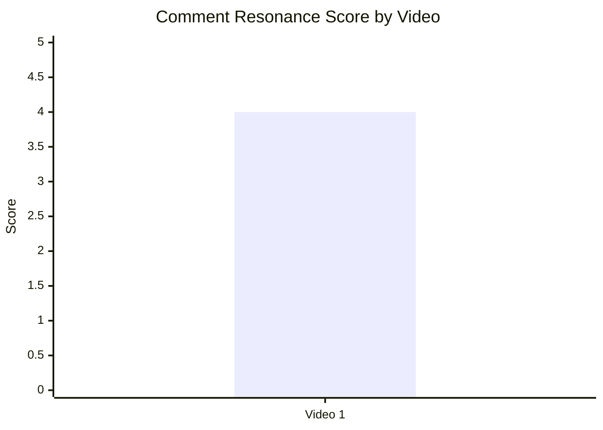

| Video | Comment resonance score | Comment signal |
|---|---:|---|
| Video 1 | 4 | Сильна дискусія + питання + accuracy backlash. |

### 11.3. Top comment clusters

- Назва графіка: Top comment clusters
- Яке питання він відповідає: які теми найчастіше виникають у коментарях?
- Які поля використовуються: cluster name, count, % of relevant comments
- Тип графіка: Mermaid bar chart + таблиця
- Що видно з графіка: домінує community discussion про Russia/Ukraine/demographics; сильні також comparative comments і accuracy backlash.
- Практичний висновок: наступні відео варто будувати навколо comparative frame і source-backed rebuttals.

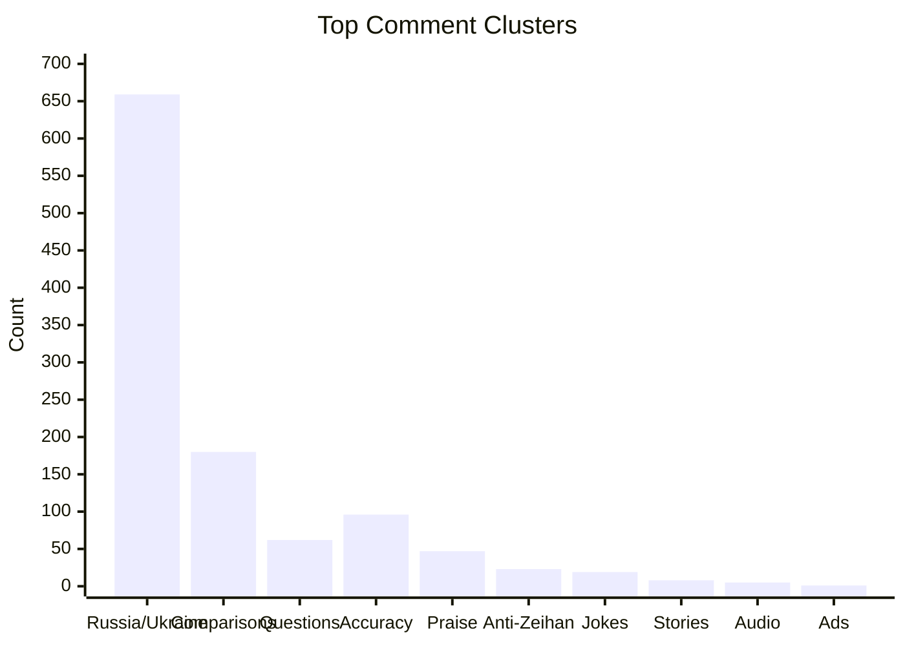

| Cluster | Topic label | Count | % of relevant comments | Strategic meaning |
|---|---|---:|---:|---|
| Russia / Ukraine / demographics discussion | COMMUNITY_DISCUSSION | 659 | 59.58% | Головний engagement engine. |
| Порівняння з Україною/Заходом/іншими країнами | DISAGREEMENT | 180 | 16.27% | Попит на comparative series. |
| Запити й уточнення | QUESTION_CLARIFICATION | 62 | 5.61% | Попит на follow-up/source explainer. |
| Accuracy backlash | CRITICISM_ACCURACY | 96 | 8.68% | Найважливіший trust risk. |
| Praise / useful explanation | PRAISE_CONTENT / PRAISE_EXPLANATION | 47 | 4.25% | Позитив є, але не домінує. |
| Anti-Zeihan / propaganda accusations | CRITICISM_CONTENT | 23 | 2.08% | Поляризаційна ціна формату. |
| Jokes / memes / location | JOKE_MEME | 19 | 1.72% | Підвищує talkability. |
| Personal stories / lived experience | PERSONAL_STORY | 8 | 0.72% | Можна використовувати для community follow-up. |
| Audio criticism | CRITICISM_AUDIO | 5 | 0.45% | Не є масовою проблемою. |
| Ads / Patreon reaction | CRITICISM_ADS | 1 | 0.09% | Рекламний негатив майже відсутній. |

## 12. Графіки score-системи

### 12.1. Overall score by video

- Назва графіка: Overall score by video
- Яке питання він відповідає: який загальний score має відео?
- Які поля використовуються: `overall_video_score`
- Тип графіка: Mermaid bar chart
- Що видно з графіка: overall = `3.8 / 5`.
- Практичний висновок: відео сильне як topic/structure/comment case, але CTA і evidence framing знижують загальний score.

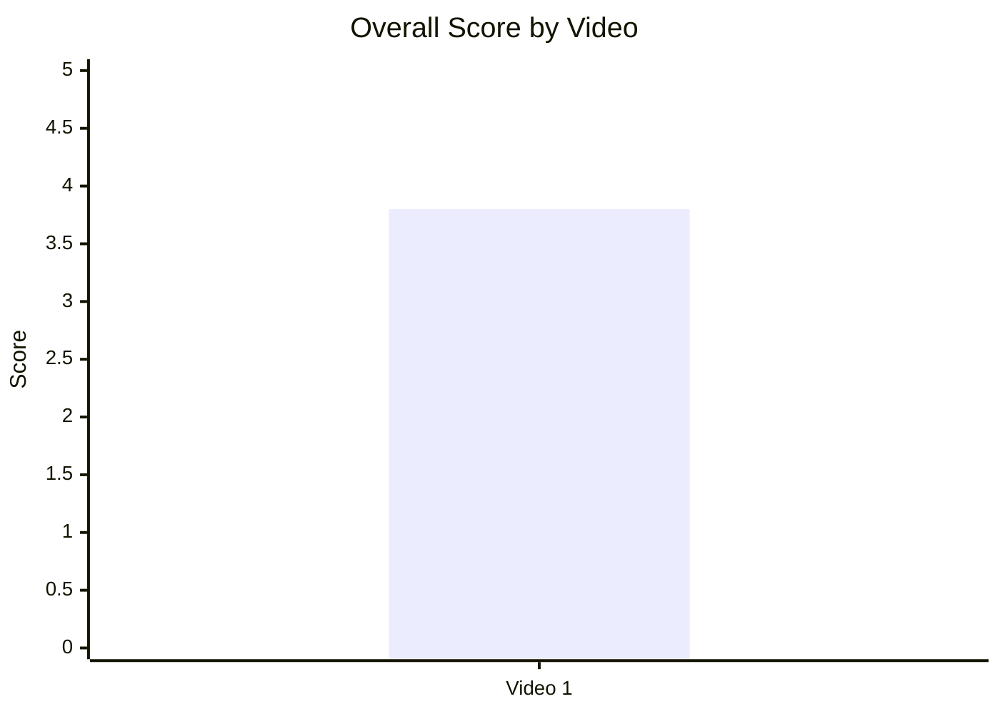

| Video | Overall score | Коментар |
|---|---:|---|
| Video 1 | 3.8 | Сильний кейс, але не максимальний через CTA/evidence/audio constraints. |

### 12.2. Score breakdown heatmap

- Назва графіка: Score breakdown heatmap
- Яке питання він відповідає: де сильні й слабкі сторони відео?
- Які поля використовуються: `hook_score`, `structure_score`, `value_density_score`, `audio_score`, `cta_score`, `ad_integration_score`, `comment_resonance_score`, `replicability_score`, `overall_video_score`
- Тип графіка: heatmap / matrix
- Що видно з графіка: найсильніша зона — ad integration score через відсутність interruptive ads; найслабша — CTA.
- Практичний висновок: найшвидший improvement lever — spoken CTA + next-video bridge + source/caveat framing.

| Video | Hook | Structure | Value Density | Audio | CTA | Ad | Comments | Replicability | Overall |
|---|---:|---:|---:|---:|---:|---:|---:|---:|---:|
| Video 1 | 3 | 4 | 4 | 3 | 2 | 5 | 4 | N/A | 3.8 |

Heatmap legend:

| Score | Meaning |
|---:|---|
| 5 | Strong / leverage point |
| 4 | Good |
| 3 | Acceptable but improvable |
| 2 | Weak / priority fix |
| 1 | Critical weakness |
| N/A | Даних немає у V1-звіті |

### 12.3. Strengths vs weaknesses count

- Назва графіка: Strengths vs weaknesses count
- Яке питання він відповідає: скільки зафіксовано success mechanics і missed opportunities?
- Які поля використовуються: кількість items у секціях Success Mechanics та Weaknesses / Missed Opportunities
- Тип графіка: Mermaid bar chart
- Що видно з графіка: `6` success mechanics і `7` missed opportunities.
- Практичний висновок: відео має сильну основу, але список actionable fixes навіть більший за список success mechanics.

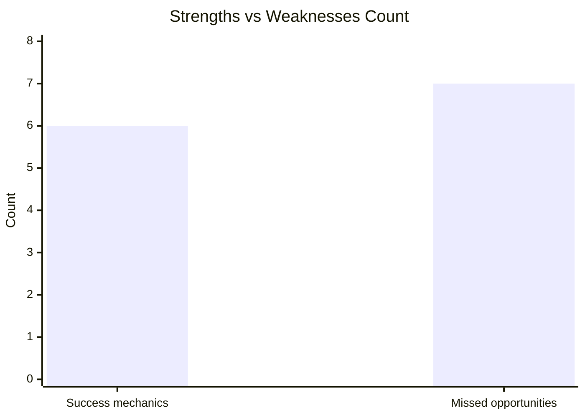

| Video | Success mechanics count | Missed opportunities count | Interpretation |
|---|---:|---:|---|
| Video 1 | 6 | 7 | Добра база для повторення, але є чіткий optimization backlog. |

## 13. Кореляції та патерни

Correlation analysis skipped: fewer than 5 comparable videos.

| Pair | Correlation / Pattern | Strength | Interpretation | Confidence |
|---|---:|---|---|---|
| hook_score → overall_video_score | NOT_APPLICABLE | N/A | Потрібно мінімум 5 comparable videos для кореляції. | LOW |
| value_density_score → er_public_percent | NOT_APPLICABLE | N/A | Потрібно мінімум 5 comparable videos для кореляції. | LOW |
| cta_score → comment_rate_percent | NOT_APPLICABLE | N/A | Потрібно мінімум 5 comparable videos для кореляції. | LOW |
| comment_resonance_score → er_public_percent | NOT_APPLICABLE | N/A | Потрібно мінімум 5 comparable videos для кореляції. | LOW |
| views_per_day → er_public_percent | NOT_APPLICABLE | N/A | Потрібно мінімум 5 comparable videos для кореляції. | LOW |
| ad_load_percent → er_public_percent | NOT_APPLICABLE | N/A | Потрібно мінімум 5 comparable videos для кореляції. | LOW |
| time_to_first_value_seconds → overall_video_score | NOT_APPLICABLE | N/A | Додатково заважає `NO_TIMECODES`. | LOW |

Попередні патерни для одного кейсу, не кореляції:

| Pattern | Data | Interpretation | Confidence |
|---|---|---|---|
| Debate-driven topic creates comments | 1,163 comments; 659 community discussion cluster | Тема Russia + Ukraine + demographics працює як discussion engine. | LOW |
| CTA is underused | CTA score `2`; no comment prompt; no next-video bridge | Є потенціал підняти comments/session depth через конкретний prompt. | LOW |
| Evidence framing is a trust lever | Accuracy backlash cluster: 96 comments / 8.68% relevant comments | Source cards або pinned source note можуть зменшити repeating criticism. | LOW |
| Clean editorial flow helps pacing | ad_load = 0.0%; ad score = 5 | Відсутність spoken ad не створює disruption risk. | LOW |

## 14. Висновки для контент-стратегії

| Спостереження | Дані / графік | Що це означає | Що робити |
|---|---|---|---|
| Відео має сильний raw reach і нормалізовану швидкість | Views = 608,927; views/day = 1780.49 | Тема має потенціал як baseline для майбутніх geopolitics-demographics роликів. | Повторити тему в серійному форматі, але з більш чітким comparative angle. |
| Engagement помітний, але без benchmark | ER Public = 2.5911%; comments/1k views = 1.91 | Не можна назвати engagement сильним/слабким без когорти, але коментарів достатньо для strategy mining. | Зібрати ще 5+ V1-звітів у тій самій когорті `LONG_4_10_MIN`. |
| Основний коментарний двигун — дискусія, не praise | 659 community discussion comments; positive only 42 | Відео не просто “подобається”, а провокує політичну/демографічну дискусію. | Створювати titles/hooks, які відкривають debate, але не підривають trust. |
| Accuracy backlash — найбільший ризик | 96 CRITICISM_ACCURACY comments | Спірні claims можуть збільшувати коментарі, але шкодити довірі. | Додати source/caveat cards і pinned source comment. |
| CTA-система слабка | CTA score = 2; no comment prompt; no next-video bridge | Втрачається потенціал конверсії з сильного topic resonance. | Додати verbal CTA після payoff: питання для коментаря + next video bridge. |
| Ad load не заважає | ad_detected = false; ad_load = 0.0%; ad score = 5 | Немає interruption risk від sponsor read. | Якщо додавати рекламу, ставити після першого payoff і тримати коротко. |
| Audio — не критична, але improvable зона | audio score = 3; loudness -24.4 LUFS | Мобільні глядачі можуть мати friction через низьку гучність. | Нормалізувати spoken loudness ближче до платформи/канального стандарту. |

## 15. Що тестувати далі

| Тест | Гіпотеза | На яких даних базується | Як виміряти | Пріоритет |
|---|---|---|---|---|
| Faster trigger opening | Якщо показати актуальний trigger у перші 10 секунд, hook score і early retention можуть зрости. | Hook score = 3; trigger запізнюється; `NO_TIMECODES`. | Retention curve, first 30 sec drop-off — `OWNER_ONLY`. | HIGH |
| Source/caveat cards | Якщо дати 2–3 source/caveat cards для спірних чисел, accuracy backlash зменшиться. | Accuracy backlash = 96 comments / 8.68% relevant. | Частка CRITICISM_ACCURACY у коментарях, sentiment over time. | HIGH |
| Concrete comment prompt | Якщо запитати “Do you want Ukraine demographics next?”, comment rate може зрости. | Questions = 188; requests = 25; comparative cluster = 180. | Comment rate %, comments/1k views, pinned comment replies. | HIGH |
| Next-video bridge | Якщо завершувати відео переходом на Ukraine/Europe/China demographics, session depth може зрости. | has_next_video_bridge = false; CTA score = 2. | End screen CTR, next video views — `OWNER_ONLY`. | HIGH |
| Description CTA cleanup | Якщо залишити один primary CTA зверху, зовнішні кліки можуть стати сфокусованішими. | Description має багато CTA; V1-звіт позначає overload risk. | Link clicks — `OWNER_ONLY`. | MEDIUM |
| Audio loudness normalization | Якщо підняти voice loudness, mobile friction може зменшитись. | Audio score = 3; integrated loudness = -24.4 LUFS. | Retention by device, audio complaints, average view duration — частково `OWNER_ONLY`. | MEDIUM |
| Comparative series packaging | Якщо запустити серію Russia / Ukraine / Europe / China demographics, можна використати вже наявний попит на comparison. | Comparative cluster = 180; requests/questions = 213 total. | Views/day, ER Public %, returning viewers, playlist/session metrics. | HIGH |

## 16. Дані для експорту в таблицю / CSV

| video_label | title | format_group | views | views_per_day | like_rate_percent | comment_rate_percent | er_public_percent | views_per_1k_subs | hook_type | hook_score | cta_count | cta_score | ad_load_percent | ad_integration_score | audio_score | comment_resonance_score | overall_video_score | top_success_mechanic | top_missed_opportunity |
|---|---|---|---:|---:|---:|---:|---:|---:|---|---:|---:|---:|---:|---:|---:|---:|---:|---|---|
| Video 1 | The Demographic Crisis in Russia \|\| Peter Zeihan | LONG_4_10_MIN | 608927 | 1780.49 | 2.4001 | 0.1910 | 2.5911 | 636.95 | PROBLEM | 3 | 6 | 2 | 0.0 | 5 | 3 | 4 | 3.8 | Current-event trigger after evergreen background | Contested claims need source/caveat framing |

CSV-ready:

```csv
video_label,title,format_group,views,views_per_day,like_rate_percent,comment_rate_percent,er_public_percent,views_per_1k_subs,hook_type,hook_score,cta_count,cta_score,ad_load_percent,ad_integration_score,audio_score,comment_resonance_score,overall_video_score,top_success_mechanic,top_missed_opportunity
Video 1,"The Demographic Crisis in Russia || Peter Zeihan",LONG_4_10_MIN,608927,1780.49,2.4001,0.1910,2.5911,636.95,PROBLEM,3,6,2,0.0,5,3,4,3.8,"Current-event trigger after evergreen background","Contested claims need source/caveat framing"
```