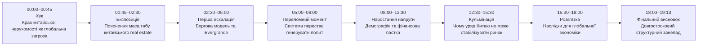
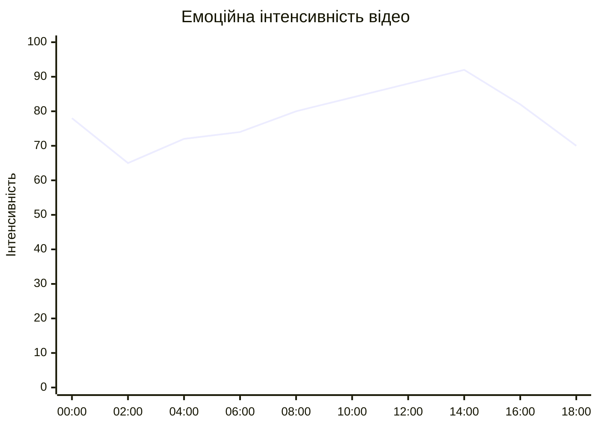
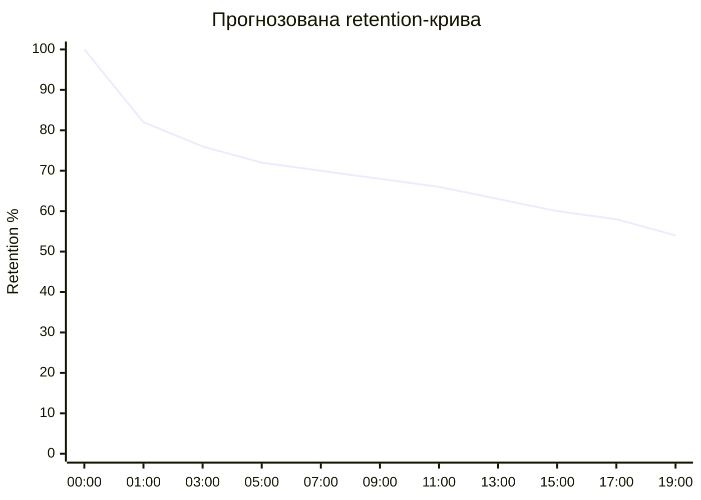
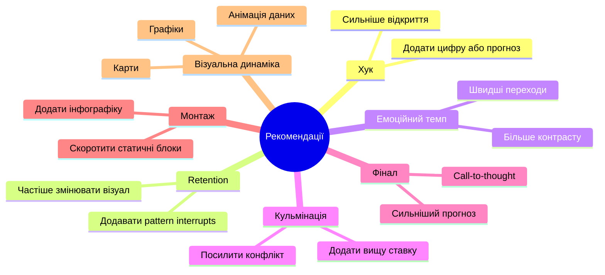

# Аналіз довгоформатного YouTube-відео

## Вхідні параметри відео

- Назва: **The Failure of Chinese Real Estate — Peter Zeihan**
- Тривалість: **19 хв 13 сек**
- Формат аналізу: прогнозований narrative + retention-аналіз на основі структури відео
- Retention-дані: **не надані**
- Тип відео: геополітична аналітика / економічний breakdown

---

# 1. Сюжетна дуга (Narrative Arc)

%%{init: {'theme':'base', 'themeVariables': {
'primaryColor':'#f3f4f6',
'primaryTextColor':'#111827',
'primaryBorderColor':'#2563eb',
'lineColor':'#2563eb',
'secondaryColor':'#ffffff',
'tertiaryColor':'#f3f4f6',
'background':'#f3f4f6'
}}}%%

---

# 2. Ключові Story Beats

%%{init: {'theme':'base', 'themeVariables': {
'primaryColor':'#f3f4f6',
'primaryTextColor':'#111827',
'primaryBorderColor':'#2563eb',
'lineColor':'#2563eb',
'secondaryColor':'#ffffff',
'tertiaryColor':'#f3f4f6',
'background':'#f3f4f6'
}}}%%

---

# 3. Емоційний темп

%%{init: {'theme':'base', 'themeVariables': {
'primaryColor':'#f3f4f6',
'primaryTextColor':'#111827',
'primaryBorderColor':'#2563eb',
'lineColor':'#2563eb',
'secondaryColor':'#ffffff',
'tertiaryColor':'#f3f4f6',
'background':'#f3f4f6'
}}}%%

---

# 4. Утримання аудиторії

## Прогнозована retention-крива

%%{init: {'theme':'base', 'themeVariables': {
'primaryColor':'#f3f4f6',
'primaryTextColor':'#111827',
'primaryBorderColor':'#2563eb',
'lineColor':'#2563eb',
'secondaryColor':'#ffffff',
'tertiaryColor':'#f3f4f6',
'background':'#f3f4f6'
}}}%%

---

# 5. Піки retention

| Таймкод | Подія | Чому це може утримувати увагу | Сила піку 1–10 |
|---|---|---|---|
| 00:00–00:45 | Жорсткий вступ про крах ринку | Висока ставка та глобальна загроза | 9 |
| 03:20–04:20 | Приклад Evergrande | Конкретний кейс та знайомий бренд | 8 |
| 07:00–08:20 | Демографічна криза | Неочікуване пояснення проблеми | 8 |
| 11:30–12:20 | Залежність місцевих урядів | Системний рівень конфлікту | 7 |
| 14:00–15:20 | Чому Китай не може врятувати ринок | Кульмінаційний висновок | 9 |
| 16:00–17:30 | Наслідки для світу | Розширення масштабу історії | 8 |

---

# 6. Провали retention

| Таймкод | Проблема | Ймовірна причина спаду | Що покращити |
|---|---|---|---|
| 01:40–02:20 | Довге пояснення масштабу | Надлишок цифр | Додати графіку або порівняння |
| 05:40–06:30 | Абстрактна економічна логіка | Менше емоційної динаміки | Вставити кейс або приклад |
| 09:20–10:10 | Повільний темп пояснення | Мало зміни візуалу | Частіше змінювати кадри |
| 12:40–13:30 | Політичні пояснення | Інформаційне перевантаження | Розбити тезу на короткі блоки |
| 17:20–18:00 | Висновок без нового конфлікту | Зниження напруги | Додати сильніший фінальний прогноз |

---

# 7. Оцінка сегментів

| Сегмент | Таймкод | Функція | Емоційна інтенсивність | Ризик втрати уваги | Оцінка 1–10 | Що покращити |
|---|---|---|---|---|---|---|
| Хук | 00:00–00:45 | Захоплення уваги | Висока | Низький | 9 | Додати швидший монтаж |
| Експозиція | 00:45–02:30 | Контекст | Середня | Середній | 7 | Більше візуалізації |
| Ескалація | 02:30–05:00 | Конфлікт | Висока | Низький | 8 | Підсилити контраст |
| Перелом | 05:00–08:00 | Розкриття причини | Висока | Середній | 8 | Скоротити повтори |
| Наростання | 08:00–12:30 | Поглиблення ставки | Висока | Середній | 8 | Додати зміну ритму |
| Кульмінація | 12:30–15:30 | Головний висновок | Дуже висока | Низький | 9 | Посилити драматичність |
| Розв’язка | 15:30–18:00 | Наслідки | Середня | Середній | 7 | Додати конкретні приклади |
| Фінал | 18:00–19:13 | Підсумок | Середня | Високий | 6 | Сильніший closing statement |

---

# 8. Практичні рекомендації

%%{init: {'theme':'base', 'themeVariables': {
'primaryColor':'#f3f4f6',
'primaryTextColor':'#111827',
'primaryBorderColor':'#2563eb',
'lineColor':'#2563eb',
'secondaryColor':'#ffffff',
'tertiaryColor':'#f3f4f6',
'background':'#f3f4f6'
}}}%%

---

# 9. Підсумкова оцінка

| Показник | Оцінка 1–10 | Коментар |
|---|---|---|
| Сюжетна дуга | 8 | Чітка структура з хорошою ескалацією |
| Story Beats | 8 | Сильні логічні переходи між тезами |
| Емоційний темп | 7 | Інколи надто аналітичний ритм |
| Retention Structure | 7 | Є ризики просадки в середині |
| Загальна оцінка | 8 | Сильне аналітичне long-form відео |
