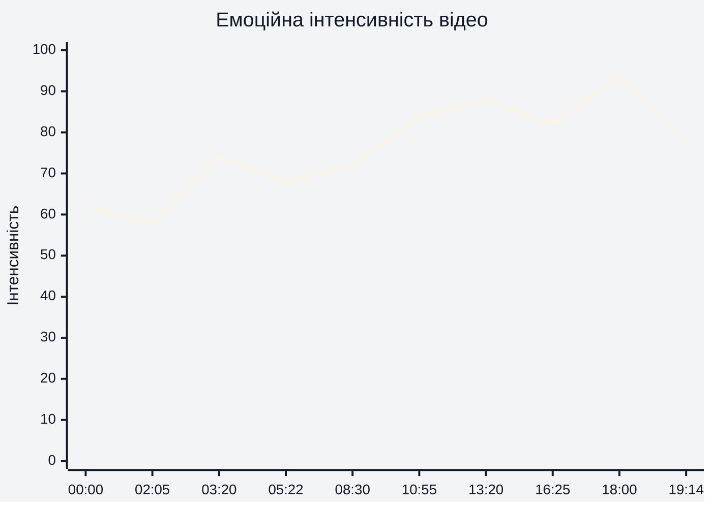
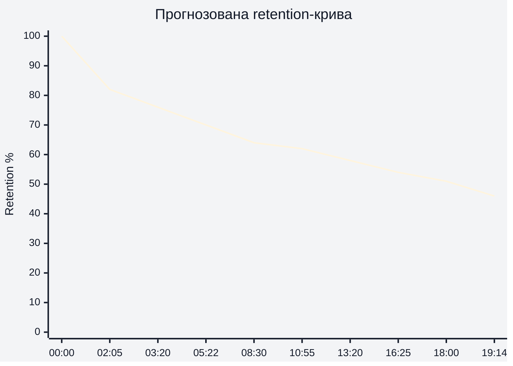
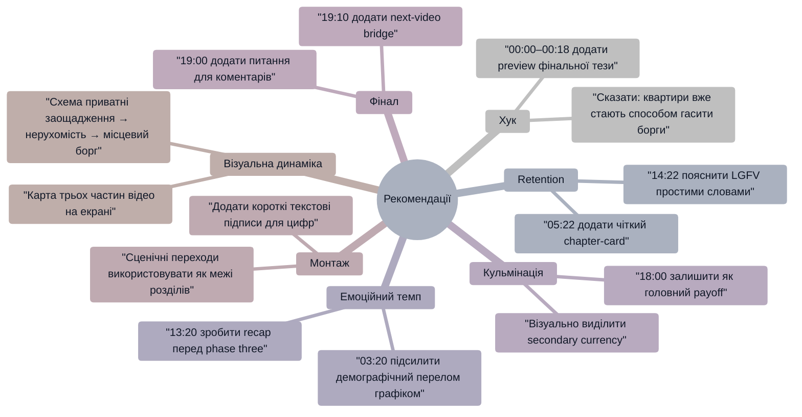

# Аналіз довгоформатного YouTube-відео

## 1. Сюжетна дуга (Narrative Arc)

## 2. Ключові Story Beats

## 3. Емоційний темп

Графік показує прогнозовану емоційну інтенсивність за сюжетними подіями. Найвищий емоційний пік припадає на 18:00, коли зʼявляється теза про квартири як сурогатну валюту для боргів. Практичний висновок: найсильніший елемент варто було частково винести в хук 00:00–00:18.

## 4. Утримання аудиторії

Реальні retention-дані не надані. Нижче — потенційна retention-структура, побудована за темпом, щільністю інформації та сюжетними переходами відео.

Графік показує не реальні дані YouTube Studio, а прогнозовану криву. Ймовірний спад після 05:22 повʼязаний із переходом у довший історико-політичний блок, а відносне утримання біля 18:00 може підтримуватися новою конкретною тезою про квартири як форму погашення боргів.

## 5. Піки retention

| Таймкод | Подія | Чому це може утримувати увагу | Сила піку 1–10 |
|---|---|---|---:|
| 00:00 | Обіцянка “історії у трьох частинах” про катастрофу Китаю | Глядач одразу розуміє тему, масштаб і структуру | 8 |
| 02:55 | Аналогія з asset-backed securities і кризою 2007 року | Складна китайська схема стає зрозумілою через знайомий історичний приклад | 8 |
| 03:55 | Теза про відсутність людей для майбутнього попиту | Різкий перелом від “нерухомість росте” до “попит зникає” | 9 |
| 05:22 | “Part two is a real doozy” | Вербальний перезапуск уваги й очікування нового рівня проблеми | 7 |
| 10:55 | Місцева влада заробляє через землю й забудову | Пояснюється, чому бульбашка підтримувалася інституційно | 8 |
| 13:20 | 70% приватних заощаджень у житловій нерухомості | Дуже високі ставки для звичайних людей, не лише для держави | 9 |
| 16:25 | До житлової кризи додаються тарифи, торгівля й демографія | Проблема стає глобальною економічною пасткою | 8 |
| 18:00 | Квартири використовуються для погашення боргів як вторинна валюта | Найсильніша конкретна “нова” механіка фінального блоку | 10 |

## 6. Провали retention

| Таймкод | Проблема | Ймовірна причина спаду | Що покращити |
|---|---|---|---|
| 00:18–02:05 | Щільне пояснення банківської системи | Багато абстрактної економіки до першого сильного прикладу | Додати коротку візуальну схему “заощадження → банки → дешеві кредити → зайнятість” |
| 06:00–08:30 | Довгий історико-політичний відступ | Частина глядачів прийшла за real estate, а отримує ширшу історію управління Китаєм | Скоротити блок або дати на екрані чіткий підпис: “чому це важливо для нерухомості” |
| 08:30–10:55 | Багато claims про дані, населення й місцеву владу | Висока когнітивна щільність без графіків і джерел | Додати 3 bullet-карти: “погані дані”, “погані стимули”, “поганий борг” |
| 14:22–16:25 | Борг місцевих урядів і LGFV | Тема складна, абревіатура може бути незрозумілою | Дати просте пояснення LGFV одним реченням і візуальну аналогію |
| 19:00–19:14 | Фінал без next-video bridge | Після сильного висновку немає керованого переходу до наступного перегляду | Додати 10 секунд: “якщо хочете зрозуміти демографічну частину — дивіться наступне відео” |

## 7. Оцінка сегментів

| Сегмент | Таймкод | Функція | Емоційна інтенсивність | Ризик втрати уваги | Оцінка 1–10 | Що покращити |
|---|---|---|---:|---|---:|---|
| Хук | 00:00–00:18 | Обіцяє тему й структуру | 62 | Низький | 8 | Додати один конкретний preview фінального шоку про квартири як боргову валюту |
| Банківська експозиція | 00:18–02:05 | Пояснює, чому люди шукають інвестиції поза банками | 58 | Середній | 7 | Додати просту схему руху грошей |
| Нерухомість як інвестиційний вихід | 02:05–03:20 | Вводить bubble mechanics | 74 | Низький | 8 | Показати короткий приклад “одна квартира — багато власників” |
| Демографічний перелом | 03:20–05:22 | Ламає припущення про вічний попит | 82 | Низький | 9 | Підсилити графіком “попит падає, житло лишається” |
| Перехід до другої частини | 05:22–06:00 | Оновлює увагу | 68 | Низький | 7 | Додати on-screen chapter title |
| Історія централізації | 06:00–08:30 | Пояснює політичну логіку | 72 | Середній | 7 | Скоротити або сильніше привʼязати до real estate finance |
| Місцева влада і погані дані | 08:30–10:55 | Пояснює системну сліпоту | 76 | Середній | 8 | Дати sources/caveats для спірних claims |
| Земля, забудовники, ghost suburbs | 10:55–13:20 | Показує інституційний двигун бульбашки | 84 | Низький | 9 | Вивести ключові цифри на екран |
| Підсумок phase two | 13:20–14:22 | Зʼєднує приватні заощадження й місцеву владу | 88 | Низький | 9 | Зробити короткий recap-card |
| Місцевий борг і LGFV | 14:22–16:25 | Поглиблює системний ризик | 78 | Середній | 7 | Простими словами пояснити LGFV |
| Глобальна економічна рамка | 16:25–18:00 | Додає тарифи, торгівлю, логістику й демографію | 82 | Середній | 8 | Не перевантажувати новими темами перед фіналом |
| Фінальна кульмінація | 18:00–19:00 | Показує квартири як сурогатну валюту боргів | 94 | Низький | 10 | Винести частину цієї тези в перші 20 секунд |
| Фінальний висновок | 19:00–19:14 | Закриває прогнозом і black-box тезою | 78 | Середній | 7 | Додати CTA, питання для коментарів і next-video bridge |

## 8. Практичні рекомендації

## 9. Підсумкова оцінка

| Показник | Оцінка 1–10 | Коментар |
|---|---:|---|
| Сюжетна дуга | 8 | 00:00–19:14 має чітку ескалацію: приватні заощадження → місцева влада → системна економічна пастка |
| Story Beats | 9 | Найсильніші beats: 03:20 демографічний перелом, 13:20 70% savings, 18:00 квартири як боргова валюта |
| Емоційний темп | 8 | Темп зростає до 18:00, але 06:00–10:55 може бути щільним для частини аудиторії |
| Retention Structure | 7 | Потенційно сильна структура, але реальних retention-даних немає; ризики в історичних і технічних блоках |
| Загальна оцінка | 8 | Сильне long-form пояснення з високою сюжетною логікою; головні покращення — візуальні схеми, джерела, CTA і next-video bridge |
