# Статистичний аналіз відеозвітів

## 1. Короткий executive summary

| Пункт | Висновок |
|---|---|
| Скільки відео проаналізовано | 1 |
| Скільки форматів відео | 1: `LONG_10_20_MIN` |
| Найсильніше відео за overall score | Video 1 — `The Failure of Chinese Real Estate || Peter Zeihan`, overall `3.75` |
| Найсильніше відео за ER Public % | Video 1 — `2.36%` |
| Найсильніше відео за views per day | Video 1 — `2 059.0` views/day |
| Найсильніша повторювана механіка | `INSUFFICIENT_DATA` для повторюваності; у цьому відео top mechanic: `HIGH_STAKES_MACRO_TOPIC` |
| Найчастіша слабкість | `INSUFFICIENT_DATA` для частотності; у цьому відео top weakness: `NO_VERBAL_COMMENT_PROMPT` |
| Головна стратегічна можливість | Масштабувати macro topic + 3-part structure, але додати verbal comment prompt, next-video bridge і source/pinned comment hub |
| Рівень впевненості | `LOW_CONFIDENCE` — тільки 1 відео, лише описова статистика, без кореляцій |

## 2. Якість і повнота даних

| Поле | Кількість відео з даними | Кількість N/A | Коментар |
|---|---:|---:|---|
| views | 1 | 0 | Є public metric: `975 949` |
| likes | 1 | 0 | Є public metric: `20 646` |
| comments_count | 1 | 0 | Є public metric: `2 416` |
| views_per_day | 1 | 0 | Є derived metric: `2 059.0` |
| er_public_percent | 1 | 0 | Є derived metric: `2.36%` |
| views_per_1k_subs | 1 | 0 | Є derived metric: `1 020.87` |
| hook_score | 1 | 0 | Є score: `4.0` |
| cta_score | 1 | 0 | Є score: `2.5` |
| ad_integration_score | 0 | 1 | `NOT_APPLICABLE`, classic ads not detected |
| audio_score | 1 | 0 | Є score: `3.0`, але audio confidence обмежений |
| comment_resonance_score | 1 | 0 | Є score: `4.5` |
| overall_video_score | 1 | 0 | Є score: `3.75` |

### Обмеження аналізу

- `LOW_CONFIDENCE`: доступний лише 1 відеозвіт, тому всі висновки описові, не статистично узагальнювальні.
- Correlation analysis skipped за правилом master prompt: менше ніж 5 comparable videos.
- CTR, impressions, retention curve, average view duration, watch time, subscribers gained і traffic sources відсутні у звіті й позначаються як `N/A`.
- Рекламні графіки обмежені, бо classic sponsor/ad integrations не виявлені; `ad_load_percent = 0.0`, `ad_integration_score = NOT_APPLICABLE`.
- Sentiment distribution має якісні категорії (`MEDIUM`, `HIGH`, `PRESENT`), але не має точних percent/count по sentiment, тому stacked sentiment chart неможливо побудувати точно.

## 3. Підготовлена таблиця для графіків

| Video | Format | Views | Likes | Comments | Views/day | Like Rate % | Comment Rate % | ER Public % | Views/1k subs | Hook | CTA | Ad | Audio | Comment Resonance | Overall |
|---|---|---:|---:|---:|---:|---:|---:|---:|---:|---:|---:|---:|---:|---:|---:|
| Video 1 | LONG_10_20_MIN | 975 949 | 20 646 | 2 416 | 2 059.0 | 2.12 | 0.25 | 2.36 | 1 020.87 | 4.0 | 2.5 | 1 | 3.0 | 4.5 | 3.75 |

| Label | Full title | URL |
|---|---|---|
| Video 1 | The Failure of Chinese Real Estate || Peter Zeihan | https://www.youtube.com/watch?v=a2AJvCPcNUE |

## 4. Рекомендовані графіки

| # | Назва графіка | Тип графіка | Поля | Для чого потрібен | Пріоритет |
|---:|---|---|---|---|---|
| 1 | Overall score by video | Mermaid bar chart | `overall_video_score` | Побачити загальний score | HIGH |
| 2 | Views per day by video | Mermaid bar chart | `views_per_day` | Оцінити normalized velocity | HIGH |
| 3 | ER Public % by video | Mermaid bar chart | `er_public_percent` | Оцінити public engagement | HIGH |
| 4 | ER Public % vs Views/day | Mermaid quadrant/scatter substitute | `er_public_percent`, `views_per_day` | Побачити баланс reach і engagement | HIGH |
| 5 | Hook score by video | Mermaid bar chart | `hook_score` | Оцінити hook | HIGH |
| 6 | CTA score by video | Mermaid bar chart | `cta_score` | Оцінити CTA weakness | HIGH |
| 7 | Score breakdown heatmap | Markdown heatmap table | scores 1–5 | Побачити сильні/слабкі сторони | HIGH |
| 8 | Sentiment distribution | Table only | qualitative sentiment fields | Показати реакції аудиторії | MEDIUM |
| 9 | CTA features heatmap | Markdown matrix | CTA booleans | Побачити CTA gaps | HIGH |
| 10 | Ad load % by video | Skipped/table | `ad_load_percent` | Оцінити ad load | LOW — no ads detected |

## 5. Графіки продуктивності

## 5.1. Views by video

- Назва графіка: Views by video
- Яке питання він відповідає: яке відео має найбільший raw reach?
- Які поля використовуються: `video_label`, `views`
- Тип графіка: Mermaid bar chart
- Що видно з графіка: Video 1 має `975 949` views.
- Практичний висновок: raw reach високий, але при `n=1` немає порівняння з іншими відео; для стратегії краще дивитися також `views_per_day` і `views_per_1k_subs`.

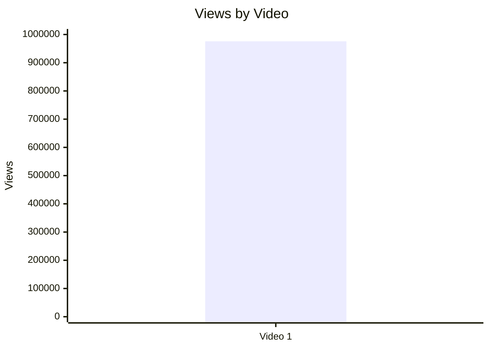

## 5.2. Views per day by video

- Назва графіка: Views per day by video
- Яке питання він відповідає: яка normalized velocity з урахуванням віку відео?
- Які поля використовуються: `video_label`, `views_per_day`
- Тип графіка: Mermaid bar chart
- Що видно з графіка: Video 1 має `2 059.0` views/day.
- Практичний висновок: це корисніша метрика за raw views, але без інших відео неможливо визначити, чи це outlier у когорті.

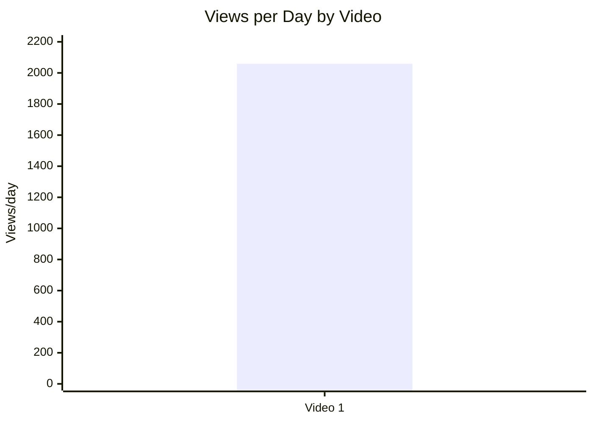

## 5.3. Views per 1k subscribers

- Назва графіка: Views per 1k subscribers
- Яке питання він відповідає: наскільки відео конвертує розмір каналу в перегляди?
- Які поля використовуються: `video_label`, `views_per_1k_subs`
- Тип графіка: Mermaid bar chart
- Що видно з графіка: Video 1 має `1 020.87` views per 1k subs.
- Практичний висновок: відео приблизно дорівнює subscriber base за масштабом переглядів, але `LOW_CONFIDENCE` для broader висновків.

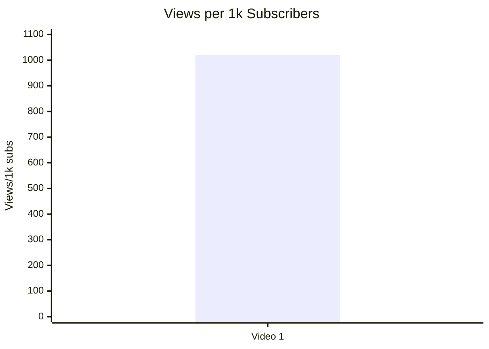

## 5.4. Performance quadrant

- Назва графіка: Performance quadrant
- Яке питання він відповідає: чи є баланс охоплення і залучення?
- Які поля використовуються: `views_per_day`, `er_public_percent`
- Тип графіка: scatter/quadrant; Mermaid xychart використано як single-point substitute
- Що видно з графіка: Video 1 = `2059.0` views/day і `2.36%` ER Public.
- Практичний висновок: через одне відео неможливо обчислити межі “high/low” по когорті; quadrant classification = `INSUFFICIENT_DATA`.

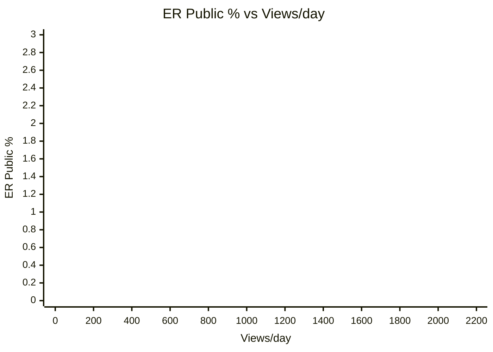

| Video | Views/day | ER Public % | Quadrant |
|---|---:|---:|---|
| Video 1 | 2059.0 | 2.36 | `INSUFFICIENT_DATA` — no cohort thresholds |

## 6. Графіки залучення

## 6.1. ER Public % by video

- Назва графіка: ER Public % by video
- Яке питання він відповідає: яке public engagement rate має відео?
- Які поля використовуються: `video_label`, `er_public_percent`
- Тип графіка: Mermaid bar chart
- Що видно з графіка: Video 1 має `2.36%`.
- Практичний висновок: engagement є виміряним, але його якість треба порівнювати з іншими long-form відео у майбутніх партіях.

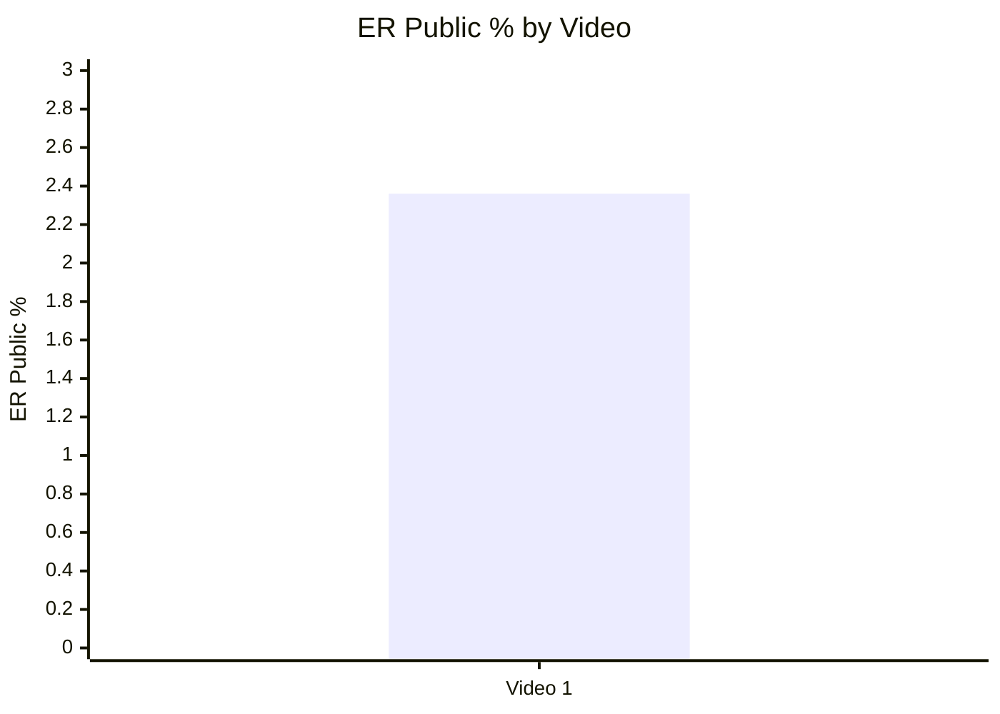

## 6.2. Like Rate % vs Comment Rate %

- Назва графіка: Like Rate % vs Comment Rate %
- Яке питання він відповідає: engagement більше схиляється до лайків чи дискусії?
- Які поля використовуються: `like_rate_percent`, `comment_rate_percent`
- Тип графіка: scatter; для `n=1` подано table + Mermaid substitute
- Що видно з графіка: Like Rate `2.12%`, Comment Rate `0.25%`.
- Практичний висновок: відео має значно сильніший like-сигнал, ніж comment-rate у відсотках, але absolute comments високі (`2 416`).

```mermaid
xychart-beta
    title "Like Rate % vs Comment Rate %"
    x-axis "Like Rate %" 0 --> 3
    y-axis "Comment Rate %" 0 --> 1
    line [0.25]
```

| Video | Like Rate % | Comment Rate % | Interpretation |
|---|---:|---:|---|
| Video 1 | 2.12 | 0.25 | Likes dominate by rate; comments still strategically important because clusters are debate-heavy |

## 6.3. Comments per 1k views

- Назва графіка: Comments per 1k views
- Яке питання він відповідає: скільки коментарів генерує кожна 1 000 views?
- Які поля використовуються: `comments_per_1k_views`
- Тип графіка: Mermaid bar chart
- Що видно з графіка: Video 1 має `2.48` comments per 1k views.
- Практичний висновок: дискусійність є, але без benchmark не класифікуємо як high/low.

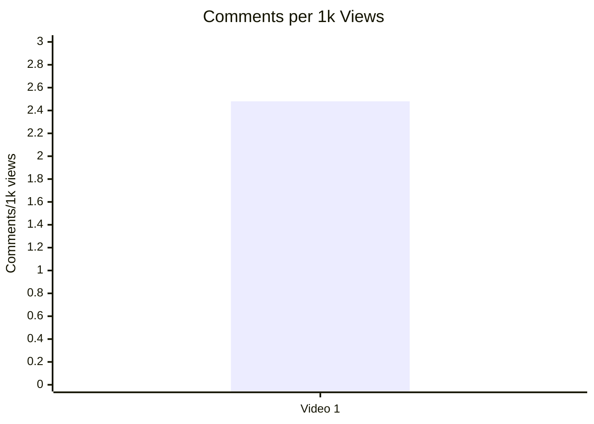

## 7. Графіки структури та hook

## 7.1. Hook score by video

- Назва графіка: Hook score by video
- Яке питання він відповідає: наскільки сильний hook?
- Які поля використовуються: `hook_score`
- Тип графіка: Mermaid bar chart
- Що видно з графіка: Hook score = `4.0`.
- Практичний висновок: hook сильний, але improvement opportunity — винести найсильніший final mechanism у перші 20 секунд.

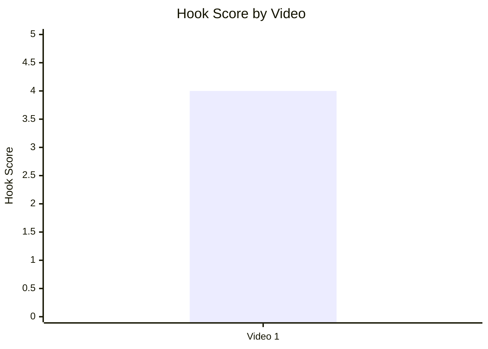

## 7.2. Hook type distribution

- Назва графіка: Hook type distribution
- Яке питання він відповідає: який primary hook type використано?
- Які поля використовуються: `hook_primary_type`
- Тип графіка: Mermaid pie chart
- Що видно з графіка: 100% доступних відео використовує `PROBLEM_THREAT`.
- Практичний висновок: це не “переважний патерн”, а лише єдиний доступний кейс; позначка `LOW_CONFIDENCE`.

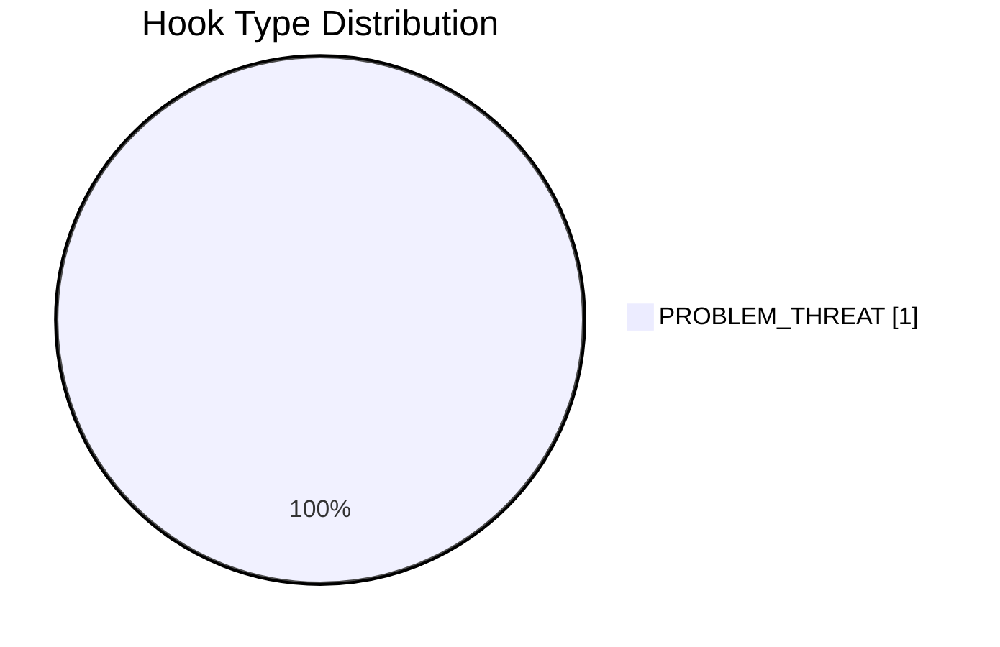

## 7.3. Time to first value vs Overall Score

- Назва графіка: Time to first value vs Overall Score
- Яке питання він відповідає: чи швидка перша цінність пов’язана з overall score?
- Які поля використовуються: `time_to_first_value_seconds`, `overall_video_score`
- Тип графіка: scatter; для `n=1` table only
- Що видно з графіка: `time_to_first_value = 00:18`, тобто `18` seconds; overall `3.75`.
- Практичний висновок: зв’язок не оцінюється через `INSUFFICIENT_DATA`, але для цього кейсу швидкий старт є зафіксованою сильною рисою.

| Video | Time to first value | Seconds | Overall |
|---|---|---:|---:|
| Video 1 | 00:18 | 18 | 3.75 |

## 8. Графіки CTA

## 8.1. CTA score by video

- Назва графіка: CTA score by video
- Яке питання він відповідає: наскільки сильна CTA-система?
- Які поля використовуються: `cta_score`
- Тип графіка: Mermaid bar chart
- Що видно з графіка: CTA score = `2.5`.
- Практичний висновок: CTA — найслабший score-блок серед доступних числових оцінок.

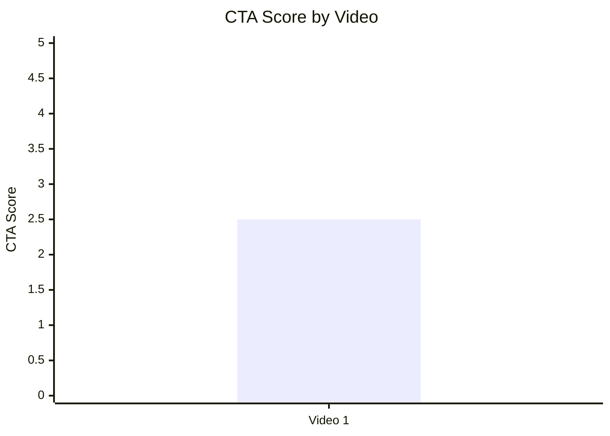

## 8.2. CTA count vs ER Public %

- Назва графіка: CTA count vs ER Public %
- Яке питання він відповідає: чи кількість CTA пов’язана з ER?
- Які поля використовуються: `cta_count`, `er_public_percent`
- Тип графіка: scatter; graph skipped
- Що видно з графіка: `cta_count = MULTIPLE_DESCRIPTION_LINKS`, не numeric.
- Практичний висновок: графік неможливо побудувати коректно без numeric CTA count; потрібне ручне кодування CTA count у наступних звітах.

| Video | CTA count raw | Numeric CTA count | ER Public % |
|---|---|---:|---:|
| Video 1 | MULTIPLE_DESCRIPTION_LINKS | N/A | 2.36 |

## 8.3. CTA features heatmap

- Назва графіка: CTA features heatmap
- Яке питання він відповідає: які CTA features присутні або відсутні?
- Які поля використовуються: `has_comment_prompt`, inferred description subscribe CTA, `has_like_cta`, `has_bell_cta`, `has_next_video_bridge`
- Тип графіка: Markdown heatmap/matrix
- Що видно з графіка: немає verbal comment prompt, like CTA, bell CTA, next-video bridge.
- Практичний висновок: найбільш прямий тест — додати verbal comment prompt і next-video bridge.

| Video | Comment prompt | Subscribe | Like | Bell | Next video bridge |
|---|---|---|---|---|---|
| Video 1 | ❌ | ⚠️ Description only | ❌ | ❌ | ❌ |

## 9. Графіки реклами / інтеграцій

Advertising graphs skipped: no advertising integrations detected.

## 9.1. Ad load % by video

- Назва графіка: Ad load % by video
- Яке питання він відповідає: чи є рекламне навантаження?
- Які поля використовуються: `ad_load_percent`
- Тип графіка: skipped/table
- Що видно з графіка: classic ad load = `0.0%`.
- Практичний висновок: ad fatigue не є виявленою проблемою цього відео.

| Video | Ad detected | Ad load % | Ad integration score |
|---|---|---:|---|
| Video 1 | false | 0.0 | NOT_APPLICABLE |

## 9.2. First ad position %

- Назва графіка: First ad position %
- Яке питання він відповідає: чи реклама стоїть занадто рано?
- Які поля використовуються: `first_ad_relative_position_percent`
- Тип графіка: skipped
- Що видно з графіка: `NOT_APPLICABLE`.
- Практичний висновок: немає classic ad, тому ризик early ad interruption не виявлений.

## 9.3. Ad integration score vs ER Public %

- Назва графіка: Ad integration score vs ER Public %
- Яке питання він відповідає: чи якість реклами пов’язана з engagement?
- Які поля використовуються: `ad_integration_score`, `er_public_percent`
- Тип графіка: skipped
- Що видно з графіка: `ad_integration_score = NOT_APPLICABLE`.
- Практичний висновок: графік неможливий без рекламних інтеграцій.

## 10. Графіки аудіо

## 10.1. Audio score by video

- Назва графіка: Audio score by video
- Яке питання він відповідає: який audio score має відео?
- Які поля використовуються: `audio_score`
- Тип графіка: Mermaid bar chart
- Що видно з графіка: Audio score = `3.0`.
- Практичний висновок: audio не визначено як головна проблема, але confidence обмежений через відсутність технічної перевірки.

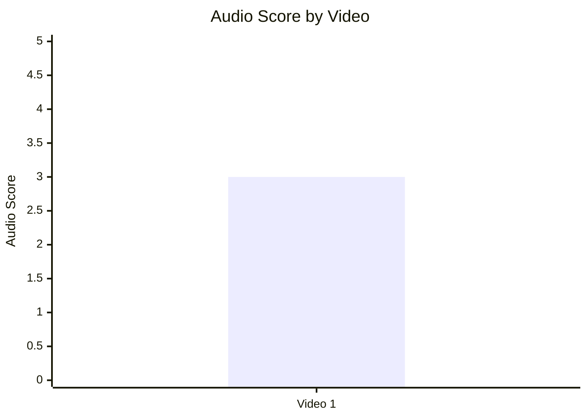

## 10.2. Audio score vs Overall Score

- Назва графіка: Audio score vs Overall Score
- Яке питання він відповідає: чи audio score пов’язаний із загальним score?
- Які поля використовуються: `audio_score`, `overall_video_score`
- Тип графіка: scatter; table only for `n=1`
- Що видно з графіка: Audio `3.0`, Overall `3.75`.
- Практичний висновок: зв’язок не оцінюється; потрібно мінімум 5 comparable videos для кореляції.

| Video | Audio score | Overall score |
|---|---:|---:|
| Video 1 | 3.0 | 3.75 |

## 11. Графіки коментарів

## 11.1. Sentiment distribution

- Назва графіка: Sentiment distribution
- Яке питання він відповідає: яка структура реакцій аудиторії?
- Які поля використовуються: qualitative sentiment/type fields із Comment Analysis
- Тип графіка: stacked bar skipped; table only
- Що видно з графіка: точних percent/count немає; доступні qualitative strength labels.
- Практичний висновок: для майбутніх звітів треба фіксувати numeric sentiment percentages, інакше stacked bar неможливий.

| Video | Positive | Negative | Mixed | Neutral | Question | Request | Spam |
|---|---|---|---|---|---|---|---|
| Video 1 | MEDIUM | HIGH | HIGH | N/A | MEDIUM | LOW-MEDIUM | PRESENT |

## 11.2. Comment resonance score by video

- Назва графіка: Comment resonance score by video
- Яке питання він відповідає: наскільки сильно коментарі резонують?
- Які поля використовуються: `comment_resonance_score`
- Тип графіка: Mermaid bar chart
- Що видно з графіка: Comment resonance score = `4.5`.
- Практичний висновок: comments — один із найсильніших assets відео; варто керувати дискусією через pinned prompt.

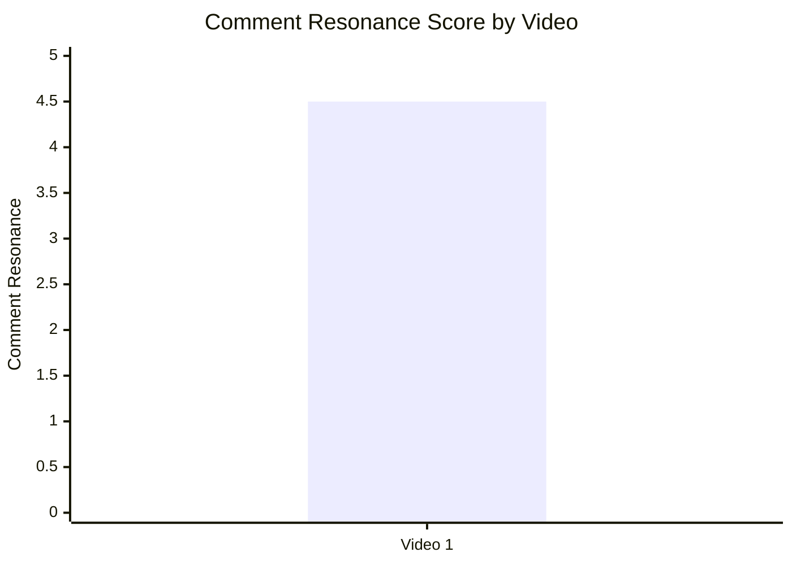

## 11.3. Top comment clusters

- Назва графіка: Top comment clusters
- Яке питання він відповідає: що аудиторія найчастіше обговорює?
- Які поля використовуються: cluster names + qualitative strength
- Тип графіка: horizontal bar substitute via ordered table
- Що видно з графіка: найсильніші кластери — skepticism, land lease correction, demographics dispute.
- Практичний висновок: наступні контент-тести мають відповідати на skepticism і factual corrections, а не тільки повторювати collapse thesis.

| Rank | Cluster | Strength | Strategic meaning |
|---:|---|---|---|
| 1 | China collapse skepticism | HIGH | Потрібен update/falsifiability video |
| 2 | Land ownership / lease correction | HIGH | Потрібне уточнення “sell vs lease” |
| 3 | Demographics / population dispute | HIGH | Сильна тема для follow-up |
| 4 | Ghost cities / collapse support | MEDIUM-HIGH | Viewer anecdotes можуть підсилити series |
| 5 | Chinese history corrections | MEDIUM | Історичні asides треба скоротити або джерелити |
| 6 | NZ / hiking / scenery | MEDIUM | Scenic branding працює як secondary affinity |

## 12. Графіки score-системи

## 12.1. Overall score by video

- Назва графіка: Overall score by video
- Яке питання він відповідає: який загальний score має відео?
- Які поля використовуються: `overall_video_score`
- Тип графіка: Mermaid bar chart
- Що видно з графіка: Overall = `3.75`.
- Практичний висновок: відео сильне, але не максимальне; основний drag — CTA score.

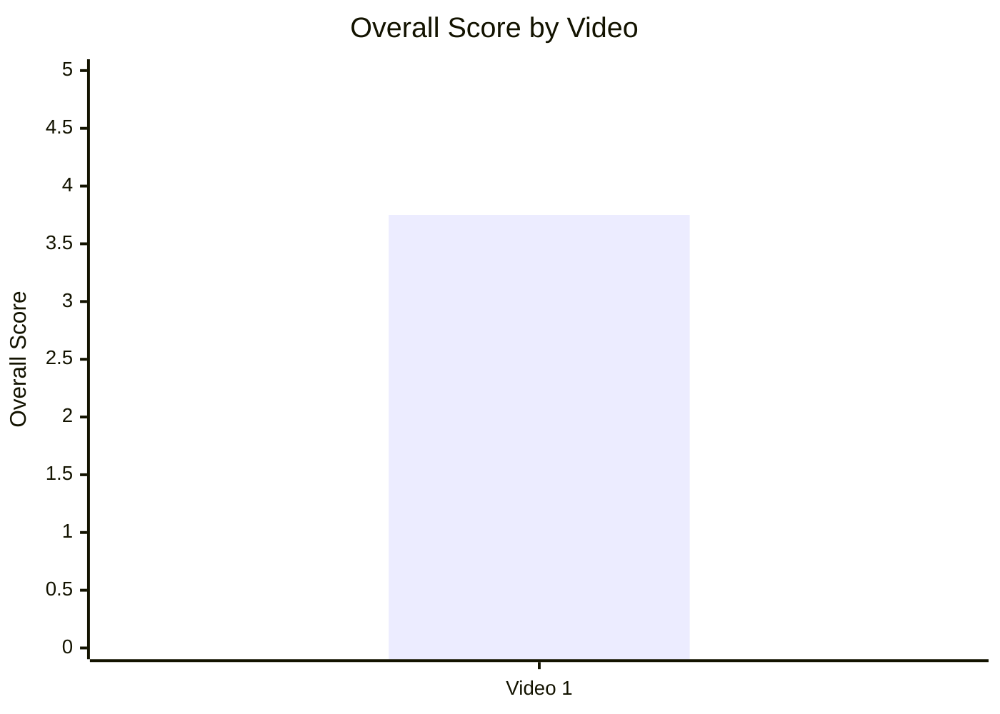

## 12.2. Score breakdown heatmap

- Назва графіка: Score breakdown heatmap
- Яке питання він відповідає: де сильні й слабкі score-зони?
- Які поля використовуються: hook, structure, value_density, audio, cta, ad, comments, replicability, overall
- Тип графіка: Markdown heatmap table
- Що видно з графіка: strongest = comments `4.5`; weakest numeric = CTA `2.5`; ad = `N/A`.
- Практичний висновок: не треба міняти core topic/structure першим; треба покращити CTA/session mechanics.

| Video | Hook | Structure | Value Density | Audio | CTA | Ad | Comments | Replicability | Overall |
|---|---:|---:|---:|---:|---:|---|---:|---:|---:|
| Video 1 | 4.0 | 4.0 | 4.0 | 3.0 | 2.5 | N/A | 4.5 | 4.0 | 3.75 |

## 12.3. Strengths vs weaknesses count

- Назва графіка: Strengths vs weaknesses count
- Яке питання він відповідає: скільки success mechanics і missed opportunities зафіксовано?
- Які поля використовуються: success mechanics count, missed opportunities count, high-priority missed opportunities
- Тип графіка: Mermaid bar chart
- Що видно з графіка: 7 success mechanics, 8 missed opportunities, 3 high-priority missed opportunities.
- Практичний висновок: відео має сильну механіку, але є чіткий optimization backlog.

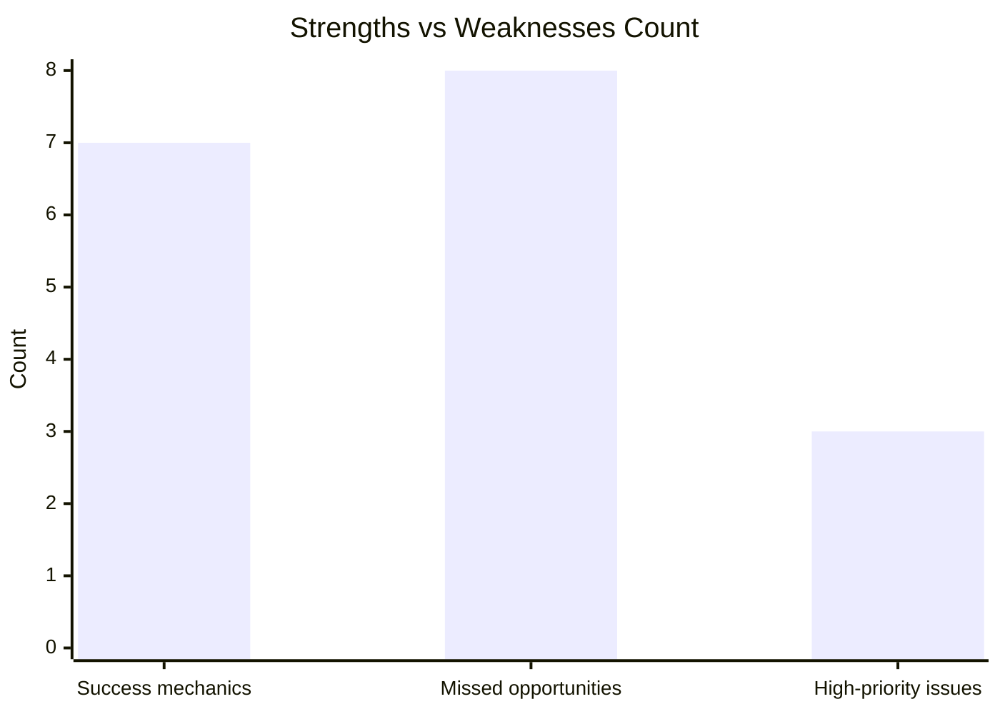

## 13. Кореляції та патерни

Correlation analysis skipped: fewer than 5 comparable videos.

| Pair | Correlation / Pattern | Strength | Interpretation | Confidence |
|---|---:|---|---|---|
| hook_score → overall_video_score | N/A | INSUFFICIENT_DATA | Потрібно мінімум 5 comparable videos | LOW |
| value_density_score → er_public_percent | N/A | INSUFFICIENT_DATA | Потрібно мінімум 5 comparable videos | LOW |
| cta_score → comment_rate_percent | N/A | INSUFFICIENT_DATA | Потрібно мінімум 5 comparable videos | LOW |
| comment_resonance_score → er_public_percent | N/A | INSUFFICIENT_DATA | Потрібно мінімум 5 comparable videos | LOW |
| views_per_day → er_public_percent | N/A | INSUFFICIENT_DATA | Потрібно мінімум 5 comparable videos | LOW |
| ad_load_percent → er_public_percent | N/A | INSUFFICIENT_DATA | Немає ad integrations + лише 1 відео | LOW |
| time_to_first_value_seconds → overall_video_score | N/A | INSUFFICIENT_DATA | Потрібно мінімум 5 comparable videos | LOW |

Попередні патерни для одного кейсу (`LOW_CONFIDENCE`): Video 1 поєднує сильний hook/structure/value density із високим comment resonance, але має слабший CTA score.

## 14. Висновки для контент-стратегії

| Спостереження | Дані / графік | Що це означає | Що робити |
|---|---|---|---|
| Core topic працює як reach engine | Views `975 949`, views/day `2 059.0`, success mechanic `HIGH_STAKES_MACRO_TOPIC` | China + real estate + collapse має сильний market pull | Робити follow-up на China systemic risks, але з update angle |
| Comments — найсильніший score-блок | Comment resonance `4.5`, clusters HIGH | Відео створює debate і corrections | Додати pinned comment із контрольованим питанням і source hub |
| CTA — найслабший numeric score | CTA score `2.5`, no comment prompt, no next-video bridge | Втрачається session time і керована дискусія | Додати verbal comment prompt, subscribe bridge, end-screen next video |
| Hook сильний, але можна загострити | Hook score `4.0`, time to first value `18 sec` | Старт швидкий, але strongest mechanism пізно | Виносити “apartments as shadow currency” у hook |
| Реклама не шкодить, бо її немає | ad_load `0.0`, ad score `N/A` | Ad fatigue не пояснює слабкі місця | Не змінювати ad strategy на основі цього кейсу |
| Audio не є доведеним bottleneck | Audio `3.0`, confidence limited | Технічних даних мало | Для майбутніх звітів додати waveform/volume metrics |
| Слабкість у source clarity | Missed opportunity `SOURCE_GAP_FOR_DISPUTED_CLAIMS` | Глядачі фокусуються на corrections | Додавати sources, caveats і wording clarifications |

## 15. Що тестувати далі

| Тест | Гіпотеза | На яких даних базується | Як виміряти | Пріоритет |
|---|---|---|---|---|
| Verbal comment prompt | Контрольований prompt підвищить якість коментарів і зменшить хаотичний skepticism | `NO_VERBAL_COMMENT_PROMPT`, comment resonance `4.5` | Comment rate %, comments per 1k views, частка question/request clusters | HIGH |
| Next-video bridge | End-screen bridge підвищить session continuation | `NO_NEXT_VIDEO_BRIDGE`, CTA score `2.5` | End screen CTR, next video views from end screen | HIGH |
| Source/pinned comment hub | Джерела зменшать factual correction friction | `SOURCE_GAP_FOR_DISPUTED_CLAIMS`, clusters: land lease/history corrections | Ratio positive/mixed/negative corrections, pinned comment engagement | HIGH |
| Hook with strongest mechanism first | Конкретний mechanism у перші 20 sec підвищить retention start | Strongest new mechanism appears ~18:00 | First 30 sec retention, average view duration | HIGH |
| China land lease explainer | Correction cluster можна перетворити на follow-up traffic | Land ownership / lease correction = HIGH | Views/day, comment quality, search traffic if available | HIGH |
| “Was I wrong about China?” update | Skepticism cluster можна перетворити на credibility content | China collapse skepticism = HIGH | CTR, comments sentiment, returning viewers | HIGH |
| Audio metrics instrumentation | Кращі audio data дадуть об’єктивніший score | Audio score `3.0`, technical metrics unavailable | LUFS/peak/noise metrics in future reports | MEDIUM |

## 16. Дані для експорту в таблицю / CSV

| video_label | title | format_group | views | views_per_day | like_rate_percent | comment_rate_percent | er_public_percent | views_per_1k_subs | hook_type | hook_score | cta_count | cta_score | ad_load_percent | ad_integration_score | audio_score | comment_resonance_score | overall_video_score | top_success_mechanic | top_missed_opportunity |
|---|---|---|---:|---:|---:|---:|---:|---:|---|---:|---|---:|---:|---|---:|---:|---:|---|---|
| Video 1 | The Failure of Chinese Real Estate || Peter Zeihan | LONG_10_20_MIN | 975949 | 2059.0 | 2.12 | 0.25 | 2.36 | 1020.87 | PROBLEM_THREAT | 4.0 | MULTIPLE_DESCRIPTION_LINKS | 2.5 | 0.0 | NOT_APPLICABLE | 3.0 | 4.5 | 3.75 | HIGH_STAKES_MACRO_TOPIC | NO_VERBAL_COMMENT_PROMPT |