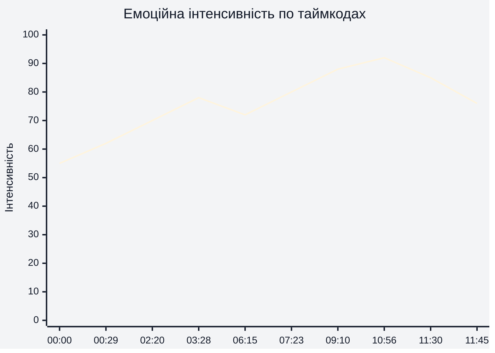
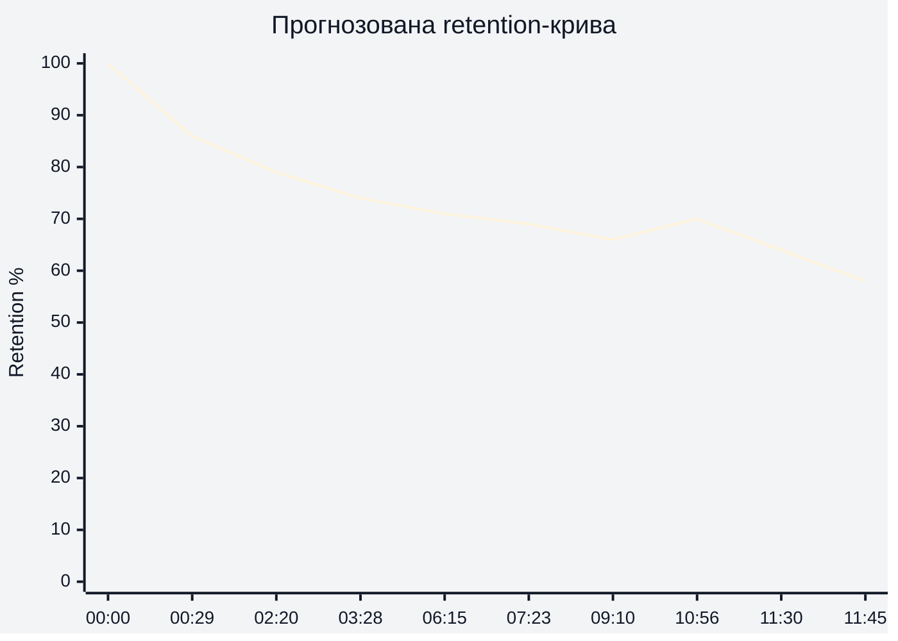
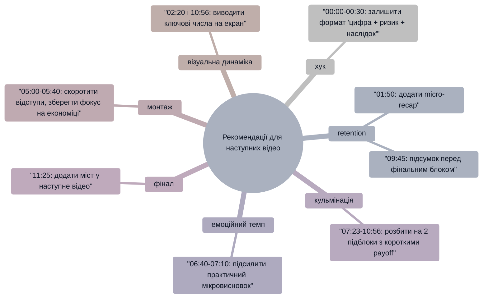

# Аналіз довгоформатного YouTube-відео

## 1. Сюжетна дуга (Narrative Arc)

```mermaid
%%{init: {'theme':'base', 'themeVariables': {
'primaryColor':'#f3f4f6',
'primaryTextColor':'#111827',
'primaryBorderColor':'#2563eb',
'lineColor':'#2563eb',
'secondaryColor':'#ffffff',
'tertiaryColor':'#f3f4f6',
'background':'#f3f4f6'
}}}%%
flowchart LR
A["Хук<br/>00:00-00:29<br/>Прогноз: 25-33% виробників можуть вибути"] -->
B["Експозиція<br/>00:29-02:20<br/>Контекст торговельних конфліктів і агросектору"] -->
C["Перша ескалація<br/>02:20-03:28<br/>Тарифи 100%+ і втрата китайського каналу"] -->
D["Переломний момент<br/>03:28-06:15<br/>Блок meats: мінус маржа, мінус експорт"] -->
E["Наростання напруги<br/>06:15-07:23<br/>Блок row crops: пастка сої/кукурудзи"] -->
F["Кульмінація<br/>07:23-10:56<br/>Блок specialty crops: найвищий системний ризик"] -->
G["Розв’язка<br/>10:56-11:30<br/>Сценарії порятунку: субсидії або глибша криза"] -->
H["Фінальний висновок<br/>11:30-11:45<br/>Дешевша їжа = ліквідація господарств"]
```

## 2. Ключові Story Beats

```mermaid
%%{init: {'theme':'base', 'themeVariables': {
'primaryColor':'#f3f4f6',
'primaryTextColor':'#111827',
'primaryBorderColor':'#2563eb',
'lineColor':'#2563eb',
'secondaryColor':'#ffffff',
'tertiaryColor':'#f3f4f6',
'background':'#f3f4f6'
}}}%%
flowchart LR
S1["00:00<br/>Старт серії про хаос<br/>Функція: миттєвий вхід у тему"] -->
S2["00:29<br/>Ризик 25-33% банкрутств<br/>Функція: підняти ставки"] -->
S3["01:30<br/>Чому агро б’ють першим у trade war<br/>Функція: причинно-наслідкова рамка"] -->
S4["02:20<br/>Китайський ринок фактично обнулюється<br/>Функція: стратегічний перелом"] -->
S5["03:28<br/>Meats: втрата зовнішнього попиту<br/>Функція: конкретизація наслідків"] -->
S6["05:20<br/>Падіння прибутковості ~25% на тварину<br/>Функція: фінансовий шок"] -->
S7["06:15<br/>Row crops: соя/кукурудза в короткостроковому стресі<br/>Функція: розширення проблеми"] -->
S8["07:23<br/>Specialty crops і Central Valley<br/>Функція: локалізована кульмінація ризику"] -->
S9["10:56<br/>Політичний вибір: субсидії vs втрати<br/>Функція: сценарна розв’язка"] -->
S10["11:30<br/>Сигнал для глядача: дешевий кошик як тривога<br/>Функція: практичний післясмак"]
```

## 3. Емоційний темп

## 4. Утримання аудиторії

**Статус даних:** реальні retention-дані не надані, нижче — **прогнозована retention-структура** для відрізку `00:00-11:45`.

## 5. Піки retention

| Таймкод | Подія | Чому це може утримувати увагу | Сила піку 1–10 |
|---|---|---|---:|
| 00:29 | Озвучено ризик «25–33% виробників» | Чіткий high-stakes гачок із конкретною цифрою | 9 |
| 02:20 | Теза про втрату китайського ринку | Різка ескалація наслідків і масштабу | 8 |
| 03:28 | Перехід до блоку meats | Обіцянка практичної деталізації по підсекторах | 7 |
| 07:23 | Вхід у specialty crops / Central Valley | Нова підтема з максимальним локальним ризиком | 8 |
| 10:56 | «One more thing» + споживчий сигнал | Персональна релевантність для глядача в побуті | 9 |

## 6. Провали retention

| Таймкод | Проблема | Ймовірна причина спаду | Що покращити |
|---|---|---|---|
| 01:30-02:10 | Рівний аналітичний монолог без візуального зсуву | Висока щільність пояснення без зміни ритму | Додати короткий візуальний «підсумок кадром» на 01:50 |
| 05:00-05:40 | Деталі про «непопулярні частини» тварин затягуються | Гумор і деталі частково відводять від головної лінії | Скоротити блок на 10–15 сек і швидше повернутись до економіки |
| 06:40-07:10 | Перехід між соєю та кукурудзою місцями «плаский» | Менша драматургічна новизна в середині відео | Вставити micro-payoff: «що робити фермеру вже цього сезону» |
| 09:20-10:10 | Тривалий пояснювальний відрізок без чіткого підсумку | Накопичення макроаргументів без проміжного «якірного» висновку | Додати 1-реченневий recap на 09:45 |
| 11:10-11:30 | Фінальний відрізок перед закінченням без CTA-мосту | Немає переходу до наступної дії після висновку | Додати bridge на наступне відео в 11:25 |

## 7. Оцінка сегментів

| Сегмент | Таймкод | Функція | Емоційна інтенсивність | Ризик втрати уваги | Оцінка 1–10 | Що покращити |
|---|---|---|---:|---|---:|---|
| Хук | 00:00-00:29 | Захопити увагу через ставку | 62 | Низький | 9 | Залишити темп, додати 1 візуальний proof-point |
| Контекст | 00:29-02:20 | Пояснити рамку конфлікту | 70 | Середній | 8 | На 01:50 вставити короткий підсумок-лейбл |
| Ескалація ринку | 02:20-03:28 | Показати масштаб втрати попиту | 78 | Низький | 8 | Додати графічний маркер «ринок 0» |
| Meats блок | 03:28-06:15 | Конкретні наслідки для маржі | 72 | Середній | 7 | Стиснути відступ 05:00-05:40 |
| Row crops блок | 06:15-07:23 | Перехід до сої/кукурудзи | 80 | Середній | 7 | Дати micro-payoff у 06:55 |
| Specialty crops блок | 07:23-10:56 | Кульмінація системного ризику | 88 | Середній | 8 | Розбити на 2 підпідсумки (08:40, 09:45) |
| Розв’язка сценаріїв | 10:56-11:30 | Політичний/економічний вибір | 85 | Низький | 8 | Додати чітку формулу «варіант А/Б» |
| Фінал | 11:30-11:45 | Закрити меседж для глядача | 76 | Середній | 7 | Додати CTA-bridge в 11:25-11:35 |

## 8. Практичні рекомендації

## 9. Підсумкова оцінка

| Показник | Оцінка 1–10 | Коментар |
|---|---:|---|
| Сюжетна дуга | 8 | Від `00:00` до `11:45` є послідовна ескалація з чіткою кульмінацією `07:23-10:56`. |
| Story Beats | 8 | Ключові точки `00:29`, `02:20`, `03:28`, `07:23`, `10:56` працюють як опорні «удари». |
| Емоційний темп | 7 | Темп зростає до `10:56`, але на `05:00-05:40` і `09:20-10:10` є ризик просідання уваги. |
| Retention Structure | 7 | Для `00:00-11:45` побудована прогнозована крива; потрібні реальні Studio-дані для валідації. |
| Загальна оцінка | 8 | Сильна аналітична драматургія з головним резервом у фінальному bridge на `11:25-11:35`. |