# Статистичний аналіз відеозвітів

## 1. Короткий executive summary

| Пункт | Висновок |
|---|---|
| Скільки відео проаналізовано | 1 |
| Скільки форматів відео | 1 (`LONG_10_20_MIN`) |
| Найсильніше відео за overall score | Video 1 (`3.67`) |
| Найсильніше відео за ER Public % | Video 1 (`2.6082%`) |
| Найсильніше відео за views per day | Video 1 (`1749.59`) |
| Найсильніша повторювана механіка | `CLEAR_HOOK` (також `FAST_VALUE_DELIVERY`, `STRONG_STORY_STRUCTURE`) |
| Найчастіша слабкість | `NO_COMMENT_PROMPT`, `NO_NEXT_VIDEO_BRIDGE` |
| Головна стратегічна можливість | Додати керований CTA-потік: comment prompt + next video bridge |
| Рівень впевненості | LOW |

## 2. Якість і повнота даних

| Поле | Кількість відео з даними | Кількість N/A | Коментар |
|---|---:|---:|---|
| views | 1 | 0 | Повні |
| likes | 1 | 0 | Повні |
| comments_count | 1 | 0 | Повні |
| views_per_day | 1 | 0 | Повні |
| er_public_percent | 1 | 0 | Повні |
| views_per_1k_subs | 1 | 0 | Повні |
| hook_score | 1 | 0 | Повні |
| cta_score | 1 | 0 | Повні |
| ad_integration_score | 0 | 1 | `NOT_APPLICABLE` (реклама не виявлена) |
| audio_score | 1 | 0 | Є, але з `LOW_CONFIDENCE` прапорцями |
| comment_resonance_score | 1 | 0 | Повні |
| overall_video_score | 1 | 0 | Повні |

### Обмеження аналізу

- Вибірка = 1 відео, тому всі міжвідео-висновки мають статус `LOW_CONFIDENCE`.
- Кореляції не виконуються (менше 5 відео; також менше 3 для базової кореляційної оцінки).
- `time_to_first_value` оцінено з `NO_TIMECODES`, тому часові графіки мають нижчу точність.

## 3. Підготовлена таблиця для графіків

| Video | Format | Views | Views/day | Like Rate % | Comment Rate % | ER Public % | Views/1k subs | Hook | CTA | Ad | Audio | Comment Resonance | Overall |
|---|---|---:|---:|---:|---:|---:|---:|---:|---:|---|---:|---:|---:|
| Video 1 | LONG_10_20_MIN | 649917 | 1749.59 | 2.2343 | 0.3739 | 2.6082 | 679.83 | 4 | 2 | NOT_APPLICABLE | 3 | 4 | 3.67 |

| Label | Full title | URL |
|---|---|---|
| Video 1 | The Fire Hose of Chaos: Agriculture | https://www.youtube.com/watch?v=Y_jtHIezOqU |

## 4. Рекомендовані графіки

| # | Назва графіка | Тип графіка | Поля | Для чого потрібен | Пріоритет |
|---:|---|---|---|---|---|
| 1 | Overall score by video | Bar chart | overall_video_score | Швидко побачити загальну якість | HIGH |
| 2 | Views per day by video | Bar chart | views_per_day | Нормалізована продуктивність | HIGH |
| 3 | ER Public % by video | Bar chart | er_public_percent | Порівняти залучення | HIGH |
| 4 | ER Public vs Views/day | Scatter/quadrant | er_public_percent, views_per_day | Баланс охоплення і залучення | HIGH |
| 5 | Hook score by video | Bar chart | hook_score | Оцінити силу hook | HIGH |
| 6 | CTA score by video | Bar chart | cta_score | Оцінити CTA-ефективність | HIGH |
| 7 | Score breakdown heatmap | Heatmap | score-блоки | Побачити сильні/слабкі осі | HIGH |
| 8 | Sentiment distribution | Stacked bar | sentiment percents | Структура реакції аудиторії | MEDIUM |
| 9 | CTA features heatmap | Heatmap/matrix | CTA feature flags | Які CTA інструменти реально використані | MEDIUM |
| 10 | Ad load % by video | Bar chart | ad_load_percent | Контроль рекламного навантаження | LOW |

## 5. Графіки продуктивності

### 5.1. Views by video

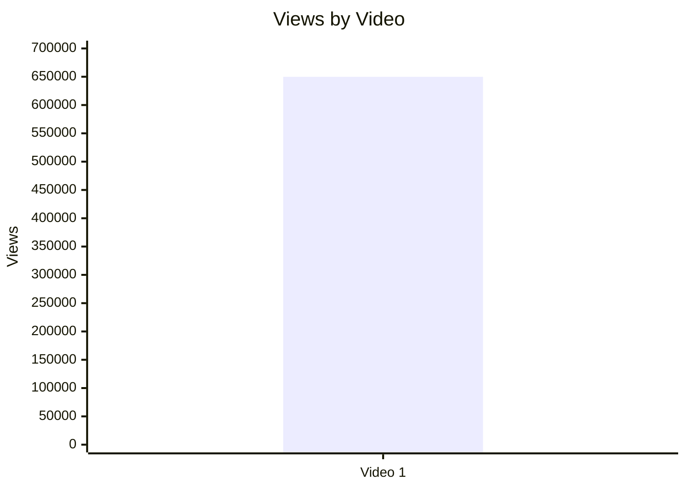

- Назва графіка: Views by Video
- Яке питання він відповідає: Яке відео має найбільший raw reach?
- Які поля використовуються: `video_label`, `views`
- Тип графіка: Bar chart
- Що видно з графіка: Єдине відео має `649,917` переглядів.
- Практичний висновок: Використовувати як контекст, але не як головний performance KPI без нормалізації (`LOW_CONFIDENCE`).

### 5.2. Views per day by video

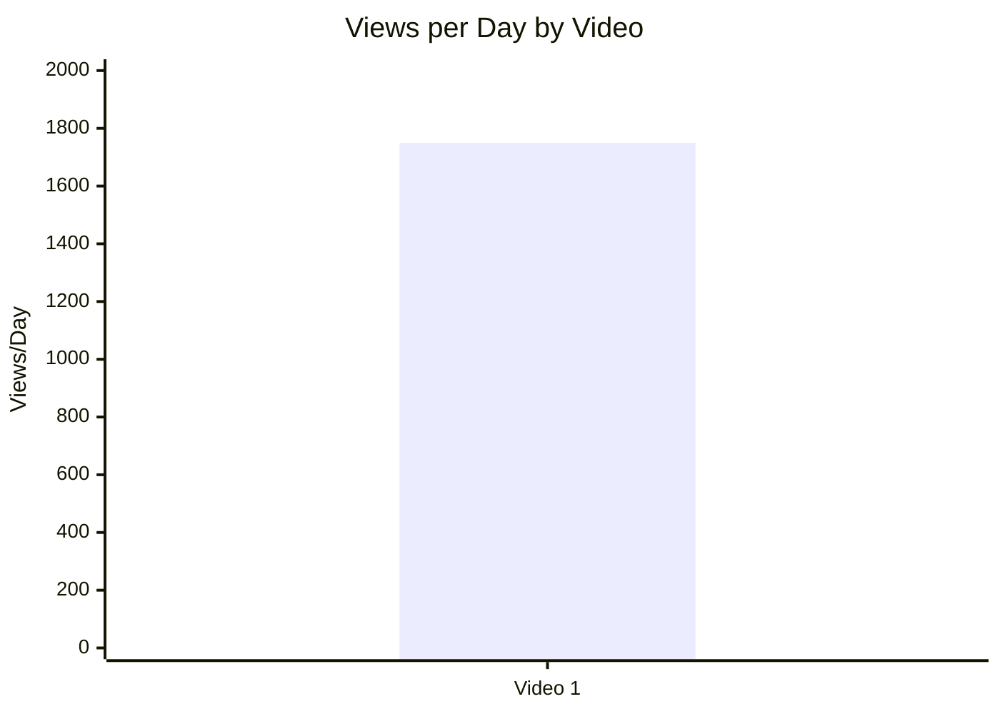

- Назва графіка: Views per Day by Video
- Яке питання він відповідає: Яка швидкість набору переглядів з урахуванням віку відео?
- Які поля використовуються: `video_label`, `views_per_day`
- Тип графіка: Bar chart
- Що видно з графіка: `1749.59` переглядів/день.
- Практичний висновок: Це головний performance-орієнтир для наступних long-form відео цієї ж когорти.

### 5.3. Views per 1k subscribers

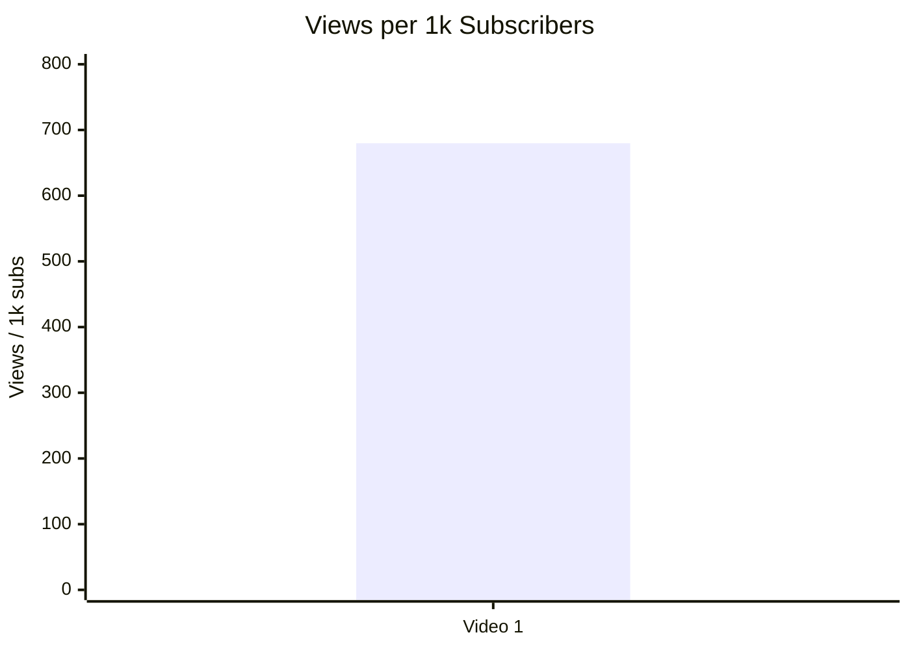

- Назва графіка: Views per 1k Subscribers
- Яке питання він відповідає: Наскільки ефективно відео конвертує розмір каналу в перегляди?
- Які поля використовуються: `video_label`, `views_per_1k_subs`
- Тип графіка: Bar chart
- Що видно з графіка: `679.83` views/1k subs.
- Практичний висновок: Метрика придатна як internal benchmark для майбутніх відео каналу.

### 5.4. Performance quadrant

Performance quadrant skipped: `INSUFFICIENT_DATA` (1 відео, немає міжвідео-розподілу для квадрантів).

Таблиця для ручної побудови:
| video_label | views_per_day | er_public_percent |
|---|---:|---:|
| Video 1 | 1749.59 | 2.6082 |

- Назва графіка: Performance Quadrant
- Яке питання він відповідає: Чи поєднує відео сильне охоплення й сильне залучення?
- Які поля використовуються: `views_per_day`, `er_public_percent`
- Тип графіка: Scatter/quadrant
- Що видно з графіка: Немає достатнього розподілу точок.
- Практичний висновок: Потрібно щонайменше 3–5 відео для осмисленого квадрант-аналізу.

## 6. Графіки залучення

### 6.1. ER Public % by video

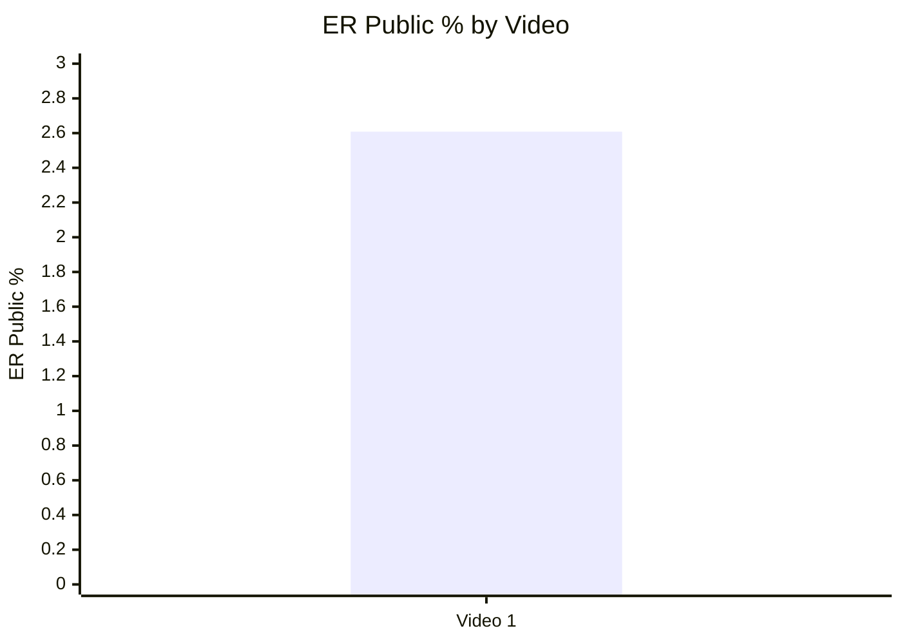

- Назва графіка: ER Public % by Video
- Яке питання він відповідає: Який публічний рівень залучення?
- Які поля використовуються: `video_label`, `er_public_percent`
- Тип графіка: Bar chart
- Що видно з графіка: `2.6082%`.
- Практичний висновок: Значення брати як стартову точку для порівняння майбутніх відео.

### 6.2. Like Rate % vs Comment Rate %

Scatter skipped: `INSUFFICIENT_DATA` (1 точка).

Таблиця для ручної побудови:
| video_label | like_rate_percent | comment_rate_percent |
|---|---:|---:|
| Video 1 | 2.2343 | 0.3739 |

- Назва графіка: Like Rate % vs Comment Rate %
- Яке питання він відповідає: Чи більше «подобається», чи більше «дискутується»?
- Які поля використовуються: `like_rate_percent`, `comment_rate_percent`
- Тип графіка: Scatter plot
- Що видно з графіка: Даних недостатньо для форми розподілу.
- Практичний висновок: Потрібна серія відео для визначення engagement-профілю.

### 6.3. Comments per 1k views

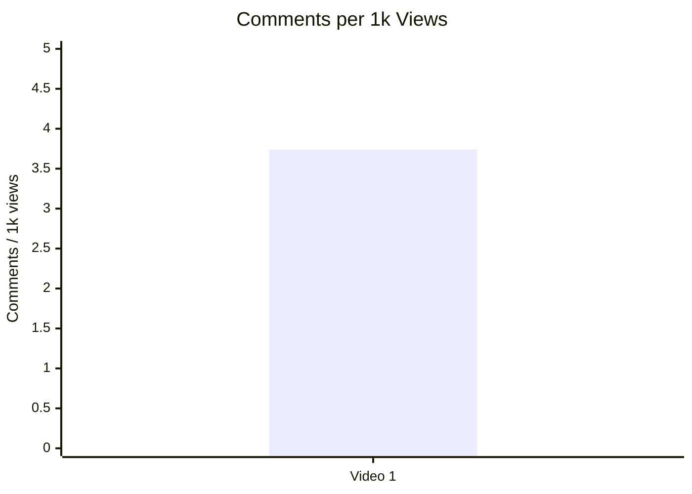

- Назва графіка: Comments per 1k Views
- Яке питання він відповідає: Наскільки відео провокує реакцію?
- Які поля використовуються: `video_label`, `comments_per_1k_views`
- Тип графіка: Bar chart
- Що видно з графіка: `3.74` коментарів на 1k переглядів.
- Практичний висновок: Дискусійний потенціал теми високий; варто масштабувати через серійність.

## 7. Графіки структури та hook

### 7.1. Hook score by video

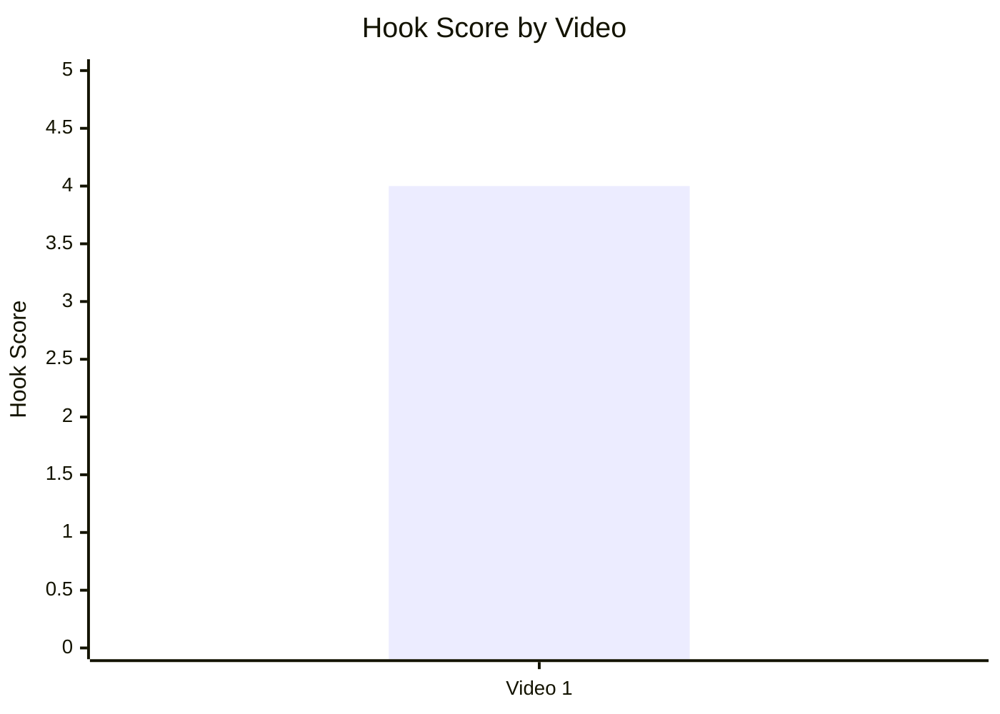

- Назва графіка: Hook Score by Video
- Яке питання він відповідає: Наскільки сильний старт відео?
- Які поля використовуються: `video_label`, `hook_score`
- Тип графіка: Bar chart
- Що видно з графіка: `hook_score = 4`.
- Практичний висновок: Hook-модель цього відео варто копіювати в наступних випусках.

### 7.2. Hook type distribution

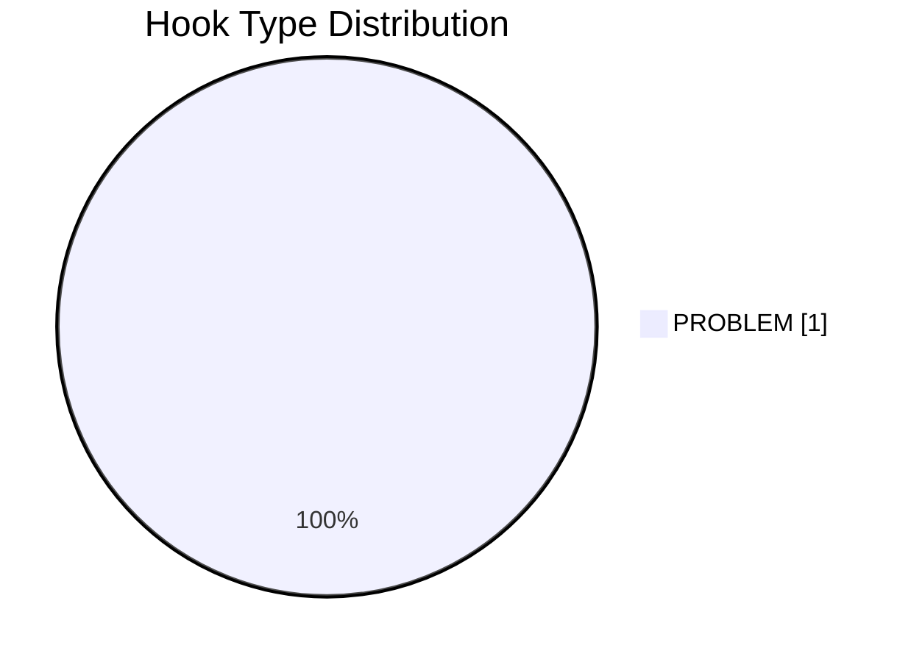

- Назва графіка: Hook Type Distribution
- Яке питання він відповідає: Які типи hook використовуються найчастіше?
- Які поля використовуються: `hook_primary_type`, `count`
- Тип графіка: Pie chart
- Що видно з графіка: У вибірці лише `PROBLEM`.
- Практичний висновок: Розподіл нерепрезентативний; потрібні додаткові відео для порівняння hook-type ефекту (`LOW_CONFIDENCE`).

### 7.3. Time to first value vs Overall Score

Scatter skipped: `INSUFFICIENT_DATA` (1 відео; `time_to_first_value_seconds` оцінний через `NO_TIMECODES`).

Таблиця для ручної побудови:
| video_label | time_to_first_value_seconds | overall_video_score |
|---|---:|---:|
| Video 1 | 29 (estimated) | 3.67 |

- Назва графіка: Time to First Value vs Overall Score
- Яке питання він відповідає: Чи швидша перша цінність пов’язана з вищим результатом?
- Які поля використовуються: `time_to_first_value_seconds`, `overall_video_score`
- Тип графіка: Scatter plot
- Що видно з графіка: Немає порівнювальної вибірки.
- Практичний висновок: Метрику треба збирати системно для кожного нового відео.

## 8. Графіки CTA

### 8.1. CTA score by video

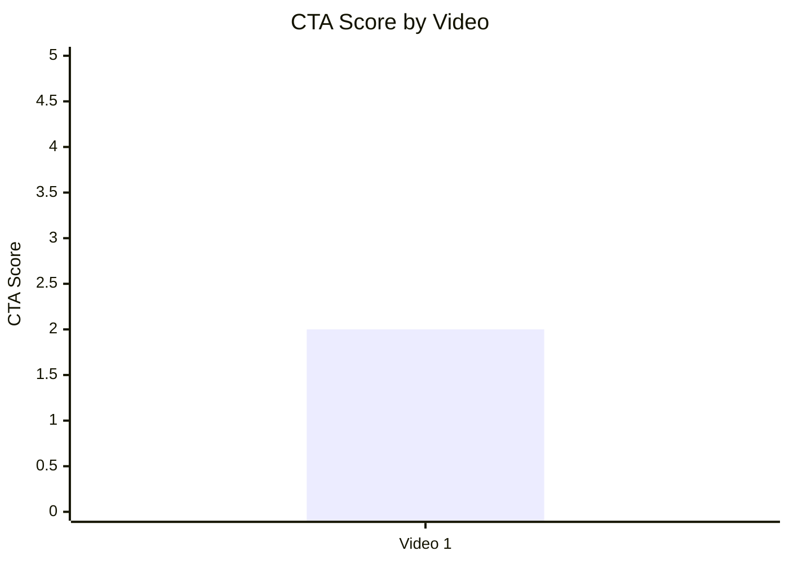

- Назва графіка: CTA Score by Video
- Яке питання він відповідає: Наскільки ефективно організовано CTA?
- Які поля використовуються: `video_label`, `cta_score`
- Тип графіка: Bar chart
- Що видно з графіка: `cta_score = 2`.
- Практичний висновок: CTA-блок є головною зоною для оптимізації.

### 8.2. CTA count vs ER Public %

Scatter skipped: `INSUFFICIENT_DATA` (1 точка).

Таблиця для ручної побудови:
| video_label | cta_count | er_public_percent |
|---|---:|---:|
| Video 1 | 5 | 2.6082 |

- Назва графіка: CTA Count vs ER Public %
- Яке питання він відповідає: Чи більше CTA пов’язано з кращим ER?
- Які поля використовуються: `cta_count`, `er_public_percent`
- Тип графіка: Scatter plot
- Що видно з графіка: Немає міжвідео-порівняння.
- Практичний висновок: Потрібен A/B масив по кількості та типу CTA.

### 8.3. CTA features heatmap

| Video | Comment prompt | Subscribe | Like | Bell | Next video bridge |
|---|---|---|---|---|---|
| Video 1 | ❌ | ✅ | ❌ | ❌ | ❌ |

- Назва графіка: CTA Features Heatmap
- Яке питання він відповідає: Які CTA-механіки реально присутні?
- Які поля використовуються: `has_comment_prompt`, `has_subscribe_cta`, `has_like_cta`, `has_bell_cta`, `has_next_video_bridge`
- Тип графіка: Heatmap / matrix
- Що видно з графіка: Є лише subscribe CTA; відсутні ключові engagement-елементи.
- Практичний висновок: Пріоритетно додати comment prompt та next video bridge.

## 9. Графіки реклами / інтеграцій

Advertising graphs skipped: no advertising integrations detected.

| video_label | ad_detected | ad_count | ad_load_percent | first_ad_relative_position_percent | ad_integration_score |
|---|---|---:|---:|---|---|
| Video 1 | false | 0 | 0 | NOT_APPLICABLE | NOT_APPLICABLE |

- Назва графіка: Ad Load / Ad Position / Ad Integration
- Яке питання він відповідає: Чи впливає реклама на залучення?
- Які поля використовуються: `ad_load_percent`, `first_ad_relative_position_percent`, `ad_integration_score`
- Тип графіка: Bar/scatter (пропущено)
- Що видно з графіка: In-video реклами немає.
- Практичний висновок: Ad-risk у цьому відео відсутній; потрібно збирати ad-кейси для порівняння.

## 10. Графіки аудіо

### 10.1. Audio score by video

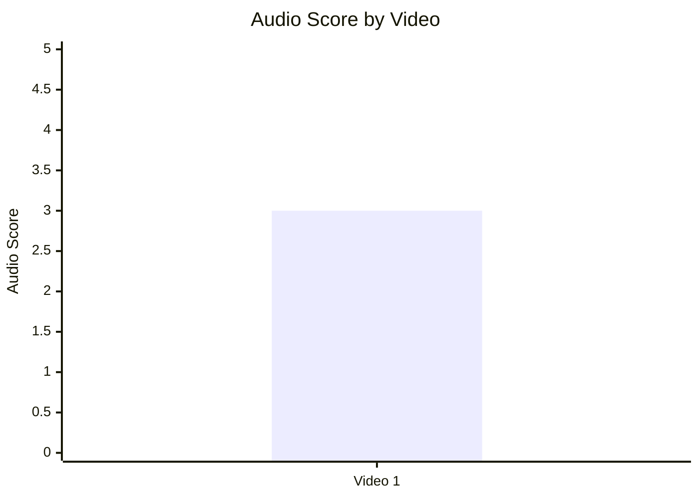

- Назва графіка: Audio Score by Video
- Яке питання він відповідає: Яка узагальнена аудіо-оцінка?
- Які поля використовуються: `video_label`, `audio_score`
- Тип графіка: Bar chart
- Що видно з графіка: `audio_score = 3`.
- Практичний висновок: Середній рівень; інтерпретувати обережно через `LOW_CONFIDENCE` у детальних аудіо-критеріях.

### 10.2. Audio score vs Overall Score

Scatter skipped: `INSUFFICIENT_DATA` (1 точка).

Таблиця для ручної побудови:
| video_label | audio_score | overall_video_score |
|---|---:|---:|
| Video 1 | 3 | 3.67 |

- Назва графіка: Audio Score vs Overall Score
- Яке питання він відповідає: Чи кращий звук збігається з вищим загальним балом?
- Які поля використовуються: `audio_score`, `overall_video_score`
- Тип графіка: Scatter plot
- Що видно з графіка: Немає статистичного розподілу.
- Практичний висновок: Потрібно накопичити мінімум 5 відео з надійними audio-score.

## 11. Графіки коментарів

### 11.1. Sentiment distribution

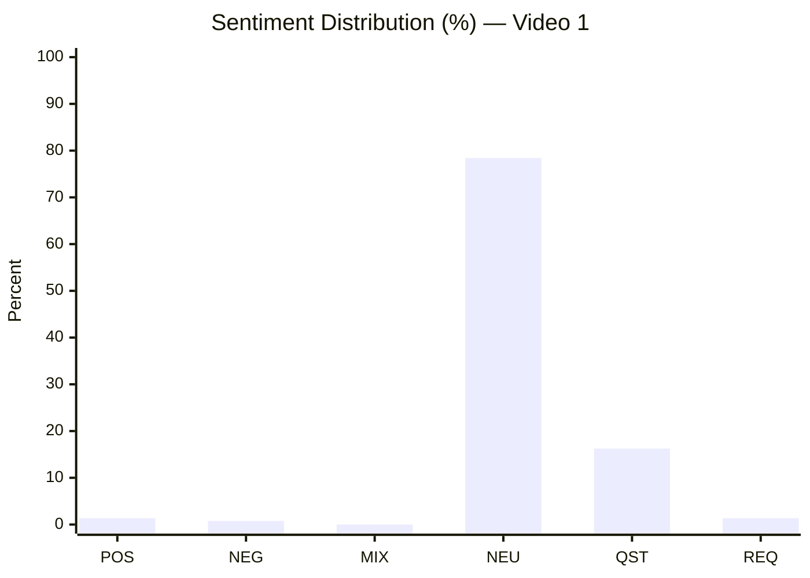

- Назва графіка: Sentiment Distribution
- Яке питання він відповідає: Яка структура реакції аудиторії?
- Які поля використовуються: `positive_percent`, `negative_percent`, `mixed_percent`, `neutral_percent`, `question_percent`, `request_percent`
- Тип графіка: Stacked bar (тут подано як bar по категоріях)
- Що видно з графіка: Домінує `NEUTRAL`, великий блок `QUESTION`.
- Практичний висновок: Контент викликає більше уточнювальних дискусій, ніж полярних оцінок.

### 11.2. Comment resonance score by video

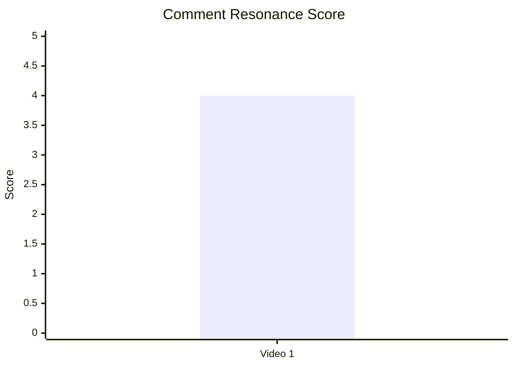

- Назва графіка: Comment Resonance Score by Video
- Яке питання він відповідає: Наскільки сильний резонанс у коментарях?
- Які поля використовуються: `video_label`, `comment_resonance_score`
- Тип графіка: Bar chart
- Що видно з графіка: `4/5`.
- Практичний висновок: Коментарний блок варто використовувати як джерело ідей для follow-up контенту.

### 11.3. Top comment clusters

```mermaid
xychart-beta horizontal
    title "Top Comment Clusters (% of relevant comments)"
    x-axis "Percent"
    y-axis ["COMMUNITY_DISCUSSION","QUESTION_CLARIFICATION","PRAISE_PRODUCTION","PRAISE_CREATOR","PRAISE_CONTENT"]
    bar [26.24,7.22,4.49,2.95,1.75]
```

- Назва графіка: Top Comment Clusters
- Яке питання він відповідає: Які теми домінують у коментарях?
- Які поля використовуються: `cluster_name`, `% of relevant comments`
- Тип графіка: Horizontal bar chart
- Що видно з графіка: Найбільший кластер — політико-економічна дискусія.
- Практичний висновок: Найсильніший драйвер реакції — контроверсійна інтерпретація наслідків політики; це варто врахувати при формуванні наступних тем.

## 12. Графіки score-системи

### 12.1. Overall score by video

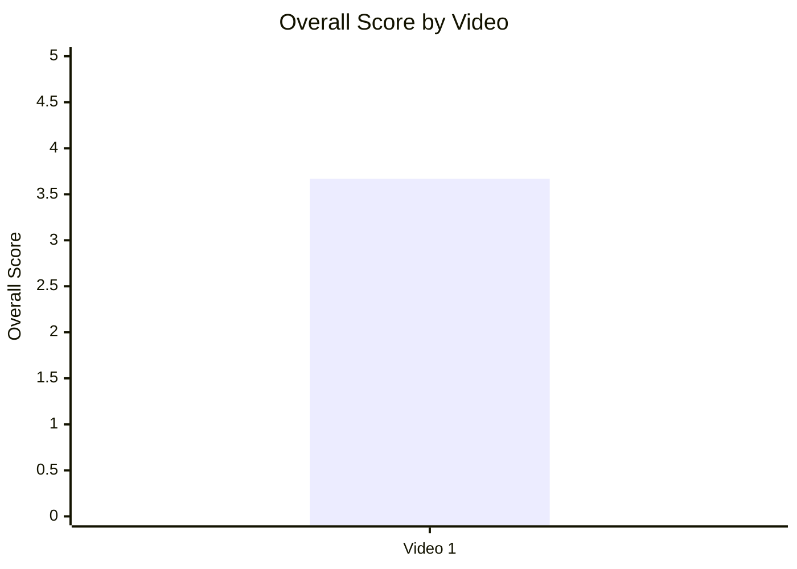

- Назва графіка: Overall Score by Video
- Яке питання він відповідає: Яка загальна конкурентоспроможність відео?
- Які поля використовуються: `video_label`, `overall_video_score`
- Тип графіка: Bar chart
- Що видно з графіка: `3.67/5`.
- Практичний висновок: Відео сильне, але має явний резерв у CTA-площині.

### 12.2. Score breakdown heatmap

Шкала: `🟥 (1–2)`, `🟨 (3)`, `🟩 (4–5)`, `⬜ (NOT_APPLICABLE)`

| Video | Hook | Structure | Value Density | Audio | CTA | Ad | Comments | Replicability | Overall |
|---|---:|---:|---:|---:|---:|---:|---:|---:|---:|
| Video 1 | 4 🟩 | 4 🟩 | 4 🟩 | 3 🟨 | 2 🟥 | NOT_APPLICABLE ⬜ | 4 🟩 | 4 🟩 | 3.67 🟨 |

- Назва графіка: Score Breakdown Heatmap
- Яке питання він відповідає: Які виміри є найсильнішими/найслабшими?
- Які поля використовуються: `hook_score`, `structure_score`, `value_density_score`, `audio_score`, `cta_score`, `ad_integration_score`, `comment_resonance_score`, `replicability_score`, `overall_video_score`
- Тип графіка: Heatmap / matrix
- Що видно з графіка: Сильні блоки — hook/structure/value/comments; слабкий блок — CTA.
- Практичний висновок: Найшвидший приріст overall дасть апгрейд CTA-побудови.

### 12.3. Strengths vs weaknesses count

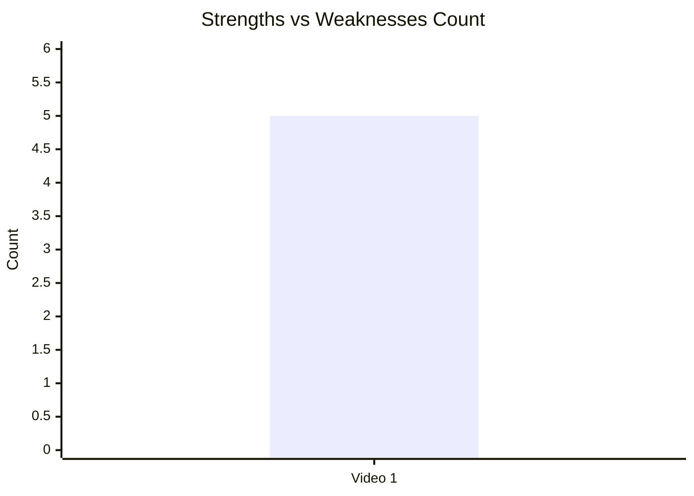

Дані для читання:
- `success_mechanics_count = 5`
- `missed_opportunities_count = 5`
- `high_priority_issues_count = 2`

- Назва графіка: Strengths vs Weaknesses Count
- Яке питання він відповідає: Баланс сильних і слабких сторін?
- Які поля використовуються: count success mechanics, count missed opportunities, count high-priority issues
- Тип графіка: Stacked bar (тут подано як числова summary через обмеження Mermaid)
- Що видно з графіка: Кількість strengths і weaknesses формально симетрична.
- Практичний висновок: Якість висока, але операційні втрати (CTA/bridge/prompt) помітно знижують фінальний потенціал.

## 13. Кореляції та патерни

Correlation analysis skipped: fewer than 5 comparable videos.

## 14. Висновки для контент-стратегії

| Спостереження | Дані / графік | Що це означає | Що робити |
|---|---|---|---|
| Сильний performance при сильному hook | 5.2, 7.1, 12.2 | Старт і структура вже працюють | Зберегти problem-led hook + 3-блокову логіку |
| Резонанс у коментарях високий | 6.3, 11.2, 11.3 | Аудиторія активно входить у дискусію | Додати кероване питання в кінці відео |
| CTA-система недобудована | 8.1, 8.3, 12.2 | Втрачається конверсія в наступну дію | Впровадити comment prompt + next video bridge |
| Рекламне навантаження не заважає | 9 | У цьому кейсі ad-risk відсутній | У майбутніх інтеграціях тримати ad_load низьким і після value-block |
| Даних недостатньо для міжвідео статистики | 2, 13 | Сильні висновки робити рано | Нарощувати єдиний датасет мінімум до 5+ відео |

## 15. Що тестувати далі

| Тест | Гіпотеза | На яких даних базується | Як виміряти | Пріоритет |
|---|---|---|---|---|
| Додати comment prompt у фіналі | Це підвищить comments_per_1k_views і частку REQUEST/QUESTION | 8.3, 11.1, 11.3 | Δ comments_per_1k_views, Δ question/request rate | HIGH |
| Додати next-video bridge + end screen | Підвищить глибину сесії | 8.3, 12.2 | End-screen CTR, next video views/session | HIGH |
| Зменшити CTA-розпорошення до 1 primary CTA | Підвищить конверсію цільової дії | 8.1, 8.2 (`LOW_CONFIDENCE`) | CTR primary CTA, conversion per 1k views | HIGH |
| Тест альтернативного hook типу (PROMISE vs PROBLEM) | Може підвищити early engagement на частині тем | 7.2 (`LOW_CONFIDENCE`) | 30s retention proxy/initial comments velocity | MEDIUM |
| Зробити серійне продовження теми | Підсилить повторний перегляд і discussion loop | 11.3 (QUESTION_CLARIFICATION, REQUEST_TOPIC) | Views/day серії, comment resonance score | HIGH |

## 16. Дані для експорту в таблицю / CSV

| video_label | title | format_group | views | views_per_day | like_rate_percent | comment_rate_percent | er_public_percent | views_per_1k_subs | hook_type | hook_score | cta_count | cta_score | ad_load_percent | ad_integration_score | audio_score | comment_resonance_score | overall_video_score | top_success_mechanic | top_missed_opportunity |
|---|---|---|---:|---:|---:|---:|---:|---:|---|---:|---:|---:|---:|---|---:|---:|---:|---|---|
| Video 1 | The Fire Hose of Chaos: Agriculture | LONG_10_20_MIN | 649917 | 1749.59 | 2.2343 | 0.3739 | 2.6082 | 679.83 | PROBLEM | 4 | 5 | 2 | 0 | NOT_APPLICABLE | 3 | 4 | 3.67 | CLEAR_HOOK | NO_COMMENT_PROMPT |