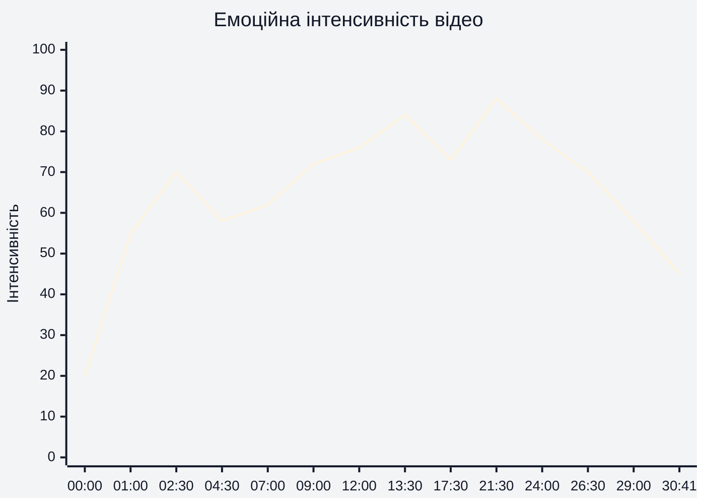
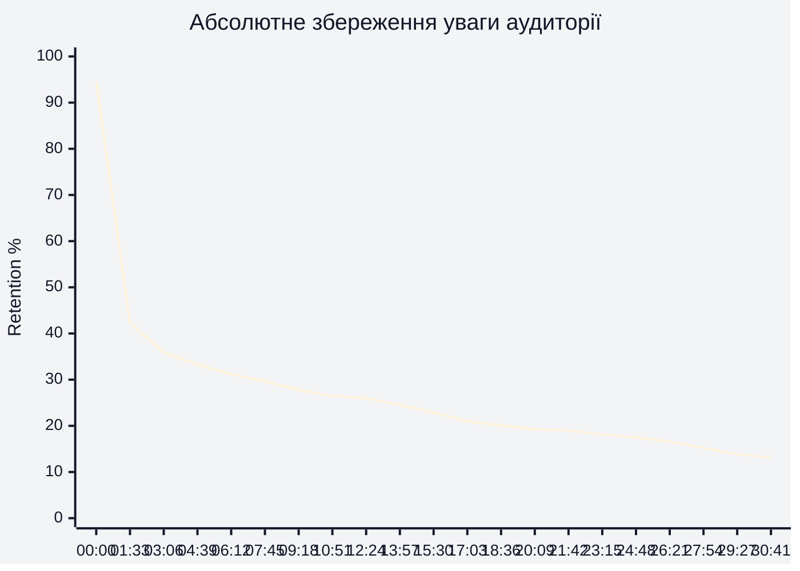
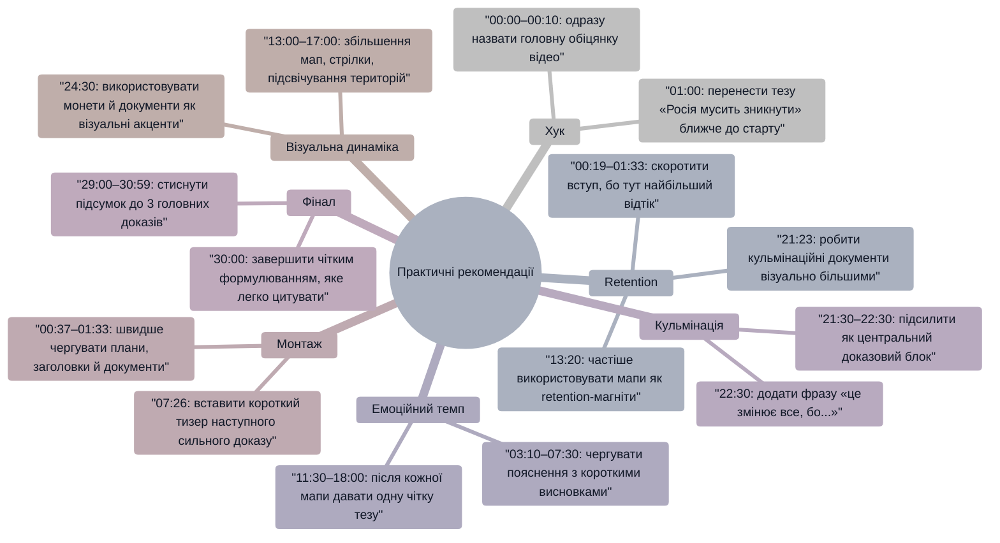

# Аналіз довгоформатного YouTube-відео

**Відео:** «30 хвилин і ви назавжди перестанете називати Московію як Росія»  
**Тривалість:** 30:59  
**Retention-дані:** використано наданий CSV із абсолютним показником збереження уваги аудиторії.  
**Тема:** історико-політичний розбір привласнення назви «Русь / Росія» Московією.  
**Цільова аудиторія:** україномовні глядачі, які цікавляться історією, деколонізацією, інформаційною війною, ідентичністю та аргументами проти російського історичного наративу.

## 1. Сюжетна дуга (Narrative Arc)

```mermaid
%%{init: {'theme':'base', 'themeVariables': {
'primaryColor':'#f3f4f6',
'primaryTextColor':'#111827',
'primaryBorderColor':'#2563eb',
'lineColor':'#2563eb',
'secondaryColor':'#ffffff',
'tertiaryColor':'#f3f4f6',
'background':'#f3f4f6'
}}}%%
flowchart LR
    A["00:00–01:30<br/>Хук<br/>Різкий старт із тезою, що Росія має втратити символічну назву й імперський бренд"]
    B["01:30–03:10<br/>Експозиція<br/>Окреслення головного питання: що саме було вкрадено — Русь, Русія, Russia"]
    C["03:10–07:30<br/>Перша ескалація<br/>Постановка мотиву крадіжки та сумнівів: чи існує джерельна база, яка це підтверджує"]
    D["07:30–11:30<br/>Переломний момент<br/>Автор переходить від заяви до доказової логіки: назви, джерела, давні згадки, зовнішні свідчення"]
    E["11:30–18:00<br/>Наростання напруги<br/>Розділ про територію: карти й документи перевіряють, чи мала Московія зв’язок із Руссю"]
    F["18:00–22:30<br/>Кульмінація<br/>Серія карт, текстів і документів підсилює головну тезу: московський наратив має слабкі місця"]
    G["22:30–27:00<br/>Розв’язка<br/>Поворот до династії, спадкоємності та політичного привласнення як системної технології"]
    H["27:00–30:59<br/>Фінальний висновок<br/>Автор повертає аргумент у сучасність і закріплює тезу про потребу не називати Московію Росією"]
    A --> B --> C --> D --> E --> F --> G --> H
```

## 2. Ключові Story Beats

```mermaid
%%{init: {'theme':'base', 'themeVariables': {
'primaryColor':'#f3f4f6',
'primaryTextColor':'#111827',
'primaryBorderColor':'#2563eb',
'lineColor':'#2563eb',
'secondaryColor':'#ffffff',
'tertiaryColor':'#f3f4f6',
'background':'#f3f4f6'
}}}%%
flowchart LR
    B1["00:30<br/>Подія: згадка про публічні символи й інформаційний контекст<br/>Функція: підготовка до конфлікту"]
    B2["01:00<br/>Подія: теза «Росія мусить зникнути»<br/>Функція: сильний ідеологічний хук"]
    B3["02:00<br/>Подія: формула «Що вкрали? Русь / Русія / Russia»<br/>Функція: уточнення предмета розслідування"]
    B4["03:00<br/>Подія: питання «Хто і коли вкрав?»<br/>Функція: запуск детективної структури"]
    B5["03:30<br/>Подія: розбір мотиву крадіжки<br/>Функція: пояснення ставки для Московії"]
    B6["05:30–06:30<br/>Подія: поява документів і зовнішніх джерел<br/>Функція: перехід від позиції до доказів"]
    B7["08:30–09:30<br/>Подія: згадки про грецькі, арабські та інші назви<br/>Функція: розширення історичного контексту"]
    B8["11:30–12:30<br/>Подія: питання про територію і зв’язок Московії з Руссю<br/>Функція: новий рівень перевірки тези"]
    B9["13:00–17:00<br/>Подія: робота з мапами й географічними межами<br/>Функція: візуальне доведення або спростування просторового зв’язку"]
    B10["21:30–22:30<br/>Подія: документи про Московію, Русь і межі назв<br/>Функція: кульмінаційне підсилення доказової частини"]
    B11["23:00–25:00<br/>Подія: перехід до династії та спадковості<br/>Функція: закриття ще одного аргументу російського наративу"]
    B12["29:00–30:59<br/>Подія: фінальна книжкова/джерельна опора й висновок<br/>Функція: закріплення головної позиції"]
    B1 --> B2 --> B3 --> B4 --> B5 --> B6 --> B7 --> B8 --> B9 --> B10 --> B11 --> B12
```

## 3. Емоційний темп

Емоційний темп побудований навколо чергування трьох режимів: провокаційна теза на 01:00, доказове розслідування на 05:30–17:00 і кульмінаційне підсилення через карти/документи на 21:30–22:30. Найсильніша емоційна точка — 21:30–22:30, бо там візуальна доказовість збігається з головною політичною тезою.

## 4. Утримання аудиторії

Retention-крива показує дуже різке падіння на старті: з 94.60% на 00:00 до 62.76% на 00:19, 51.44% на 00:37 і 42.36% на 01:33. Після 03:06 крива стабілізується в зоні 35.90% і далі повільно знижується до 22.90% на 15:30, 17.50% на 24:48 та 13.18% на 30:41.

## 5. Піки retention

| Таймкод | Подія | Чому це може утримувати увагу | Сила піку 1–10 |
|---|---|---|---|
| 07:08 | Повернення до питання можливості перевірити крадіжку назви | Глядач отримує обіцянку конкретної перевірки, а не лише позиційної заяви | 6 |
| 07:45 | Блок «Чи може бути зв’язок по мові?» | Чітке питання створює очікування відповіді й відкриває новий доказовий напрям | 6 |
| 10:14 | Чорно-білий акцент із паузою та жестом | Зміна візуального ритму перериває монотонність і повертає увагу | 5 |
| 11:28 | Питання про релігію як можливий зв’язок | Тема релігійної спадкоємності емоційно й ідентично заряджена | 5 |
| 13:20 | Перехід до мап і географічного доказу | Візуальні карти роблять абстрактний історичний аргумент конкретним | 7 |
| 21:23 | Карта з позначенням Руської землі | Висока доказова щільність: карта одразу дає глядачу «бачити» аргумент | 7 |
| 25:06 | Блок про династію та основне питання спадкоємності | Повертає відео до великої ставки: хто має право на історичну назву | 6 |
| 28:12 | Перехід до фінального узагальнення | Глядачі, які дійшли до кінця, отримують очікуване підбиття доказів | 5 |

## 6. Провали retention

| Таймкод | Проблема | Ймовірна причина спаду | Що покращити |
|---|---|---|---|
| 00:19 | Падіння з 94.60% до 62.76% | Старт не одразу дає максимально конкретну обіцянку результату; частина аудиторії ще не розуміє, що отримає за 30 хвилин | У перші 10 секунд винести фінальну ставку: «за 30 хвилин покажу 4 докази, чому назва “Росія” є привласненням» |
| 00:37 | Падіння до 51.44% | Ранній контекст може сприйматися як довгий вступ перед основним розслідуванням | Додати швидкий монтаж доказів із майбутніх таймкодів 13:20, 21:23, 24:30 |
| 00:56–01:33 | Падіння до 42.36% | Сильна теза на 01:00 з’являється після помітного відтоку | Перенести тезу «Росія мусить зникнути» ближче до 00:05–00:10 |
| 03:06–04:39 | Зниження з 35.90% до 33.32% | Пояснювальна частина про «що вкрали» може бути менш візуально динамічною | Частіше міняти кадр: документи, мапи, короткі цитати, контрастні підписи |
| 07:26 | Локальний спад до 29.22% | Після блоку про джерела темп може здаватися повторним | Перед 07:26 поставити мікрообіцянку: «далі — найслабше місце московської версії» |
| 13:38–13:57 | Після підйому на 13:20 retention падає до 24.53% | Демонстрація мап може тривати довше, ніж глядач здатен утримувати без чіткої вказівки, куди дивитися | Додати стрілки, збільшення, коротку фразу-висновок на кожні 10–15 секунд |
| 24:48 | Спад до 17.50% | Після кульмінації 21:30–22:30 може виникати відчуття, що головне вже сказано | На 23:00 анонсувати фінальний аргумент: «залишився найважливіший пункт — династія» |
| 30:23 | Мінімум 13.11% | Фінал може бути довшим за потребу для частини аудиторії | Зробити фінальну формулу на 29:30–30:00 і винести CTA після стислого висновку |

## 7. Оцінка сегментів

| Сегмент | Таймкод | Функція | Емоційна інтенсивність | Ризик втрати уваги | Оцінка 1–10 | Що покращити |
|---|---|---|---|---|---|---|
| Хук і постановка конфлікту | 00:00–01:30 | Захопити увагу й заявити радикальну тезу | Висока після 01:00 | Дуже високий: retention падає до 42.36% на 01:33 | 6 | Почати з найсильнішої тези на 00:05 і дати обіцянку доказів |
| Предмет крадіжки назви | 01:30–03:10 | Пояснити, що саме означає «Русь / Русія / Russia» | Середньо-висока | Високий: 35.90% на 03:06 | 7 | Додати більше візуальних зіставлень назв |
| Мотив і перевірка джерел | 03:10–07:30 | Перевести тезу в розслідування | Середня | Середній: близько 30% на 07:08 | 7 | Скоротити повтори й чіткіше маркувати кожен доказ |
| Мова, назви, ранні свідчення | 07:30–11:30 | Показати, що питання складніше за просту політичну заяву | Середньо-висока | Середній: 26.56% на 11:28 | 7 | Робити короткі підсумки після кожного джерела |
| Територія і мапи | 11:30–18:00 | Дати візуальну основу головної тези | Висока на 13:20 | Середній: 24.53% на 13:57 | 8 | Активніше направляти погляд глядача на мапах |
| Кульмінаційні документи й географія | 18:00–22:30 | Максимально підсилити доказову частину | Дуже висока на 21:23–22:30 | Помірний: близько 19% на 21:42 | 8 | Поставити короткий «проміжний вирок» після кожного документа |
| Династія і спадкоємність | 23:00–26:30 | Закрити ще один фундаментальний аргумент | Висока | Середній: 17.98% на 25:06 | 7 | Раніше пояснити, чому цей блок критично важливий після карт |
| Сучасний контекст і фінал | 26:30–30:59 | Повернути історичний аргумент у сучасну інформаційну війну | Середня | Високий: 13.18% на 30:41 | 6 | Стиснути фінал і завершити сильнішою однореченнєвою формулою |

## 8. Практичні рекомендації

## 9. Підсумкова оцінка

| Показник | Оцінка 1–10 | Коментар |
|---|---:|---|
| Сюжетна дуга | 8 | Відео має чіткий рух від провокаційної тези на 01:00 до доказової кульмінації на 21:30–22:30 і фінального висновку на 29:00–30:59. |
| Story Beats | 8 | Ключові точки добре розставлені: «що вкрали» на 02:00, «хто і коли вкрав» на 03:00, карти на 13:00–17:00, династія на 23:00–25:00. |
| Емоційний темп | 7 | Найсильніші емоційні хвилі припадають на 01:00, 13:20 і 21:30–22:30, але середина 03:10–07:30 потребує більшої ритмічної варіативності. |
| Retention Structure | 6 | Реальні retention-дані показують сильний стартовий відтік: 94.60% на 00:00, 42.36% на 01:33, 35.90% на 03:06. Далі крива стабілізується, але повільно падає до 13.18% на 30:41. |
| Загальна оцінка | 7 | Сильна тема, хороша доказова структура й візуальні піки, але вступ і фінал потребують ущільнення, щоб зменшити відтік на 00:19–01:33 і 29:00–30:59. |
