# Статистичний аналіз відеозвітів

## 1. Короткий executive summary

| Пункт | Висновок |
|---|---|
| Скільки відео проаналізовано | 1 |
| Скільки форматів відео | 1: `LONG_20_PLUS_MIN` |
| Найсильніше відео за overall score | Video 1 — 4.06/5 |
| Найсильніше відео за ER Public % | Video 1 — 7.72% |
| Найсильніше відео за views per day | Video 1 — 459.91 views/day |
| Найсильніша повторювана механіка | `INSUFFICIENT_DATA`: лише 1 відео, повторюваність між відео не визначається. У межах одного відео зафіксовано `CONTROVERSY_OR_DEBATE`, `CLEAR_HOOK`, `COMMUNITY_IDENTIFICATION`, `HIGH_COMMENT_TRIGGER`, `EVERGREEN_VALUE`. |
| Найчастіша слабкість | `INSUFFICIENT_DATA`: лише 1 відео. У цьому відео головні missed opportunities: `OVERLONG_INTRO`, `MISSING_PINNED_COMMENT_STRATEGY`, `NO_COMMENT_PROMPT`, `NO_NEXT_VIDEO_BRIDGE`, `COMMENTS_SHOW_TOPIC_GAP`. |
| Головна стратегічна можливість | Масштабувати long-form формат “конфліктна теза + доказова структура + карти/джерела”, але додати коротший time-to-first-value, джерельний pinned comment, comment prompt і сильний next-video bridge. |
| Рівень впевненості | LOW |

## 2. Якість і повнота даних

| Поле | Кількість відео з даними | Кількість N/A | Коментар |
|---|---:|---:|---|
| views | 1 | 0 | Є в YT_VIDEO_ANALYSIS_V1. |
| likes | 1 | 0 | Є в YT_VIDEO_ANALYSIS_V1. |
| comments_count | 1 | 0 | У звіті поле назване `comments` / comments count. |
| views_per_day | 1 | 0 | Розраховано в YT_VIDEO_ANALYSIS_V1. |
| er_public_percent | 1 | 0 | Розраховано в YT_VIDEO_ANALYSIS_V1. |
| views_per_1k_subs | 1 | 0 | Розраховано на базі channel followers. |
| hook_score | 1 | 0 | Є в score-блоці. |
| cta_score | 1 | 0 | Є в score-блоці. |
| ad_integration_score | 0 | 1 | `NOT_APPLICABLE`: реклами не виявлено. |
| audio_score | 1 | 0 | Є, але з `LOW_CONFIDENCE`. |
| comment_resonance_score | 1 | 0 | Є в score-блоці. |
| overall_video_score | 1 | 0 | Є в score-блоці: 4.06. |

### Обмеження аналізу

- Проаналізовано лише 1 відео, тому всі висновки мають рівень `LOW_CONFIDENCE`.
- Кореляції, кластери і статистично значущі патерни не будуються: потрібно мінімум 5 порівнюваних відео.
- Усі графіки є описовими для одного відео, а не порівняльною статистикою когорти.
- `ad_integration_score` = `NOT_APPLICABLE`, тому рекламні графіки не будуються.
- `audio_score` доступний, але має `LOW_CONFIDENCE`; аудіо-графіки можна використовувати тільки як попередній індикатор.

## 3. Підготовлена таблиця для графіків

| Video | Format | Views | Likes | Comments | Views/day | Like Rate % | Comment Rate % | ER Public % | Views/1k subs | Hook | CTA | Ad | Audio | Comment Resonance | Overall |
|---|---|---:|---:|---:|---:|---:|---:|---:|---:|---:|---:|---:|---:|---:|---:|
| Video 1 | LONG_20_PLUS_MIN | 439 676 | 27 162 | 6 794 | 459.9 | 6.18 | 1.55 | 7.72 | 21552.7 | 0 | 0 | 1 | 0 | 0 | 4.06 |

| Label | Full title | URL |
|---|---|---|
| Video 1 | 30 хвилин і ви назавжди перестанете називати Московію як Росія | https://www.youtube.com/watch?v=-rTlrarqQD8 |

## 4. Рекомендовані графіки

| # | Назва графіка | Тип графіка | Поля | Для чого потрібен | Пріоритет |
|---:|---|---|---|---|---|
| 1 | Overall score by video | Bar chart / Mermaid xychart | `video_label`, `overall_video_score` | Побачити загальну силу відео | HIGH |
| 2 | Views per day by video | Bar chart / Mermaid xychart | `video_label`, `views_per_day` | Оцінити швидкість набору переглядів із поправкою на вік | HIGH |
| 3 | ER Public % by video | Bar chart / Mermaid xychart | `video_label`, `er_public_percent` | Оцінити публічне залучення | HIGH |
| 4 | Score breakdown heatmap | Matrix table | `hook_score`, `structure_score`, `value_density_score`, `audio_score`, `cta_score`, `comment_resonance_score`, `replicability_score`, `overall_video_score` | Побачити сильні та слабкі score-компоненти | HIGH |
| 5 | CTA features heatmap | Matrix table | `has_comment_prompt`, `has_subscribe_cta`, `has_like_cta`, `has_bell_cta`, `has_next_video_bridge` | Побачити, які CTA присутні/відсутні | HIGH |
| 6 | Sentiment distribution | Table only | qualitative sentiment levels | Реальні відсотки sentiment не надані, тому stacked bar не будується | MEDIUM |
| 7 | Performance quadrant | Scatter plot | `views_per_day`, `er_public_percent` | Для 1 відео графік має лише одну точку; корисний як шаблон | MEDIUM |
| 8 | Ad load % by video | Skipped | `ad_load_percent` | Реклами не виявлено | LOW |

## 5. Графіки продуктивності

## 5.1. Views by video

- Назва графіка: Views by video
- Яке питання він відповідає: який raw reach має відео?
- Які поля використовуються: `video_label`, `views`
- Тип графіка: Mermaid bar chart
- Що видно з графіка: Video 1 має 439676 переглядів.
- Практичний висновок: raw views високі в абсолюті, але з 1 відео немає когорти для визначення outlier; для стратегії краще дивитися normalized metrics.

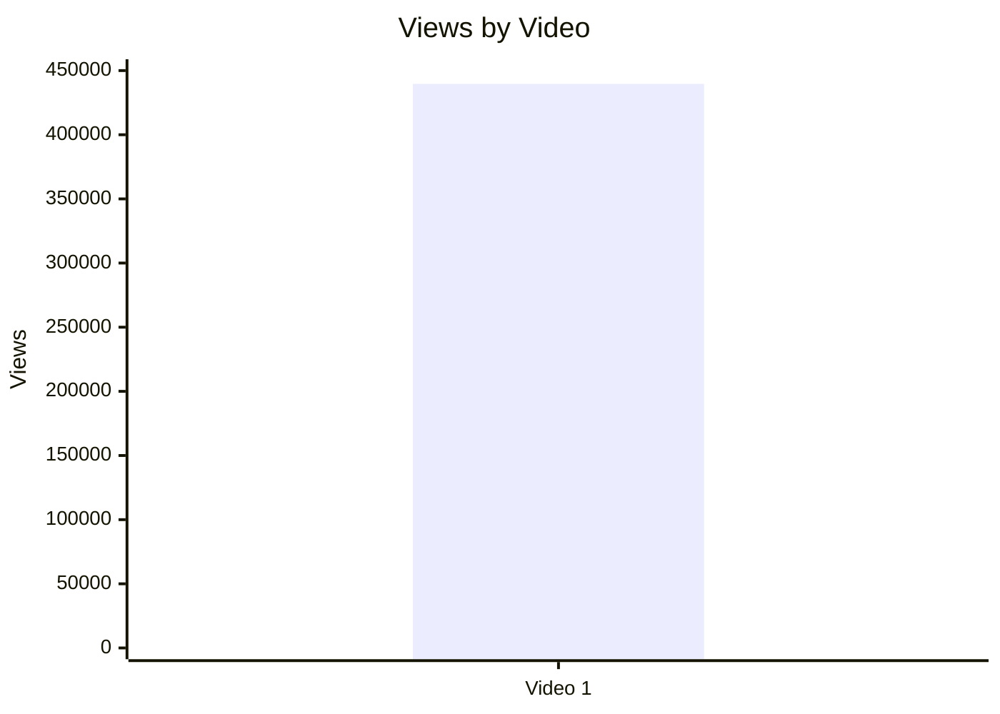

| Video | Views | Коментар |
|---|---:|---|
| Video 1 | 439676 | Raw reach без порівняльної когорти; outlier status = `INSUFFICIENT_DATA`. |

## 5.2. Views per day by video

- Назва графіка: Views per day by video
- Яке питання він відповідає: яка швидкість набору переглядів із поправкою на вік відео?
- Які поля використовуються: `video_label`, `views_per_day`
- Тип графіка: Mermaid bar chart
- Що видно з графіка: Video 1 має 459.91 views/day.
- Практичний висновок: показник можна використовувати як baseline для майбутніх відео формату `LONG_20_PLUS_MIN`.

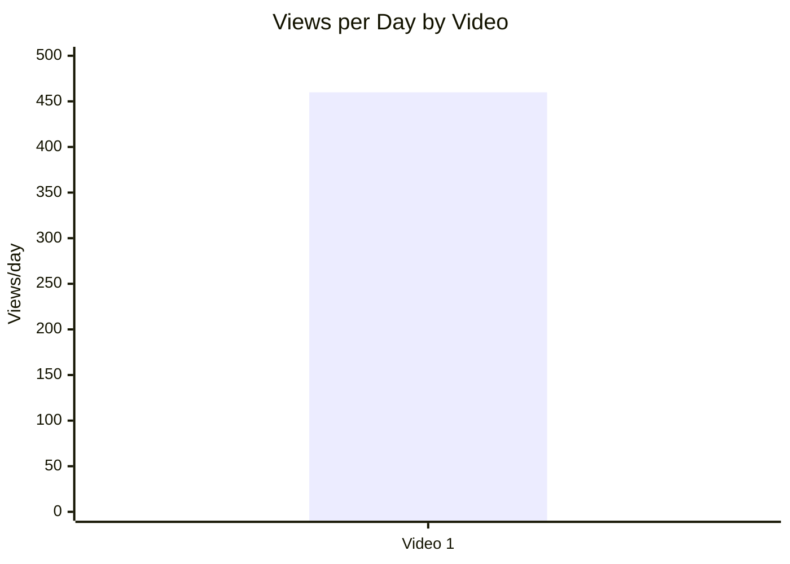

## 5.3. Views per 1k subscribers

- Назва графіка: Views per 1k subscribers
- Яке питання він відповідає: наскільки відео перетворює розмір каналу в перегляди?
- Які поля використовуються: `video_label`, `views_per_1k_subs`
- Тип графіка: Mermaid bar chart
- Що видно з графіка: Video 1 має 21552.75 views per 1k subs/followers.
- Практичний висновок: відео значно виходить за межі бази підписників/фоловерів, але без інших відео це не можна називати статистичним outlier.

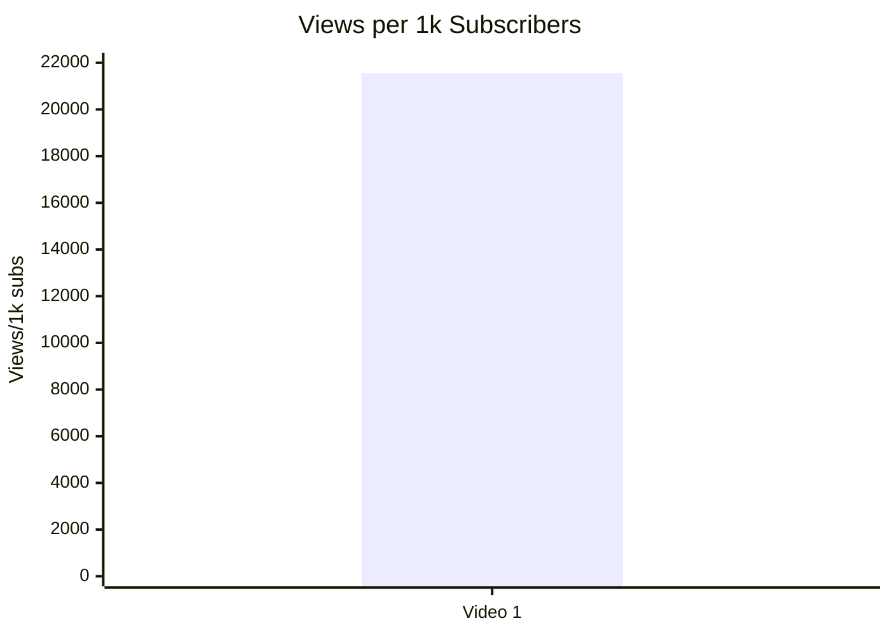

## 5.4. Performance quadrant

- Назва графіка: Performance quadrant
- Яке питання він відповідає: чи поєднує відео охоплення і залучення?
- Які поля використовуються: `views_per_day`, `er_public_percent`
- Тип графіка: scatter plot / quadrant template
- Що видно з графіка: для одного відео є лише одна точка: 459.91 views/day і 7.72% ER Public.
- Практичний висновок: графік варто будувати після додавання 5+ comparable long-form відео; зараз quadrant classification = `INSUFFICIENT_DATA`.

| Video | Views/day | ER Public % | Quadrant status |
|---|---:|---:|---|
| Video 1 | 459.91 | 7.72 | `INSUFFICIENT_DATA`: немає медіан/порогів когорти. |

## 6. Графіки залучення

## 6.1. ER Public % by video

- Назва графіка: ER Public % by video
- Яке питання він відповідає: наскільки сильне публічне залучення?
- Які поля використовуються: `video_label`, `er_public_percent`
- Тип графіка: Mermaid bar chart
- Що видно з графіка: Video 1 має ER Public 7.72%.
- Практичний висновок: це baseline для майбутніх відео; не оцінювати як “добре/погано” без когорти.

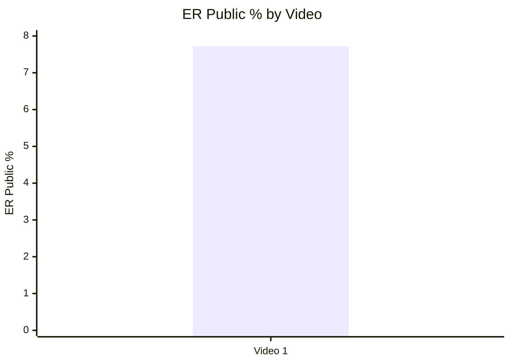

## 6.2. Like Rate % vs Comment Rate %

- Назва графіка: Like Rate % vs Comment Rate %
- Яке питання він відповідає: відео більше подобається чи провокує дискусію?
- Які поля використовуються: `like_rate_percent`, `comment_rate_percent`
- Тип графіка: scatter plot / table fallback
- Що видно з графіка: Video 1 має like rate 6.18% і comment rate 1.55%.
- Практичний висновок: відео одночасно отримує підтримку і сильну дискусію; для quadrant-висновків потрібна когорта.

| Video | Like Rate % | Comment Rate % | Попереднє читання |
|---|---:|---:|---|
| Video 1 | 6.18 | 1.55 | Сильна публічна реакція; без порівняння не класифікується. |

## 6.3. Comments per 1k views

- Назва графіка: Comments per 1k views
- Яке питання він відповідає: наскільки відео провокує коментарі на одиницю переглядів?
- Які поля використовуються: `video_label`, `comments_per_1k_views`
- Тип графіка: Mermaid bar chart
- Що видно з графіка: Video 1 має 15.45 comments per 1k views.
- Практичний висновок: це корисний baseline для вимірювання debate-trigger у наступних відео.

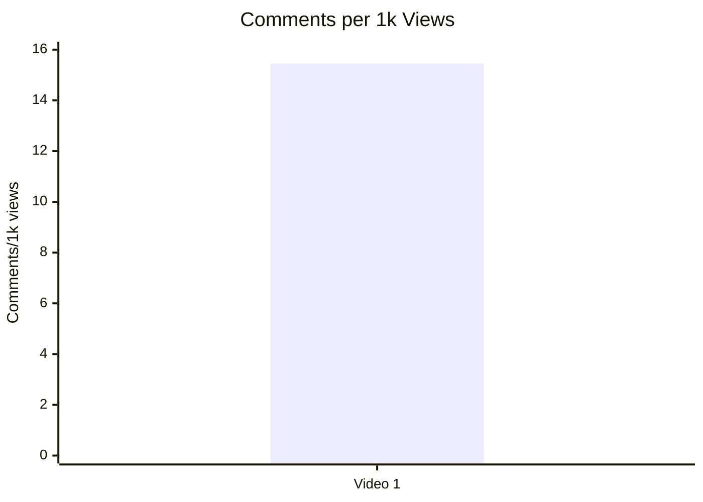

## 7. Графіки структури та hook

## 7.1. Hook score by video

- Назва графіка: Hook score by video
- Яке питання він відповідає: наскільки сильний hook за оцінкою YT_VIDEO_ANALYSIS_V1?
- Які поля використовуються: `video_label`, `hook_score`
- Тип графіка: Mermaid bar chart
- Що видно з графіка: Video 1 має hook score 4/5.
- Практичний висновок: hook є сильною стороною; тестувати скорочення вступу до першої цінності.

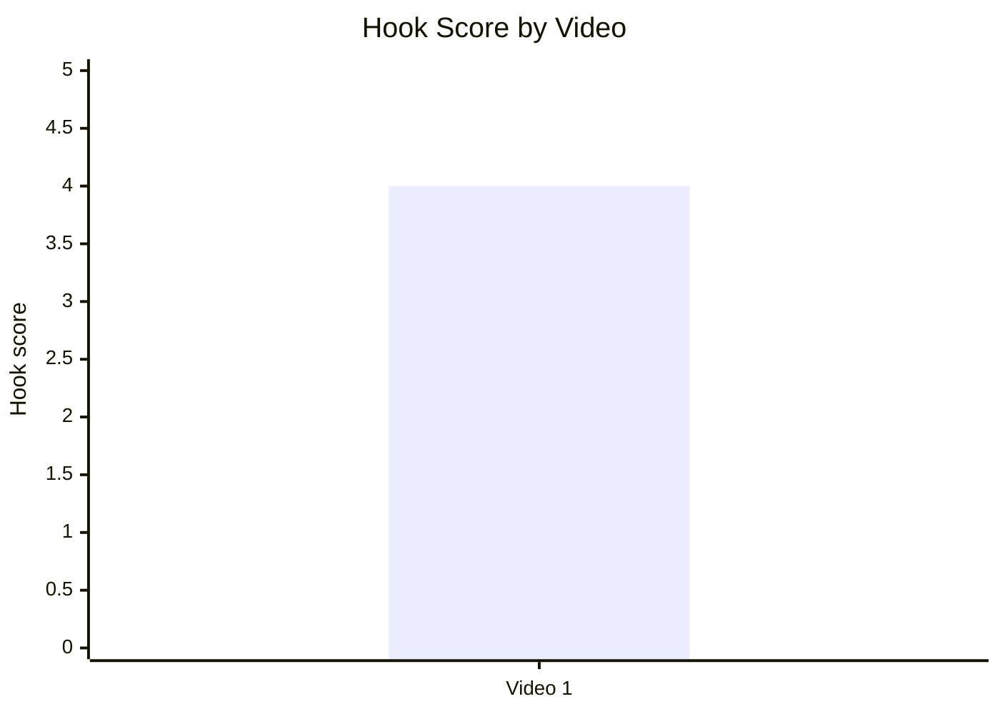

## 7.2. Hook type distribution

- Назва графіка: Hook type distribution
- Яке питання він відповідає: який primary hook type використовується?
- Які поля використовуються: `hook_primary_type`
- Тип графіка: Mermaid pie chart
- Що видно з графіка: 100% наявної вибірки — `CONFLICT`.
- Практичний висновок: не можна робити висновок, що `CONFLICT` працює краще за інші типи; потрібні інші відео для порівняння.

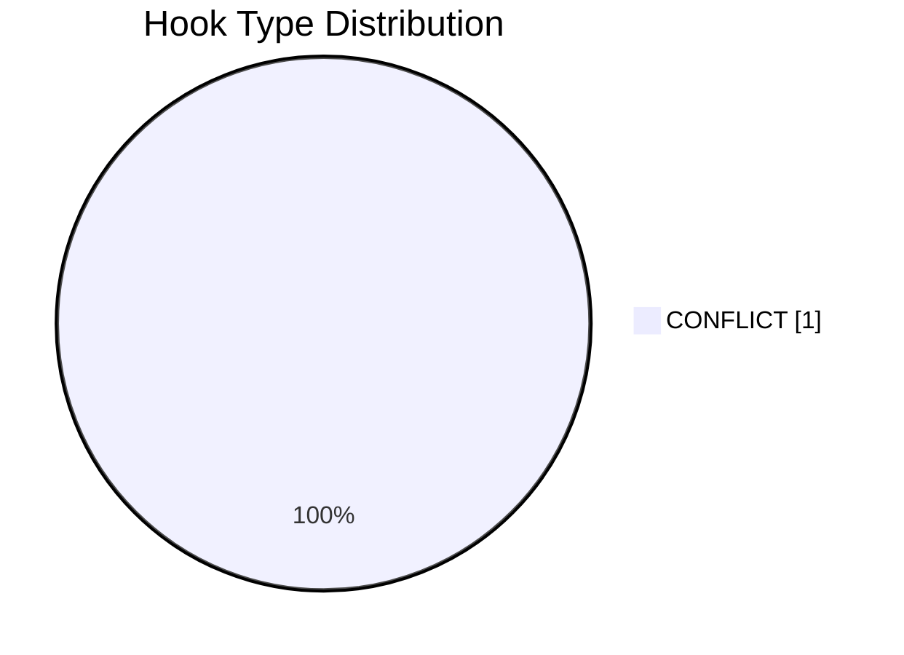

## 7.3. Time to first value vs Overall Score

- Назва графіка: Time to first value vs Overall Score
- Яке питання він відповідає: чи швидша перша цінність пов’язана з вищим результатом?
- Які поля використовуються: `time_to_first_value_seconds`, `overall_video_score`
- Тип графіка: scatter plot / table fallback
- Що видно з графіка: Video 1 має time to first value ≈ 107 сек і overall score 4.06.
- Практичний висновок: кореляцію не будувати; тест для наступних відео — перший proof block до 45 сек.

| Video | Time to first value seconds | Overall score | Status |
|---|---:|---:|---|
| Video 1 | 107 | 4.06 | `LOW_CONFIDENCE`: одна точка даних. |

## 8. Графіки CTA

## 8.1. CTA score by video

- Назва графіка: CTA score by video
- Яке питання він відповідає: наскільки сильна CTA-система відео?
- Які поля використовуються: `video_label`, `cta_score`
- Тип графіка: Mermaid bar chart
- Що видно з графіка: Video 1 має CTA score 3/5.
- Практичний висновок: CTA — середня зона; головні тести — comment prompt, pinned source hub, next-video bridge.

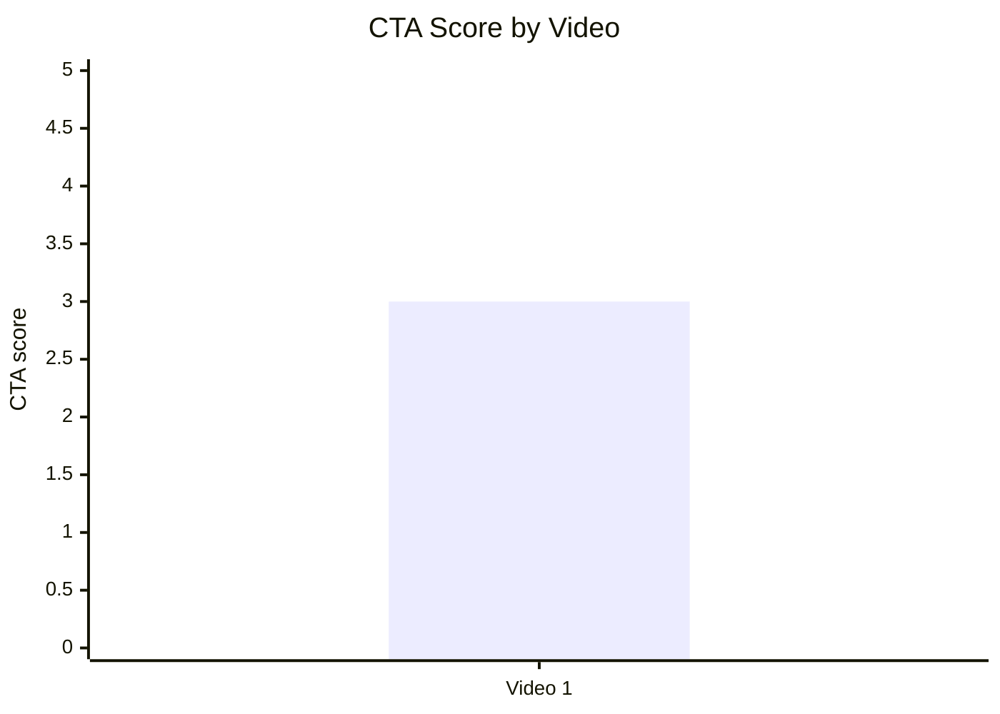

## 8.2. CTA count vs ER Public %

- Назва графіка: CTA count vs ER Public %
- Яке питання він відповідає: чи більше CTA пов’язано з вищим ER?
- Які поля використовуються: `cta_count`, `er_public_percent`
- Тип графіка: skipped / table fallback
- Що видно з графіка: `cta_count` як числове поле не винесено у Comparable Summary JSON.
- Практичний висновок: графік неможливо побудувати без стандартизованого `cta_count`; за наявними даними можна аналізувати лише CTA features.

| Video | CTA count | ER Public % | Status |
|---|---:|---:|---|
| Video 1 | N/A | 7.72 | `INSUFFICIENT_DATA`: cta_count не надано як структуроване поле. |

## 8.3. CTA features heatmap

- Назва графіка: CTA features heatmap
- Яке питання він відповідає: які CTA-механіки використані або відсутні?
- Які поля використовуються: `has_comment_prompt`, `has_subscribe_cta`, `has_like_cta`, `has_bell_cta`, `has_next_video_bridge`
- Тип графіка: matrix heatmap table
- Що видно з графіка: є subscribe CTA і next-video link/bridge у pinned/end-screen контексті, але немає comment prompt, like CTA, bell CTA.
- Практичний висновок: найшвидші покращення — додати явний comment prompt і вербальний next-video bridge.

| Video | Comment prompt | Subscribe | Like | Bell | Next video bridge |
|---|---|---|---|---|---|
| Video 1 | ❌ | ✅ | ❌ | ❌ | ✅ |

## 9. Графіки реклами / інтеграцій

Advertising graphs skipped: no advertising integrations detected.

| Video | Ad detected | Ad count | Ad load % | First ad position % | Ad integration score | Status |
|---|---|---:|---:|---:|---|---|
| Video 1 | NO | 0 | 0.0 | NOT_APPLICABLE | NOT_APPLICABLE | Рекламні графіки не будуються. |

## 10. Графіки аудіо

## 10.1. Audio score by video

- Назва графіка: Audio score by video
- Яке питання він відповідає: яка попередня оцінка аудіо?
- Які поля використовуються: `video_label`, `audio_score`
- Тип графіка: Mermaid bar chart
- Що видно з графіка: Video 1 має audio score 3/5.
- Практичний висновок: аудіо не виглядає головною силою; потрібен окремий ручний аудіо-аудит, бо score має `LOW_CONFIDENCE`.

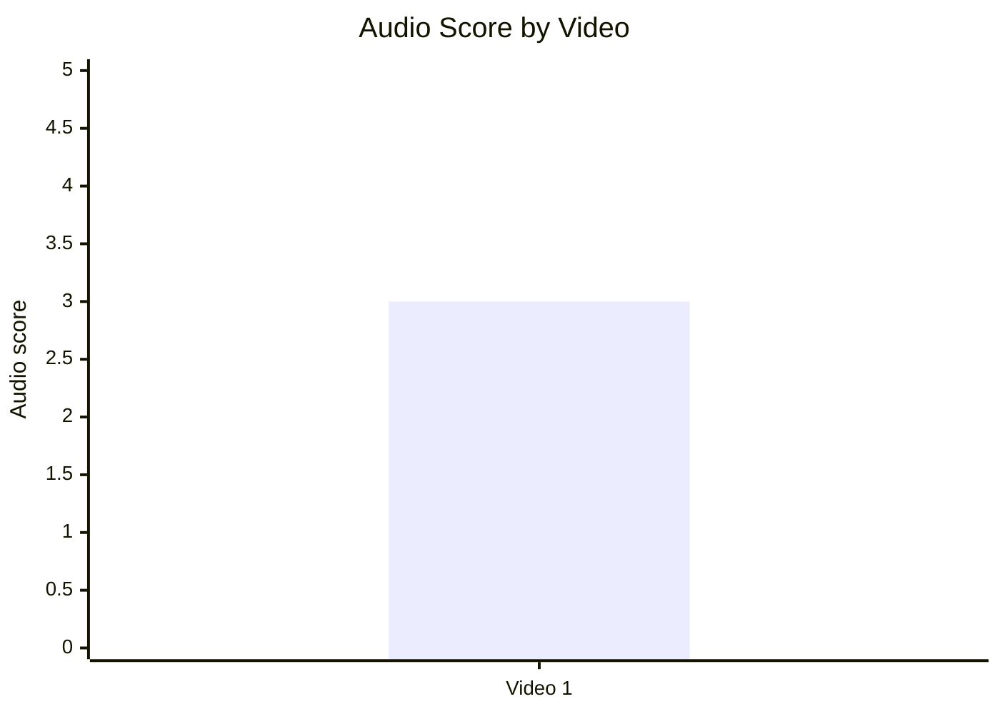

## 10.2. Audio score vs Overall Score

- Назва графіка: Audio score vs Overall Score
- Яке питання він відповідає: чи краща якість аудіо пов’язана з вищим загальним результатом?
- Які поля використовуються: `audio_score`, `overall_video_score`
- Тип графіка: scatter plot / table fallback
- Що видно з графіка: одна точка — audio 3, overall 4.06.
- Практичний висновок: зв’язок не визначається; для майбутніх звітів збирати standardized audio score.

| Video | Audio score | Overall score | Confidence |
|---|---:|---:|---|
| Video 1 | 3 | 4.06 | LOW_CONFIDENCE |

## 11. Графіки коментарів

## 11.1. Sentiment distribution

- Назва графіка: Sentiment distribution
- Яке питання він відповідає: яка структура реакції аудиторії?
- Які поля використовуються: qualitative sentiment levels з YT_VIDEO_ANALYSIS_V1
- Тип графіка: table fallback
- Що видно з графіка: positive/supportive = HIGH, negative/oppositional = HIGH, neutral/questions = MEDIUM, debate intensity = HIGH.
- Практичний висновок: відео створює resonance + controversy; для stacked bar потрібні відсотки sentiment, яких у звіті немає.

| Video | Positive/supportive | Negative/oppositional | Neutral/questions | Debate intensity | Status |
|---|---|---|---|---|---|
| Video 1 | HIGH | HIGH | MEDIUM | HIGH | Відсотки не надані; stacked bar = `INSUFFICIENT_DATA`. |

## 11.2. Comment resonance score by video

- Назва графіка: Comment resonance score by video
- Яке питання він відповідає: наскільки сильна реакція в коментарях?
- Які поля використовуються: `video_label`, `comment_resonance_score`
- Тип графіка: Mermaid bar chart
- Що видно з графіка: Video 1 має 5/5.
- Практичний висновок: коментарі — найсильніший score-компонент відео.

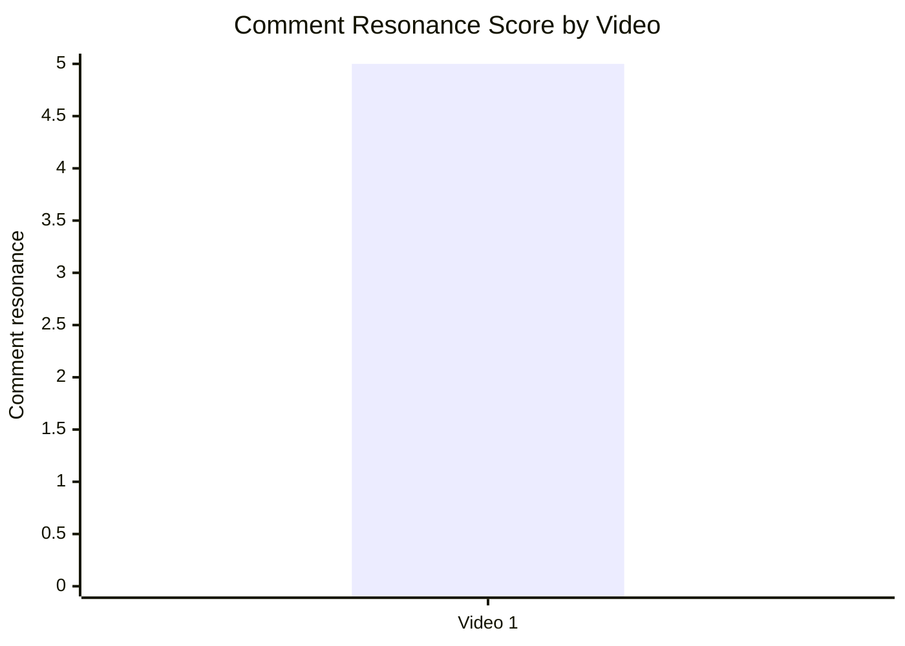

## 11.3. Top comment clusters

- Назва графіка: Top comment clusters
- Яке питання він відповідає: що найчастіше повторюється в коментарях?
- Які поля використовуються: cluster names і qualitative strength з Comment Analysis
- Тип графіка: table fallback
- Що видно з графіка: найбільші кластери мають силу HIGH: підтримка тези, перехід до поведінкової дії, дискусія/контраргументи, токсичні реакції.
- Практичний висновок: наступний контент варто будувати як серію відповідей на контраргументи та як source-backed FAQ.

| Cluster | Strength | Практичний висновок |
|---|---|---|
| Підтримка тези і подяка | HIGH | Зберігати ідентичнісну ясність і сильний promise. |
| Перехід до поведінкової дії | HIGH | CTA на мовну зміну працює як поведінковий payoff. |
| Дискусія та контраргументи | HIGH | Робити follow-up із топ-запереченнями. |
| Токсичні / образливі реакції | HIGH | Потрібна модераційна рамка та pinned comment із правилами/джерелами. |
| Запити на джерела / продовження | MEDIUM | Додати “джерельний штаб” і плейлист. |
| Реакція на CTA / поширення | MEDIUM | Посилити share CTA і next-video bridge. |
| Скарги на рекламу | LOW | Реклама не є проблемою цього відео. |

## 12. Графіки score-системи

## 12.1. Overall score by video

- Назва графіка: Overall score by video
- Яке питання він відповідає: наскільки сильне відео загалом?
- Які поля використовуються: `video_label`, `overall_video_score`
- Тип графіка: Mermaid bar chart
- Що видно з графіка: Video 1 має overall score 4.06/5.
- Практичний висновок: відео є сильним baseline у своїй когорті, але для рейтингу потрібні інші `LONG_20_PLUS_MIN` звіти.

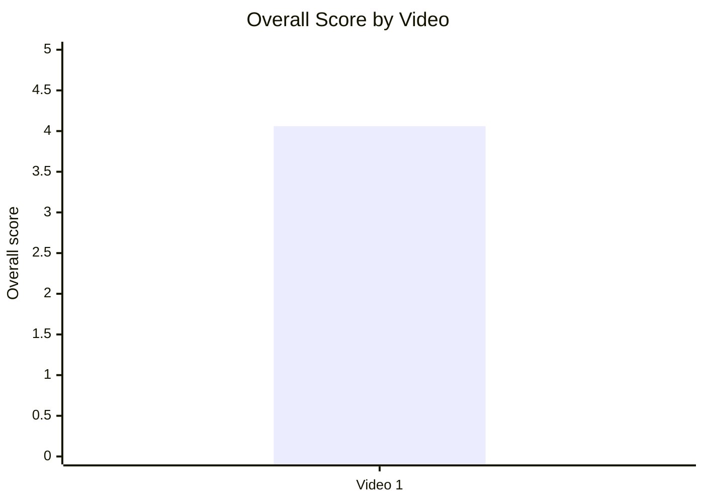

## 12.2. Score breakdown heatmap

- Назва графіка: Score breakdown heatmap
- Яке питання він відповідає: які компоненти сильні/слабкі?
- Які поля використовуються: score-блок YT_VIDEO_ANALYSIS_V1
- Тип графіка: heatmap matrix table
- Що видно з графіка: найсильніший компонент — Comments 5/5; найслабші доступні — Audio 3/5 і CTA 3/5.
- Практичний висновок: оптимізація має фокусуватись не на hook, а на CTA, end-screen bridge, pinned comment і аудіо/темповій перевірці.

| Video | Hook | Structure | Value Density | Audio | CTA | Ad | Comments | Replicability | Overall |
|---|---:|---:|---:|---:|---:|---:|---:|---:|---:|
| Video 1 | 4 | 4 | 4 | 3 | 3 | NOT_APPLICABLE | 5 | 4 | 4.06 |

## 12.3. Strengths vs weaknesses count

- Назва графіка: Strengths vs weaknesses count
- Яке питання він відповідає: скільки ключових success mechanics і missed opportunities зафіксовано?
- Які поля використовуються: `main_success_mechanics`, `main_missed_opportunities`
- Тип графіка: Mermaid bar chart
- Що видно з графіка: 5 success mechanics і 5 missed opportunities.
- Практичний висновок: потенціал відео високий, але існує стільки ж конкретних точок оптимізації.

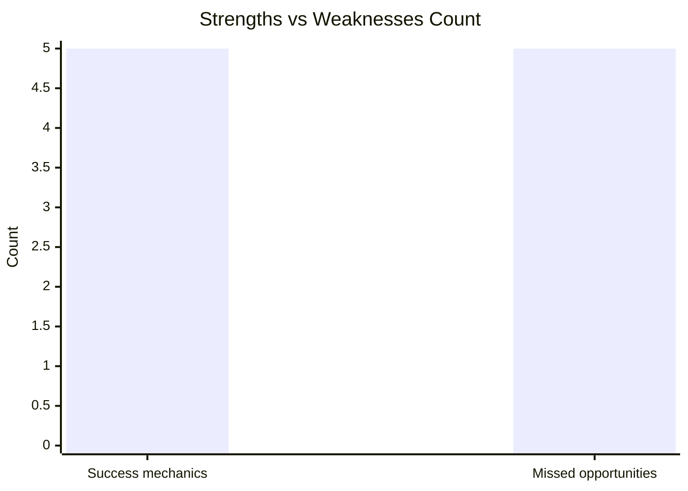

| Video | Success mechanics count | Missed opportunities count | Коментар |
|---|---:|---:|---|
| Video 1 | 5 | 5 | Сильна формула, але багато практичних оптимізацій для наступних відео. |

## 13. Кореляції та патерни

Correlation analysis skipped: fewer than 5 comparable videos.

| Pair | Correlation / Pattern | Strength | Interpretation | Confidence |
|---|---:|---|---|---|
| hook_score → overall_video_score | NOT_COMPARABLE | NOT_COMPARABLE | Лише 1 відео. | LOW |
| value_density_score → er_public_percent | NOT_COMPARABLE | NOT_COMPARABLE | Лише 1 відео. | LOW |
| cta_score → comment_rate_percent | NOT_COMPARABLE | NOT_COMPARABLE | Лише 1 відео. | LOW |
| comment_resonance_score → er_public_percent | NOT_COMPARABLE | NOT_COMPARABLE | Лише 1 відео. | LOW |
| views_per_day → er_public_percent | NOT_COMPARABLE | NOT_COMPARABLE | Лише 1 відео. | LOW |
| ad_load_percent → er_public_percent | NOT_APPLICABLE | NOT_APPLICABLE | Реклами немає. | LOW |
| time_to_first_value_seconds → overall_video_score | NOT_COMPARABLE | NOT_COMPARABLE | Лише 1 відео. | LOW |

## 14. Висновки для контент-стратегії

| Спостереження | Дані / графік | Що це означає | Що робити |
|---|---|---|---|
| Конфліктний hook є сильною стороною | Hook score 4/5; primary hook type `CONFLICT`; ER Public 7.72% | Тема з чіткою суперечкою створює увагу й реакцію. | Повторювати conflict/promise hook, але не робити висновок про універсальну ефективність без інших відео. |
| Коментарі — найсильніший компонент | Comment resonance 5/5; comments per 1k views 15.45 | Відео працює як debate trigger. | Запускати follow-up із відповідями на топ-контраргументи. |
| CTA-система має простір для росту | CTA score 3/5; no comment prompt; end-screen CTR 0.0% у вихідному аналізі | Реакція є, але вона недостатньо керована. | Додати pinned source hub, явний comment prompt і вербальний next-video bridge. |
| Рекламне навантаження не заважає | ad_count 0; ad_load 0.0% | Немає ризику ad fatigue у цьому відео. | Якщо додавати рекламу в майбутньому, тестувати тільки після першого payoff. |
| Time to first value можна скоротити | Time to first value ≈ 107 сек | Частина нових глядачів може не дочекатися першого proof block. | Тестувати перший доказ до 45 сек. |
| Score breakdown показує головні слабкі місця | Audio 3/5, CTA 3/5 проти Comments 5/5 | Оптимізація має бути не в темі, а в упаковці дій і утриманні. | Покращити CTA design, audio/tempo audit і структуру переходів. |

## 15. Що тестувати далі

| Тест | Гіпотеза | На яких даних базується | Як виміряти | Пріоритет |
|---|---|---|---|---|
| Перший proof block до 45 секунд | Швидший time-to-first-value може покращити retention і overall performance. | Поточний time to first value ≈ 107 сек; missed opportunity `OVERLONG_INTRO`. | Порівняти retention 0:00–2:00, views/day, ER Public %. | HIGH |
| Pinned comment як source hub | Структуровані джерела зменшать хаотичну критику і підсилять поширення. | `MISSING_PINNED_COMMENT_STRATEGY`; кластери коментарів із запитами на джерела. | Виміряти replies до pinned comment, saves/shares якщо доступно, comment quality вручну. | HIGH |
| Явний comment prompt | Конкретне питання переведе debate у корисніші коментарі. | `NO_COMMENT_PROMPT`; comment resonance 5/5, але токсичність HIGH. | Comment rate %, частка коментарів із відповіддю на prompt, токсичність. | HIGH |
| End-screen bridge | Вербальний перехід підніме переходи в наступне відео. | `NO_NEXT_VIDEO_BRIDGE`; end screen CTR 0.0% у вихідному аналізі. | End screen CTR, session views, views on linked follow-up. | HIGH |
| Серія відповідей на контраргументи | Повторювані objections можна конвертувати в серію. | `COMMENTS_SHOW_TOPIC_GAP`; кластери Рюриковичі/Новгород/карти/мова. | Views/day серії, comments per 1k views, підписки з серії. | HIGH |
| Audio/tempo audit | Підвищення clarity/listening comfort може допомогти довгому формату. | Audio score 3/5 з `LOW_CONFIDENCE`; відео 31:00. | AVD, retention slope, ручна оцінка аудіо 1–5 до/після. | MEDIUM |
| Міжнародний bridge на англомовну версію | Англомовна версія може посилити зовнішнє поширення. | Description містить англомовну версію; зовнішні джерела і діаспорні країни присутні у вихідному аналізі. | Clicks на description/pinned link, external traffic share, comments англійською. | MEDIUM |

## 16. Дані для експорту в таблицю / CSV

| video_label | title | format_group | views | views_per_day | like_rate_percent | comment_rate_percent | er_public_percent | views_per_1k_subs | hook_type | hook_score | cta_count | cta_score | ad_load_percent | ad_integration_score | audio_score | comment_resonance_score | overall_video_score | top_success_mechanic | top_missed_opportunity |
|---|---|---|---:|---:|---:|---:|---:|---:|---|---:|---:|---:|---:|---:|---:|---:|---:|---|---|
| Video 1 | 30 хвилин і ви назавжди перестанете називати Московію як Росія | LONG_20_PLUS_MIN | 439676 | 459.91 | 6.18 | 1.55 | 7.72 | 21552.75 | CONFLICT | 4 | N/A | 3 | 0.0 | NOT_APPLICABLE | 3 | 5 | 4.06 | CONTROVERSY_OR_DEBATE | OVERLONG_INTRO |