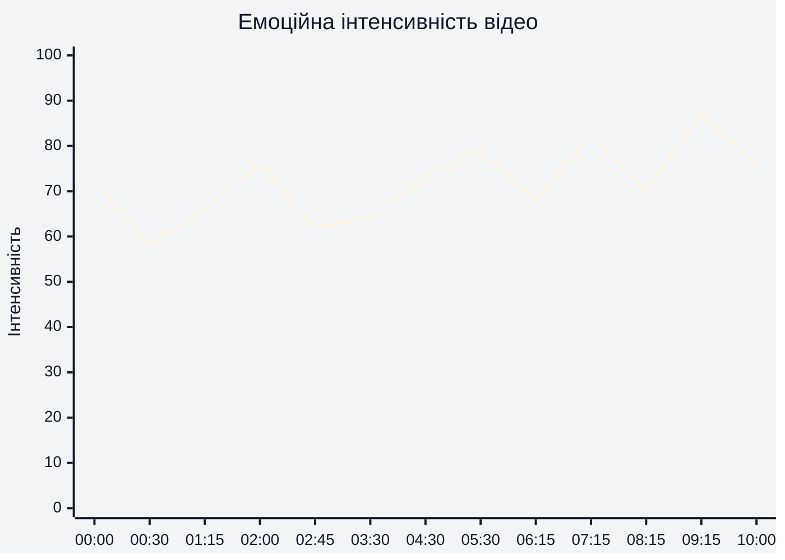
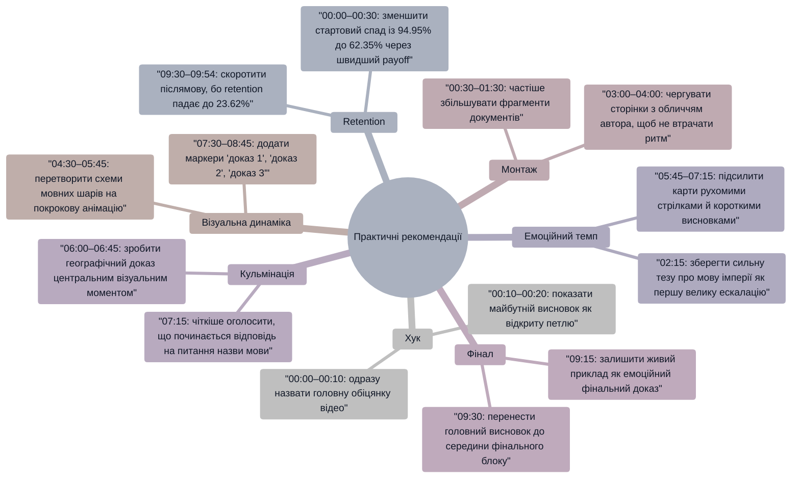

# Аналіз довгоформатного YouTube-відео

**Відео:** «Как угро-финны заговорили на славянском»  
**Тривалість:** 10:00  
**Retention-дані:** надано CSV з абсолютним показником збереження уваги аудиторії за позиціями 0–99% відео.  
**Транскрипт із таймкодами:** не надано, тому змістова розмітка побудована за відеорядом, екранними підписами, документальними вставками та реальною retention-кривою.  
**Тема:** історико-мовний розбір про назви «руський/русский язык», церковнослов’янську, болгарську, латинську та імперську мовну традицію.

## 1. Сюжетна дуга (Narrative Arc)

```mermaid
%%{init: {'theme':'base', 'themeVariables': {
'primaryColor':'#f3f4f6',
'primaryTextColor':'#111827',
'primaryBorderColor':'#2563eb',
'lineColor':'#2563eb',
'secondaryColor':'#ffffff',
'tertiaryColor':'#f3f4f6',
'background':'#f3f4f6'
}}}%%
flowchart LR
    A["00:00–00:30<br/>Хук<br/>Провокаційна постановка: руський, український і латинь показані як конфлікт назв і походження"]
    B["00:30–01:30<br/>Експозиція<br/>Через старі тексти й рукописи пояснюється, що ключова проблема — не лише мова, а назва мови"]
    C["01:30–02:45<br/>Перша ескалація<br/>Теза посилюється підписами про те, що московити не розуміють справжній руський язик"]
    D["02:45–03:45<br/>Переломний момент<br/>Автор переходить від полеміки до авторитетних джерел і академічних матеріалів"]
    E["03:45–05:45<br/>Наростання напруги<br/>З’являються сторінки з виділеннями, образи діячів і блок про імперську мову та болгарський/церковнослов’янський шар"]
    F["05:45–07:30<br/>Кульмінація<br/>Через карти, етнічні зони та схему 'угро-фінни' пояснюється, як мова імперії відривається від локального мовного ґрунту"]
    G["07:30–09:15<br/>Розв’язка<br/>Словники, граматики й назви мови збирають аргументи в одну лінію: як правильно називати мову імперії"]
    H["09:15–10:00<br/>Фінальний висновок<br/>Приклад із розмовним відео про болгарський/московський закріплює тезу через контраст живої мови й історичної назви"]
    A --> B --> C --> D --> E --> F --> G --> H
```



## 2. Ключові Story Beats

```mermaid
%%{init: {'theme':'base', 'themeVariables': {
'primaryColor':'#f3f4f6',
'primaryTextColor':'#111827',
'primaryBorderColor':'#2563eb',
'lineColor':'#2563eb',
'secondaryColor':'#ffffff',
'tertiaryColor':'#f3f4f6',
'background':'#f3f4f6'
}}}%%
flowchart LR
    B1["00:00<br/>Старт із провокаційним кадром<br/>Функція: миттєво задати конфлікт і тему ідентичності мови"]
    B2["00:15<br/>Поява старого лексикону/рукопису<br/>Функція: перевести глядача від емоції до доказової бази"]
    B3["01:15<br/>Виділені фрагменти документа<br/>Функція: показати, що теза спирається на конкретний текст, а не лише на думку автора"]
    B4["01:45<br/>Титр про сучасну вимову 'Руського языка'<br/>Функція: зробити тезу зрозумілою через порівняння звучання"]
    B5["02:15<br/>Формула 'язык империи на 55%'<br/>Функція: підняти ставку й змістити тему в бік імперської конструкції"]
    B6["02:45–03:30<br/>Академічні джерела й сторінки з підкресленнями<br/>Функція: легітимізувати аргумент через авторитетні посилання"]
    B7["04:00–04:45<br/>Блок про болгарський і церковнослов’янський вплив<br/>Функція: пояснити механізм походження імперської мови"]
    B8["05:00–05:45<br/>Схема 'місцевий — латинь — церковнослов’янський'<br/>Функція: спростити складний історичний процес візуальною моделлю"]
    B9["06:00–06:45<br/>Карти й етнічні території<br/>Функція: дати географічне пояснення мовного зсуву"]
    B10["07:15–08:15<br/>Титр 'як назвати язик імперії' та старі словники<br/>Функція: підвести до головної відповіді відео"]
    B11["08:45–09:15<br/>Блок 'Руський язик — прародитель' і граматика<br/>Функція: зв’язати початковий хук із доказами фінальної частини"]
    B12["09:15–10:00<br/>Фінальний приклад із дискусією про болгарський/московський<br/>Функція: завершити відео живим прикладом і дати запам’ятовуваний фінальний акцент"]
    B1 --> B2 --> B3 --> B4 --> B5 --> B6 --> B7 --> B8 --> B9 --> B10 --> B11 --> B12
```



## 3. Емоційний темп



**Висновок:** емоційна крива стартує високо на 00:00 через провокаційний хук, просідає до 00:30, коли починається пояснювальна частина, знову піднімається на 02:15 через формулу про «язык империи на 55%», досягає сильного напруження на 05:45–07:15 через карти й блок про угро-фінський контекст, а найсильніше фінальне підсилення відбувається на 09:15–10:00 через живий приклад із порівнянням «болгарський/московський».

## 4. Утримання аудиторії

```mermaid
%%{init: {'theme':'base', 'themeVariables': {
'primaryColor':'#f3f4f6',
'primaryTextColor':'#111827',
'primaryBorderColor':'#2563eb',
'lineColor':'#2563eb',
'secondaryColor':'#ffffff',
'tertiaryColor':'#f3f4f6',
'background':'#f3f4f6'
}}}%%
xychart-beta
    title "Реальна крива утримання аудиторії"
    x-axis ['00:00', '00:30', '01:00', '01:30', '01:42', '02:00', '02:30', '03:00', '03:30', '04:00', '04:30', '04:48', '05:00', '05:30', '06:00', '06:36', '07:00', '07:36', '08:00', '08:30', '09:00', '09:12', '09:30', '09:54']
    y-axis "Retention, %" 0 --> 100
    line [94.95, 62.35, 54.32, 50.02, 50.53, 47.2, 45.19, 43.42, 42.07, 41.14, 40.75, 41.39, 40.28, 38.35, 38.25, 38.94, 37.16, 37.05, 35.05, 34.47, 34.11, 34.98, 32.15, 23.62]
```

**Висновок:** retention-дані реальні, а не прогнозовані. Найбільший спад відбувається у перші 30 секунд: з 94.95% на 00:00 до 62.35% на 00:30. Після 01:30 крива стабілізується близько 50%, локально підсилюється на 01:42 до 50.53%, тримається відносно рівно в доказовому блоці 03:00–05:00, має невелике відновлення на 04:48 до 41.39%, тримається в зоні 38–39% на 06:00–06:36, а фінальний спад посилюється після 09:30: з 32.15% на 09:30 до 23.62% на 09:54.

## 5. Піки retention

| Таймкод | Подія | Чому це може утримувати увагу | Сила піку 1–10 |
|---|---|---|---:|
| 01:42 | Титр про те, як звучить сучасний «Руський языкъ» | Після стартового падіння глядач отримує чітку, просту формулу конфлікту; retention локально піднімається до 50.53% | 7 |
| 02:30 | Поява експертного/академічного джерела після тези про «язык империи» | Автор переходить від провокації до доказу, що знижує скепсис і стабілізує перегляд на 45.19% | 6 |
| 04:48 | Візуальний блок зі Святославом, Іваном Грозним і схемою мовних шарів | Змінюється візуальний ритм: портрети, ілюстрації та схема допомагають втримати складний історичний матеріал | 6 |
| 06:36 | Карта з історико-географічним поясненням | Географічна візуалізація дає нову опору для аргументу; retention піднімається до 38.94% після попереднього плато | 6 |
| 07:36 | Старі словники й сторінки з термінами «руський/московитський» | Глядач отримує конкретні назви й джерела, що повертає відчуття доказовості після карт | 5 |
| 09:12 | Початок фінального прикладу з розмовним відео | Замість документів з’являється живий фрагмент, що створює фінальний контраст і локальне відновлення до 34.98% | 7 |

## 6. Провали retention

| Таймкод | Проблема | Ймовірна причина спаду | Що покращити |
|---|---|---|---|
| 00:06 | Різкий спад із 94.95% до 83.35% | Хук провокаційний, але глядач ще не отримує достатньо швидкої обіцянки користі або плану відео | У 00:00–00:10 додати чітку обіцянку: «за 10 хвилин покажу 3 джерела, чому назва мови змінилася» |
| 00:12 | Спад до 76.87% | Перехід до старих текстів може бути різким для глядача, який очікував швидшої відповіді | На 00:10–00:15 вставити короткий прев’ю-кадр майбутнього висновку з 07:15–08:15 |
| 00:30 | Спад до 62.35% | Пояснення через рукописи потребує концентрації, але емоційна ставка після хука тимчасово зменшується | Додати мікроконфлікт на 00:25–00:35: «ось тут і починається підміна назви» |
| 05:30 | Просідання до 38.35% | Блок про місцеву мову, латинь і церковнослов’янський шар стає абстрактним | На 05:15–05:45 додати коротку таблицю «місцева мова / мова церкви / мова імперії» |
| 08:30 | Просідання до 34.47% | Друга половина словникових джерел може сприйматися як повтор уже доведеного аргументу | На 08:15–08:45 скоротити повтори або вставити підсумковий контраргумент опонента |
| 09:30–09:54 | Фінальний спад із 32.15% до 23.62% | Після головного висновку частина аудиторії відчуває завершення й виходить до фактичного кінця | Перенести найсильніший фінальний висновок на 09:20–09:30, а CTA або післямову зробити коротшою |

## 7. Оцінка сегментів

| Сегмент | Таймкод | Функція | Емоційна інтенсивність | Ризик втрати уваги | Оцінка 1–10 | Що покращити |
|---|---|---|---:|---|---:|---|
| Хук і теза | 00:00–00:30 | Захопити увагу через конфлікт назв «руський/український/латинь» | 72 | Високий: retention падає до 62.35% | 7 | Швидше назвати результат, який глядач отримає до 10:00 |
| Джерельна експозиція | 00:30–01:30 | Пояснити, що проблема лежить у старих текстах і термінах | 60 | Середній: багато дрібного тексту на екрані | 6 | Додати прості підписи поверх джерел на 00:45–01:15 |
| Полемічна ескалація | 01:30–02:15 | Посилити тезу через підпис «москвиты не понимают…» | 76 | Низько-середній: є чіткий конфлікт | 8 | Залишити, але скоротити паузи між тезою й прикладом |
| Академічне обґрунтування | 02:15–03:45 | Підкріпити тезу авторитетними джерелами | 64 | Середній: доказова частина менш емоційна | 7 | Чергувати сторінки з короткими висновками автора кожні 15–20 секунд |
| Болгарський/церковнослов’янський блок | 03:45–05:45 | Пояснити походження імперської мови через історичний шар | 77 | Середній: тема складна, retention близько 40% | 8 | На 04:00–04:45 вивести одну головну тезу великим текстом |
| Географічна кульмінація | 05:45–07:15 | Показати мапи, території й угро-фінський контекст | 80 | Середній: карти втримують, але пояснення щільне | 8 | На 06:00–06:45 додати стрілки або анімацію руху впливів |
| Відповідь через назви й словники | 07:15–09:15 | Зібрати аргумент у відповідь: як називати мову імперії | 74 | Середньо-високий: можливе відчуття повтору | 7 | Скоротити другорядні джерела й чіткіше маркувати «доказ 1/2/3» |
| Фінальний приклад | 09:15–10:00 | Закріпити тезу живим контрастом «болгарський/московський» | 87 | Високий наприкінці: retention падає до 23.62% | 7 | Стиснути фінал і винести головний punchline до 09:30 |

## 8. Практичні рекомендації



## 9. Підсумкова оцінка

| Показник | Оцінка 1–10 | Коментар |
|---|---:|---|
| Сюжетна дуга | 8 | На 00:00 є сильна провокаційна теза, на 05:45–07:15 є кульмінаційний історико-географічний блок, а на 09:15–10:00 є фінальний приклад; слабке місце — різкий стартовий спад до 00:30. |
| Story Beats | 8 | Відео має 10+ помітних сюжетних точок: від старих текстів на 00:15–01:15 до словників на 07:30–08:15 і живого прикладу на 09:15. |
| Емоційний темп | 7 | Темп добре зростає на 02:15, 05:45 і 09:15, але доказові блоки 03:00–04:00 та 08:15–08:45 можуть відчуватися рівними. |
| Retention Structure | 6 | Реальна крива має сильний ранній спад: 94.95% на 00:00, 62.35% на 00:30 і 54.32% на 01:00; після цього структура стабілізується, але фінал падає до 23.62% на 09:54. |
| Загальна оцінка | 7 | Відео має сильну тему, чіткий конфлікт і багато доказів, але потребує швидшого payoff у 00:00–00:30, компактнішого фіналу 09:30–10:00 і візуального спрощення складних джерельних сегментів. |
