# Статистичний аналіз відеозвітів

## 1. Короткий executive summary

| Пункт | Висновок |
|---|---|
| Скільки відео проаналізовано | 1 |
| Скільки форматів відео | 1: `LONG_10_20_MIN` |
| Найсильніше відео за overall score | Video 1 — `3.72 / 5` |
| Найсильніше відео за ER Public % | Video 1 — `17.17%` |
| Найсильніше відео за views per day | Video 1 — `59.60` |
| Найсильніша повторювана механіка | `INSUFFICIENT_DATA`: повторюваність неможливо оцінити на 1 відео. Для цього відео головна механіка — `CONTROVERSY_OR_DEBATE`. |
| Найчастіша слабкість | `INSUFFICIENT_DATA`: частотність неможливо оцінити на 1 відео. Для цього відео топ-слабкість — `COMMENTS_SHOW_TOPIC_GAP`. |
| Головна стратегічна можливість | Перетворити конфліктну тему з високим comment rate у серію: follow-up з відповідями на головні заперечення + pinned comment із джерелами. |
| Рівень впевненості | LOW |

Дані взяті тільки з прикріпленого звіту `YT_VIDEO_ANALYSIS_V1`. Відео не переаналізовувалось з нуля.

## 2. Якість і повнота даних

| Поле | Кількість відео з даними | Кількість N/A | Коментар |
|---|---:|---:|---|
| views | 1 | 0 | Є: `41 901`. |
| likes | 1 | 0 | Є: `2 954`. |
| comments_count | 1 | 0 | Є: `4 241`. |
| views_per_day | 1 | 0 | Є: `59.60`. |
| er_public_percent | 1 | 0 | Є: `17.17%`. |
| views_per_1k_subs | 1 | 0 | Є: `2 053.97`. |
| hook_score | 1 | 0 | Є: `4 / 5`. |
| cta_score | 1 | 0 | Є: `3 / 5`. |
| ad_integration_score | 0 | 1 | `NOT_APPLICABLE`: реклами не виявлено. |
| audio_score | 1 | 0 | Є: `4 / 5`. |
| comment_resonance_score | 1 | 0 | Є: `5 / 5`. |
| overall_video_score | 1 | 0 | Є: `3.72 / 5`. |

### Обмеження аналізу

- Вибірка містить лише 1 відео, тому всі висновки мають статус `LOW_CONFIDENCE`.
- Кореляції не будуються: `Correlation analysis skipped: fewer than 5 comparable videos`.
- Формат один — `LONG_10_20_MIN`, тому проблема змішування Shorts / long-form / live відсутня.
- Багато структурних часових полів мають `NO_TIMECODES`, тому графіки за точним `time_to_first_value_seconds` неможливі.
- Коментарі у вихідному аналізі мають `PARTIAL_DATA`: 3 306 розпізнаних блоків при публічному лічильнику 4 241.
- Реклами не виявлено, тому рекламні графіки не будуються як порівняльні.

## 3. Підготовлена таблиця для графіків

| Video | Format | Views | Views/day | Like Rate % | Comment Rate % | ER Public % | Views/1k subs | Hook | CTA | Ad | Audio | Comment Resonance | Overall |
|---|---|---:|---:|---:|---:|---:|---:|---:|---:|---:|---:|---:|---:|
| Video 1 | LONG_10_20_MIN | 41901 | 59.60 | 7.05 | 10.12 | 17.17 | 2053.97 | 4 | 3 | N/A | 4 | 5 | 3.72 |

| Label | Full title | URL |
|---|---|---|
| Video 1 | Как угро-финны заговорили на славянском? | https://www.youtube.com/watch?v=Fj0BdPitFug |

## 4. Рекомендовані графіки

| # | Назва графіка | Тип графіка | Поля | Для чого потрібен | Пріоритет |
|---:|---|---|---|---|---|
| 1 | Overall score by video | Mermaid bar chart | `overall_video_score` | Швидко побачити загальну оцінку відео | HIGH |
| 2 | Views per day by video | Mermaid bar chart | `views_per_day` | Оцінити нормалізовану швидкість набору переглядів | HIGH |
| 3 | ER Public % by video | Mermaid bar chart | `er_public_percent` | Оцінити публічне залучення | HIGH |
| 4 | ER Public % vs Views/day | Таблиця / scatter неможливий повноцінно | `er_public_percent`, `views_per_day` | Побачити баланс охоплення і реакції | HIGH |
| 5 | Hook score by video | Mermaid bar chart | `hook_score` | Оцінити силу hook | HIGH |
| 6 | CTA score by video | Mermaid bar chart | `cta_score` | Оцінити CTA-систему | HIGH |
| 7 | Score breakdown heatmap | Matrix table | score-поля | Побачити сильні/слабкі сторони | HIGH |
| 8 | Sentiment distribution | Mermaid pie + таблиця | `positive_percent`, `negative_percent`, `mixed_percent`, `neutral_percent`, `question_percent`, `request_percent`, `joke_meme_percent` | Побачити структуру реакції аудиторії | HIGH |
| 9 | CTA features heatmap | Matrix table | CTA boolean fields | Побачити, які CTA є / відсутні | HIGH |
| 10 | Ad load % by video | Mermaid bar chart | `ad_load_percent` | Показати рекламне навантаження | LOW |

## 5. Графіки продуктивності

## 5.1. Views by video

- Назва графіка: `Views by video`
- Яке питання він відповідає: яке відео має найбільший raw reach.
- Які поля використовуються: `video_label`, `views`.
- Тип графіка: Mermaid bar chart.
- Що видно з графіка: є лише одне відео з `41 901` переглядом.
- Практичний висновок: raw reach корисний як базова точка, але без інших відео та без нормалізації не можна визначити outlier або benchmark.

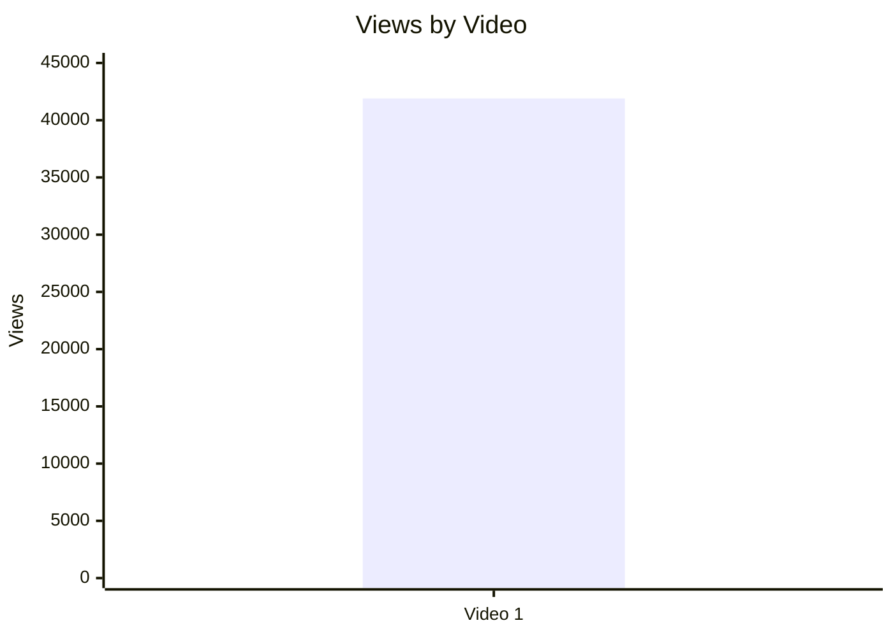

| Video | Views | Interpretation |
|---|---:|---|
| Video 1 | 41901 | Єдиний об’єкт аналізу; outlier status = `INSUFFICIENT_DATA`. |

## 5.2. Views per day by video

- Назва графіка: `Views per day by video`
- Яке питання він відповідає: яка швидкість набору переглядів із поправкою на вік відео.
- Які поля використовуються: `video_label`, `views_per_day`.
- Тип графіка: Mermaid bar chart.
- Що видно з графіка: `59.60` переглядів/день.
- Практичний висновок: це довгострокова середня швидкість за 703 дні; для оцінки стартового performance потрібні інші відео або дані перших 24/48/72 годин.

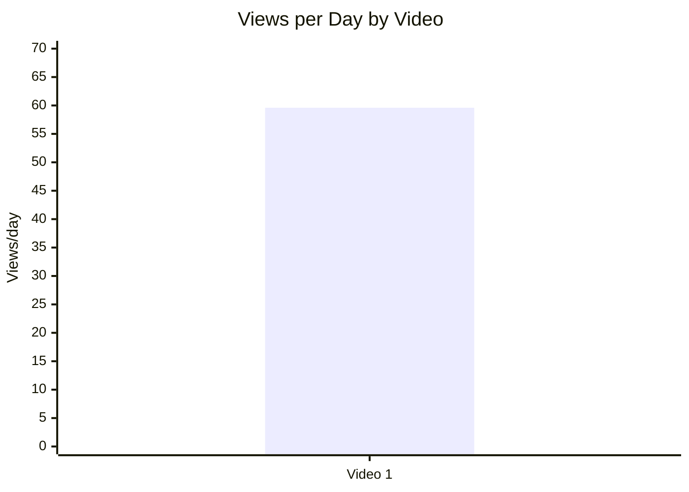

## 5.3. Views per 1k subscribers

- Назва графіка: `Views per 1k subscribers`
- Яке питання він відповідає: наскільки відео конвертує розмір каналу в перегляди.
- Які поля використовуються: `video_label`, `views_per_1k_subs`.
- Тип графіка: Mermaid bar chart.
- Що видно з графіка: `2 053.97` views / 1k subs.
- Практичний висновок: відео отримало переглядів більше, ніж кількість підписників, нормована на 1k; без когорти не можна назвати це добрим чи поганим benchmark.

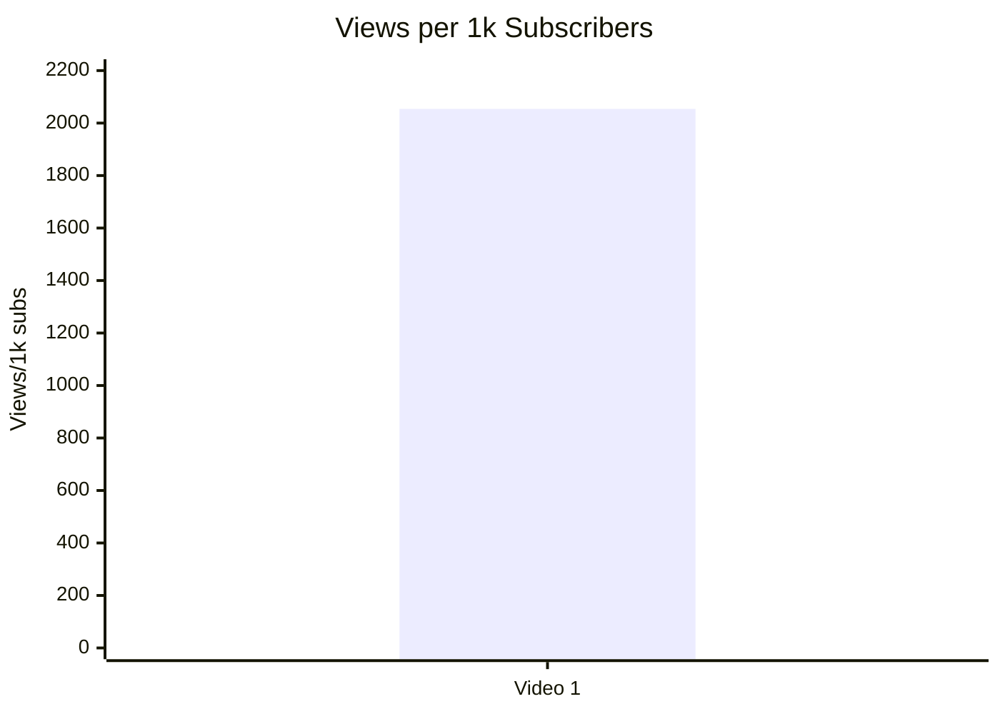

## 5.4. Performance quadrant

- Назва графіка: `Performance quadrant`
- Яке питання він відповідає: чи має відео одночасно reach-speed і engagement.
- Які поля використовуються: `views_per_day`, `er_public_percent`.
- Тип графіка: scatter / quadrant.
- Що видно з графіка: повноцінний quadrant неможливий, бо є тільки 1 точка і немає median/benchmark.
- Практичний висновок: Video 1 можна зафіксувати як базову точку для майбутніх порівнянь: `views_per_day = 59.60`, `ER Public = 17.17%`.

| Video | Views/day | ER Public % | Quadrant status |
|---|---:|---:|---|
| Video 1 | 59.60 | 17.17 | `INSUFFICIENT_DATA`: немає порогів high/low без ≥2–5 відео або benchmark. |

## 6. Графіки залучення

## 6.1. ER Public % by video

- Назва графіка: `ER Public % by video`
- Яке питання він відповідає: який рівень публічного залучення має відео.
- Які поля використовуються: `video_label`, `er_public_percent`.
- Тип графіка: Mermaid bar chart.
- Що видно з графіка: `ER Public = 17.17%`.
- Практичний висновок: ER сформований значною мірою коментарями, тому це сигнал дискусійності, а не автоматично позитивної реакції.

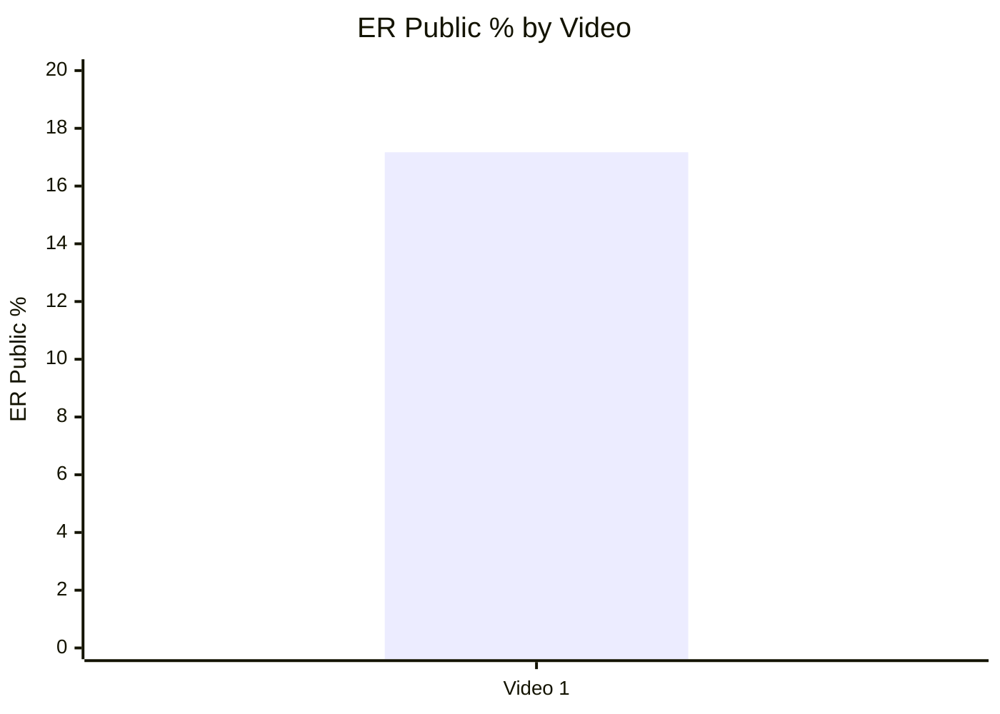

## 6.2. Like Rate % vs Comment Rate %

- Назва графіка: `Like Rate % vs Comment Rate %`
- Яке питання він відповідає: чи залучення більше схоже на позитивну підтримку або на дискусію.
- Які поля використовуються: `like_rate_percent`, `comment_rate_percent`.
- Тип графіка: scatter plot; для 1 відео — таблиця точки.
- Що видно з графіка: `comment_rate_percent = 10.12%` вищий за `like_rate_percent = 7.05%`.
- Практичний висновок: реакція більше дискусійна/полемічна, ніж просто лайкова.

| Video | Like Rate % | Comment Rate % | Interpretation |
|---|---:|---:|---|
| Video 1 | 7.05 | 10.12 | High comment behavior relative to likes; тема провокує дискусію. |

## 6.3. Comments per 1k views

- Назва графіка: `Comments per 1k views`
- Яке питання він відповідає: скільки коментарів відео генерує на 1 000 переглядів.
- Які поля використовуються: `video_label`, `comments_per_1k_views`.
- Тип графіка: Mermaid bar chart.
- Що видно з графіка: `101.21` comments / 1k views.
- Практичний висновок: коментарі — головний engagement driver цього відео.

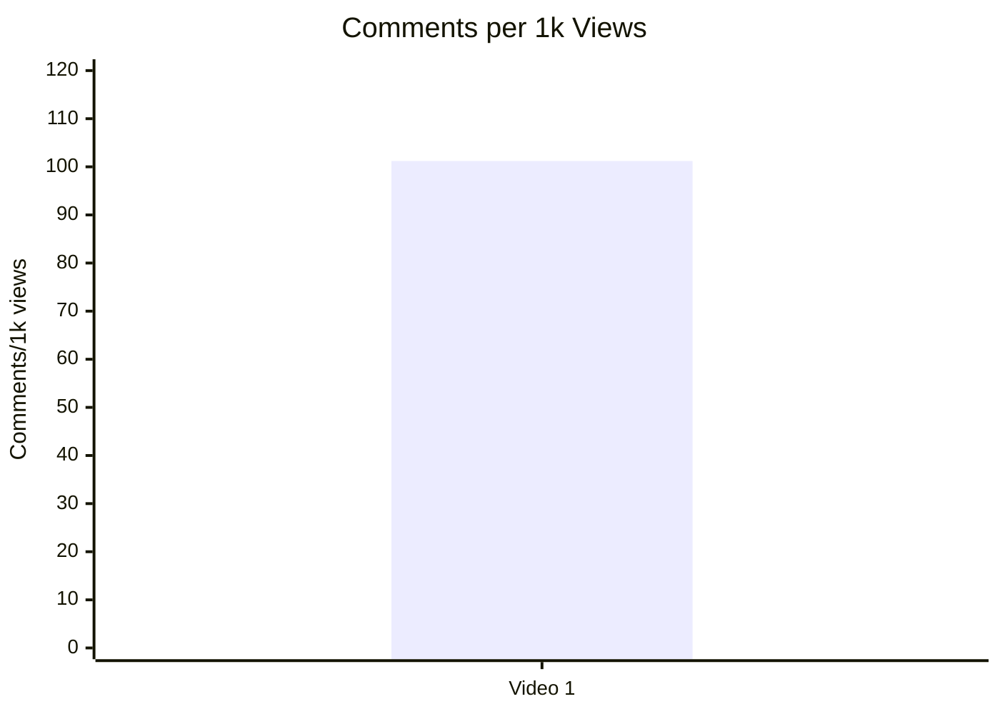

## 7. Графіки структури та hook

## 7.1. Hook score by video

- Назва графіка: `Hook score by video`
- Яке питання він відповідає: наскільки сильний hook.
- Які поля використовуються: `video_label`, `hook_score`.
- Тип графіка: Mermaid bar chart.
- Що видно з графіка: hook score = `4 / 5`.
- Практичний висновок: thesis-first conflict hook варто зберегти як механіку для тестів.


## 7.2. Hook type distribution

- Назва графіка: `Hook Type Distribution`
- Яке питання він відповідає: які типи hook використовуються.
- Які поля використовуються: `hook_primary_type`, count.
- Тип графіка: Mermaid pie chart.
- Що видно з графіка: у вибірці є лише `CONFLICT`.
- Практичний висновок: на одному відео не можна сказати, що `CONFLICT` працює краще за інші типи; можна лише винести його в гіпотезу для серії.

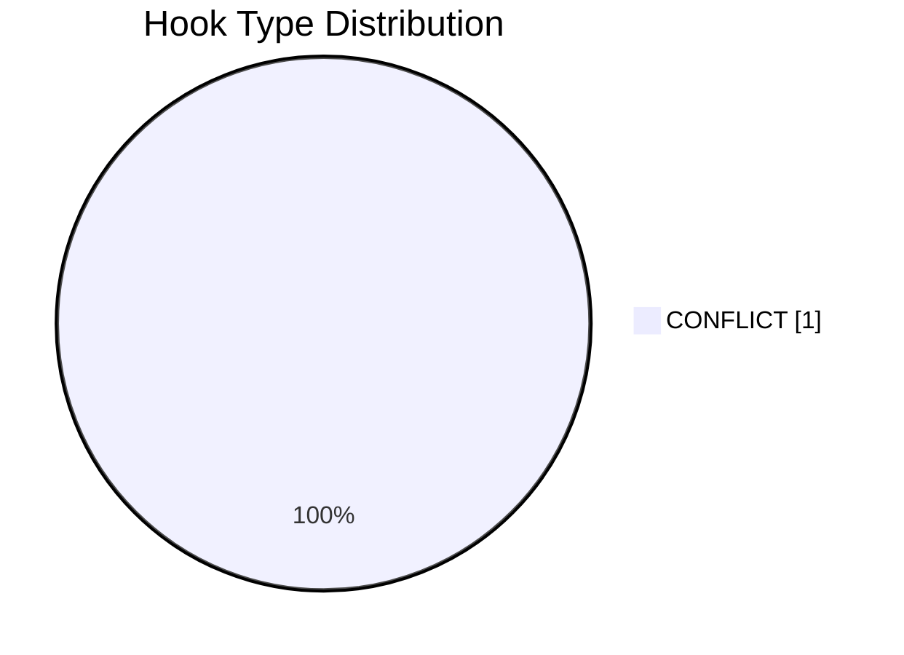

## 7.3. Time to first value vs Overall Score

- Назва графіка: `Time to first value vs Overall Score`
- Яке питання він відповідає: чи швидша перша цінність пов’язана з overall score.
- Які поля використовуються: `time_to_first_value_seconds`, `overall_video_score`.
- Тип графіка: scatter plot.
- Що видно з графіка: `INSUFFICIENT_DATA`, бо time-to-first-value у звіті позначено як `NO_TIMECODES_LOW_CONFIDENCE_EARLY`, без секунд.
- Практичний висновок: для наступних звітів треба витягувати `time_to_first_value_seconds`, інакше структурні графіки не масштабуються.

| Video | Time to first value | Overall | Status |
|---|---|---:|---|
| Video 1 | NO_TIMECODES_LOW_CONFIDENCE_EARLY | 3.72 | `INSUFFICIENT_DATA` for scatter. |

## 8. Графіки CTA

## 8.1. CTA score by video

- Назва графіка: `CTA score by video`
- Яке питання він відповідає: наскільки сильна CTA-система.
- Які поля використовуються: `video_label`, `cta_score`.
- Тип графіка: Mermaid bar chart.
- Що видно з графіка: `CTA score = 3 / 5`.
- Практичний висновок: є сильний comment CTA, але бракує subscribe/like/next-video bridge.

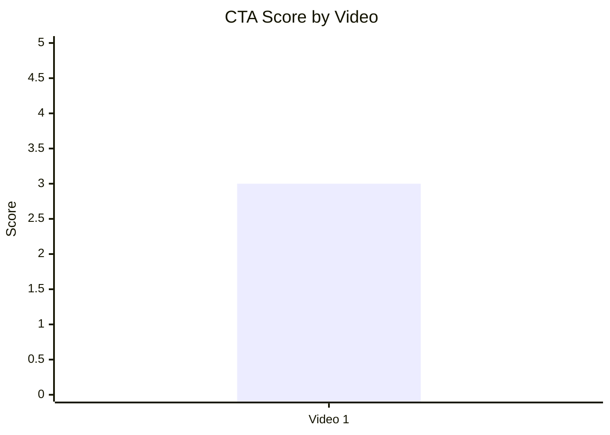

## 8.2. CTA count vs ER Public %

- Назва графіка: `CTA count vs ER Public %`
- Яке питання він відповідає: чи кількість CTA пов’язана із залученням.
- Які поля використовуються: `cta_count`, `er_public_percent`.
- Тип графіка: scatter plot; для 1 відео — таблиця точки.
- Що видно з графіка: `cta_count = 1`, `ER Public = 17.17%`.
- Практичний висновок: причинність не доведена; можна тестувати якість comment prompt, а не збільшення кількості CTA.

| Video | CTA count | ER Public % | CTA overload risk |
|---|---:|---:|---|
| Video 1 | 1 | 17.17 | Low: один основний CTA. |

## 8.3. CTA features heatmap

- Назва графіка: `CTA features heatmap`
- Яке питання він відповідає: які CTA-елементи є / відсутні.
- Які поля використовуються: `has_comment_prompt`, `has_subscribe_cta`, `has_like_cta`, `has_bell_cta`, `has_next_video_bridge`.
- Тип графіка: matrix heatmap table.
- Що видно з графіка: є тільки comment prompt.
- Практичний висновок: найкращий тест — додати next-video bridge і pinned comment, не перевантажуючи відео шаблонними CTA.

| Video | Comment prompt | Subscribe | Like | Bell | Next video bridge |
|---|---|---|---|---|---|
| Video 1 | ✅ | ❌ | ❌ | ❌ | ❌ |

## 9. Графіки реклами / інтеграцій

Advertising graphs skipped: no advertising integrations detected.

## 9.1. Ad load % by video

- Назва графіка: `Ad load % by video`
- Яке питання він відповідає: чи є рекламне навантаження.
- Які поля використовуються: `ad_load_percent`.
- Тип графіка: Mermaid bar chart.
- Що видно з графіка: ad load = `0.00%`.
- Практичний висновок: реклама не пояснює реакцію аудиторії і не створює disruption risk.

```mermaid
xychart-beta
    title "Ad Load % by Video"
    x-axis ["Video 1"]
    y-axis "Ad Load %" 0 --> 1
    bar [0]
```

## 9.2. First ad position %

- Назва графіка: `First ad position %`
- Яке питання він відповідає: де стоїть перша реклама.
- Які поля використовуються: `first_ad_relative_position_percent`.
- Тип графіка: bar/scatter.
- Що видно з графіка: `NOT_APPLICABLE`.
- Практичний висновок: графік неможливо побудувати, бо реклами не виявлено.

| Video | First ad relative position % | Status |
|---|---:|---|
| Video 1 | N/A | NOT_APPLICABLE |

## 9.3. Ad integration score vs ER Public %

- Назва графіка: `Ad integration score vs ER Public %`
- Яке питання він відповідає: чи якість реклами пов’язана з ER.
- Які поля використовуються: `ad_integration_score`, `er_public_percent`.
- Тип графіка: scatter plot.
- Що видно з графіка: `NOT_APPLICABLE`.
- Практичний висновок: немає рекламних інтеграцій, тому не можна оцінювати вплив реклами.

## 10. Графіки аудіо

## 10.1. Audio score by video

- Назва графіка: `Audio score by video`
- Яке питання він відповідає: яка якість аудіо за оцінкою звіту.
- Які поля використовуються: `video_label`, `audio_score`.
- Тип графіка: Mermaid bar chart.
- Що видно з графіка: `audio_score = 4 / 5`.
- Практичний висновок: аудіо не є головною проблемою відео; стратегічні покращення важливіші в структурі, джерелах і CTA.

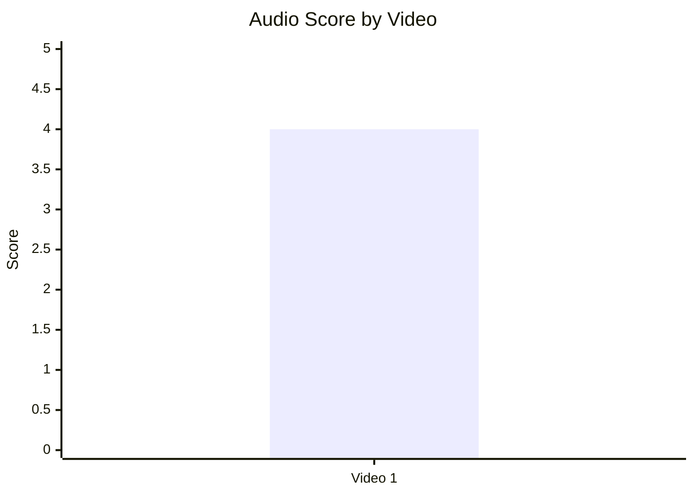

## 10.2. Audio score vs Overall Score

- Назва графіка: `Audio score vs Overall Score`
- Яке питання він відповідає: чи краща якість аудіо пов’язана з overall score.
- Які поля використовуються: `audio_score`, `overall_video_score`.
- Тип графіка: scatter plot; для 1 відео — таблиця точки.
- Що видно з графіка: `audio_score = 4`, `overall = 3.72`.
- Практичний висновок: зв’язок оцінити неможливо; аудіо можна лишити як контрольований стандарт.

| Video | Audio score | Overall score | Interpretation |
|---|---:|---:|---|
| Video 1 | 4 | 3.72 | Audio is stronger than overall, so main bottleneck is not audio. |

## 11. Графіки коментарів

## 11.1. Sentiment distribution

- Назва графіка: `Sentiment distribution`
- Яке питання він відповідає: яка структура реакції аудиторії.
- Які поля використовуються: `positive_percent`, `negative_percent`, `mixed_percent`, `neutral_percent`, `question_percent`, `request_percent`, `joke_meme_percent`.
- Тип графіка: stacked bar бажаний; у Markdown подано pie + таблицю.
- Що видно з графіка: найбільша частка — `NEGATIVE 38.49%`, потім `NEUTRAL 20.96%`, `QUESTION 14.43%`, `JOKE_MEME 9.79%`, `MIXED 8.93%`, `POSITIVE 6.19%`, `REQUEST 1.20%`.
- Практичний висновок: коментарна сила відео походить із конфлікту та заперечень; треба перетворити це в follow-up і FAQ, а не просто повторювати поляризацію.

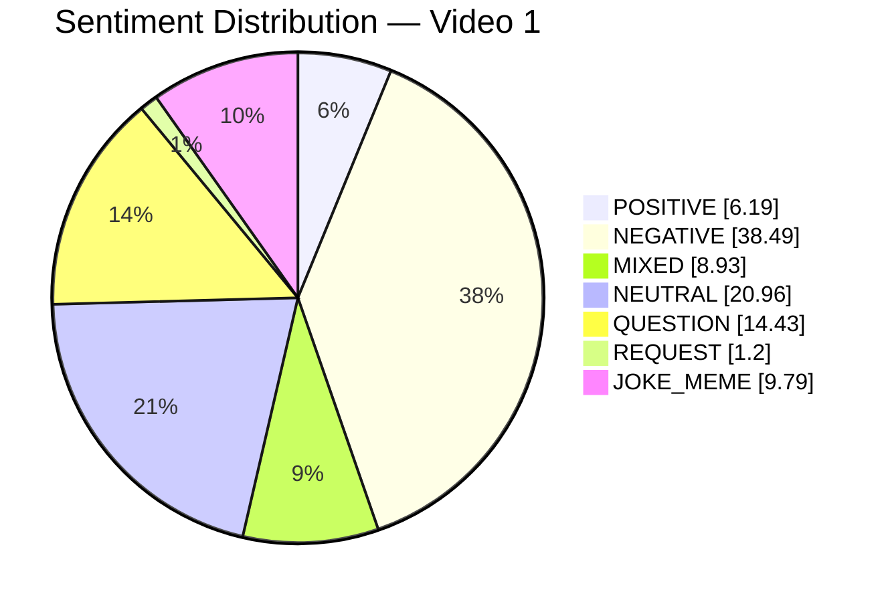

| Sentiment | Percent |
|---|---:|
| POSITIVE | 6.19 |
| NEGATIVE | 38.49 |
| MIXED | 8.93 |
| NEUTRAL | 20.96 |
| QUESTION | 14.43 |
| REQUEST | 1.20 |
| JOKE_MEME | 9.79 |

## 11.2. Comment resonance score by video

- Назва графіка: `Comment resonance score by video`
- Яке питання він відповідає: наскільки сильно відео резонує в коментарях.
- Які поля використовуються: `comment_resonance_score`.
- Тип графіка: Mermaid bar chart.
- Що видно з графіка: `5 / 5`.
- Практичний висновок: резонанс — найсильніший score-компонент відео.

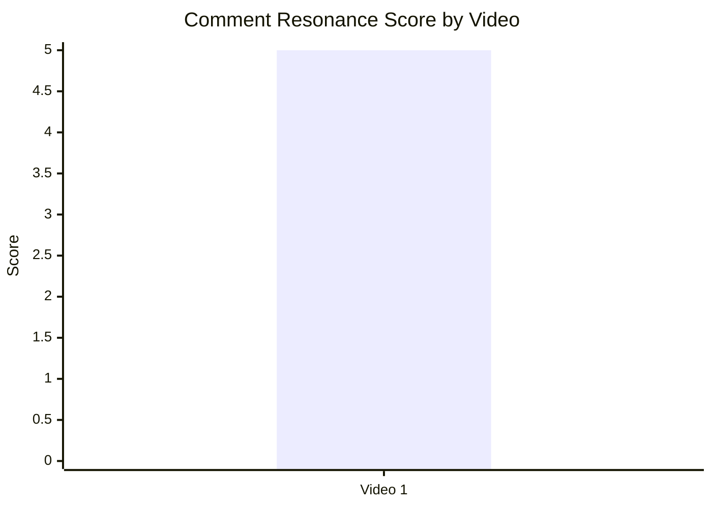

## 11.3. Top comment clusters

- Назва графіка: `Top comment clusters`
- Яке питання він відповідає: що найчастіше хвалять, критикують або питають.
- Які поля використовуються: cluster label, `% of relevant comments`.
- Тип графіка: horizontal bar бажаний; у Markdown подано Mermaid bar + таблицю.
- Що видно з графіка: найбільший кластер — `CRITICISM_ACCURACY 26.12%`.
- Практичний висновок: головний контентний тест — не нова тема, а сильніший доказовий каркас і відповідь на заперечення.

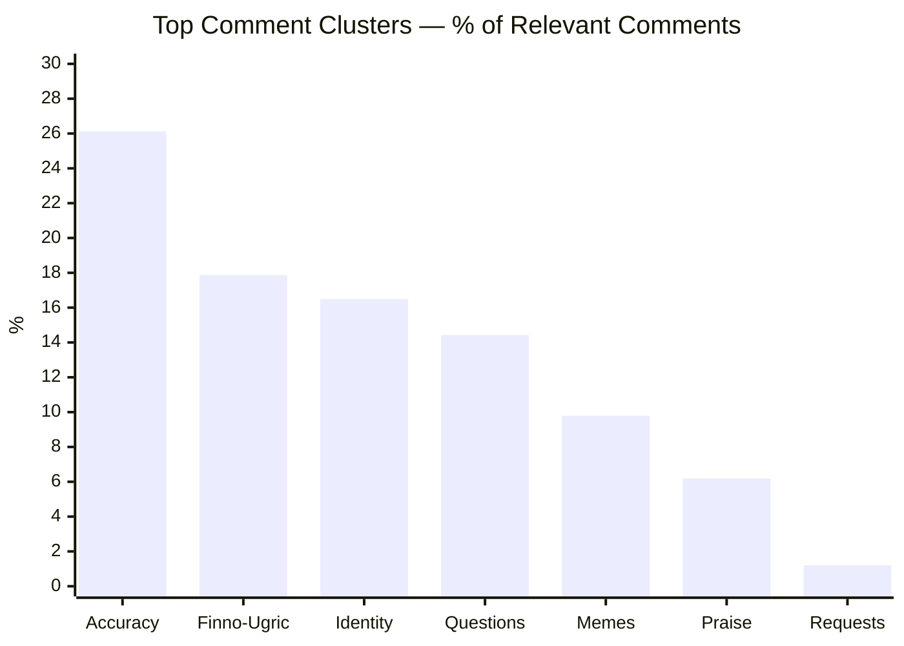

| Cluster | % of relevant comments | Practical meaning |
|---|---:|---|
| CRITICISM_ACCURACY | 26.12 | Найчастіше критикують доказовість і лінгвістичну методологію. |
| DISAGREEMENT: фінно-угорське походження / Меря / Москва | 17.87 | Назва точно запускає core debate. |
| COMMUNITY_DISCUSSION: Україна / Русь / Росія | 16.49 | Відео працює як identity conflict content. |
| QUESTION_CLARIFICATION | 14.43 | Є база для FAQ / follow-up. |
| JOKE_MEME | 9.79 | Високий шум і сарказм у дискусії. |
| PRAISE_CONTENT | 6.19 | Позитивне ядро є, але не домінує. |
| REQUEST_MORE_CONTENT | 1.20 | Серійний сигнал слабкий, але наявний. |

## 12. Графіки score-системи

## 12.1. Overall score by video

- Назва графіка: `Overall score by video`
- Яке питання він відповідає: загальна оцінка відео.
- Які поля використовуються: `overall_video_score`.
- Тип графіка: Mermaid bar chart.
- Що видно з графіка: `3.72 / 5`.
- Практичний висновок: відео сильне в hook/comment resonance, але overall стримується структурою, value density і CTA.

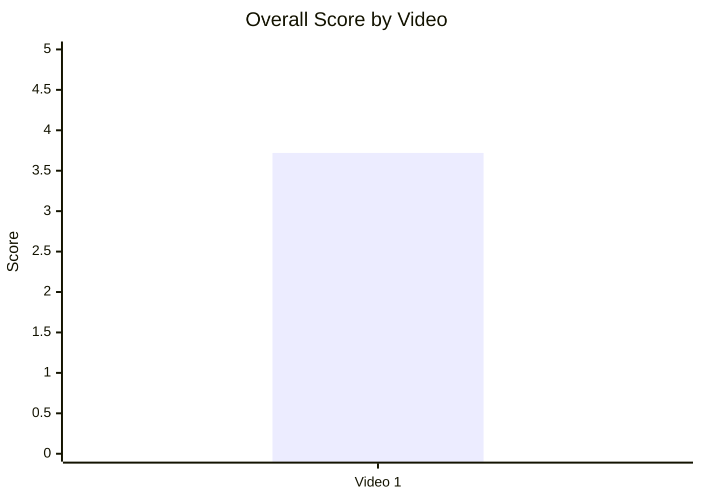

## 12.2. Score breakdown heatmap

- Назва графіка: `Score breakdown heatmap`
- Яке питання він відповідає: які компоненти score сильні / слабкі.
- Які поля використовуються: `hook_score`, `structure_score`, `value_density_score`, `audio_score`, `cta_score`, `ad_integration_score`, `comment_resonance_score`, `replicability_score`, `overall_video_score`.
- Тип графіка: heatmap table.
- Що видно з графіка: найсильніше — comments `5`, hook/audio/replicability `4`; слабше — structure/value/CTA `3`; ad = `N/A`.
- Практичний висновок: масштабувати тему і hook, але підсилити структуру доказів, CTA і серійний перехід.

| Video | Hook | Structure | Value Density | Audio | CTA | Ad | Comments | Replicability | Overall |
|---|---:|---:|---:|---:|---:|---:|---:|---:|---:|
| Video 1 | 4 | 3 | 3 | 4 | 3 | N/A | 5 | 4 | 3.72 |

Legend: `5` = дуже сильний компонент; `4` = сильний; `3` = середній / потребує оптимізації; `N/A` = не застосовується.

## 12.3. Strengths vs weaknesses count

- Назва графіка: `Strengths vs weaknesses count`
- Яке питання він відповідає: баланс успішних механік і missed opportunities.
- Які поля використовуються: кількість `success_mechanics`, кількість `missed_opportunities`.
- Тип графіка: Mermaid bar chart.
- Що видно з графіка: у звіті є 5 success mechanics і 5 missed opportunities.
- Практичний висновок: відео не слабке; воно має сильну механіку, але таку саму кількість зон оптимізації.

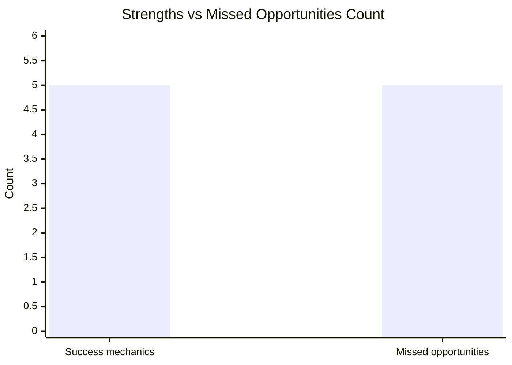

| Type | Count | Top item |
|---|---:|---|
| Success mechanics | 5 | CONTROVERSY_OR_DEBATE |
| Missed opportunities | 5 | COMMENTS_SHOW_TOPIC_GAP |

## 13. Кореляції та патерни

Correlation analysis skipped: fewer than 5 comparable videos.

| Pair | Correlation / Pattern | Strength | Interpretation | Confidence |
|---|---:|---|---|---|
| hook_score → overall_video_score | INSUFFICIENT_DATA | N/A | Потрібно мінімум 5 відео для кореляції. | LOW |
| value_density_score → er_public_percent | INSUFFICIENT_DATA | N/A | На 1 відео не можна відокремити вплив щільності цінності від теми/конфлікту. | LOW |
| cta_score → comment_rate_percent | INSUFFICIENT_DATA | N/A | Є comment CTA і високий comment rate, але причинність не доведена. | LOW |
| comment_resonance_score → er_public_percent | INSUFFICIENT_DATA | N/A | Обидва показники високі для Video 1, але це опис, не кореляція. | LOW |
| views_per_day → er_public_percent | INSUFFICIENT_DATA | N/A | Потрібні інші відео для порогів high/low. | LOW |
| ad_load_percent → er_public_percent | NOT_APPLICABLE | N/A | Реклами не виявлено. | LOW |
| time_to_first_value_seconds → overall_video_score | INSUFFICIENT_DATA | N/A | Немає секунд через `NO_TIMECODES`. | LOW |

Попередні патерни для одного відео:

| Pattern | Evidence from report | Confidence |
|---|---|---|
| Конфліктна thesis-first подача може підсилювати коментарі | `comment_rate_percent = 10.12%`, `comment_resonance_score = 5`, mechanic `CONTROVERSY_OR_DEBATE`. | LOW |
| Comment CTA варто тестувати як питання, а не лозунг | Є `has_comment_prompt = true`, але negative/question clusters великі. | LOW |
| Головний bottleneck — доказова структура, не аудіо | `audio_score = 4`, але `structure_score = 3`, `value_density_score = 3`, топ-проблема `COMMENTS_SHOW_TOPIC_GAP`. | LOW |

## 14. Висновки для контент-стратегії

| Спостереження | Дані / графік | Що це означає | Що робити |
|---|---|---|---|
| Відео найсильніше резонує в коментарях | Comment resonance `5/5`; comment rate `10.12%`; comments per 1k views `101.21`. | Тема й hook провокують дискусію краще, ніж пасивне схвалення. | Робити follow-up із відповідями на головні заперечення. |
| Hook сильніший за структуру | Hook `4/5`, Structure `3/5`. | Упаковка/початок працює краще, ніж доказовий ланцюг у середині. | Зберегти conflict hook, але додати framework: лексика / граматика / письмова традиція / розмовна мова. |
| CTA є, але вузький | CTA score `3/5`; heatmap: comment prompt ✅, subscribe/like/bell/next bridge ❌. | Відео збирає коментарі, але слабше переводить у підписку або наступний перегляд. | Додати pinned FAQ + next-video bridge у фіналі. |
| Реклама не впливає на реакцію | Ad load `0%`, ad score `N/A`. | Немає ризику рекламного disruption. | Рекламу не тестувати в цьому форматі до стабілізації структури/серійності. |
| Негатив і питання — найбільший ресурс для наступного контенту | Negative `38.49%`, Question `14.43%`; топ-кластер `CRITICISM_ACCURACY 26.12%`. | Критика вже сформувала карту майбутнього сценарію. | Випустити відео: «10 головних заперечень — відповідаю з джерелами». |
| Серійність поки не реалізована | `has_next_video_bridge = false`; missed opportunity `NO_NEXT_VIDEO_BRIDGE`. | Високий резонанс не повністю конвертується у session depth. | Фінал кожного такого відео має вести до наступного конкретного питання. |

## 15. Що тестувати далі

| Тест | Гіпотеза | На яких даних базується | Як виміряти | Пріоритет |
|---|---|---|---|---|
| FAQ follow-up на 10 заперечень | Відповіді на критику конвертують negative/question comments у перегляди наступного відео. | `CRITICISM_ACCURACY 26.12%`, `QUESTION 14.43%`, top missed opportunity `COMMENTS_SHOW_TOPIC_GAP`. | Views/day, comment rate, end screen CTR, частка повторюваних objections у коментарях. | HIGH |
| Pinned comment із джерелами | Структурований pinned comment зменшить хаотичні повтори і підвищить якість дискусії. | `MISSING_PINNED_COMMENT_STRATEGY`, багато запитів на докази. | Частка comments із “де пруфи?”, кількість конструктивних відповідей, CTR на джерела якщо доступний. | HIGH |
| Comment prompt як питання | Питання “який найсильніший контраргумент?” дасть якісніші коментарі, ніж лозунг. | `has_comment_prompt = true`, високий comment rate, але negative/joke clusters значні. | Comment rate, частка QUESTION/NEUTRAL vs JOKE/LOW_INFO, середня довжина коментаря. | HIGH |
| Next-video bridge | Конкретний перехід у наступне відео підвищить session depth. | `has_next_video_bridge = false`, end screen CTR `2.2%`. | End screen CTR, views from end screen, playlist/session views. | HIGH |
| Visual source framework | Схема типів доказів зменшить confusion. | `COMMENTS_SHOW_CONFUSION`, `structure_score = 3`, `value_density_score = 3`. | Retention у середній частині, частка коментарів про “лексика vs граматика”. | MEDIUM |
| Chapters у description | Таймкоди допоможуть skeptics перевіряти аргументи. | `NO_TIMECODES`, chapters N/A, багато джерел у сценарії. | Rewatch segments, comment references to chapters, retention around source blocks. | MEDIUM |
| Серія з однаковим conflict hook | Якщо thesis-first conflict стабільно дає коментарі, це може бути окремий формат. | `hook_score = 4`, `CONTROVERSY_OR_DEBATE`, ER `17.17%`. | Порівняти ≥5 відео: hook type, views/day, ER, comment rate. | MEDIUM |

## 16. Дані для експорту в таблицю / CSV

| video_label | title | format_group | views | views_per_day | like_rate_percent | comment_rate_percent | er_public_percent | views_per_1k_subs | hook_type | hook_score | cta_count | cta_score | ad_load_percent | ad_integration_score | audio_score | comment_resonance_score | overall_video_score | top_success_mechanic | top_missed_opportunity |
|---|---|---|---:|---:|---:|---:|---:|---:|---|---:|---:|---:|---:|---:|---:|---:|---:|---|---|
| Video 1 | Как угро-финны заговорили на славянском? | LONG_10_20_MIN | 41901 | 59.60 | 7.05 | 10.12 | 17.17 | 2053.97 | CONFLICT | 4 | 1 | 3 | 0.00 | N/A | 4 | 5 | 3.72 | CONTROVERSY_OR_DEBATE | COMMENTS_SHOW_TOPIC_GAP |

```csv
video_label,title,format_group,views,views_per_day,like_rate_percent,comment_rate_percent,er_public_percent,views_per_1k_subs,hook_type,hook_score,cta_count,cta_score,ad_load_percent,ad_integration_score,audio_score,comment_resonance_score,overall_video_score,top_success_mechanic,top_missed_opportunity
Video 1,Как угро-финны заговорили на славянском?,LONG_10_20_MIN,41901,59.60,7.05,10.12,17.17,2053.97,CONFLICT,4,1,3,0.00,N/A,4,5,3.72,CONTROVERSY_OR_DEBATE,COMMENTS_SHOW_TOPIC_GAP
```
