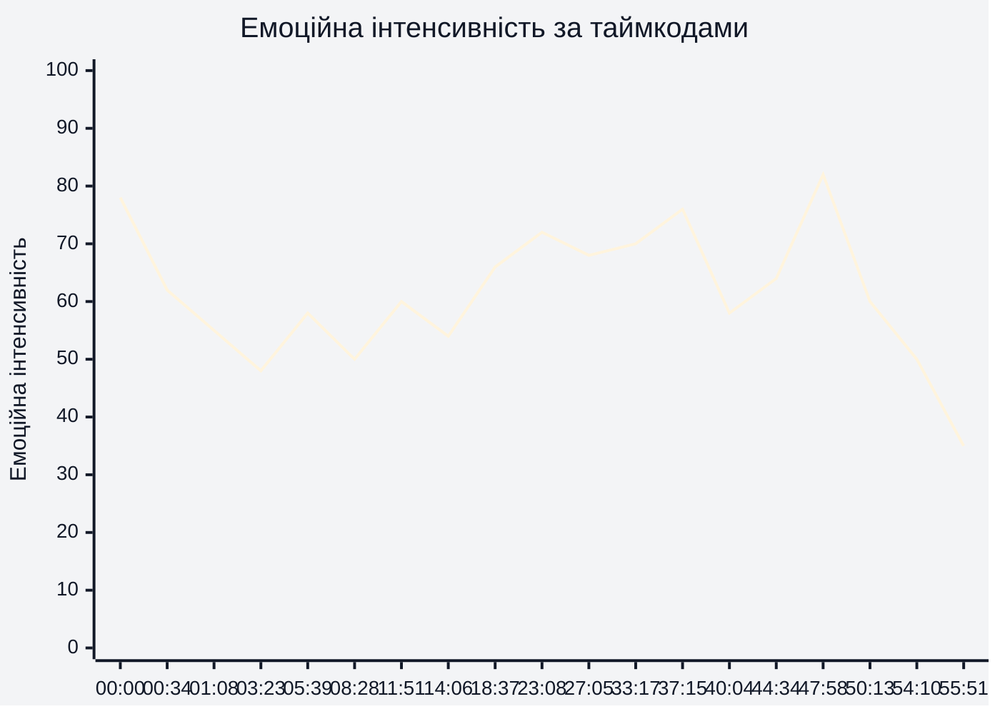
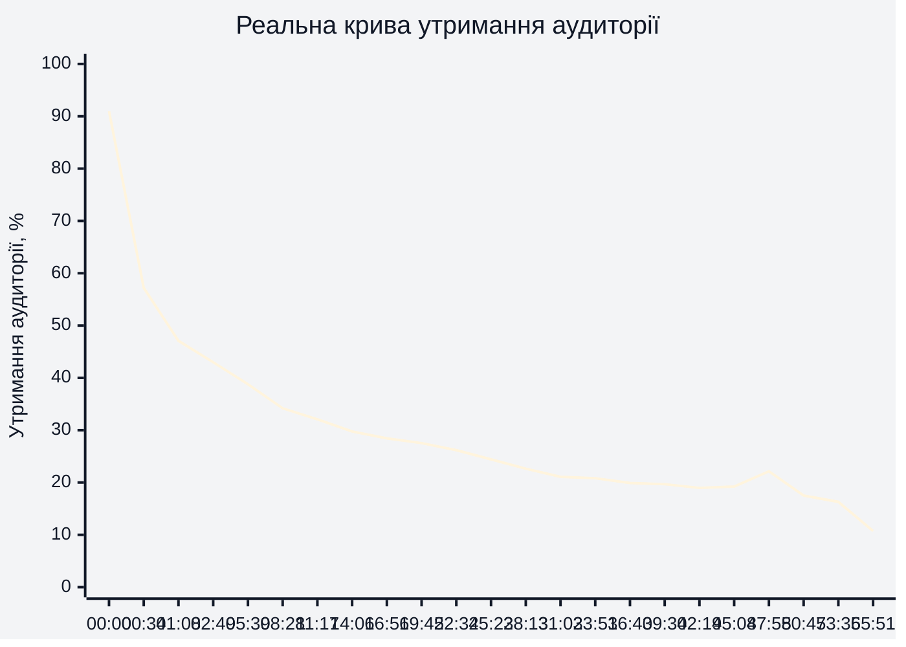
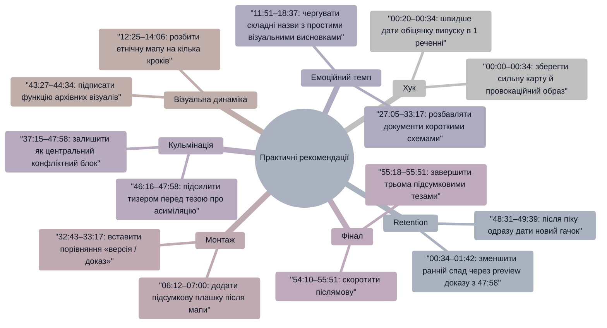

# Аналіз довгоформатного YouTube-відео

Аналіз виконано за наданим MP4-файлом тривалістю **56:25** і наданими retention-даними YouTube Studio. Транскрипт із таймкодами не було надано, тому сюжетні висновки прив’язані до відеоряду, видимих слайдів, екранних тез і реальної кривої утримання.

## 1. Сюжетна дуга (Narrative Arc)

```mermaid
%%{init: {'theme':'base', 'themeVariables': {
'primaryColor':'#f3f4f6',
'primaryTextColor':'#111827',
'primaryBorderColor':'#2563eb',
'lineColor':'#2563eb',
'secondaryColor':'#ffffff',
'tertiaryColor':'#f3f4f6',
'background':'#f3f4f6'
}}}%%
flowchart LR
    A["00:00–00:34<br/>Хук<br/>Провокаційна карта й візуальна обіцянка розібрати походження московитів"] --> 
    B["00:34–03:23<br/>Експозиція<br/>Ведучий формулює тему через поняття «русский» і список 7 підозрілих нестиковок"] --> 
    C["03:23–11:51<br/>Перша ескалація<br/>Поява джерел, мап і аргументів про етнічне та політичне походження термінів"] --> 
    D["11:51–23:08<br/>Переломний момент<br/>Відео переходить від лінгвістики до історичної географії, мап Печери/Чуді/Муроми/Мордви та документів"] --> 
    E["23:08–37:15<br/>Наростання напруги<br/>Сегмент «важное отступление» і блок про те, як міф міг бути сконструйований через джерела й переписування"] --> 
    F["37:15–47:58<br/>Кульмінація<br/>Пряме зіставлення «мала Русь / велика Русь», карта «край = територія тиранії» і теза про асиміляцію"] --> 
    G["47:58–54:10<br/>Розв’язка<br/>Узагальнення про поступову асиміляцію русинів-українців у «русском» способі життя та культурі"] --> 
    H["54:10–55:51<br/>Фінальний висновок<br/>Ведучий закриває аргументацію в кадрі, але темп знижується і retention падає до фіналу"]
```

## 2. Ключові Story Beats

```mermaid
%%{init: {'theme':'base', 'themeVariables': {
'primaryColor':'#f3f4f6',
'primaryTextColor':'#111827',
'primaryBorderColor':'#2563eb',
'lineColor':'#2563eb',
'secondaryColor':'#ffffff',
'tertiaryColor':'#f3f4f6',
'background':'#f3f4f6'
}}}%%
flowchart LR
    B1["00:00<br/>Карта й карикатурний образ<br/>Функція: миттєвий хук і конфлікт"] -->
    B2["00:34<br/>Теза про поняття «русский»<br/>Функція: постановка головного питання"] -->
    B3["01:08<br/>Слайд «7 подозрительных нестыковок»<br/>Функція: створення обіцянки структури"] -->
    B4["03:23<br/>Блок зі словами «мы новозванный вами бог»<br/>Функція: перший іронічний доказовий поворот"] -->
    B5["05:39<br/>Карта з насоновською зоною<br/>Функція: переведення тези у просторовий доказ"] -->
    B6["08:28<br/>Стародавній текст із виділеннями<br/>Функція: підкріплення твердження джерелом"] -->
    B7["11:51<br/>Мапа «хто жив здесь во времена Руси»<br/>Функція: розширення історичного контексту"] -->
    B8["18:37<br/>Пояснення зміни після падіння Русі<br/>Функція: середній поворот і повторна мобілізація уваги"] -->
    B9["23:08<br/>Слайд «важное отступление»<br/>Функція: зміна масштабу аргументації"] -->
    B10["37:15<br/>Плашка «провал в логике»<br/>Функція: конфліктна кульмінаційна теза"] -->
    B11["47:58<br/>Блок про асиміляцію<br/>Функція: найсильніше підсумкове узагальнення"] -->
    B12["54:10<br/>Фінальна промова ведучого<br/>Функція: закриття теми й вихід з історії"]
```

## 3. Емоційний темп

**Висновок:** емоційний максимум формується не на старті, а в зоні **37:15–47:58**, де з’являються найконфліктніші слайди: «провал в логике», «мала Русь / велика Русь» і «поступенная ассимиляция». Найслабша зона — **54:10–55:51**, де фінал стає переважно монологічним і втрачає частину візуальної напруги.

## 4. Утримання аудиторії

**Висновок:** використано реальні retention-дані. Найрізкіший спад відбувається між **00:00 і 00:34**: утримання падає з **90,96%** до **57,20%**. Після **05:39** крива стабілізується повільніше, а помітні мікропіки з’являються на **23:08**, **33:17** і особливо **47:58**.

## 5. Піки retention

| Таймкод | Подія | Чому це може утримувати увагу | Сила піку 1–10 |
|---|---|---|---|
| 00:00 | Карта, карикатурний образ і різкий візуальний старт | Високий контраст, одразу зрозумілий конфлікт і сильна обіцянка теми | 9 |
| 05:39 | Мапа з виділеною територією та портретом історичного автора | Перехід від розмови до візуального доказу з географією | 6 |
| 11:51 | Мапа «хто жив здесь во времена Руси» | Глядач отримує просту схему для складної історичної тези | 7 |
| 18:37 | Пояснення «що произошло здесь после падения Руси» | Сегмент створює причинно-наслідковий поворот у середині відео | 7 |
| 23:08 | Слайд «важное отступление» | Маркер нового розділу освіжає структуру після довгого доказового блоку | 8 |
| 33:17 | Старовинна мапа з чіткими зеленими виділеннями | Візуальний доказ повертає увагу після текстових документів | 7 |
| 37:15 | Слайд «провал в логике» і протиставлення «мала Русь / велика Русь» | Конфліктна формула робить аргумент простим і мемним | 8 |
| 47:58 | Блок про «постепенную ассимиляцию русинов-украинцев» | Найсильніший локальний підйом retention: теза звучить як підсумкова відповідь на головне питання | 9 |
| 54:10 | Коротке фінальне повернення до ведучого | Глядачі, які дійшли до кінця, отримують закриття аргументації | 5 |

## 6. Провали retention

| Таймкод | Проблема | Ймовірна причина спаду | Що покращити |
|---|---|---|---|
| 00:34 | Падіння з 90,96% до 57,20% | Після сильного хука темп переходить у пояснювальний монолог | На **00:20–00:34** швидше показати карту проблеми й конкретну обіцянку «що доведемо за 7 пунктів» |
| 01:08 | Додаткове падіння до 47,08% | Список «7 нестиковок» ще не дає першого доказу | На **01:08–01:42** додати міні-прев’ю найсильнішого доказу з **47:58** |
| 06:12 | Спад після мапового блоку | Після візуального доказу повертається щільне пояснення | На **06:12–07:00** вставити коротке резюме «що ця мапа змінює» |
| 12:25 | Просідання після етнографічної мапи | Багато назв народів і територій підряд можуть перевантажити | На **12:25–13:30** розбити інформацію на 2–3 короткі візуальні кроки |
| 32:43 | Локальний спад у блоці старовинних карт | Довга доказова серія без нового емоційного повороту | На **32:43–33:17** додати контраст «офіційна версія / що видно на карті» |
| 36:07 | Просідання перед кульмінаційним блоком | Перехід до складної логіки міфу може звучати абстрактно | На **36:07–37:15** скоротити підводку до слайду «провал в логике» |
| 43:27 | Спад у візуальному історичному фрагменті | Зміна кадрів є, але сюжетна функція може бути неочевидною | На **43:27–44:34** додати підпис «навіщо цей приклад важливий для головної тези» |
| 46:16 | Локальний мінімум перед сильним піком | Перед фінальним узагальненням накопичується монологічність | На **46:16–47:58** поставити короткий тизер: «зараз ключ до всього міфу» |
| 48:31 | Різкий спад після піку 47:58 | Після найсильнішої тези відео не одразу дає новий гачок | На **48:31–49:39** швидко показати практичний наслідок цієї тези для сучасного міфу |
| 54:44–55:51 | Фінальне падіння до 10,72% | Завершення виглядає як післямова без нової інформації | На **54:10–55:51** зробити коротший фінал із підсумком у 3 тезах і CTA після них |

## 7. Оцінка сегментів

| Сегмент | Таймкод | Функція | Емоційна інтенсивність | Ризик втрати уваги | Оцінка 1–10 | Що покращити |
|---|---|---|---|---|---|---|
| Хук | 00:00–00:34 | Відкрити конфлікт через карту й провокаційний візуал | 78/100 | Середній | 8 | На **00:20–00:34** швидше озвучити головну обіцянку випуску |
| Постановка теми | 00:34–03:23 | Пояснити проблему поняття «русский» і структуру з 7 пунктів | 55/100 | Високий | 6 | На **01:08–02:15** додати перший доказ, а не тільки список |
| Перші джерела й мапи | 03:23–11:51 | Перевести тезу в документи, карти й історичні джерела | 60/100 | Середній | 7 | На **06:12–07:00** частіше підсумовувати значення кожного доказу |
| Географічне розширення | 11:51–18:37 | Показати етнічний і територіальний контекст Русі та сусідніх народів | 62/100 | Середній | 7 | На **12:25–14:06** спростити блок із багатьма назвами |
| Середній поворот | 18:37–23:08 | Пояснити, що змінюється після падіння Русі | 70/100 | Низький | 8 | На **21:00–23:08** зробити місток до наступного розділу коротшим |
| «Важливе відступлення» | 23:08–33:17 | Показати, як історичний міф міг формуватися через джерела | 68/100 | Середній | 8 | На **27:05–29:00** чергувати документи з простішими візуальними схемами |
| Конструкція міфу | 33:17–40:04 | Пояснити механіку підміни та логічний конфлікт | 76/100 | Середній | 8 | На **36:07–37:15** скоротити підводку до сильного слайду |
| Кульмінація | 40:04–47:58 | Звести аргументи до тези про перейменування, край і асиміляцію | 82/100 | Низький | 9 | На **43:27–44:34** чіткіше назвати функцію кожного візуального прикладу |
| Розв’язка | 47:58–54:10 | Дати підсумкову тезу про асиміляцію й наслідки | 65/100 | Середній | 7 | На **48:31–50:13** додати новий мікроконфлікт після найсильнішого піку |
| Фінал | 54:10–55:51 | Закрити відео й завершити позицію автора | 35/100 | Високий | 5 | На **54:10–55:51** скоротити фінальну промову та завершити сильнішою останньою фразою |

## 8. Практичні рекомендації

## 9. Підсумкова оцінка

| Показник | Оцінка 1–10 | Коментар |
|---|---:|---|
| Сюжетна дуга | 8 | На **00:00–47:58** є чіткий рух від хука до кульмінації; слабше працює фінальна зона **54:10–55:51** |
| Story Beats | 8 | Сильні точки на **01:08**, **23:08**, **37:15** і **47:58** добре структурують довге відео |
| Емоційний темп | 7 | Найкраще працює напруга **37:15–47:58**; рання пояснювальна частина **00:34–03:23** просідає |
| Retention Structure | 7 | Реальна крива має очікуваний спад на старті, але мікропіки **23:08**, **33:17**, **47:58** показують сильні структурні опори |
| Загальна оцінка | 8 | Відео має сильну доказову архітектуру й кульмінаційний блок, але потребує швидшого раннього payoff на **00:34–01:42** і коротшого фіналу на **54:10–55:51** |
