# Статистичний аналіз відеозвітів

## 1. Короткий executive summary

| Пункт | Висновок |
|---|---|
| Скільки відео проаналізовано | 1 |
| Скільки форматів відео | 1: `LONG_20_PLUS_MIN` |
| Найсильніше відео за overall score | Video 1 — `4.06` |
| Найсильніше відео за ER Public % | Video 1 — `11.11%` |
| Найсильніше відео за views per day | Video 1 — `282.92` |
| Найсильніша повторювана механіка | `INSUFFICIENT_DATA`: лише 1 відео; у цьому відео найсильніші механіки — `CONTROVERSY_OR_DEBATE`, `HIGH_COMMENT_TRIGGER`, `EVERGREEN_VALUE` |
| Найчастіша слабкість | `INSUFFICIENT_DATA`: лише 1 відео; у цьому відео ключова слабкість — слабкий next-video bridge / end-screen CTR `0.5%` |
| Головна стратегічна можливість | Зберегти формат “контроверсійна теза + evidence blocks + pinned correction loop”, але тестувати швидший cold open і сильніший перехід у наступне відео |
| Рівень впевненості | `LOW_CONFIDENCE` для статистичних патернів, бо вибірка = 1; `HIGH/MEDIUM` для описових даних одного відео згідно з вихідним YT_VIDEO_ANALYSIS_V1 звітом |

## 2. Якість і повнота даних

| Поле | Кількість відео з даними | Кількість N/A | Коментар |
|---|---:|---:|---|
| views | 1 | 0 | Є значення `204552`. |
| likes | 1 | 0 | Є значення `14058`. |
| comments_count | 1 | 0 | Є значення `8669`. |
| views_per_day | 1 | 0 | Є значення `282.92`. |
| er_public_percent | 1 | 0 | Є значення `11.11%`. |
| views_per_1k_subs | 1 | 0 | Є значення `10027.06`. |
| hook_score | 1 | 0 | Є значення `4`. |
| cta_score | 1 | 0 | Є значення `3`. |
| ad_integration_score | 0 | 1 | `NOT_APPLICABLE`: third-party sponsor read не виявлено; є self-promo/support links. |
| audio_score | 1 | 0 | Є значення `4`, confidence MEDIUM у вихідному звіті. |
| comment_resonance_score | 1 | 0 | Є значення `5`. |
| overall_video_score | 1 | 0 | Є значення `4.06`. |

### Обмеження аналізу

- Вибірка містить лише 1 відео, тому всі статистичні узагальнення мають статус `LOW_CONFIDENCE`.
- Кореляції не будуються: `Correlation analysis skipped: fewer than 5 comparable videos.`
- Порівняння між форматами не виконується: у вибірці лише `LONG_20_PLUS_MIN`.
- Частина полів є `PARTIAL_DATA`: transcript без нативних таймкодів, коментарі parsed partial vs public count, retention лише як якісний summary.
- Рекламні графіки обмежені: third-party advertising не виявлено; self-promo/support links є, але `ad_load_percent = N/A`.

## 3. Підготовлена таблиця для графіків

| Video | Format | Views | Views/day | Like Rate % | Comment Rate % | ER Public % | Views/1k subs | Hook | CTA | Ad | Audio | Comment Resonance | Overall |
|---|---|---:|---:|---:|---:|---:|---:|---:|---:|---:|---:|---:|---:|
| Video 1 | LONG_20_PLUS_MIN | 204552 | 282.92 | 6.87 | 4.24 | 11.11 | 10027.06 | 4 | 3 | NOT_APPLICABLE | 4 | 5 | 4.06 |

| Label | Full title | URL |
|---|---|---|
| Video 1 | Настоящая история московитов | https://www.youtube.com/watch?v=pxCp_kOPPmU |

## 4. Рекомендовані графіки

| # | Назва графіка | Тип графіка | Поля | Для чого потрібен | Пріоритет |
|---:|---|---|---|---|---|
| 1 | Overall score by video | Mermaid bar chart | `overall_video_score` | Побачити загальний score відео | HIGH |
| 2 | Views per day by video | Mermaid bar chart | `views_per_day` | Оцінити normalized performance з урахуванням віку | HIGH |
| 3 | ER Public % by video | Mermaid bar chart | `er_public_percent` | Оцінити публічне залучення | HIGH |
| 4 | ER Public % vs Views/day | Таблиця / quadrant note | `er_public_percent`, `views_per_day` | Побачити баланс охоплення і реакції | HIGH |
| 5 | Hook score by video | Mermaid bar chart | `hook_score` | Оцінити якість hook | HIGH |
| 6 | CTA score by video | Mermaid bar chart | `cta_score` | Оцінити CTA | HIGH |
| 7 | Score breakdown heatmap | Markdown heatmap table | score fields | Побачити сильні/слабкі сторони | HIGH |
| 8 | Sentiment distribution | Mermaid bar chart + table | comment sentiment percent | Показати структуру реакцій | HIGH |
| 9 | CTA features heatmap | Markdown matrix | CTA feature booleans | Побачити, які CTA використані | HIGH |
| 10 | Ad load % by video | Skipped | `ad_load_percent` | Оцінити рекламне навантаження | LOW — немає точного ad load |

## 5. Графіки продуктивності

## 5.1. Views by video

- Назва графіка: Views by video
- Яке питання він відповідає: яке відео має найбільший raw reach?
- Які поля використовуються: `video_label`, `views`
- Тип графіка: Mermaid bar chart
- Що видно з графіка: у вибірці лише Video 1 з `204552` переглядами.
- Практичний висновок: raw views показує масштаб, але без інших відео й нормалізації не дозволяє зробити висновок про “краще/гірше”.

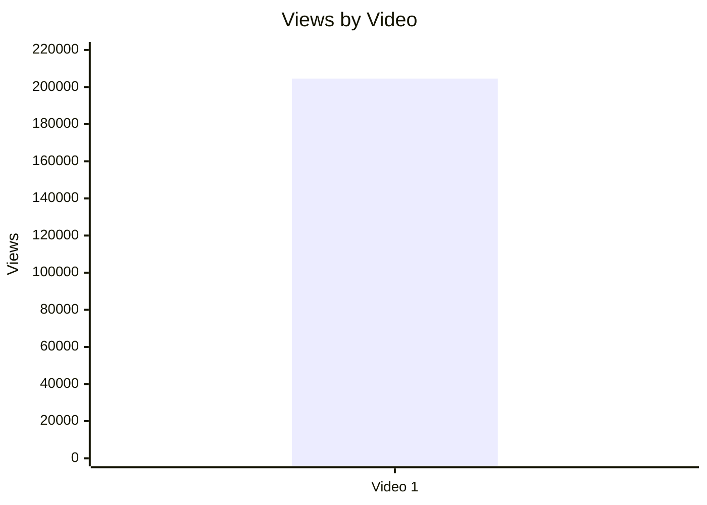

## 5.2. Views per day by video

- Назва графіка: Views per day by video
- Яке питання він відповідає: яка швидкість набору переглядів з урахуванням віку відео?
- Які поля використовуються: `video_label`, `views_per_day`
- Тип графіка: Mermaid bar chart
- Що видно з графіка: Video 1 має `282.92` views/day.
- Практичний висновок: це ключова normalized performance-метрика для майбутнього порівняння з іншими long-form відео.

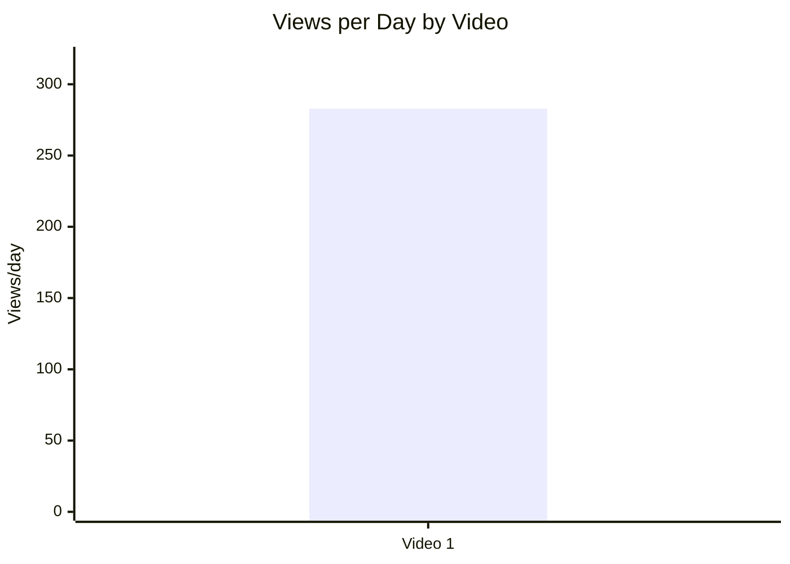

## 5.3. Views per 1k subscribers

- Назва графіка: Views per 1k subscribers
- Яке питання він відповідає: наскільки відео перетворює розмір каналу в перегляди?
- Які поля використовуються: `video_label`, `views_per_1k_subs`
- Тип графіка: Mermaid bar chart
- Що видно з графіка: Video 1 має `10027.06` views per 1k subs/followers.
- Практичний висновок: це сильний кандидат для майбутнього порівняння з іншими відео каналу, але зараз без benchmark висновок описовий.

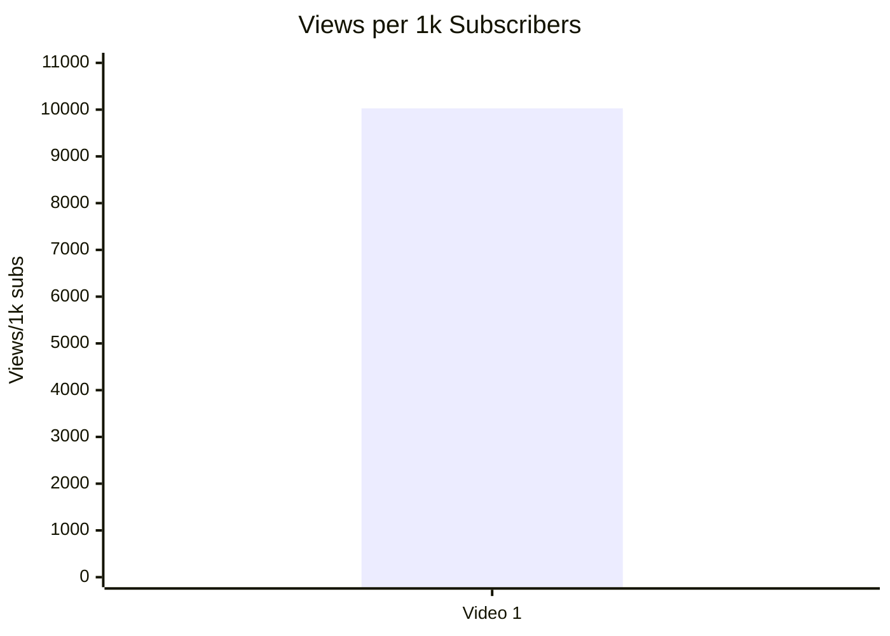

## 5.4. Performance quadrant

- Назва графіка: Performance quadrant
- Яке питання він відповідає: чи відео балансує охоплення і залучення?
- Які поля використовуються: `views_per_day`, `er_public_percent`
- Тип графіка: scatter/quadrant; для 1 точки подано таблицю, бо квадранти потребують порівняльних порогів.
- Що видно з графіка: є одна точка — `views_per_day = 282.92`, `ER Public = 11.11%`.
- Практичний висновок: графік стане корисним після додавання мінімум 3–5 comparable long-form відео.

| Video | Views/day | ER Public % | Quadrant status |
|---|---:|---:|---|
| Video 1 | 282.92 | 11.11 | `INSUFFICIENT_DATA`: немає median/benchmark для визначення high/low |

## 6. Графіки залучення

## 6.1. ER Public % by video

- Назва графіка: ER Public % by video
- Яке питання він відповідає: який рівень публічного залучення?
- Які поля використовуються: `video_label`, `er_public_percent`
- Тип графіка: Mermaid bar chart
- Що видно з графіка: Video 1 має `11.11%` ER Public.
- Практичний висновок: ER можна використовувати як baseline для майбутніх відео цього формату.

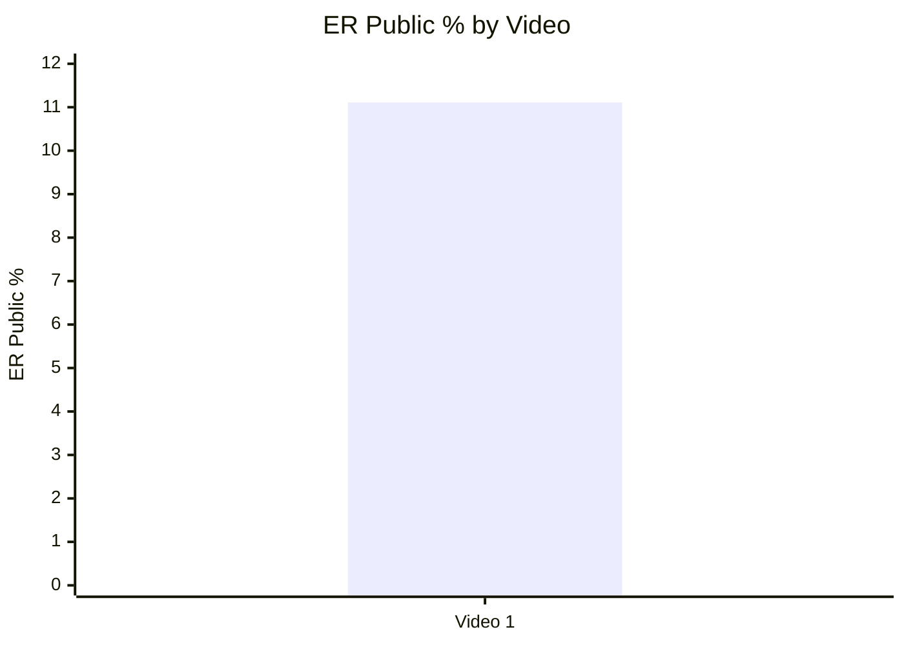

## 6.2. Like Rate % vs Comment Rate %

- Назва графіка: Like Rate % vs Comment Rate %
- Яке питання він відповідає: реакція більше через лайки чи через дискусії?
- Які поля використовуються: `like_rate_percent`, `comment_rate_percent`
- Тип графіка: scatter plot; для 1 точки подано таблицю.
- Що видно з графіка: `like_rate_percent = 6.87`, `comment_rate_percent = 4.24`.
- Практичний висновок: відео має не лише лайки, а й високу дискусійність; однак без порівняльної вибірки це опис, не статистичний висновок.

| Video | Like Rate % | Comment Rate % | Interpretation |
|---|---:|---:|---|
| Video 1 | 6.87 | 4.24 | Сильне залучення в межах одного відео; порівняння з іншими відео `INSUFFICIENT_DATA` |

## 6.3. Comments per 1k views

- Назва графіка: Comments per 1k views
- Яке питання він відповідає: наскільки відео провокує коментарі відносно переглядів?
- Які поля використовуються: `video_label`, `comments_per_1k_views`
- Тип графіка: Mermaid bar chart
- Що видно з графіка: Video 1 має `42.38` comments per 1k views.
- Практичний висновок: це важливий baseline для тем, які мають запускати дискусії.

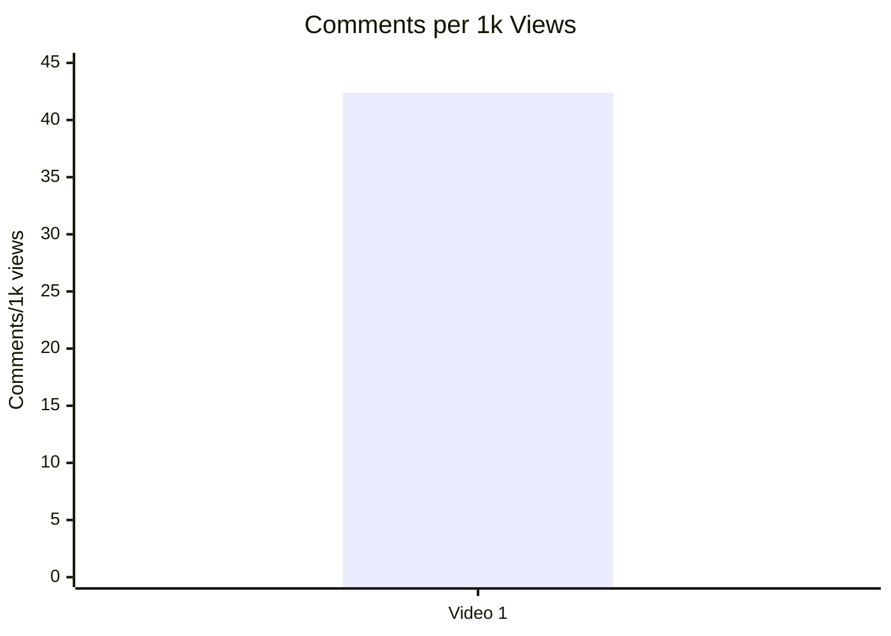

## 7. Графіки структури та hook

## 7.1. Hook score by video

- Назва графіка: Hook score by video
- Яке питання він відповідає: наскільки сильний hook у відео?
- Які поля використовуються: `video_label`, `hook_score`
- Тип графіка: Mermaid bar chart
- Що видно з графіка: Video 1 має hook score `4/5`.
- Практичний висновок: формула “7 suspicious inconsistencies” варта повторного тесту.

## 7.2. Hook type distribution

- Назва графіка: Hook type distribution
- Яке питання він відповідає: який primary hook type використовується?
- Які поля використовуються: `hook_primary_type`, count
- Тип графіка: Mermaid pie chart
- Що видно з графіка: у вибірці один hook type — `CURIOSITY_GAP`.
- Практичний висновок: недостатньо даних для висновку, що цей тип hook “кращий”; можна використовувати як baseline.

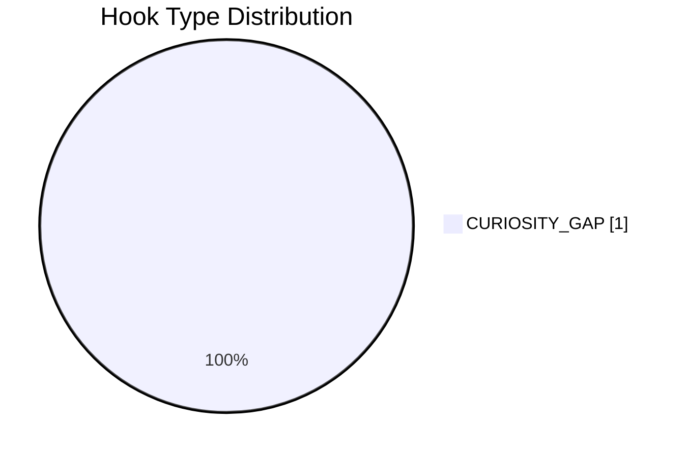

## 7.3. Time to first value vs Overall Score

- Назва графіка: Time to first value vs Overall Score
- Яке питання він відповідає: чи швидша перша цінність пов’язана з вищим результатом?
- Які поля використовуються: `time_to_first_value_seconds`, `overall_video_score`
- Тип графіка: scatter plot; для 1 точки подано таблицю.
- Що видно з графіка: Video 1 має `time_to_first_value = 210 sec`, `overall = 4.06`.
- Практичний висновок: у цьому відео перша цінність стартує о 03:30, а owner analytics фіксує різкий спад на старті; це гіпотеза для тесту, не кореляція.

| Video | Time to first value | Seconds | Overall Score | Status |
|---|---:|---:|---:|---|
| Video 1 | 03:30 | 210 | 4.06 | `LOW_CONFIDENCE` pattern only |

## 8. Графіки CTA

## 8.1. CTA score by video

- Назва графіка: CTA score by video
- Яке питання він відповідає: наскільки якісно CTA вбудовані у відео?
- Які поля використовуються: `video_label`, `cta_score`
- Тип графіка: Mermaid bar chart
- Що видно з графіка: Video 1 має CTA score `3/5`.
- Практичний висновок: CTA є, але головний простір для оптимізації — прибрати overload у фіналі й посилити next-video bridge.

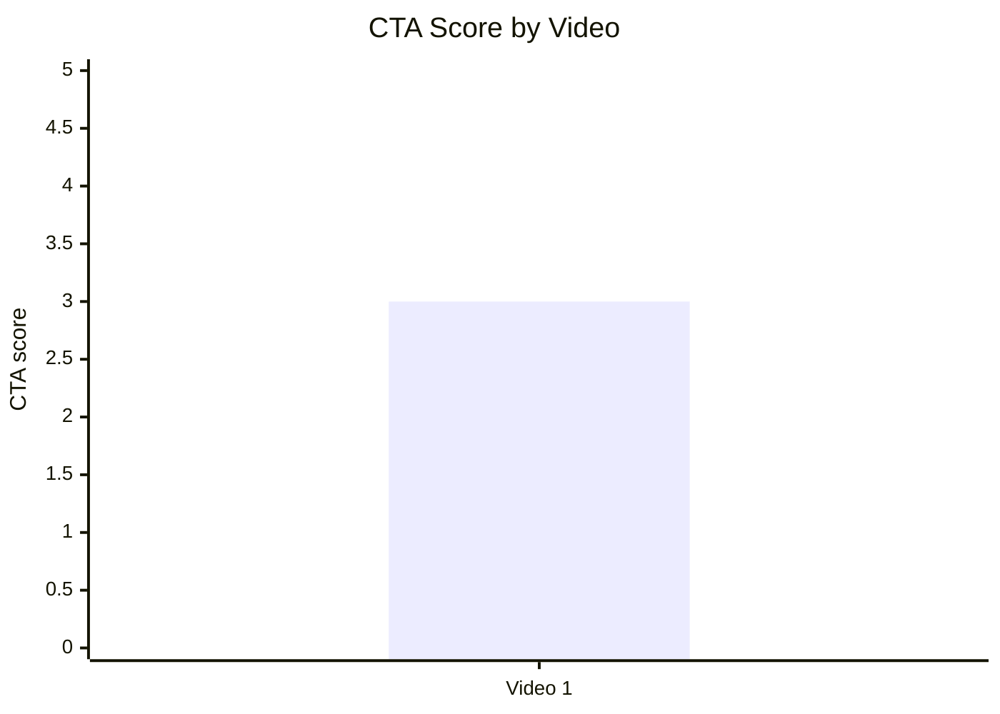

## 8.2. CTA count vs ER Public %

- Назва графіка: CTA count vs ER Public %
- Яке питання він відповідає: чи більше CTA пов’язано з кращим залученням?
- Які поля використовуються: `cta_count`, `er_public_percent`
- Тип графіка: scatter plot; для 1 точки подано таблицю.
- Що видно з графіка: Video 1 має `cta_count = 7`, `ER Public = 11.11%`.
- Практичний висновок: неможливо визначити зв’язок на 1 відео; водночас вихідний аналіз позначає ризик CTA overload.

| Video | CTA count | ER Public % | CTA overload risk |
|---|---:|---:|---|
| Video 1 | 7 | 11.11 | YES / PARTLY: фінал має багато напрямків одночасно |

## 8.3. CTA features heatmap

- Назва графіка: CTA features heatmap
- Яке питання він відповідає: які CTA features присутні?
- Які поля використовуються: `has_comment_prompt`, `has_subscribe_cta`, `has_like_cta`, `has_bell_cta`, `has_next_video_bridge`
- Тип графіка: Markdown heatmap / matrix
- Що видно з графіка: є comment prompt, subscribe, bell, next-video bridge; like CTA не підтверджений як окремий явний CTA у Comparable Summary JSON.
- Практичний висновок: next-video bridge є формально, але його ефективність слабка за end-screen CTR `0.5%`.

| Video | Comment prompt | Subscribe | Like | Bell | Next video bridge |
|---|---|---|---|---|---|
| Video 1 | ✅ | ✅ | `N/A` | ✅ | ✅ |

## 9. Графіки реклами / інтеграцій

Advertising graphs skipped: no third-party advertising integrations detected.

У вихідному YT_VIDEO_ANALYSIS_V1 звіті `ad_integration_score = NOT_APPLICABLE`, бо sponsor read не виявлено. Водночас є self-promo/support links: Patreon, BuyMeACoffee, Telegram/TikTok, донат ЗСУ, Figma/documents links. Точний `ad_load_percent` не визначений.

## 9.1. Ad load % by video

- Назва графіка: Ad load % by video
- Яке питання він відповідає: який відсоток відео займає реклама?
- Які поля використовуються: `ad_load_percent`
- Тип графіка: skipped
- Що видно з графіка: `INSUFFICIENT_DATA`, бо `ad_load_percent = N/A`.
- Практичний висновок: для наступних звітів треба точно фіксувати тривалість self-promo/support CTA у секундах.

| Video | Ad detected | Ad load % | Ad integration score | Note |
|---|---|---:|---|---|
| Video 1 | Self-promo/support links only | N/A | NOT_APPLICABLE | Third-party sponsor read не виявлено |

## 9.2. First ad position %

- Назва графіка: First ad position %
- Яке питання він відповідає: чи реклама/інтеграція стоїть занадто рано?
- Які поля використовуються: `first_ad_relative_position_percent`
- Тип графіка: skipped
- Що видно з графіка: `INSUFFICIENT_DATA`, бо точний first ad position для description links не застосовується.
- Практичний висновок: in-video support CTA стоїть наприкінці, тому не заважає першій цінності.

## 9.3. Ad integration score vs ER Public %

- Назва графіка: Ad integration score vs ER Public %
- Яке питання він відповідає: чи якість рекламної інтеграції пов’язана з реакцією аудиторії?
- Які поля використовуються: `ad_integration_score`, `er_public_percent`
- Тип графіка: skipped
- Що видно з графіка: `NOT_APPLICABLE`.
- Практичний висновок: неможливо оцінити вплив реклами на ER у цій вибірці.

## 10. Графіки аудіо

## 10.1. Audio score by video

- Назва графіка: Audio score by video
- Яке питання він відповідає: яка оцінка аудіо?
- Які поля використовуються: `video_label`, `audio_score`
- Тип графіка: Mermaid bar chart
- Що видно з графіка: Video 1 має audio score `4/5`.
- Практичний висновок: звук не виглядає головним обмеженням; більший ризик — fatigue через довжину та монологовість.

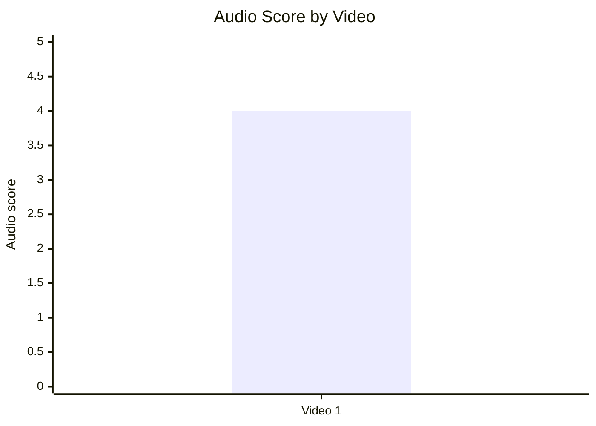

## 10.2. Audio score vs Overall Score

- Назва графіка: Audio score vs Overall Score
- Яке питання він відповідає: чи краща якість аудіо пов’язана з вищим overall?
- Які поля використовуються: `audio_score`, `overall_video_score`
- Тип графіка: scatter plot; для 1 точки подано таблицю.
- Що видно з графіка: audio score `4`, overall score `4.06`.
- Практичний висновок: зв’язок не оцінюється статистично через 1 відео.

| Video | Audio score | Overall score | Status |
|---|---:|---:|---|
| Video 1 | 4 | 4.06 | `INSUFFICIENT_DATA` for relationship |

## 11. Графіки коментарів

## 11.1. Sentiment distribution

- Назва графіка: Sentiment distribution
- Яке питання він відповідає: яка структура реакцій у коментарях?
- Які поля використовуються: `positive_percent`, `negative_percent`, `mixed_percent`, `neutral_percent`, `question_percent`, `request_percent`
- Тип графіка: Mermaid bar chart + table
- Що видно з графіка: найбільші частки — `NEUTRAL 42.67%` і `QUESTION 36.56%`.
- Практичний висновок: коментарі працюють як debate/Q&A loop; найкращий next step — відео з відповідями на заперечення.

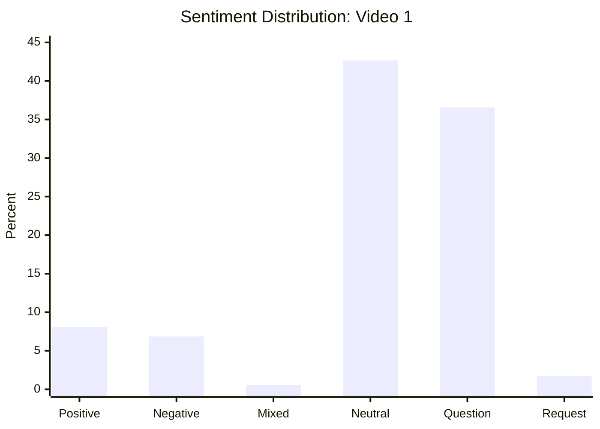

| Sentiment | Percent |
|---|---:|
| POSITIVE | 8.06 |
| NEGATIVE | 6.85 |
| MIXED | 0.54 |
| NEUTRAL | 42.67 |
| QUESTION | 36.56 |
| REQUEST | 1.71 |
| JOKE_MEME | 3.60 |

## 11.2. Comment resonance score by video

- Назва графіка: Comment resonance score by video
- Яке питання він відповідає: наскільки сильно відео резонує в коментарях?
- Які поля використовуються: `comment_resonance_score`
- Тип графіка: Mermaid bar chart
- Що видно з графіка: Video 1 має `5/5`.
- Практичний висновок: comment engine — найсильніша частина відео.

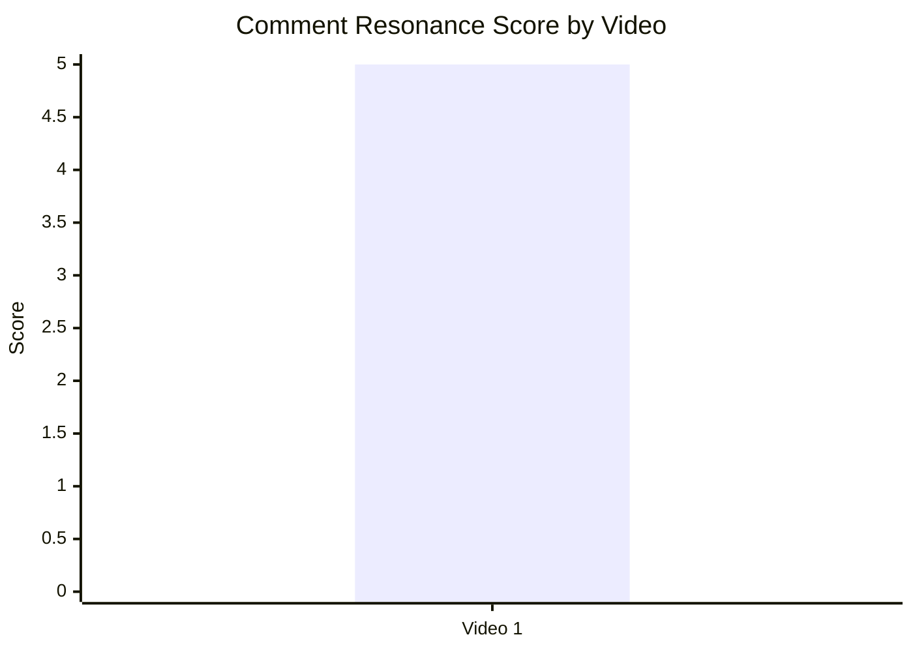

## 11.3. Top comment clusters

- Назва графіка: Top comment clusters
- Яке питання він відповідає: які теми найчастіше виникають у коментарях?
- Які поля використовуються: `cluster`, `% of relevant comments`
- Тип графіка: Mermaid bar chart + table
- Що видно з графіка: найбільші кластери — community discussion `41.40%` і question clarification `36.43%`.
- Практичний висновок: наступні відео варто будувати навколо уточнень, заперечень і доказової бази.

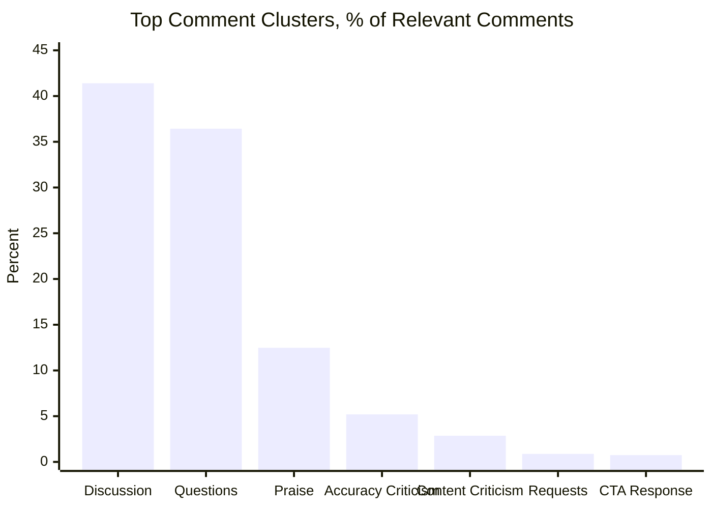

| Cluster | % of relevant comments | Practical meaning |
|---|---:|---|
| Community debate / довгі дискусії про ідентичність | 41.40 | Відео працює як дискусійний тригер. |
| Питання та уточнення до історичних тез | 36.43 | Є матеріал для Q&A / fact-check sequel. |
| Похвала за роботу / цінність матеріалу | 12.48 | Аудиторія цінує “великий обсяг роботи”. |
| Критика точності / джерел / маніпуляцій | 5.20 | Потрібна структурована сторінка джерел і відповіді на заперечення. |
| Критика позиції / звинувачення у русофобії чи расизмі | 2.86 | Частина негативу стосується рамки теми. |
| Запити / потенціал серії | 0.88 | Серійність є, але її треба підсилювати CTA. |
| CTA / лайки / підписка / поширення | 0.74 | CTA не є головним типом реакції в коментарях. |

## 12. Графіки score-системи

## 12.1. Overall score by video

- Назва графіка: Overall score by video
- Яке питання він відповідає: який загальний score відео?
- Які поля використовуються: `overall_video_score`
- Тип графіка: Mermaid bar chart
- Що видно з графіка: Video 1 має `4.06/5`.
- Практичний висновок: це сильний baseline для наступних long-form відео, але без когорти не є rank.

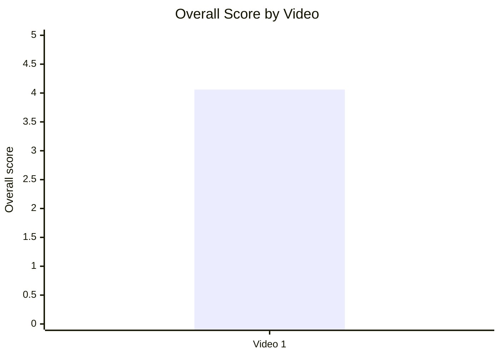

## 12.2. Score breakdown heatmap

- Назва графіка: Score breakdown heatmap
- Яке питання він відповідає: які score-компоненти сильні/слабкі?
- Які поля використовуються: `hook_score`, `structure_score`, `value_density_score`, `audio_score`, `cta_score`, `ad_integration_score`, `comment_resonance_score`, `replicability_score`, `overall_video_score`
- Тип графіка: Markdown heatmap table
- Що видно з графіка: найсильніше — comments `5`; найслабше — CTA `3`; ad = `NOT_APPLICABLE`.
- Практичний висновок: масштабувати debate/comment механіку; оптимізувати CTA і next-video bridge.

| Video | Hook | Structure | Value Density | Audio | CTA | Ad | Comments | Replicability | Overall |
|---|---:|---:|---:|---:|---:|---:|---:|---:|---:|
| Video 1 | 4 | 4 | 4 | 4 | 3 | NOT_APPLICABLE | 5 | 4 | 4.06 |

## 12.3. Strengths vs weaknesses count

- Назва графіка: Strengths vs weaknesses count
- Яке питання він відповідає: скільки сильних механік і missed opportunities зафіксовано?
- Які поля використовуються: count of `success_mechanics`, count of `missed_opportunities`
- Тип графіка: Mermaid bar chart
- Що видно з графіка: у вихідному звіті 5 success mechanics і 5 missed opportunities.
- Практичний висновок: відео має сильну основу, але є достатньо конкретних оптимізацій для наступних випусків.

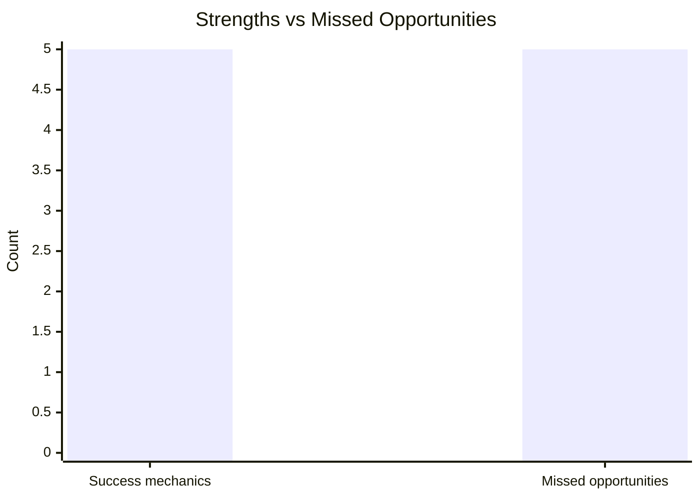

## 13. Кореляції та патерни

Correlation analysis skipped: fewer than 5 comparable videos.

| Pair | Correlation / Pattern | Strength | Interpretation | Confidence |
|---|---:|---|---|---|
| hook_score → overall_video_score | `INSUFFICIENT_DATA` | N/A | Потрібно мінімум 5 comparable відео для кореляції. | LOW |
| value_density_score → er_public_percent | `INSUFFICIENT_DATA` | N/A | Потрібно мінімум 5 comparable відео. | LOW |
| cta_score → comment_rate_percent | `INSUFFICIENT_DATA` | N/A | CTA score одного відео не дозволяє оцінити зв’язок. | LOW |
| comment_resonance_score → er_public_percent | `INSUFFICIENT_DATA` | N/A | Є сильний single-video signal, але це не кореляція. | LOW |
| views_per_day → er_public_percent | `INSUFFICIENT_DATA` | N/A | Немає порівняльних точок. | LOW |
| ad_load_percent → er_public_percent | `NOT_APPLICABLE` | N/A | Ad load не визначено. | LOW |
| time_to_first_value_seconds → overall_video_score | `LOW_CONFIDENCE pattern` | LOW | Є гіпотеза: 210 секунд до first value + різкий стартовий спад можуть шкодити retention. | LOW |

## 14. Висновки для контент-стратегії

| Спостереження | Дані / графік | Що це означає | Що робити |
|---|---|---|---|
| Відео має сильний comment engine | `comment_resonance_score = 5`, `comments_per_1k_views = 42.38`, clusters: discussion 41.40%, questions 36.43% | Тема й формат провокують обговорення, уточнення і fact-check | Робити follow-up “відповіді на головні заперечення” і pinned correction hub |
| Hook працює як структурна обіцянка | `hook_score = 4`, primary hook `CURIOSITY_GAP` | Список “7 нестыковок” дає глядачу карту payoff | Тестувати формулу “5–7 суперечностей → доказові блоки → висновок” |
| CTA — найслабший score-блок | `cta_score = 3`, end-screen CTR `0.5%` проти channel avg `2.1%` | Фінал неефективно переводить глядача в наступну дію | Зменшити кількість фінальних CTA і зробити один сильний next-video bridge |
| Старт може бути повільним | `time_to_first_value = 03:30`, retention summary: різкий спад на старті | Частина глядачів може не дочекатися доказової частини | Тестувати cold open з найсильнішим доказом у перші 20–30 секунд |
| Реклама не є головним фактором | `ad_integration_score = NOT_APPLICABLE`, ad criticism cluster незначущий | Негатив аудиторії не сфокусований на рекламі | Не додавати early sponsor read у подібні evidence-heavy відео без тесту |
| Плейлист/session strategy недовикористана | Missed opportunity: weak end-screen CTR, playlist share низький у вихідному звіті | Відео створює інтерес, але не добирає session time | Створити серію/плейлист і вести в наступний ролик через pinned comment та end screen |

## 15. Що тестувати далі

| Тест | Гіпотеза | На яких даних базується | Як виміряти | Пріоритет |
|---|---|---|---|---|
| Cold open з найсильнішим доказом | Якщо показати proof у перші 20–30 секунд, стартовий drop-off зменшиться | `time_to_first_value = 03:30`; retention summary: різкий спад на старті | Retention at 0:30, 1:00, 3:00; AVD; views/day | HIGH |
| Один основний фінальний CTA | Якщо залишити один next-video CTA, end-screen CTR зросте | `cta_score = 3`; end-screen CTR `0.5%` vs channel avg `2.1%` | End-screen CTR, next video views, session duration | HIGH |
| Pinned correction/source hub | Якщо структурувати джерела й помилки в pinned comment, критика точності стане productive engagement | cluster `CRITICISM_ACCURACY = 5.20%`; pinned comment уже працює як correction loop | Коментарі з таймкодами, reply depth, sentiment shift, repeat viewers | HIGH |
| Відео-відповідь на 10 головних заперечень | Якщо відповісти на repeated objections, можна конвертувати негатив/питання в watch time | `QUESTION_CLARIFICATION = 36.43%`, `COMMUNITY_DISCUSSION = 41.40%` | CTR, comment_rate, shares, positive/negative ratio | HIGH |
| Серійність “7 суперечностей” | Якщо повторити hook template, curiosity gap може стабільно піднімати engagement | `hook_score = 4`, strong discussion clusters | CTR, first 30s retention, ER Public %, comments/1k views | MEDIUM |
| Playlist + pinned viewing order | Якщо дати порядок перегляду, session time зросте | Missed opportunity: playlist strategy слабка; next-video bridge слабкий | Playlist starts, end-screen CTR, traffic from playlists | MEDIUM |
| Розділення support links після основної дії | Якщо support CTA не конкурує з next-video CTA, буде менше action dilution | Фінал містить subscribe, bell, Patreon, BuyMeACoffee, ЗСУ, documents, English video, share | End-screen CTR, external link clicks, support conversion | MEDIUM |

## 16. Дані для експорту в таблицю / CSV

| video_label | title | format_group | views | views_per_day | like_rate_percent | comment_rate_percent | er_public_percent | views_per_1k_subs | hook_type | hook_score | cta_count | cta_score | ad_load_percent | ad_integration_score | audio_score | comment_resonance_score | overall_video_score | top_success_mechanic | top_missed_opportunity |
|---|---|---|---:|---:|---:|---:|---:|---:|---|---:|---:|---:|---:|---:|---:|---:|---:|---|---|
| Video 1 | Настоящая история московитов | LONG_20_PLUS_MIN | 204552 | 282.92 | 6.87 | 4.24 | 11.11 | 10027.06 | CURIOSITY_GAP | 4 | 7 | 3 | N/A | NOT_APPLICABLE | 4 | 5 | 4.06 | CONTROVERSY_OR_DEBATE | NO_NEXT_VIDEO_BRIDGE / weak end-screen CTR |
