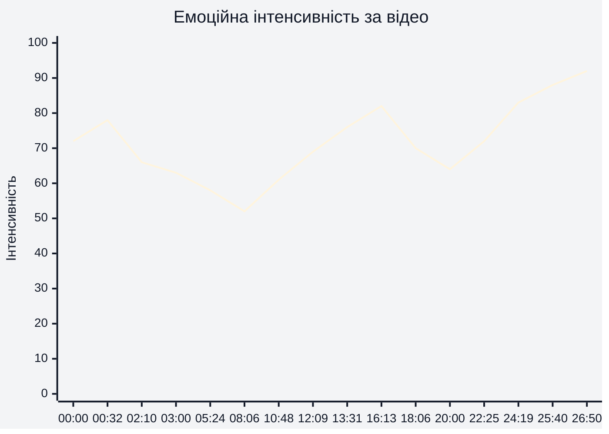
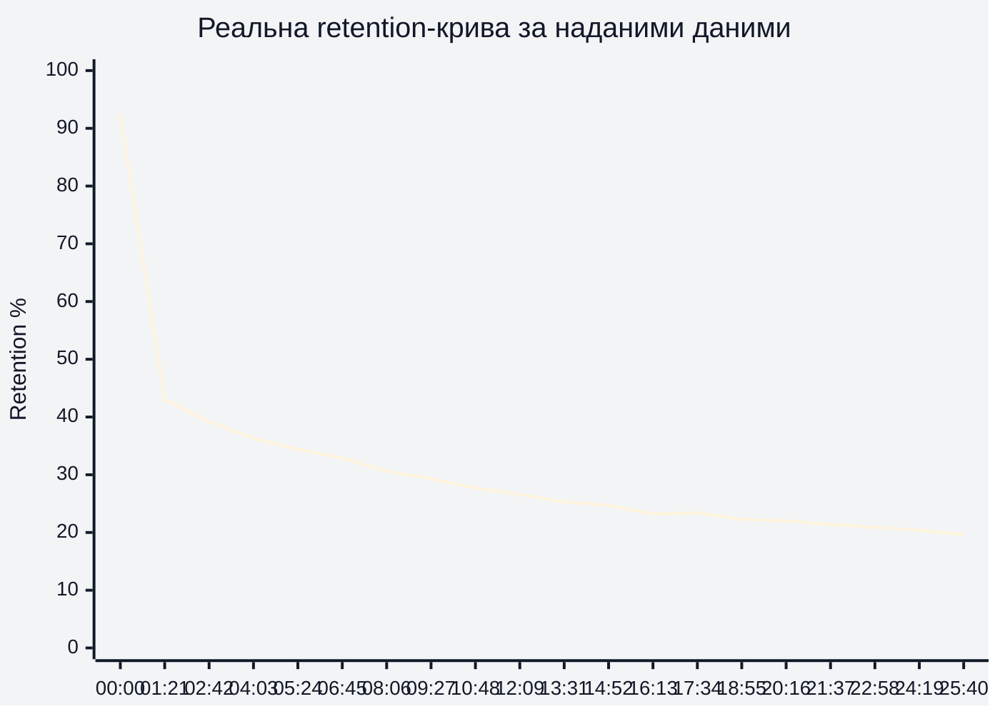
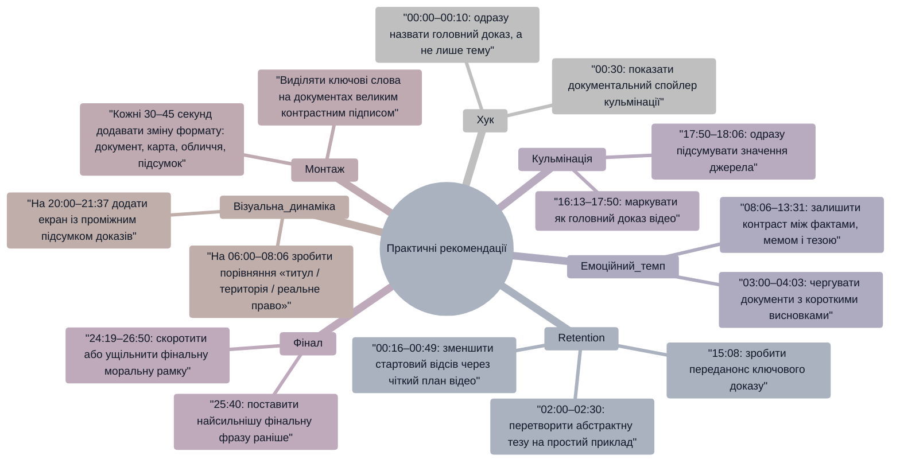

# Аналіз довгоформатного YouTube-відео

**Відео:** «Разоблачение титула московских царей Всея Руси»  
**Тривалість:** 27:01  
**Основа аналізу:** відеоряд, видимі слайди/документи й надані retention-дані з CSV. Транскрипт із таймкодами не надано, тому змістові висновки прив’язані до візуальних епізодів і таймкодів відео.

## 1. Сюжетна дуга (Narrative Arc)

```mermaid
%%{init: {'theme':'base', 'themeVariables': {
'primaryColor':'#f3f4f6',
'primaryTextColor':'#111827',
'primaryBorderColor':'#2563eb',
'lineColor':'#2563eb',
'secondaryColor':'#ffffff',
'tertiaryColor':'#f3f4f6',
'background':'#f3f4f6'
}}}%%
flowchart LR
    A["00:00–00:32<br/>Хук<br/>Автор одразу заводить глядача в конфлікт навколо титулу московських царів і показує історичні образи Русі."]
    B["00:32–02:10<br/>Експозиція<br/>Пояснюється рамка проблеми: треба розрізняти назву держави, титул правителя й політичну претензію."]
    C["02:10–05:24<br/>Перша ескалація<br/>З’являються документи, списки правителів і церковно-політичні аргументи, які переводять тезу з думки в доказову базу."]
    D["05:24–08:06<br/>Переломний момент<br/>Титул «усієї Русі» подається не як факт володіння, а як претензія, яку потрібно перевіряти джерелами."]
    E["08:06–13:31<br/>Наростання напруги<br/>Автор посилює полеміку через документи, мемний візуал і слайд про претензію на Київську Русь."]
    F["13:31–18:06<br/>Кульмінація<br/>Найщільніший блок доказів: історичні джерела, контекст Москви/Московії та теза про самопроголошення титулу."]
    G["18:06–23:30<br/>Розв’язка<br/>Розбираються контраргументи про спадкоємність, назву держави й право на титул."]
    H["23:30–27:01<br/>Фінальний висновок<br/>Історичний розбір переходить у морально-політичну оцінку та емоційне підсумування."]
    A --> B --> C --> D --> E --> F --> G --> H
```

## 2. Ключові Story Beats

```mermaid
%%{init: {'theme':'base', 'themeVariables': {
'primaryColor':'#f3f4f6',
'primaryTextColor':'#111827',
'primaryBorderColor':'#2563eb',
'lineColor':'#2563eb',
'secondaryColor':'#ffffff',
'tertiaryColor':'#f3f4f6',
'background':'#f3f4f6'
}}}%%
flowchart LR
    B1["00:00<br/>Автор відкриває відео прямим зверненням<br/>Функція: швидко задати конфлікт."]
    B2["00:30<br/>Монтаж із княжими/історичними образами<br/>Функція: показати масштаб теми."]
    B3["02:00<br/>Слайд про підміну понять: назва держави і титул правителя<br/>Функція: сформувати головний критерій аналізу."]
    B4["03:00<br/>Перший великий документальний доказ на екрані<br/>Функція: перевести розмову в доказову площину."]
    B5["04:00<br/>Список князів і згадка про політико-церковний контекст<br/>Функція: розширити історичне тло."]
    B6["06:00<br/>Поява формули «государь усієї Русі» поруч із артефактами<br/>Функція: відокремити титул від реального контролю територій."]
    B7["08:00<br/>Текстові джерела й візуальні вставки з підсвічуванням<br/>Функція: ущільнити аргументацію."]
    B8["12:00<br/>Слайд про претензію на Київську Русь<br/>Функція: прямо назвати мотивацію претензії."]
    B9["13:31<br/>Блок із джерелами про Московію<br/>Функція: підвести до кульмінаційного спростування."]
    B10["16:13<br/>Слайд про самопроголошення титулу<br/>Функція: сформулювати головний обвинувальний висновок."]
    B11["22:25<br/>Контраргумент №2 і відповідь автора<br/>Функція: закрити потенційне заперечення глядача."]
    B12["25:40–26:50<br/>Фінальна моральна рамка з сильними емоційними образами<br/>Функція: залишити глядача з підсумковим судженням."]
    B1 --> B2 --> B3 --> B4 --> B5 --> B6 --> B7 --> B8 --> B9 --> B10 --> B11 --> B12
```

## 3. Емоційний темп

Емоційна дуга починається високо на 00:00–00:32 через прямий хук, просідає в пояснювальному блоці 02:10–05:24, а потім росте через полемічні слайди 12:00, щільні докази 16:13–17:50 і фінальне моральне підсумування 25:40–26:50.

## 4. Утримання аудиторії

Retention-дані надано, тому графік вище побудовано на реальній кривій із CSV, агрегованій за кроком 5% тривалості відео. Найбільша втрата відбувається на старті: з 92,42% на 00:00 до 67,37% на 00:16 і 57,38% на 00:32. Після 05:24 крива стабілізується повільніше: 34,40% на 05:24, 25,26% на 13:31, 22,06% на 20:00 і 17,35% на 26:45.

## 5. Піки retention

| Таймкод | Подія | Чому це може утримувати увагу | Сила піку 1–10 |
|---|---|---|---|
| 00:00 | Початкове звернення автора й заявка на викриття титулу | Високий стартовий інтерес: retention 92,42%, глядач ще перевіряє обіцянку відео | 9 |
| 05:57 | Блок про титул «усієї Русі» та його політичне значення | Є маленьке локальне зростання з 34,08% до 34,10%, бо теза стає конкретнішою | 5 |
| 08:23 | Документальний/текстовий блок після вступного падіння | Локальний приріст +0,30 п.п. на 08:23 показує, що фактаж і екранні докази підхоплюють увагу | 6 |
| 10:16 | Мемний або іронічний візуальний епізод перед тезою про претензію на Русь | Зміна формату після документів дає невеликий приріст +0,09 п.п. | 5 |
| 17:34–17:50 | Найпомітніший локальний підйом у кульмінаційному блоці джерел | Retention зростає з 22,81% на 18:06 до 23,36% на 17:34 і 23,87% на 17:50; це найсильніша зона повторного інтересу | 8 |
| 22:25 | Контраргумент №2 і відповідь автора | Формат «заперечення → відповідь» активує увагу: локальний приріст +0,57 п.п. | 7 |
| 23:30 | Перехід до фінального морального висновку | Невелике утримання +0,05 п.п. через різку зміну емоційного тону | 5 |
| 25:40 | Фінальний блок із сильними образами «без честі» | Перед фіналом retention коротко підростає +0,05 п.п.; емоційний монтаж утримує ядро аудиторії | 6 |

## 6. Провали retention

| Таймкод | Проблема | Ймовірна причина спаду | Що покращити |
|---|---|---|---|
| 00:16 | Дуже різкий спад із 92,42% до 67,37% | Хук, імовірно, не встигає одразу дати чітку винагороду або головний доказ | Додати на 00:00–00:10 конкретну обіцянку: «за 27 хвилин покажу 3 докази, чому титул був політичною претензією». |
| 00:32 | Спад до 57,38% | Перехід від інтриги до історичного вступу може здаватися повільним | На 00:30 одразу показати найсильніший документ або короткий «спойлер» кульмінації. |
| 00:49 | Спад до 47,25% | Третя хвиля стартового відсіву: глядачі, які не отримали швидкої структури, виходять | Додати візуальний план відео на 00:45: «1) титул, 2) джерела, 3) контраргументи». |
| 02:26 | Retention близько 39,61%, нижче очікуваної кривої | Пояснення про підміну понять може бути абстрактним без швидкого прикладу | На 02:00–02:30 додати екран «Назва держави ≠ титул правителя» з одним простим прикладом. |
| 04:03 | Спад до 36,26% | Блок списків і контексту може перевантажувати фактами | Розбити 03:00–04:03 на 2–3 короткі тези з проміжними висновками. |
| 15:08 | Спад до 23,81% | Перед кульмінацією глядач може втомитися від щільного документального матеріалу | На 14:52–15:08 додати «через 60 секунд — ключовий доказ» і візуально позначити наближення кульмінації. |
| 18:06 | Спад після локального піку 17:34–17:50 | Після сильного доказу напруга коротко розряджається | Одразу після 17:50 дати короткий підсумок: «Отже, це не спадкоємність, а претензія». |
| 26:45 | Фінал падає до 17,35% | Емоційна розв’язка довга для частини аудиторії, яка вже отримала головний висновок | Стиснути фінальний блок 24:19–26:50 або перенести найсильнішу фразу до 25:40. |

## 7. Оцінка сегментів

| Сегмент | Таймкод | Функція | Емоційна інтенсивність | Ризик втрати уваги | Оцінка 1–10 | Що покращити |
|---|---|---|---|---|---|---|
| Хук | 00:00–00:32 | Заявити конфлікт навколо титулу та швидко показати історичний масштаб | 75/100 | Високий після перших 16 секунд: retention падає з 92,42% до 67,37% | 7 | Сформулювати головну обіцянку в перші 5 секунд і раніше показати доказ/артефакт. |
| Експозиція | 00:32–02:10 | Розвести поняття назви держави й титулу правителя | 64/100 | Високий: до 02:10 retention уже близько 40,9% | 6 | Скоротити вступні пояснення, додати візуальну карту аргументу на 00:45–01:20. |
| Перша ескалація | 02:10–05:24 | Підкріпити тезу списками, історичними постатями й документами | 58/100 | Середній: retention знижується з 40,9% до 34,4% | 7 | На 03:00–04:03 розбити документальні докази на коротші мікро-висновки. |
| Переломний момент | 05:24–08:06 | Показати, що титул «усієї Русі» не дорівнює реальному володінню Руссю | 62/100 | Середній: на 05:57 є маленьке утримання +0,02 п.п. | 8 | Підсилити 05:24–06:45 контрастом «титул проти території» у двох кадрах. |
| Наростання напруги | 08:06–13:31 | Посилити полеміку через мем, слайд із претензією на Русь і джерела | 68/100 | Середньо-високий: retention з 30,6% до 25,3%, але темп тримається через зміну форматів | 8 | На 10:48–12:09 пришвидшити перехід від мему до чіткої тези. |
| Кульмінація доказів | 13:31–18:06 | Зібрати найсильніші документи, карту/хроніку й тезу про самозванство | 82/100 | Низько-середній: падіння до 22,8%, але 17:34–17:50 дає найпомітніше локальне зростання +1,06 п.п. | 9 | Раніше анонсувати, що 16:13–17:50 буде ключовий доказ, аби підняти retention до кульмінації. |
| Розв’язка | 18:06–23:30 | Закрити контраргументи про назву, спадкоємність і право на титул | 72/100 | Низький: тримається біля 21–23%, на 22:25 є локальний підйом +0,57 п.п. | 8 | На 20:00–21:37 зробити короткий підсумковий екран «що вже доведено». |
| Фінальний висновок | 23:30–27:01 | Перевести історичну тезу в морально-політичний висновок | 88/100 | Середній: емоція висока, але retention падає до 17,35% у фіналі | 7 | Скоротити 24:19–26:50 або додати сильний фінальний call-to-action до 25:40. |

## 8. Практичні рекомендації

## 9. Підсумкова оцінка

| Показник | Оцінка 1–10 | Коментар |
|---|---:|---|
| Сюжетна дуга | 8 | Є чіткий шлях від хука 00:00 до історичних доказів 16:13–17:50 і фінального висновку 25:40–26:50; слабке місце — різкий стартовий спад 00:16–00:49. |
| Story Beats | 8 | Ключові точки добре розкладені: 02:00 дає рамку, 06:00 фокусує на титулі, 12:00 називає претензію, 22:25 закриває контраргумент. |
| Емоційний темп | 8 | Емоція наростає до кульмінації 16:13–17:50 і фіналу 25:40–26:50, але 03:00–05:24 потребує динамічнішого монтажного ритму. |
| Retention Structure | 6 | Дані показують сильний стартовий відсів: 92,42% на 00:00, 67,37% на 00:16, 47,25% на 00:49; після цього крива стабілізується, але до фіналу падає до 17,35%. |
| Загальна оцінка | 7 | Відео має сильну доказову й емоційну конструкцію, але потребує жорсткішого хука, швидшої структури на старті та ущільнення фінальних 3 хвилин. |
