# Статистичний аналіз відеозвітів

## 1. Короткий executive summary

| Пункт                              | Висновок                                                                                                                                                  |
| ---------------------------------- | --------------------------------------------------------------------------------------------------------------------------------------------------------- |
| Скільки відео проаналізовано       | 1                                                                                                                                                         |
| Скільки форматів відео             | 1: `LONG_20_PLUS_MIN`                                                                                                                                     |
| Найсильніше відео за overall score | Video 1 — `3.85`                                                                                                                                          |
| Найсильніше відео за ER Public %   | Video 1 — `15.14%`                                                                                                                                        |
| Найсильніше відео за views per day | Video 1 — `95.54`                                                                                                                                         |
| Найсильніша повторювана механіка   | `INSUFFICIENT_DATA`: лише 1 відео. У межах відео: `CONTROVERSY_OR_DEBATE`, `HIGH_COMMENT_TRIGGER`, `SEARCH_INTENT_MATCH`                                  |
| Найчастіша слабкість               | `INSUFFICIENT_DATA`: лише 1 відео. У межах відео: `NO_NEXT_VIDEO_BRIDGE`, `MISSING_PINNED_COMMENT_STRATEGY`, `CTA_TOO_GENERIC`                            |
| Головна стратегічна можливість     | Масштабувати формат “один аргумент опонента → 4 спростування → контраргумент → payoff”, але посилити pinned comment, end-screen bridge і конкретність CTA |
| Рівень впевненості                 | `LOW_CONFIDENCE` для статистичних патернів; `MEDIUM` для описових висновків одного відео                                                                  |

## 2. Якість і повнота даних

| Поле                    | Кількість відео з даними | Кількість N/A | Коментар                                                         |
| ----------------------- | -----------------------: | ------------: | ---------------------------------------------------------------- |
| views                   |                        1 |             0 | `55 415`                                                         |
| likes                   |                        1 |             0 | `3 785`                                                          |
| comments_count          |                        1 |             0 | `4 607` у метаданих; файл коментарів має `3 494` записів         |
| views_per_day           |                        1 |             0 | `95.54`                                                          |
| er_public_percent       |                        1 |             0 | `15.14%`                                                         |
| views_per_1k_subs       |                        1 |             0 | `2716.42`                                                        |
| hook_score              |                        1 |             0 | `4`                                                              |
| cta_score               |                        1 |             0 | `3`                                                              |
| ad_integration_score    |                        1 |             0 | `3`, але це self-promo/description links, не third-party sponsor |
| audio_score             |                        1 |             0 | `3`                                                              |
| comment_resonance_score |                        1 |             0 | `5`                                                              |
| overall_video_score     |                        1 |             0 | `3.85`                                                           |

### Обмеження аналізу

* Вибірка = 1 відео, тому кореляції не будуються.
* Усі патерни мають статус `LOW_CONFIDENCE`.
* Формат один: `LONG_20_PLUS_MIN`, змішування форматів немає.
* Transcript має `NO_TIMECODES`.
* Comments data = `PARTIAL_DATA`.

## 3. Підготовлена таблиця для графіків

| Video | Format | Views | Likes | Comments | Views/day | Like Rate % | Comment Rate % | ER Public % | Views/1k subs | Hook | CTA | Ad | Audio | Comment Resonance | Overall |
|---|---|---:|---:|---:|---:|---:|---:|---:|---:|---:|---:|---:|---:|---:|---:|
| Video 1 | LONG_20_PLUS_MIN | 55 415 | 3 785 | 4 607 | 95,5 | 6,83 | 8,31 | 15,14 | 2 716,4 | 4 | 3 | 3 | 3 | 5 | 3.85 |

| Label   | Full title                                       | URL                                                                                        |
| ------- | ------------------------------------------------ | ------------------------------------------------------------------------------------------ |
| Video 1 | Разоблачение титула московских царей "Всея Руси" | [https://www.youtube.com/watch?v=aa0hA79QEHs](https://www.youtube.com/watch?v=aa0hA79QEHs) |

## 4. Рекомендовані графіки

|  # | Назва графіка           | Тип графіка     | Поля                                 | Для чого потрібен                   | Пріоритет |
| -: | ----------------------- | --------------- | ------------------------------------ | ----------------------------------- | --------- |
|  1 | Overall score by video  | Mermaid bar     | `overall_video_score`                | Побачити загальний score            | HIGH      |
|  2 | Views per day by video  | Mermaid bar     | `views_per_day`                      | Оцінити normalized performance      | HIGH      |
|  3 | ER Public % by video    | Mermaid bar     | `er_public_percent`                  | Оцінити залучення                   | HIGH      |
|  4 | Hook score by video     | Mermaid bar     | `hook_score`                         | Оцінити hook                        | HIGH      |
|  5 | CTA score by video      | Mermaid bar     | `cta_score`                          | Оцінити CTA                         | HIGH      |
|  6 | Score breakdown heatmap | Markdown matrix | scores                               | Побачити сильні/слабкі сторони      | HIGH      |
|  7 | CTA features heatmap    | Markdown matrix | CTA flags                            | Побачити CTA-покриття               | HIGH      |
|  8 | Comment resonance score | Mermaid bar     | `comment_resonance_score`            | Оцінити коментарний резонанс        | HIGH      |
|  9 | Ad integration score    | Mermaid bar     | `ad_integration_score`               | Оцінити self-promo / integration    | MEDIUM    |
| 10 | Performance quadrant    | Table           | `views_per_day`, `er_public_percent` | Потрібен для майбутнього порівняння | MEDIUM    |

## 5. Графіки продуктивності

## 5.1. Views by video

* Питання: яке відео має найбільший raw reach?
* Поля: `video_label`, `views`
* Тип: bar chart
* Висновок: у вибірці лише одне відео, тому це baseline, не порівняння.

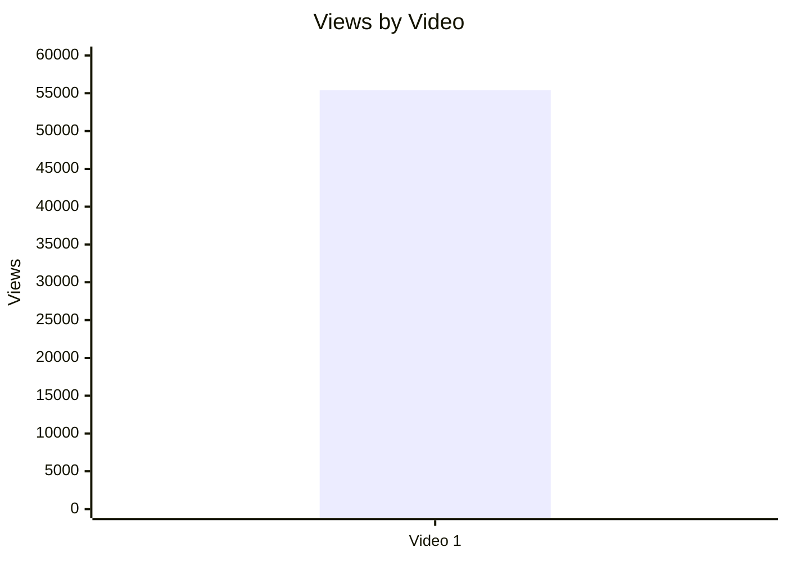

## 5.2. Views per day by video

* Питання: яка швидкість набору переглядів?
* Поля: `video_label`, `views_per_day`
* Практичний висновок: `95.54 views/day` — baseline для майбутніх long-form відео.

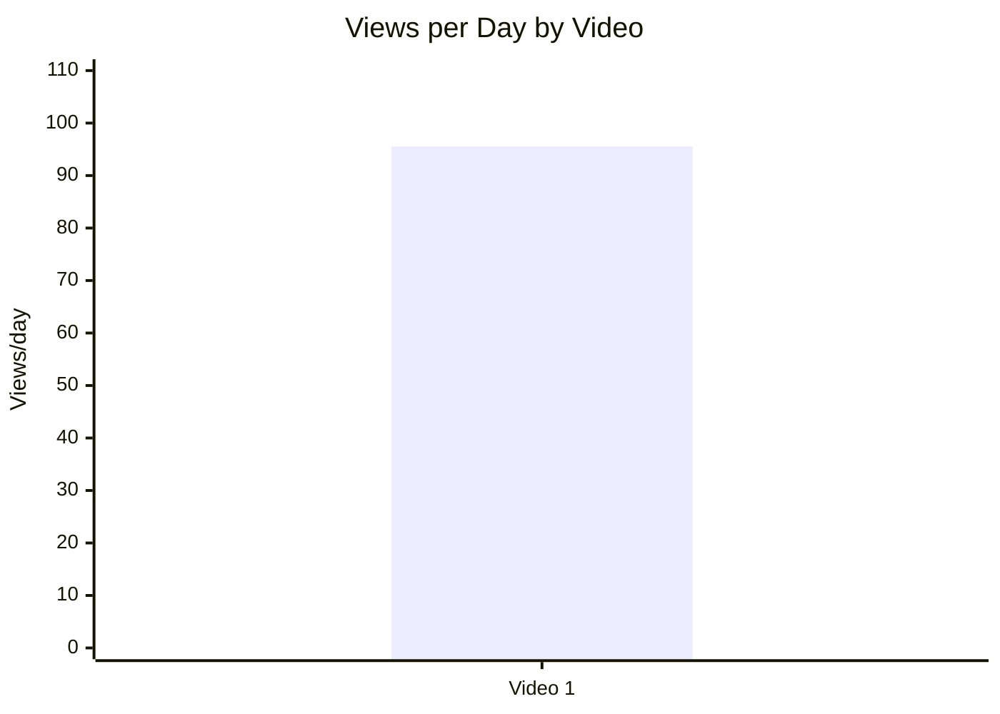

## 5.3. Views per 1k subscribers

* Питання: наскільки відео перетворює розмір каналу в перегляди?
* Поля: `views_per_1k_subs`
* Практичний висновок: `2716.42` views/1k subs — сильна нормалізована точка для майбутнього benchmark.

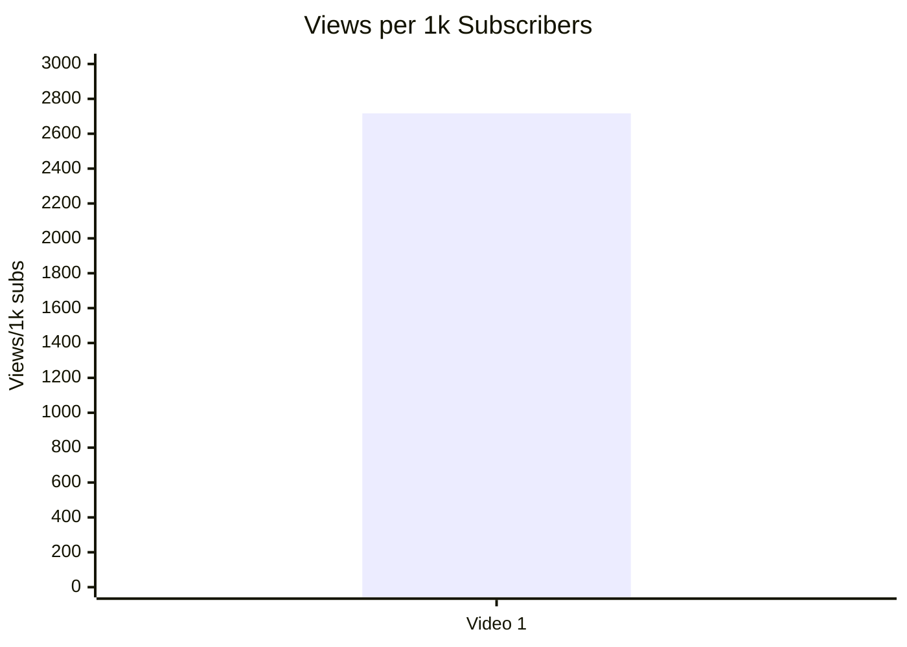

## 5.4. Performance quadrant

| Video   | Views/day | ER Public % | Quadrant status                                          |
| ------- | --------: | ----------: | -------------------------------------------------------- |
| Video 1 |     95.54 |       15.14 | `INSUFFICIENT_DATA`: немає median/benchmark для high/low |

## 6. Графіки залучення

## 6.1. ER Public % by video

* Поля: `video_label`, `er_public_percent`
* Висновок: `15.14%` — сильний single-video signal, але без порівняльної когорти.

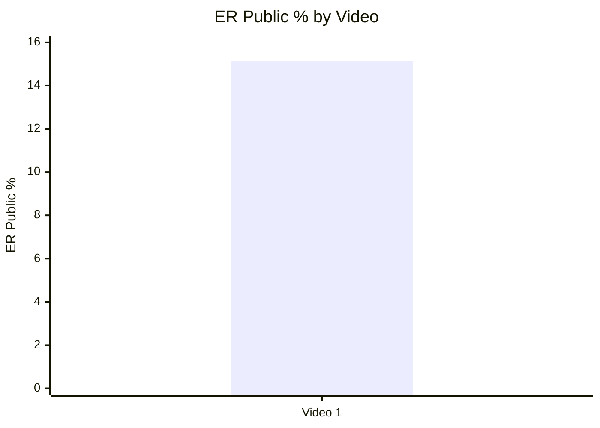

## 6.2. Like Rate % vs Comment Rate %

| Video   | Like Rate % | Comment Rate % | Interpretation                                                         |
| ------- | ----------: | -------------: | ---------------------------------------------------------------------- |
| Video 1 |        6.83 |           8.31 | Коментарна реакція сильніша за лайкову; відео працює як debate trigger |

## 6.3. Comments per 1k views

* Поля: `comments_per_1k_views`
* Розрахунок із звіту: `83.14`

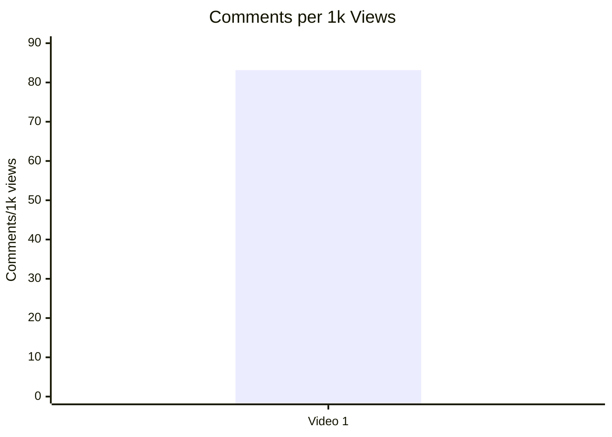

## 7. Графіки структури та hook

## 7.1. Hook score by video

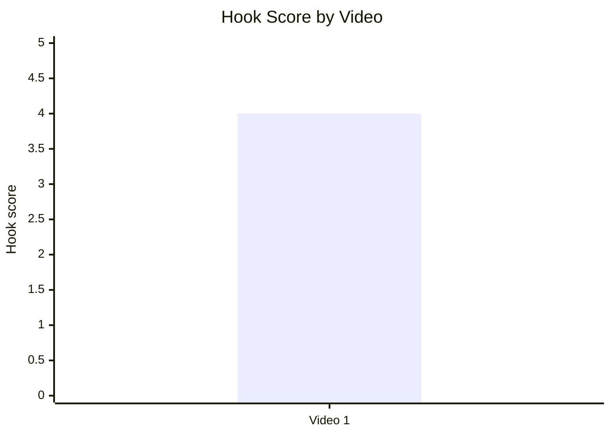

## 7.2. Hook type distribution

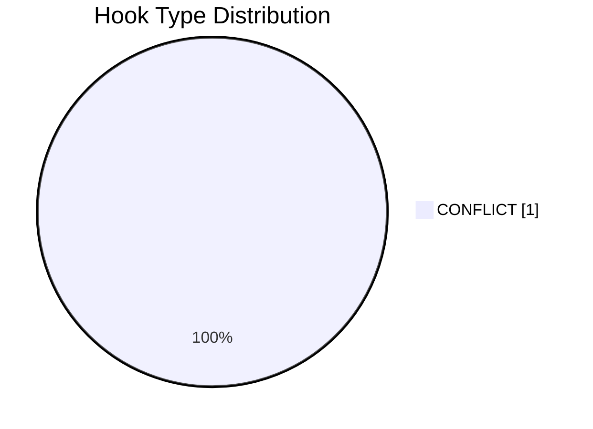

## 7.3. Time to first value vs Overall Score

| Video   | Time to first value                       | Seconds | Overall Score | Status                          |
| ------- | ----------------------------------------- | ------: | ------------: | ------------------------------- |
| Video 1 | immediate thesis / exact time unavailable |     N/A |          3.85 | `NO_TIMECODES`; scatter skipped |

## 8. Графіки CTA

## 8.1. CTA score by video

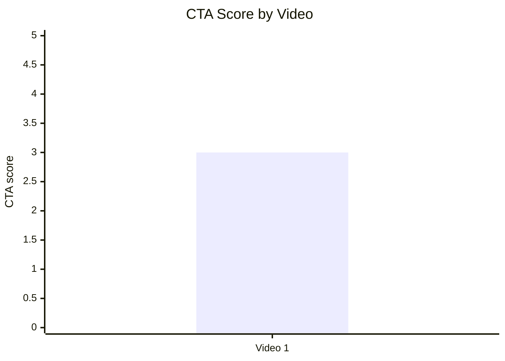

## 8.2. CTA count vs ER Public %

| Video   | CTA count | ER Public % | Interpretation                                                           |
| ------- | --------: | ----------: | ------------------------------------------------------------------------ |
| Video 1 |         4 |       15.14 | `INSUFFICIENT_DATA`: неможливо оцінити зв’язок; CTA позначено як generic |

## 8.3. CTA features heatmap

| Video   | Comment prompt | Subscribe | Like  | Bell  | Next video bridge |
| ------- | -------------- | --------- | ----- | ----- | ----------------- |
| Video 1 | ✅              | ✅         | `N/A` | `N/A` | ✅                 |

## 9. Графіки реклами / інтеграцій

## 9.1. Ad load % by video

| Video   | Ad detected | Ad load % | Ad integration score | Note                                                              |
| ------- | ----------- | --------: | -------------------: | ----------------------------------------------------------------- |
| Video 1 | YES         |       N/A |                    3 | Description link + in-video self-promo; exact ad load unavailable |

## 9.2. First ad position %

| Video   | First ad time                                      | First ad relative position % | Status                      |
| ------- | -------------------------------------------------- | ---------------------------: | --------------------------- |
| Video 1 | description link; in-video self-promo ~10:30–14:55 |                          N/A | exact timestamp unavailable |

## 9.3. Ad integration score vs ER Public %

| Video   | Ad integration score | ER Public % | Interpretation                                                       |
| ------- | -------------------: | ----------: | -------------------------------------------------------------------- |
| Video 1 |                    3 |       15.14 | `INSUFFICIENT_DATA`: вплив інтеграції на ER не оцінюється на 1 відео |

## 10. Графіки аудіо

## 10.1. Audio score by video

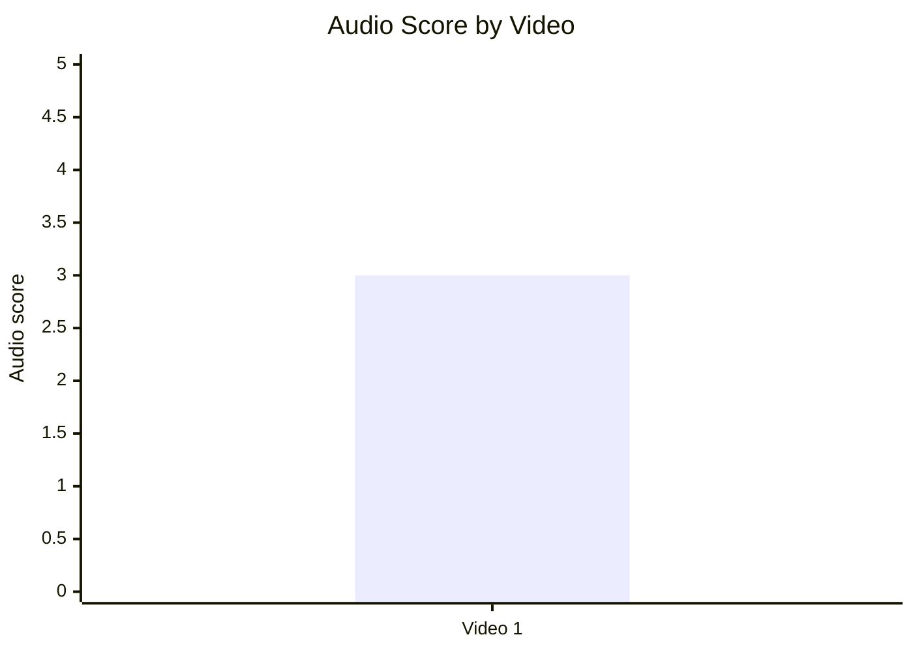

## 10.2. Audio score vs Overall Score

| Video   | Audio score | Overall score | Status                               |
| ------- | ----------: | ------------: | ------------------------------------ |
| Video 1 |           3 |          3.85 | `INSUFFICIENT_DATA` for relationship |

## 11. Графіки коментарів

## 11.1. Sentiment distribution

| Sentiment / Pattern  |                                 Value |
| -------------------- | ------------------------------------: |
| Metadata comments    |                                  4607 |
| Parsed comments file |                                  3494 |
| Comment data quality |                          PARTIAL_DATA |
| Dominant reaction    | Debate / questions / factual disputes |
| Exact sentiment %    |                                   N/A |

Sentiment distribution chart skipped: exact percentage split was not available in the attached `YT_VIDEO_ANALYSIS_V1` report.

## 11.2. Comment resonance score by video

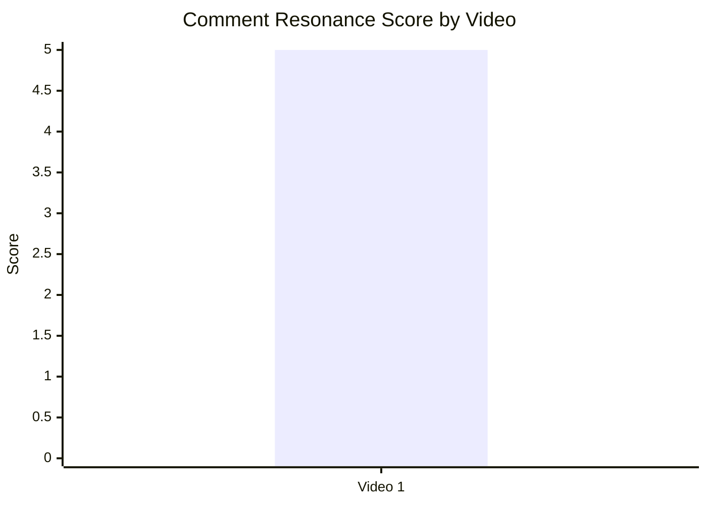

## 11.3. Top comment clusters

| Cluster                   | Evidence from report                      | Practical meaning                      |
| ------------------------- | ----------------------------------------- | -------------------------------------- |
| Debate / conflict         | `HIGH_COMMENT_TRIGGER`, 4 607 comments    | Тема провокує сильну дискусію          |
| Source / factual disputes | `MISSING_PINNED_COMMENT_STRATEGY`         | Потрібен pinned comment із джерелами   |
| CTA / next step weakness  | `CTA_TOO_GENERIC`, `NO_NEXT_VIDEO_BRIDGE` | Треба конкретний follow-up CTA         |
| Search intent match       | `SEARCH_INTENT_MATCH`                     | Назва і тема мають пошуковий потенціал |

## 12. Графіки score-системи

## 12.1. Overall score by video

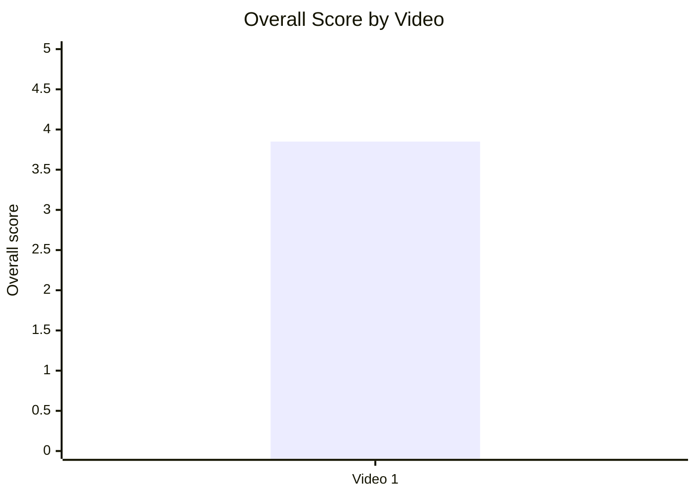

## 12.2. Score breakdown heatmap

| Video   | Hook | Structure | Value Density | Audio | CTA | Ad | Comments | Replicability | Overall |
| ------- | ---: | --------: | ------------: | ----: | --: | -: | -------: | ------------: | ------: |
| Video 1 |    4 |         4 |             4 |     3 |   3 |  3 |        5 |           N/A |    3.85 |

## 12.3. Strengths vs weaknesses count

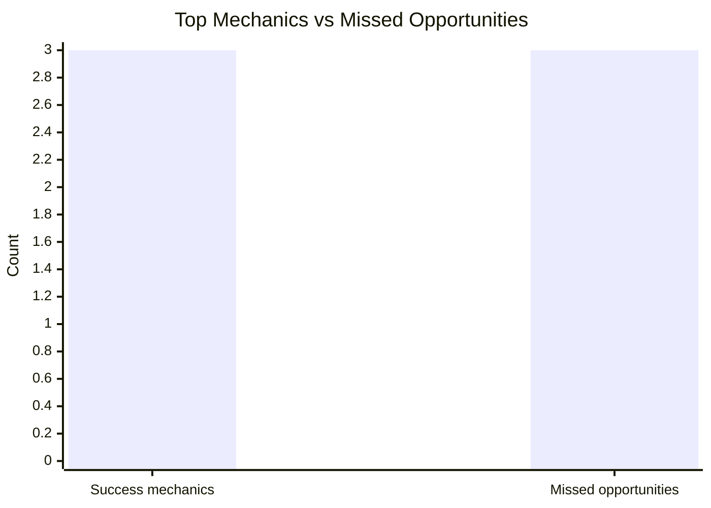

## 13. Кореляції та патерни

Correlation analysis skipped: fewer than 5 comparable videos.

| Pair                                              | Correlation / Pattern | Strength | Interpretation                                                         | Confidence |
| ------------------------------------------------- | --------------------: | -------- | ---------------------------------------------------------------------- | ---------- |
| hook_score → overall_video_score                  |   `INSUFFICIENT_DATA` | N/A      | Потрібно мінімум 5 відео                                               | LOW        |
| value_density_score → er_public_percent           |   `INSUFFICIENT_DATA` | N/A      | Потрібно мінімум 5 відео                                               | LOW        |
| cta_score → comment_rate_percent                  |   `INSUFFICIENT_DATA` | N/A      | CTA score одного відео не дає зв’язку                                  | LOW        |
| comment_resonance_score → er_public_percent       |  single-video pattern | LOW      | Високий comment resonance збігається з високим ER, але це не кореляція | LOW        |
| views_per_day → er_public_percent                 |   `INSUFFICIENT_DATA` | N/A      | Немає порівняльних точок                                               | LOW        |
| ad_load_percent → er_public_percent               |   `INSUFFICIENT_DATA` | N/A      | `ad_load_percent = N/A`                                                | LOW        |
| time_to_first_value_seconds → overall_video_score |   `INSUFFICIENT_DATA` | N/A      | `NO_TIMECODES`                                                         | LOW        |

## 14. Висновки для контент-стратегії

| Спостереження                          | Дані / графік                                                 | Що це означає                            | Що робити                                                                  |
| -------------------------------------- | ------------------------------------------------------------- | ---------------------------------------- | -------------------------------------------------------------------------- |
| Відео дуже коментарогенне              | `comment_rate_percent = 8.31%`, `comment_resonance_score = 5` | Тема провокує суперечки й уточнення      | Робити follow-up із відповідями на головні заперечення                     |
| Hook сильний                           | `hook_score = 4`, hook type `CONFLICT`                        | Конфліктна теза швидко продає тему       | Повторювати формат “єдиний сильний аргумент опонента → спростування”       |
| CTA середній                           | `cta_score = 3`, `CTA_TOO_GENERIC`                            | Заклики є, але не ведуть достатньо чітко | Дати один головний CTA: наступне відео або коментар із конкретним питанням |
| Потрібен pinned source hub             | `MISSING_PINNED_COMMENT_STRATEGY`                             | Коментарі містять фактологічні суперечки | Закріпити коментар: джерела, уточнення, посилання на наступний розбір      |
| Реклама/інтеграція не має точного load | `ad_load_percent = N/A`                                       | Неможливо оцінити вплив self-promo       | У наступних звітах фіксувати тривалість self-promo в секундах              |
| Search intent працює                   | `SEARCH_INTENT_MATCH`                                         | Назва збігається з пошуковим запитом     | Робити SEO-серію навколо спорних історичних тез                            |

## 15. Що тестувати далі

| Тест                                     | Гіпотеза                                                               | На яких даних базується                                 | Як виміряти                                               | Пріоритет |
| ---------------------------------------- | ---------------------------------------------------------------------- | ------------------------------------------------------- | --------------------------------------------------------- | --------- |
| Pinned comment із джерелами              | Зменшить хаос у фактологічних спорах і збільшить productive engagement | `MISSING_PINNED_COMMENT_STRATEGY`, високий comment rate | reply depth, sentiment, кількість питань, CTR по джерелах | HIGH      |
| Конкретний comment prompt                | Підніме якість коментарів                                              | `has_comment_prompt = true`, але CTA generic            | comment_rate, частка питань, частка довгих коментарів     | HIGH      |
| End-screen bridge                        | Збільшить session depth                                                | `NO_NEXT_VIDEO_BRIDGE` / слабка next action             | end-screen CTR, views наступного відео                    | HIGH      |
| Серія “1 аргумент → 4 спростування”      | Формат може повторювати високий resonance                              | `CONTROVERSY_OR_DEBATE`, `HIGH_COMMENT_TRIGGER`         | views/day, ER Public %, comments/1k views                 | HIGH      |
| Shorter CTA block                        | Менше CTA overload, більше переходів                                   | `CTA_TOO_GENERIC`, `cta_score = 3`                      | CTR end screen, external clicks, subscribe rate           | MEDIUM    |
| Візуальні summary-слайди після блоків    | Зменшить плутанину у складній темі                                     | structure score 4, багато фактологічних дискусій        | retention after segments, коментарі з уточненнями         | MEDIUM    |
| Відокремити self-promo від основного CTA | Зменшить конкуренцію дій                                               | ad/self-promo є, ad load N/A                            | end-screen CTR, support link CTR                          | LOW       |

## 16. Дані для експорту в таблицю / CSV

| video_label | title                                            | format_group     | views | views_per_day | like_rate_percent | comment_rate_percent | er_public_percent | views_per_1k_subs | hook_type | hook_score | cta_count | cta_score | ad_load_percent | ad_integration_score | audio_score | comment_resonance_score | overall_video_score | top_success_mechanic  | top_missed_opportunity |
| ----------- | ------------------------------------------------ | ---------------- | ----: | ------------: | ----------------: | -------------------: | ----------------: | ----------------: | --------- | ---------: | --------: | --------: | --------------: | -------------------: | ----------: | ----------------------: | ------------------: | --------------------- | ---------------------- |
| Video 1     | Разоблачение титула московских царей "Всея Руси" | LONG_20_PLUS_MIN | 55415 |         95.54 |              6.83 |                 8.31 |             15.14 |           2716.42 | CONFLICT  |          4 |         4 |         3 |             N/A |                    3 |           3 |                       5 |                3.85 | CONTROVERSY_OR_DEBATE | NO_NEXT_VIDEO_BRIDGE   |