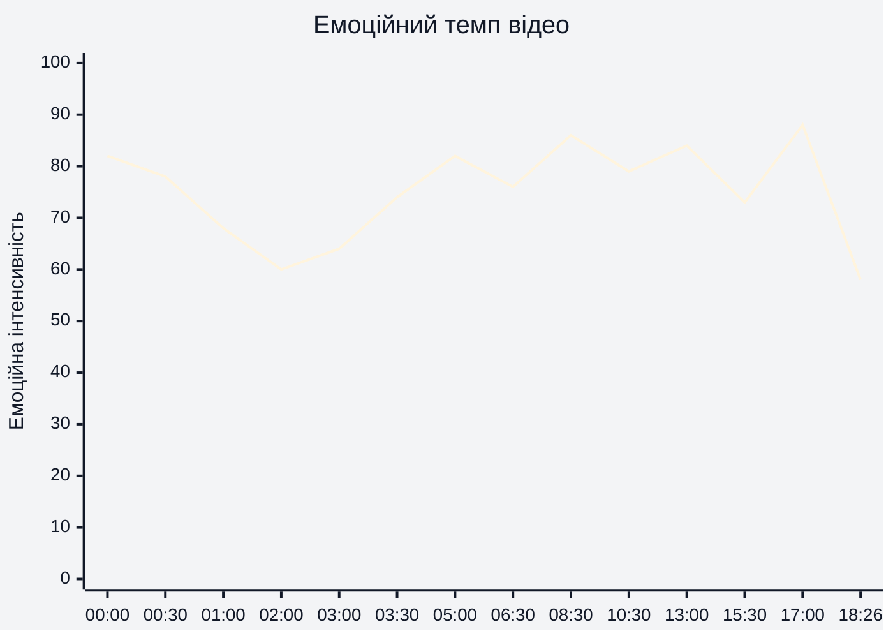
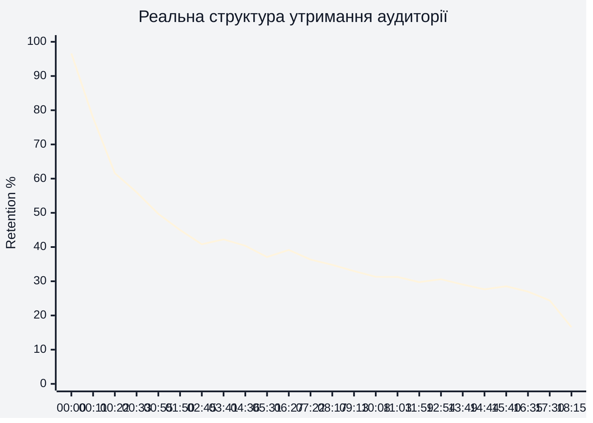
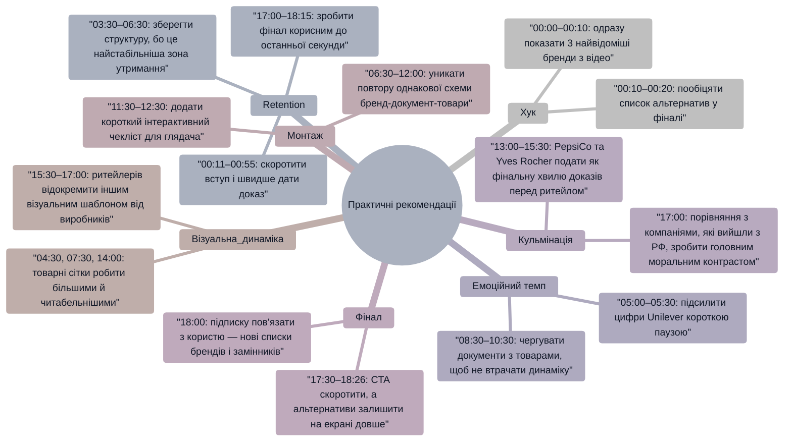

# Аналіз довгоформатного YouTube-відео

Аналіз побудовано на наданому MP4, візуальних сюжетних блоках у кадрі та реальних retention-даних із CSV. Тривалість відео: **18:26**. Тема: **хто спонсорує війну з полиць супермаркета**.

## 1. Сюжетна дуга (Narrative Arc)

```mermaid
%%{init: {'theme':'base', 'themeVariables': {
'primaryColor':'#f3f4f6',
'primaryTextColor':'#111827',
'primaryBorderColor':'#2563eb',
'lineColor':'#2563eb',
'secondaryColor':'#ffffff',
'tertiaryColor':'#f3f4f6',
'background':'#f3f4f6'
}}}%%
flowchart LR
    A["Хук<br/>00:00–00:30<br/>Автор одразу ставить конфлікт: бренди з полиць супермаркета можуть бути пов'язані з фінансуванням війни"]
    B["Експозиція<br/>00:30–03:00<br/>Пояснення рамки дослідження, поява списків брендів і джерел"]
    C["Перша ескалація<br/>03:00–04:30<br/>Вводяться критерії відбору та перший великий кейс: Mars"]
    D["Переломний момент<br/>04:30–06:30<br/>Після товарів Mars відео переходить до масштабів Unilever: фабрики, працівники, суми"]
    E["Наростання напруги<br/>06:30–11:00<br/>Mondelez і Nestlé розширюють проблему: приклади вже не поодинокі, а системні"]
    F["Кульмінація<br/>11:00–15:30<br/>P&G, Bonduelle, PepsiCo та Yves Rocher показують, що список охоплює багато повсякденних категорій"]
    G["Розв'язка<br/>15:30–17:30<br/>Metro, Auchan і порівняння з компаніями, які вийшли з ринку РФ, переводять відео до вибору глядача"]
    H["Фінальний висновок<br/>17:30–18:26<br/>Фінальна добірка альтернатив і заклик до дії з підпискою"]
    A --> B --> C --> D --> E --> F --> G --> H
```

## 2. Ключові Story Beats

```mermaid
%%{init: {'theme':'base', 'themeVariables': {
'primaryColor':'#f3f4f6',
'primaryTextColor':'#111827',
'primaryBorderColor':'#2563eb',
'lineColor':'#2563eb',
'secondaryColor':'#ffffff',
'tertiaryColor':'#f3f4f6',
'background':'#f3f4f6'
}}}%%
flowchart LR
    B1["00:00<br/>Постановка теми<br/>Функція: миттєвий моральний конфлікт"]
    B2["00:30<br/>Візуальний перехід і список брендів<br/>Функція: підвищення масштабу проблеми"]
    B3["02:00<br/>Офіційні пояснення та джерела<br/>Функція: легітимізація розслідування"]
    B4["03:00<br/>Критерії відбору<br/>Функція: правила гри для глядача"]
    B5["03:30<br/>Початок блоку Mars<br/>Функція: перший конкретний кейс"]
    B6["05:00<br/>Unilever: фабрики та працівники<br/>Функція: ескалація через цифри"]
    B7["06:30<br/>Mondelez і Milka<br/>Функція: прив'язка великої політичної теми до знайомого товару"]
    B8["08:30<br/>Nestlé: документи та статус спонсора війни<br/>Функція: посилення доказовості"]
    B9["11:00<br/>P&G і Bonduelle<br/>Функція: розширення списку категорій супермаркета"]
    B10["13:00<br/>PepsiCo з цифрами та товарами<br/>Функція: друга хвиля емоційного тиску"]
    B11["15:30<br/>Metro та Auchan<br/>Функція: перехід від брендів до торгових мереж"]
    B12["17:00<br/>Компанії, які покинули ринок РФ<br/>Функція: показати альтернативну поведінку бізнесу"]
    B1 --> B2 --> B3 --> B4 --> B5 --> B6 --> B7 --> B8 --> B9 --> B10 --> B11 --> B12
```

## 3. Емоційний темп

Емоційний темп найсильніше працює на **00:00–00:30**, де тема подається як особистий вибір глядача в супермаркеті, на **05:00–05:30**, де з'являються великі цифри Unilever, на **08:30–10:30**, де Nestlé підсилює доказову частину, і на **17:00**, де порівняння з компаніями, які покинули ринок РФ, створює моральну кульмінацію.

## 4. Утримання аудиторії

Retention має різкий стартовий спад на **00:11–00:55**: із **77,75%** до **49,71%**, тобто частина глядачів відсіюється ще до повного пояснення методології. Після **03:30** крива стабілізується навколо **40–42%**, що збігається з переходом до конкретних брендів і доказів. Найцінніша зона утримання — **03:30–06:30**, бо саме тут поєднуються критерії, Mars, Unilever і цифри масштабу.

## 5. Піки retention

| Таймкод | Подія | Чому це може утримувати увагу | Сила піку 1–10 |
|---|---|---|---|
| 03:30 | Початок блоку Mars після критеріїв відбору | Після методології глядач отримує перший конкретний кейс; retention зростає до **42,54%** | 8 |
| 04:36–04:47 | Показ товарів Mars у супермаркетному контексті | Глядач упізнає реальні продукти, а не абстрактну корпорацію; retention піднімається до **41,27%** | 7 |
| 06:16–06:27 | Перехід до Mondelez після блоку Unilever | Нова знайома категорія товарів перезавантажує увагу; retention тримається біля **38–39%** | 6 |
| 10:30 | Блок Nestlé після документів і новин | Тема отримує сильну доказову опору, а бренд дуже впізнаваний; retention піднімається до **32,96%** | 6 |
| 12:54 | Початок PepsiCo з цифрою на екрані | Велика цифра і знайомий бренд створюють новий імпульс після середини відео; retention зростає до **30,59%** | 6 |
| 15:29–15:40 | Перехід до Metro / торгових мереж | Зміна масштабу з виробників на ритейлерів додає новий кут теми; retention зростає до **28,53%** | 5 |

## 6. Провали retention

| Таймкод | Проблема | Ймовірна причина спаду | Що покращити |
|---|---|---|---|
| 00:11 | Різке падіння до **77,75%** | Хук ставить сильну тему, але частина глядачів ще не отримує конкретної обіцянки: «що саме я дізнаюся і що робити» | На **00:05–00:10** додати коротку карту відео: «7 брендів, 3 мережі, список альтернатив наприкінці» |
| 00:22 | Падіння до **61,60%** | У перші 20 секунд бракує швидкого доказу або несподіваної конкретики | На **00:15–00:20** вставити найсильнішу цифру з пізнішого блоку, наприклад із **05:30** або **13:00** |
| 00:55 | Падіння до **49,71%** | Зона вступу й переліку брендів затягується до пояснення правил відбору | Перенести критерії з **03:00** ближче до **01:00**, щоб глядач швидше зрозумів логіку списку |
| 06:38 | Спад після локального піку до **37,10%** | Після Unilever і перед Mondelez темп доказів може здаватися повторюваним | На **06:30–06:45** додати мікро-хук: «цей бренд є майже в кожному солодкому відділі» |
| 11:59 | Зниження до **29,75%** | Після кількох однотипних корпоративних кейсів з'являється втома від формату «бренд → доказ → товари» | На **11:30–12:00** змінити ритм: короткий тест для глядача або швидкий чекліст товарів |
| 17:30–18:15 | Фінальний спад із **24,38%** до **16,56%** | Після основного списку частина глядачів сприймає фінал як завершення й виходить до CTA | На **17:00** анонсувати конкретну фінальну користь: «зараз покажу, що купувати замість цього» |

## 7. Оцінка сегментів

| Сегмент | Таймкод | Функція | Емоційна інтенсивність | Ризик втрати уваги | Оцінка 1–10 | Що покращити |
|---|---|---|---|---|---|---|
| Хук і головне питання | 00:00–00:30 | Ввести конфлікт між покупкою в супермаркеті та фінансуванням війни | Висока | Високий через різкий стартовий спад | 7 | На **00:05** показати кінцеву вигоду: список брендів і альтернатив |
| Початковий контекст | 00:30–03:00 | Пояснити, чому тема важлива, і підвести до критеріїв | Середня | Високий, бо retention падає до **44,98%** на **01:50** | 6 | Скоротити вступ на **00:30–02:30** і швидше дати перший кейс |
| Критерії відбору | 03:00–03:30 | Встановити довіру до методології | Середня | Середній | 8 | Додати третій критерій у кадрі або чіткіше проговорити винятки |
| Mars | 03:30–04:50 | Перший конкретний брендовий кейс | Висока | Низький, бо є локальний пік **42,54%** | 8 | Підсилити завершення блоку швидкою підсумковою карткою товарів |
| Unilever | 05:00–06:15 | Ескалація через масштаб: фабрики, працівники, суми | Дуже висока | Середній | 8 | На **05:30** залишити цифру довше в кадрі й додати короткий висновок «що це означає» |
| Mondelez і Nestlé | 06:30–10:45 | Зробити проблему системною через знайомі товари й документи | Висока | Середній | 8 | На **08:30–09:30** розбити доказовий блок на коротші візуальні підпункти |
| P&G, Bonduelle, PepsiCo, Yves Rocher | 11:00–15:30 | Розширити карту брендів і категорій | Висока | Середньо-високий через повторювану структуру | 7 | Кожен блок завершувати одним чітким «купувати / не купувати / альтернатива» |
| Metro, Auchan, альтернативи, фінал | 15:30–18:26 | Перевести розслідування в дію для глядача | Середньо-висока | Високий у фінальному CTA | 7 | На **17:00–18:00** зробити фінальну таблицю альтернатив центральним гачком, а CTA коротшим |

## 8. Практичні рекомендації

## 9. Підсумкова оцінка

| Показник | Оцінка 1–10 | Коментар |
|---|---:|---|
| Сюжетна дуга | 8 | Є чіткий рух від особистого вибору на **00:00** до системної карти брендів на **17:00** |
| Story Beats | 8 | Ключові точки добре розставлені: критерії на **03:00**, Mars на **03:30**, Unilever на **05:00**, Nestlé на **08:30**, альтернативи на **17:00** |
| Емоційний темп | 7 | Сильні піки на **05:00–05:30**, **08:30–10:30** і **17:00**, але середина **11:00–15:30** місцями повторює однаковий ритм |
| Retention Structure | 6 | Дані показують дуже різкий спад у першу хвилину: від **96,61%** на **00:00** до **49,71%** на **00:55**, але після **03:30** відео тримається стабільніше |
| Загальна оцінка | 7 | Відео має сильну тему, доказову базу й зрозумілу моральну рамку; головний резерв росту — перша хвилина та більш корисний фінал на **17:30–18:26** |
