# Статистичний аналіз відеозвітів

## 1. Короткий executive summary

| Пункт | Висновок |
|---|---|
| Скільки відео проаналізовано | 1 |
| Скільки форматів відео | 1: `LONG_10_20_MIN` |
| Найсильніше відео за overall score | Video 1 — `3.89/5` |
| Найсильніше відео за ER Public % | Video 1 — `13.39%` |
| Найсильніше відео за views per day | Video 1 — `56.69` |
| Найсильніша повторювана механіка | `NOT_COMPARABLE` — є лише 1 відео; для цього відео головна механіка: `PRACTICAL_UTILITY` + `CONTROVERSY_OR_DEBATE` + `HIGH_COMMENT_TRIGGER` |
| Найчастіша слабкість | `NOT_COMPARABLE` — є лише 1 відео; для цього відео головна слабкість: `COMMENTS_SHOW_CONFUSION` щодо складних кейсів бойкоту |
| Головна стратегічна можливість | Серія “бренд → альтернатива → як перевірити виробника”, із pinned FAQ і next-video bridge |
| Рівень впевненості | `LOW_CONFIDENCE` для статистичних узагальнень, бо вибірка = 1; `HIGH/MEDIUM` тільки для опису цього одного звіту |

## 2. Якість і повнота даних

| Поле | Кількість відео з даними | Кількість N/A | Коментар |
|---|---:|---:|---|
| views | 1 | 0 | Є public metric: `35 772` |
| likes | 1 | 0 | Є public metric: `3 954` |
| comments_count | 1 | 0 | Є public metric: `837` |
| views_per_day | 1 | 0 | Є derived metric: `56.69` |
| er_public_percent | 1 | 0 | Є derived metric: `13.39%` |
| views_per_1k_subs | 1 | 0 | Є derived metric: `1753.53` |
| hook_score | 1 | 0 | `4/5` |
| cta_score | 1 | 0 | `3/5` |
| ad_integration_score | 0 | 1 | `NOT_APPLICABLE`, бо advertising integration не виявлено |
| audio_score | 1 | 0 | `4/5`; є MP4-аудіо, але частина аудіо-оцінок має `LOW_CONFIDENCE` |
| comment_resonance_score | 1 | 0 | `4/5` |
| overall_video_score | 1 | 0 | `3.89/5`, перераховано без ad score |

### Обмеження аналізу

- `LOW_CONFIDENCE`: статистичні порівняння, кластери між відео та кореляції неможливі, бо є лише один `YT_VIDEO_ANALYSIS_V1` звіт.
- `NOT_COMPARABLE`: відео не можна порівняти з іншими форматами або когортами, бо інших відео в наборі немає.
- `PARTIAL_DATA`: у джерельному звіті зазначено, що транскрипт без таймкодів, chapter metadata після 10:48 неповна, thumbnail-файл відсутній.
- `NOT_APPLICABLE`: advertising integration не виявлено, тому ad-графіки не будуються як performance factor.

## 3. Підготовлена таблиця для графіків

| Video | Format | Views | Likes | Comments | Views/day | Like Rate % | Comment Rate % | ER Public % | Views/1k subs | Hook | CTA | Ad | Audio | Comment Resonance | Overall |
|---|---|---:|---:|---:|---:|---:|---:|---:|---:|---:|---:|---:|---:|---:|---:|
| Video 1 | LONG_10_20_MIN | 35 772 | 3 954 | 837 | 56.69 | 11.05 | 2.34 | 13.39 | 1753.53 | 5 | 5 | 1 | 4 | 5 | 5 |

| Label | Full title | URL |
|---|---|---|
| Video 1 | Хто спонсує війну з полиць твого супермаркета? | https://www.youtube.com/watch?v=xiW40FlAAvI |

## 4. Рекомендовані графіки

| # | Назва графіка | Тип графіка | Поля | Для чого потрібен | Пріоритет |
|---:|---|---|---|---|---|
| 1 | Overall score by video | Mermaid bar chart | `overall_video_score` | Побачити загальний бал відео | HIGH |
| 2 | Views per day by video | Mermaid bar chart | `views_per_day` | Нормалізувати перегляди за віком відео | HIGH |
| 3 | ER Public % by video | Mermaid bar chart | `er_public_percent` | Показати рівень залучення | HIGH |
| 4 | Performance quadrant | Таблиця + Mermaid scatter not supported reliably | `views_per_day`, `er_public_percent` | Показати баланс охоплення і реакції | HIGH |
| 5 | Hook score by video | Mermaid bar chart | `hook_score` | Оцінити силу hook | HIGH |
| 6 | CTA score by video | Mermaid bar chart | `cta_score` | Оцінити CTA-блок | HIGH |
| 7 | CTA features heatmap | Markdown matrix | CTA boolean fields | Побачити наявні/відсутні CTA-елементи | HIGH |
| 8 | Score breakdown heatmap | Markdown matrix | score fields | Побачити сильні/слабкі сторони | HIGH |
| 9 | Sentiment distribution | Mermaid pie chart + таблиця | sentiment counts | Показати структуру коментарів | HIGH |
| 10 | Ad load % by video | Skipped | `ad_load_percent` | Оцінити рекламне навантаження | LOW, `NOT_APPLICABLE` |

## 5. Графіки продуктивності

### 5.1. Views by video

- Назва графіка: `Views by video`
- Яке питання він відповідає: яке відео має найбільший raw reach.
- Які поля використовуються: `video_label`, `views`.
- Тип графіка: Mermaid bar chart.
- Що видно з графіка: Video 1 має `35 772` перегляди.
- Практичний висновок: raw views не можна інтерпретувати як “сильно/слабо” без benchmark або інших відео.

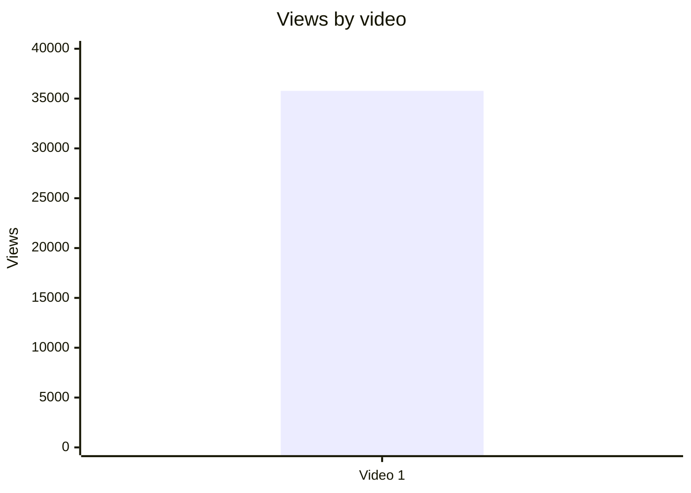

### 5.2. Views per day by video

- Назва графіка: `Views per day by video`
- Яке питання він відповідає: який середній темп набору переглядів з урахуванням віку відео.
- Які поля використовуються: `video_label`, `views_per_day`.
- Тип графіка: Mermaid bar chart.
- Що видно з графіка: Video 1 має `56.69` views/day.
- Практичний висновок: це краща метрика для порівнянь, ніж raw views, але порівнянь немає через вибірку = 1.

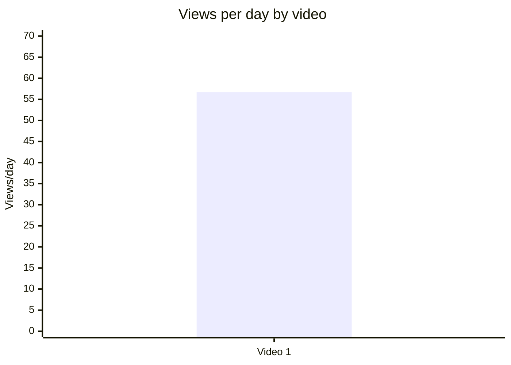

### 5.3. Views per 1k subscribers

- Назва графіка: `Views per 1k subscribers`
- Яке питання він відповідає: наскільки відео виходить за межі бази підписників.
- Які поля використовуються: `video_label`, `views_per_1k_subs`.
- Тип графіка: Mermaid bar chart.
- Що видно з графіка: Video 1 має `1753.53` views/1k subs.
- Практичний висновок: відео отримало перегляди значно ширше за поточну базу followers, але без когорти це не можна назвати outlier.

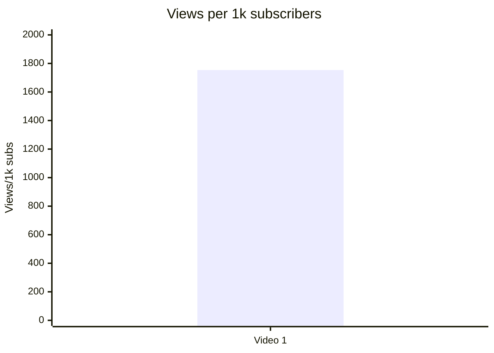

### 5.4. Performance quadrant

- Назва графіка: `Performance quadrant`
- Яке питання він відповідає: чи є баланс між швидкістю переглядів і публічним залученням.
- Які поля використовуються: `views_per_day`, `er_public_percent`.
- Тип графіка: scatter/quadrant; для одного відео подано таблицю, бо quadrant без когорти не має статистичного сенсу.
- Що видно з графіка: Video 1 = `56.69 views/day` + `13.39% ER Public`.
- Практичний висновок: `INSUFFICIENT_DATA` для quadrant-класифікації; потрібні мінімум кілька відео тієї ж когорти `LONG_10_20_MIN`.

| Video | Views/day | ER Public % | Quadrant |
|---|---:|---:|---|
| Video 1 | 56.69 | 13.39 | `INSUFFICIENT_DATA` — немає медіан/порогів когорти |

## 6. Графіки залучення

### 6.1. ER Public % by video

- Назва графіка: `ER Public % by video`
- Яке питання він відповідає: який рівень публічного залучення у відео.
- Які поля використовуються: `video_label`, `er_public_percent`.
- Тип графіка: Mermaid bar chart.
- Що видно з графіка: Video 1 має `13.39%`.
- Практичний висновок: висока абсолютна взаємодія в межах одного звіту, але без benchmark це не є статистичним висновком.

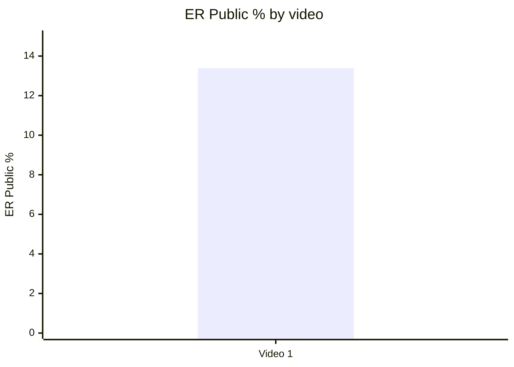

### 6.2. Like Rate % vs Comment Rate %

- Назва графіка: `Like Rate % vs Comment Rate %`
- Яке питання він відповідає: чи реакція більше через лайки, коментарі або обидва типи взаємодії.
- Які поля використовуються: `like_rate_percent`, `comment_rate_percent`.
- Тип графіка: scatter plot; для одного відео подано таблицю.
- Що видно з графіка: Video 1 = `11.05%` like rate і `2.34%` comment rate.
- Практичний висновок: відео одночасно отримало явну підтримку і дискусію; для класифікації “high/low” потрібна когорта.

| Video | Like Rate % | Comment Rate % | Interpretation |
|---|---:|---:|---|
| Video 1 | 11.05 | 2.34 | Сильна публічна реакція в межах одного відео; `NOT_COMPARABLE` без benchmark |

### 6.3. Comments per 1k views

- Назва графіка: `Comments per 1k views`
- Яке питання він відповідає: наскільки відео провокує коментування відносно переглядів.
- Які поля використовуються: `video_label`, `comments_per_1k_views`.
- Тип графіка: Mermaid bar chart.
- Що видно з графіка: Video 1 має `23.40` comments/1k views.
- Практичний висновок: тема має високий потенціал дискусійності; для порівняння потрібні інші відео.

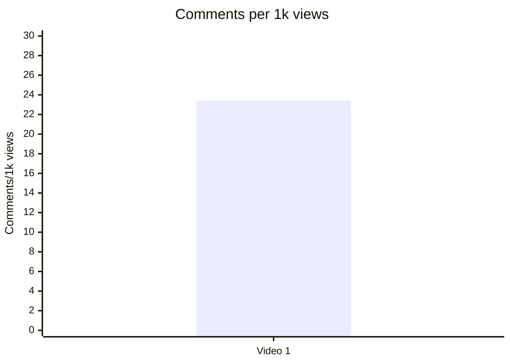

## 7. Графіки структури та hook

### 7.1. Hook score by video

- Назва графіка: `Hook score by video`
- Яке питання він відповідає: наскільки сильний hook за 1–5 шкалою.
- Які поля використовуються: `video_label`, `hook_score`.
- Тип графіка: Mermaid bar chart.
- Що видно з графіка: Video 1 має `4/5`.
- Практичний висновок: hook варто повторювати як підхід “проблема + конфлікт + практична обіцянка”, але порівняльний висновок неможливий.

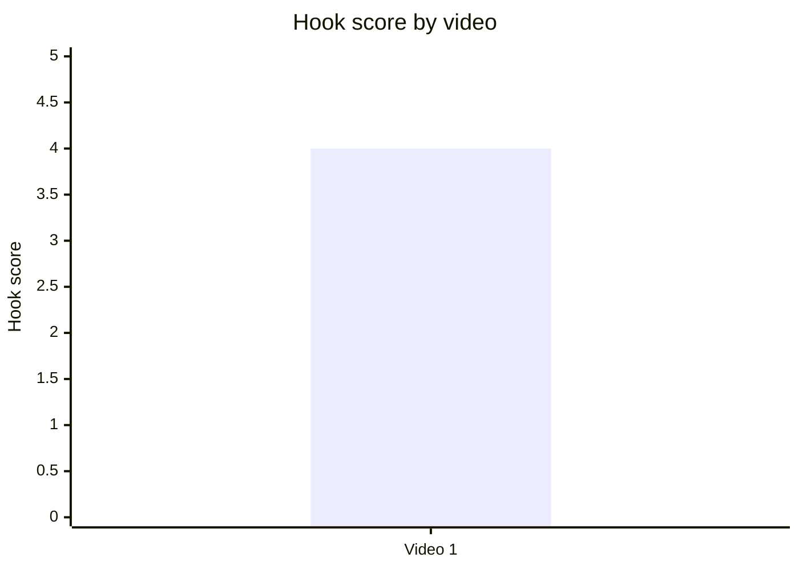

### 7.2. Hook type distribution

- Назва графіка: `Hook Type Distribution`
- Яке питання він відповідає: який primary hook type використано в наборі.
- Які поля використовуються: `hook_primary_type`.
- Тип графіка: Mermaid pie chart.
- Що видно з графіка: 100% набору = `PROBLEM`, бо є лише 1 відео.
- Практичний висновок: це не “найкращий hook type”, а лише тип поточного відео; для висновків потрібна вибірка.

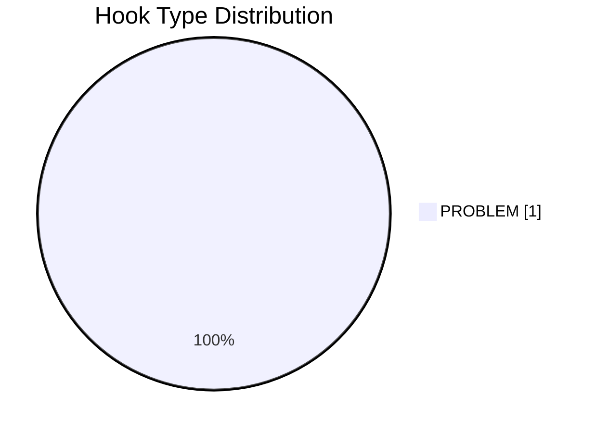

### 7.3. Time to first value vs Overall Score

- Назва графіка: `Time to first value vs Overall Score`
- Яке питання він відповідає: чи швидша перша цінність пов’язана з вищим overall score.
- Які поля використовуються: `time_to_first_value_seconds`, `overall_video_score`.
- Тип графіка: scatter plot; для одного відео подано таблицю.
- Що видно з графіка: у Comparable JSON `time_to_first_value = 00:00`; у структурному аналізі також зазначено `03:35` для першого конкретного бренду.
- Практичний висновок: `INSUFFICIENT_DATA` для зв’язку; для майбутніх звітів варто окремо фіксувати два поля: `moral_value_start_seconds` і `first_concrete_value_seconds`.

| Video | Time to first value | Time to first value seconds | Overall score | Note |
|---|---|---:|---:|---|
| Video 1 | 00:00 | 0 | 3.89 | Перша моральна цінність з 00:00; перший конкретний бренд із 03:35 |

## 8. Графіки CTA

### 8.1. CTA score by video

- Назва графіка: `CTA score by video`
- Яке питання він відповідає: наскільки CTA-блок сильний за 1–5 шкалою.
- Які поля використовуються: `video_label`, `cta_score`.
- Тип графіка: Mermaid bar chart.
- Що видно з графіка: Video 1 має `3/5`.
- Практичний висновок: CTA є, але слабке місце — відсутність next-video bridge і прямого subscribe/bell.

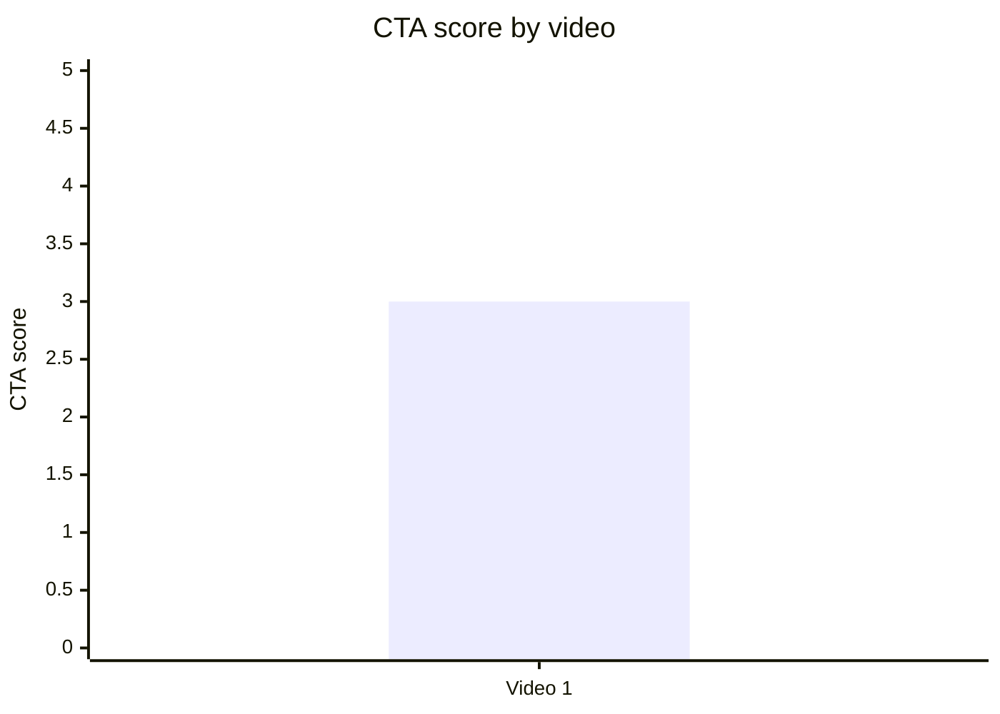

### 8.2. CTA count vs ER Public %

- Назва графіка: `CTA count vs ER Public %`
- Яке питання він відповідає: чи кількість CTA може бути пов’язана із залученням.
- Які поля використовуються: `cta_count`, `er_public_percent`.
- Тип графіка: scatter plot; для одного відео подано таблицю.
- Що видно з графіка: Video 1 має `7` CTA і `13.39%` ER Public.
- Практичний висновок: `INSUFFICIENT_DATA` для зв’язку; є описовий сигнал, що CTA на коментарі/дію збігся з високою дискусійністю.

| Video | CTA count | ER Public % | CTA overload risk |
|---|---:|---:|---|
| Video 1 | 7 | 13.39 | `PARTLY` — CTA багато, але головний недолік не overload, а слабкий next-video bridge |

### 8.3. CTA features heatmap

- Назва графіка: `CTA features heatmap`
- Яке питання він відповідає: які CTA-елементи присутні або відсутні.
- Які поля використовуються: `has_comment_prompt`, `has_subscribe_cta`, `has_like_cta`, `has_bell_cta`, `has_next_video_bridge`.
- Тип графіка: Markdown heatmap/matrix.
- Що видно з графіка: є comment prompt і like CTA; немає next-video bridge; subscribe/bell не зафіксовані в Comparable JSON, тому `N/A`.
- Практичний висновок: найближчий тест — додати чіткий next-video bridge і виміряти end screen CTR.

| Video | Comment prompt | Subscribe | Like | Bell | Next video bridge |
|---|---|---|---|---|---|
| Video 1 | ✅ | N/A | ✅ | N/A | ❌ |

## 9. Графіки реклами / інтеграцій

Advertising graphs skipped: no advertising integrations detected.

### 9.1. Ad load % by video

- Назва графіка: `Ad load % by video`
- Яке питання він відповідає: яке рекламне навантаження має відео.
- Які поля використовуються: `ad_load_percent`.
- Тип графіка: skipped.
- Що видно з графіка: `NOT_APPLICABLE`, бо `ad_detected = false`.
- Практичний висновок: рекламне навантаження не пояснює реакцію аудиторії в цьому відео.

| Video | Ad detected | Ad count | Ad load % | Ad integration score |
|---|---|---:|---|---|
| Video 1 | false | 0 | NOT_APPLICABLE | NOT_APPLICABLE |

### 9.2. First ad position %

- Назва графіка: `First ad position %`
- Яке питання він відповідає: чи реклама стоїть занадто рано.
- Які поля використовуються: `first_ad_relative_position_percent`.
- Тип графіка: skipped.
- Що видно з графіка: `NOT_APPLICABLE`.
- Практичний висновок: немає інтеграції, тому немає ризику ранньої реклами.

### 9.3. Ad integration score vs ER Public %

- Назва графіка: `Ad integration score vs ER Public %`
- Яке питання він відповідає: чи якість інтеграції пов’язана з реакцією.
- Які поля використовуються: `ad_integration_score`, `er_public_percent`.
- Тип графіка: skipped.
- Що видно з графіка: `NOT_APPLICABLE`.
- Практичний висновок: зв’язок не аналізується.

## 10. Графіки аудіо

### 10.1. Audio score by video

- Назва графіка: `Audio score by video`
- Яке питання він відповідає: яка загальна аудіо-оцінка відео.
- Які поля використовуються: `audio_score`.
- Тип графіка: Mermaid bar chart.
- Що видно з графіка: Video 1 має `4/5`.
- Практичний висновок: аудіо не виглядає головним бар’єром; слабше місце — змістова ясність складних кейсів і CTA bridge.

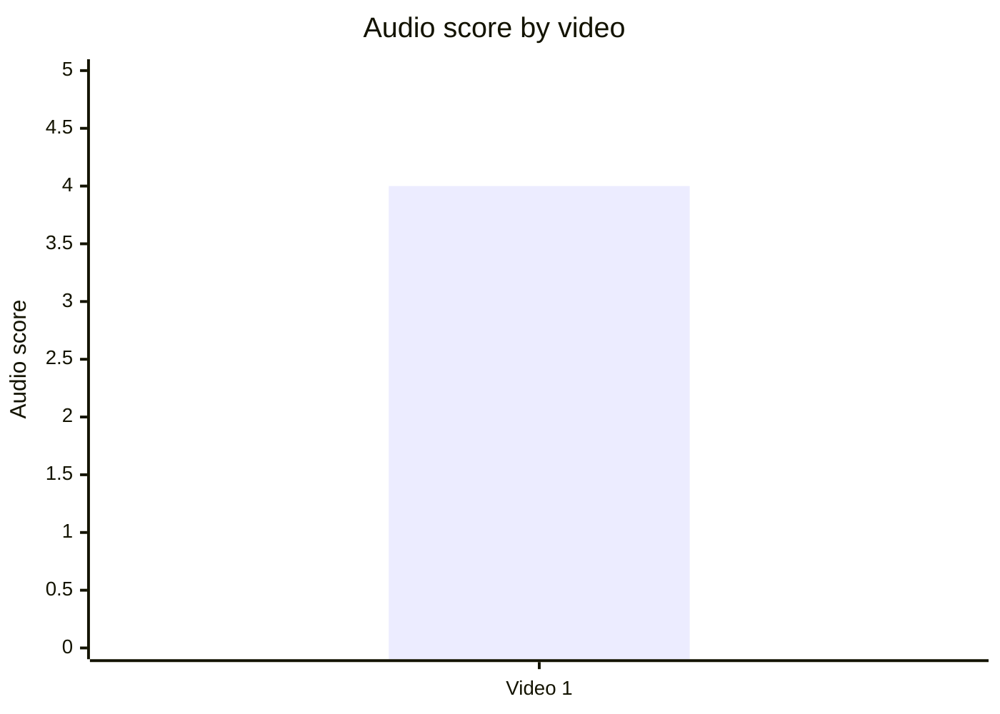

### 10.2. Audio score vs Overall Score

- Назва графіка: `Audio score vs Overall Score`
- Яке питання він відповідає: чи краща якість аудіо пов’язана з вищим загальним балом.
- Які поля використовуються: `audio_score`, `overall_video_score`.
- Тип графіка: scatter plot; для одного відео подано таблицю.
- Що видно з графіка: Video 1 = audio `4/5`, overall `3.89/5`.
- Практичний висновок: `INSUFFICIENT_DATA` для зв’язку; аудіо оцінене добре, але не доведено, що воно вплинуло на результат.

| Video | Audio score | Overall score | Note |
|---|---:|---:|---|
| Video 1 | 4 | 3.89 | Немає системних скарг на звук; `LOW_CONFIDENCE` для музичного балансу/інтонації |

## 11. Графіки коментарів

### 11.1. Sentiment distribution

- Назва графіка: `Sentiment distribution`
- Яке питання він відповідає: як розподілились типи реакції в коментарях.
- Які поля використовуються: `positive_percent`, `negative_percent`, `mixed_percent`, `neutral_percent`, `question_percent`, `request_percent`, `joke_meme_percent`.
- Тип графіка: Mermaid pie chart + таблиця.
- Що видно з графіка: найбільші частки — `NEUTRAL 44.0%` і `QUESTION 34.3%`; це вказує на багато уточнень і дискусій.
- Практичний висновок: наступні відео мають закривати FAQ і складні кейси, а не лише повторювати список брендів.

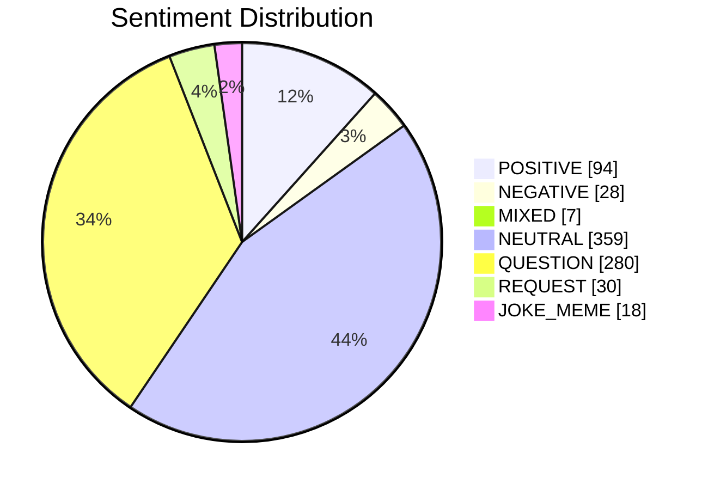

| Sentiment | Count | Percent of relevant comments |
|---|---:|---:|
| POSITIVE | 94 | 11.5% |
| NEGATIVE | 28 | 3.4% |
| MIXED | 7 | 0.9% |
| NEUTRAL | 359 | 44.0% |
| QUESTION | 280 | 34.3% |
| REQUEST | 30 | 3.7% |
| JOKE_MEME | 18 | 2.2% |
| SPAM / IRRELEVANT | 4 | 0.5% від усіх 820 записів |

### 11.2. Comment resonance score by video

- Назва графіка: `Comment resonance score by video`
- Яке питання він відповідає: наскільки коментарі показують резонанс теми.
- Які поля використовуються: `comment_resonance_score`.
- Тип графіка: Mermaid bar chart.
- Що видно з графіка: Video 1 має `4/5`.
- Практичний висновок: тема викликає сильну реакцію; її варто продовжувати, але з кращим FAQ.

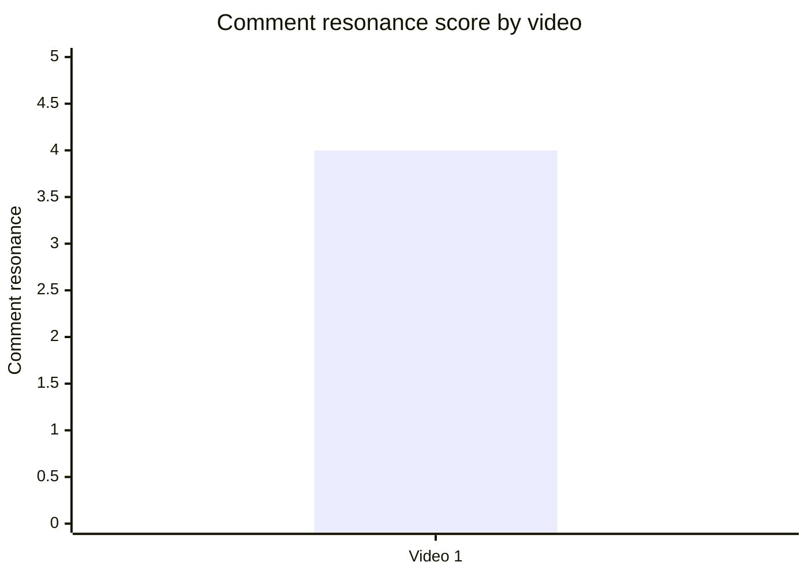

### 11.3. Top comment clusters

- Назва графіка: `Top comment clusters`
- Яке питання він відповідає: які теми найчастіше з’являються в коментарях.
- Які поля використовуються: `cluster`, `count`.
- Тип графіка: Mermaid bar chart.
- Що видно з графіка: найбільший кластер — подяка/корисність (`154`), далі бойкот/особисте рішення (`92`) і дискусія про податки/заводи (`84`).
- Практичний висновок: сильна практична користь поєднана з великою плутаниною; наступний контент має бути “список + альтернативи + складні кейси”.

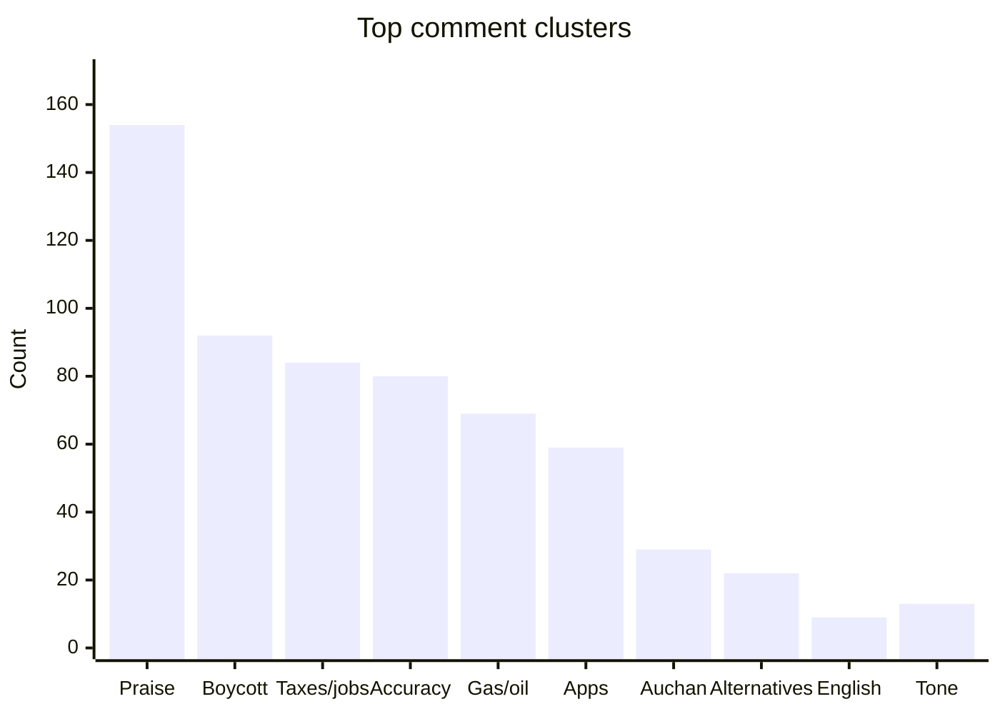

| Cluster | Count | % of relevant comments | Strategic meaning |
|---|---:|---:|---|
| Подяка / корисність / підтримка роботи | 154 | 18.9% | Формат має практичну цінність |
| Підтримка бойкоту / особисте рішення не купувати | 92 | 11.3% | Поведінковий CTA частково працює |
| Дискусія про податки, робочі місця, українські заводи | 84 | 10.3% | Потрібен framework складних кейсів |
| Уточнення / помилки / пропущені бренди | 80 | 9.8% | Потрібна актуалізація бази/джерел |
| Газ, нафта, транзит через Україну | 69 | 8.5% | Потрібен preemptive контраргумент |
| Застосунки / боти / бази перевірки | 59 | 7.2% | Можливий окремий випуск або pinned block |
| Auchan / Metro як спірний виняток | 29 | 3.6% | Слабке місце аргументації |
| Запити на альтернативи / список дозволених брендів | 22 | 2.7% | Прямий контент-тест |
| Поширення англійською / за кордоном | 9 | 1.1% | Нижчий, але реальний запит |
| Критика тону / термінів | 13 | 1.6% | Можливий A/B тест тону |

## 12. Графіки score-системи

### 12.1. Overall score by video

- Назва графіка: `Overall score by video`
- Яке питання він відповідає: який загальний score має відео.
- Які поля використовуються: `overall_video_score`.
- Тип графіка: Mermaid bar chart.
- Що видно з графіка: Video 1 має `3.89/5`.
- Практичний висновок: відео сильне за hook/value/comments, але overall стримується CTA і неповною ясністю складних кейсів.

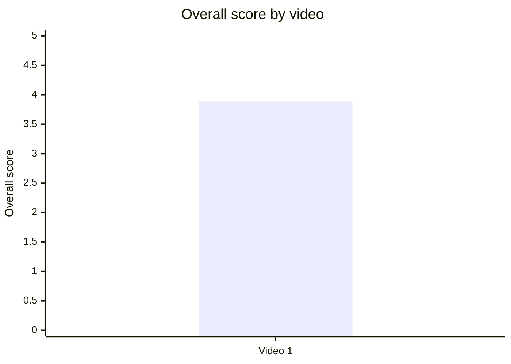

### 12.2. Score breakdown heatmap

- Назва графіка: `Score breakdown heatmap`
- Яке питання він відповідає: які компоненти сильні/слабкі.
- Які поля використовуються: `hook_score`, `structure_score`, `value_density_score`, `audio_score`, `cta_score`, `ad_integration_score`, `comment_resonance_score`, `replicability_score`, `overall_video_score`.
- Тип графіка: Markdown heatmap/matrix.
- Що видно з графіка: більшість score = `4`, CTA = `3`, ad = `NOT_APPLICABLE`.
- Практичний висновок: найшвидший важіль покращення — CTA architecture: next-video bridge, end screen, pinned FAQ.

| Video | Hook | Structure | Value Density | Audio | CTA | Ad | Comments | Replicability | Overall |
|---|---:|---:|---:|---:|---:|---|---:|---:|---:|
| Video 1 | 4 | 4 | 4 | 4 | 3 | NOT_APPLICABLE | 4 | 4 | 3.89 |

### 12.3. Strengths vs weaknesses count

- Назва графіка: `Strengths vs weaknesses count`
- Яке питання він відповідає: скільки success mechanics і missed opportunities виділено.
- Які поля використовуються: кількість `success_mechanics`, кількість `missed_opportunities`.
- Тип графіка: Mermaid bar chart.
- Що видно з графіка: 5 success mechanics і 5 missed opportunities.
- Практичний висновок: відео має сильний repeatable core, але для серії потрібні виправлення у clarity/CTA/FAQ.

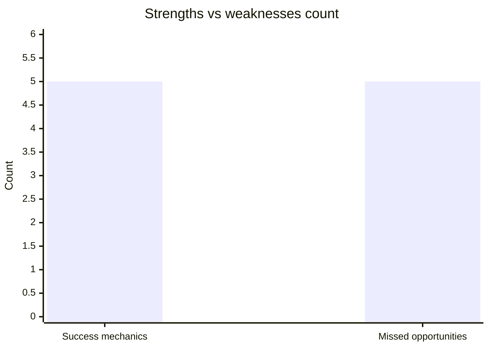

## 13. Кореляції та патерни

Correlation analysis skipped: fewer than 5 comparable videos.

| Pair | Correlation / Pattern | Strength | Interpretation | Confidence |
|---|---:|---|---|---|
| hook_score → overall_video_score | NOT_COMPARABLE | N/A | Є лише 1 відео; не можна встановити зв’язок | LOW |
| value_density_score → er_public_percent | NOT_COMPARABLE | N/A | Є лише 1 відео; можна лише описати збіг високої value density і високого ER | LOW |
| cta_score → comment_rate_percent | NOT_COMPARABLE | N/A | CTA score = 3, comment rate = 2.34%; причинний зв’язок не доведений | LOW |
| comment_resonance_score → er_public_percent | NOT_COMPARABLE | N/A | Обидва показники високі для одного відео, але це не кореляція | LOW |
| views_per_day → er_public_percent | NOT_COMPARABLE | N/A | Немає когорти для quadrant thresholds | LOW |
| ad_load_percent → er_public_percent | NOT_APPLICABLE | N/A | Рекламної інтеграції немає | LOW |
| time_to_first_value_seconds → overall_video_score | NOT_COMPARABLE | N/A | Потрібні мінімум 5 відео для кореляцій | LOW |

Попередні патерни для одного відео, не кореляції:

| Pattern | Дані | Інтерпретація | Confidence |
|---|---|---|---|
| Практична користь + моральний конфлікт збігаються з високою коментарністю | `837` comments, `23.40` comments/1k views, clusters disagreement/question | Тема добре провокує коментарі | LOW_CONFIDENCE для узагальнення |
| Відсутність next-video bridge збігається з нульовим end screen CTR | End screen CTR `0.0%`, cta_score `3/5` | Сильний кандидат для тесту | MEDIUM для цього відео |
| Складні кейси створюють плутанину | 84 коментарі про податки/заводи + 29 про Auchan/Metro | Потрібна decision matrix | MEDIUM для цього відео |

## 14. Висновки для контент-стратегії

| Спостереження | Дані / графік | Що це означає | Що робити |
|---|---|---|---|
| Відео має сильний public engagement | ER Public `13.39%`, Comments/1k views `23.40`, Comment resonance `4/5` | Тема і формат провокують реакцію | Продовжувати тему як серію, але з чіткішою структурою рішень |
| Основна сила — practical utility | Top success mechanic: `PRACTICAL_UTILITY`; cluster “подяка/корисність” = `154` | Глядачі цінують конкретні бренди й практичну дію | Додавати до кожного випуску “що не купувати / чим замінити / як перевірити” |
| Основний ризик — плутанина складних кейсів | `84` коментарі про податки/заводи + `29` про Auchan/Metro | Частина аудиторії бачить подвійні стандарти | Додати decision tree: імпорт, український завод, власник, податки РФ/Україна, дія |
| CTA не добирає session continuation | CTA score `3/5`; end screen CTR `0.0%`; next-video bridge = ❌ | Відео генерує реакцію, але не переводить її в наступний перегляд | Завершувати конкретним bridge: “натисни наступне відео зі списком альтернатив” |
| Pinned comment треба перетворити на FAQ | Missed opportunity: `MISSING_PINNED_COMMENT_STRATEGY` | Повторювані питання зараз розкидані по коментарях | Закріпити короткий FAQ + актуальні джерела + посилання на наступні відео |
| Ad load не є проблемою | `ad_detected=false`, `ad_load_percent=NOT_APPLICABLE` | Немає evidence, що реклама шкодить цьому ролику | Не фокусувати оптимізацію на рекламі; фокус на CTA та clarity |
| Аудіо достатньо сильне | Audio score `4/5`; системних скарг на звук немає | Технічний звук не головний обмежувач | Оптимізувати не звук першим, а темп пояснення і візуальні/структурні підказки |

## 15. Що тестувати далі

| Тест | Гіпотеза | На яких даних базується | Як виміряти | Пріоритет |
|---|---|---|---|---|
| Серія “чим замінити бренди” | Якщо після кожного проблемного бренду дати альтернативи, зросте утримання, збереження і позитивні коментарі | `22` запити на альтернативи + missed opportunity `COMMENTS_SHOW_TOPIC_GAP` | ER Public %, comments/1k views, частка REQUEST/QUESTION, retention у блоках альтернатив | HIGH |
| Decision tree для складних кейсів | Якщо пояснити українські заводи/податки/імпорт, зменшиться критика подвійних стандартів | `84` коментарі про податки/заводи + `29` про Auchan/Metro | Частка DISAGREEMENT clusters, comment sentiment, average view duration | HIGH |
| Next-video bridge у фіналі | Якщо фінал прямо веде на наступне відео, end screen CTR зросте | End screen CTR `0.0%`, `has_next_video_bridge=false` | End screen CTR, views from end screen, session watch time | HIGH |
| Pinned FAQ замість довгого pinned comment | Якщо pinned comment буде коротким FAQ, зменшаться повторювані питання | Missed opportunity `MISSING_PINNED_COMMENT_STRATEGY`; повторювані confusion clusters | Частка повторюваних питань після публікації, pinned link CTR якщо доступний | HIGH |
| Коментарний prompt “напиши альтернативу” | Якщо CTA збирає альтернативи, коментарі стануть кориснішими і менш хаотичними | Comment resonance `4/5`, request/apps clusters | Comment rate %, кількість корисних відповідей, кількість згадок брендів/альтернатив | MEDIUM |
| Менш агресивний тон у фактологічному ролику | Якщо зберегти moral stakes, але зменшити термінологічні атаки, скептична аудиторія менше відштовхнеться | `13` коментарів про тон/терміни | Negative/Mixed comment share, retention у перших 2 хв, like ratio | MEDIUM |
| Англійська/міжнародна версія | Якщо зробити англійську версію або дубляж, тема може ширше поширюватися за кордоном | `9` запитів на англійську + зовнішній трафік через Viber/Telegram/Facebook | External traffic %, geography outside Ukraine, shares | MEDIUM |

## 16. Дані для експорту в таблицю / CSV

| video_label | title | format_group | views | views_per_day | like_rate_percent | comment_rate_percent | er_public_percent | views_per_1k_subs | hook_type | hook_score | cta_count | cta_score | ad_load_percent | ad_integration_score | audio_score | comment_resonance_score | overall_video_score | top_success_mechanic | top_missed_opportunity |
|---|---|---|---:|---:|---:|---:|---:|---:|---|---:|---:|---:|---:|---:|---:|---:|---:|---|---|
| Video 1 | Хто спонсує війну з полиць твого супермаркета? | LONG_10_20_MIN | 35772 | 56.69 | 11.05 | 2.34 | 13.39 | 1753.53 | PROBLEM | 4 | 7 | 3 | NOT_APPLICABLE | NOT_APPLICABLE | 4 | 4 | 3.89 | PRACTICAL_UTILITY | COMMENTS_SHOW_CONFUSION |

CSV-ready версія:

```csv
video_label,title,format_group,views,views_per_day,like_rate_percent,comment_rate_percent,er_public_percent,views_per_1k_subs,hook_type,hook_score,cta_count,cta_score,ad_load_percent,ad_integration_score,audio_score,comment_resonance_score,overall_video_score,top_success_mechanic,top_missed_opportunity
Video 1,"Хто спонсує війну з полиць твого супермаркета?",LONG_10_20_MIN,35772,56.69,11.05,2.34,13.39,1753.53,PROBLEM,4,7,3,NOT_APPLICABLE,NOT_APPLICABLE,4,4,3.89,PRACTICAL_UTILITY,COMMENTS_SHOW_CONFUSION
```